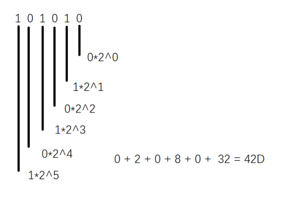

前端基础

## Day_01_计划IT学习路线

后续待补充细节，为后面学习做出准备。

*为暂做了解，后续可能会学习

### HTML

### CSS

### 	JavaScript

​	Canvas and SVG

​	Three.js and GSAP

### jQuery

### Less

### Sass

### Bootstrap

### Webpack or Vite

### Git

### Github 

### npm or yran

### Vue2 

### Vue3

### React

​	redux toolkit

### 小程序

### Hybrid （前端混合开发）

​	Uniapp

​	React Native*

​	Flutter*

### Back-end Language

​	Typescript  JS的superset（超集）

​	Node.js 

​	.Net*

​	C*

​	C++*

​	Php*

​	Java*

​	Python*

### 数据库

​	Mongodb 非关系型数据库

​	SQL 编程语言*

​	MySQL*

​	SQL Server*

​	Oracle*

### 云服务*

### Devops*

------

------

## Day_02_浏览器与通信

### 	

### Five Major Browsers and Cores

#### 浏览器的作用

​	浏览器是用来检索、展示以及传递Web信息资源的应用程序。Web信息资源由统一资源标识符( Uniform Resource Identifier，URI)所标记，它是一张网页、一张图片、一段视频或者任何在Web上所呈现的内容。使用者可以借助超级链接( Hyperlinks)，通过浏览器浏览互相关联的信息。

#### 内核的作用

​	浏览器的核心,汽车的发动机。负责网页的内容(HTML,图片，视频,css，js)的解析，对代码进行解释。

​	注意：不同浏览器内核对网页中的语法解释有可能会不一样,所以会造成一个问题，最终渲染效果不同的,所以正对一些特殊东西需要做兼容(但是现在兼容这件事很少做了，即使需要也会有对应技术帮我们自动去实现)。

#### **1.** IE（Microsoft Edge代替）

​	IE是微软旗下浏览器,诞生于1995年，IE浏览器当时是绑定系统上面，不可以卸载，产生第一次浏览器大战，IE全胜. 网景公司（netscape navigator）占据了市场90%,网景公司一部分员工 将浏览器和最终打造了另外一款火狐. 网景公司被美国在线(AOL)收购,IE在2022年6月份正式退役了，不在更新了，需要用edge浏览器. 

​	**IE使用Trident内核，也叫作IE内核。**1997年诞生，就是在mosaic浏览器内核代码上进行改造的，该内核就是一个开放的内核，别人可以获取并且使用这个内核的代码,国内很多浏览器它内部就有使用到这个Trident内核。

​	**Microsoft Edge 使用Chromium内核 。**chromium内核是谷歌开发的。

#### **2.** Safari

​	2003年诞生，苹果是在手机上开发的浏览器，苹果手机市场份额比较大，这个浏览器很快成为世界主流的浏览器

​	**Safari使用webkit内核。**它是苹果公司的内核，（chrome浏览器内核的原型），同样代码是开源。

#### **3.** Firefox

​	火狐浏览器mozilla基金会旗下浏览器，mozilla刚诞生的时候是一个非盈利组织，2004开发这款浏览器，发生第二次浏览器大战，最终将浏览器市场份额进行了一个瓜分

​	**火狐使用Gecko内核。**网景公司开发的内核，最早是使用在netscape navigator上面,后来火狐使用了这款内核，代码完全开放，世界所有程序员都可以为它写代码和增加功能,所以发展速度很快

#### **4.** Opera

​	挪威欧普拉公司旗下的浏览器,1995年诞生的，最终奇虎360给收购了

​	**Opera使用blink内核。**2013年欧普拉公司和谷歌联合开发的。就是chromium内核的一个升级版。

#### **5.** Chrome

​	2008年google旗下的浏览器，简洁、快速、安全，这个浏览器对于前端来说非常重要。

​	**Chrome同样使用blink内核。**

------

### 浏览器通信

#### 网址组成

​	http://www.baidu.com:80

​	***\*https:\**** ***\*协议\****   [***\*www.baidu.cm\****](http://www.baidu.cm) ***\*域名\****   80 端口

Protocol: http / https

Domain Name: www.baidu.com

Port (hidden):   80

#### **一.** DNS域名解析

DNS服务器，这个服务器里面有映射关系,它会先将你的域名解析成一个（公网）ip地址，如 [www.baidu.com](http://www.baidu.com) à 14.119.104.189  ,这个ip地址就是服务器在公网中的唯一身份

Ping [www.baidu.com](http://www.baidu.com) 这个指令可以诊断与服务器之间连接是否正常

返回TTL是ip协议包中的一个值，有了这个值就是正常，如果超时了就是连接是失败的，可以ping以后获取对应网站ip，可以直接访问这个ip，但是有一些网站是做了限制，不允许ip访问

内网ip可以通过ipconfig指令来查看

#### 二．建立TCP连接

​	tcp传输控制协议,可以理解为两台设备之间连接的一种规则

***\*建立的过程 需要进行3次握手\****

***\*三次握手的过程\****

SYN:请求数据包

ACK:确认数据包

1. 客户端发送一个带有SYN标志的数据包给服务器,（请求连接服务器）
2. 服务器返回带一个SYN/AKC标志数据包给客户端(服务器同意连接，并且请求连接客户端)
3. 客户端返回一个带有AKC标志数据包给服务（客户同意连接）握手成功（连接成功）

#### 三. 发送http请求

​	https就在是http的基础上加强了安全

​	http：超文本传输协议，是建立在tcp连接协议基础上的，它是用来指定两台设备之间进行传递数据的内容,就是一种传输规则

 

请求里面会包含请求的方法,url,http版本等等一些信息是包含请求信息里面的

 

#### 四. 服务器处理请求

​	服务器收到请求，会根据相关路由相关请求方式、请求参数以及对应信息、开始处理它的请求，并且会从数据库或者静态 资源服务调用客户端需要数据资源，这个阶段只是处理请求准备资源，并没有将结果返回

#### 五. 服务器返回响应结果

 服务器准备数据或者资源，就会返回给客户端,（包含文件资源，http状态,数据）

http状态码：它其实就是响应一个结论，我们可以从状态码看出当前响应结果如何,比如是成功了还是失败了还是其它信息

 

**常见的状态**

200:表示服务响应成功了，并且处理客户端的请求内容，然后将内容成功的返回给客户端

301：永久重定向，当前的服务器永远都不在使用了，最终都跳转到期它服务器

302：临时重定向，某一个阶段先跳转到另外一个页面去，过了这个阶段以后 让你重新回到当前页面

304:告诉客户端请求成功了，但是这个资源不是由服务器提供的，而是从客户端本地缓存获取的资源，目的是节省传输开销，性能优化

403：表示访问服务器的资源权限不够，或者服务器ip被封掉

404：表示服务器上根本就没有这个资源，找不到这个资源

500或者5开头:服务器出问题了，或者服务器关闭了，服务器的代码出问题了

**注意：4开头 我们在访问后端提供的接口的时候，出现了4开头，要先查看自己的代码，没有问题的情况下  那就是后端问题。**

 

#### 六. 关闭TCP连接

为了避免服务与客户端双方资源占用和消耗,当双方没有数据在继续传递的时候任何一方都可以发起关闭请求

关闭请求会经过4次挥手

1. 第一次挥手：客户端发一个FIN数据包给服务端 表示请求关闭
2. 第二次挥手: 服务端收到FIN包以后，发起一个ACK的确认包给客户端 表示确认关闭
3. 第三次挥手：服务端发起一个FIN包给客户端 表示请求关闭
4. 第四挥手：客户接受到服务端发送FIN包以后返回一个ACK确认包给客户端 表示确认关闭

Client: server 我这边没有数据给你了，我把我和你连接关闭可以吗?

Server: 好的 ，那你先关闭吧

Server：我这边好像也没有数据给你了，那我和你之间连接也关了吧

Client：好的那就关了呗

------

### 网页渲染过程

#### 			**浏览器有两个引擎： 渲染引擎 and js引擎**

1. **解析html：**先将html里面代码从上执行进行解析，如果说在解析时候碰到了一些外部资源（其它的资源文件），它会去请求对应的外部资源，这个加载过程是异步（异步以后详细解释）的
2. **DOM Tree：**渲染引擎解析html文件中DOM（document object model）元素生成对应DOM树（DOM tree）

DOM树是一种数据结构，我们可以理解为是,浏览器它不能直接理解dom标签，所以需要转换成它认识的东西,它认识的就是DOM tree

3. **CSS Tree： **解析CSScss文件或者css代码,生成一个CSSOM（css Object model） tree, 

这里cssom tree，渲染引擎它不能直接理解css的代码，所以需要转换成对应的cssom树

 

4. **Render Tree：**结合DOM tree 和 CSSOM tree 生成一个render tree（渲染树）

4. **Layout**(布局)：将对应render tree里面东西进行一个布局，比如说，每一个元素分配到屏幕上的那一个位置，给每一个元素分配对应屏幕坐标
5. **绘画绘制阶段**,渲染引擎遍历（循环）render tree里面的每一个节点进行绘制,

绘画的过程是一个**渐进**的过程.(就是说网页并不是全部绘制完成一下子出来，这样用户体验不是很好了，变解析边绘制的)

补充：js引擎是来解析js代码的(以后学了js以后再讲

------

 

#### 回流和重绘

​	**理解：**页面第一次确定dom位置大小等一些信息的时候布局（计算）

​	**回流:** 在第一次的基础上布局会得到一些布局的基础信息(如元素的大小位置...)，后面通过一些代码对这些信息进行了修改，那么就会重新计算这些布局信息,这个过程叫做回流

​	**重绘：**在第一次渲染以后会绘制，后期去修改了元素的大小 位置 颜色... 它就会重绘（重新绘制），如果说回流以后肯定会重绘

------

------

## Day03_计算机的组成与基本概念

冯.诺依曼(计算机之父),提出了**计算机的体系**:

​	1.计算机由硬件（运算器、存储器、控制器、输入设备、输出设备）

​	2.计算机内部应该采用二进制来表示指令和数据

​	3.将编好的程序和原始数据事件录入到存储器，然后启动计算机工作，程序可以自动执行

 

### 一. 计算机硬件组成部分

（运算器、存储器、控制器、输入设备、输出设备）

#### 1).主机部分

##### 	1.中央处理器(cpu)

###### 		a,运算器

​			运算器也称为算术逻辑单元运算，它的功能就是算术运算逻辑运算，

算术运算就是加减乘除这些算术，逻辑运算，与或非，一些条件判断运算

###### 		b.控制器

​			是整个计算器指挥系统，它的基本功能是从内存获取指令和分配执行指令，

指令其实就是计算机下一步要干什么了,

##### 	2.内存

​		存储装置，它主要功能存程序和数据

#### 2).外部设备

##### 	1.输入设备

​	输入设备就是从计算机外部向计算机内部传送信息的装置,后能就是将数据或者程序输入设备写入内部，内部通过对应计算功能，然后将信息存储起来，键盘，鼠标，摄像头,麦克风...

##### 	2.输出设备

​	输出设备就是将计算机底层计算出来的结果传送到计算机外部提供给给用户的信息，显示器,音响...

##### 	3.外存储器（外存）

​	存储数据的，设备,硬盘 u盘 光盘...

  

### 二. 内存和外存的区别

1. 内存读取数据的速度要比外存读取速度要快
2. 作用不同：内存存储的是临时数据，和代码指令，外存存储永久数据
3. 内存容易丢失  外存不易丢失
4. 访问权限不同，CPU只能直接访问内存数据，不能直接访问外存的数据

 

### 软件系统

#### **系统软件**

​		**操作系统**
​			Windows  macos  linux unix.. 

​		**应用软件**
​			QQ、钉钉、相关浏览器...(同一个产品在不同系统里面它软件是不同)

#### 内存

​	在程序运行的时候,指令和数据都会以二进制的形式存储到内存当中

二进制：其实就是以0(假，反，false)和1(真，正，true)组成这么一组数据如 10101010

内存中最小单位bit(位)
内存中最基本管理单位byte(字节)，一个字节它是由8个bit组成的，
**基本管理单位**的意思:一个数据它的大小只有3个bit 但是它会以一个byte的形式占着内存，小于一个字节就分配至少一个字节

8bit(位) = 1byte(字节)
1024byte(字节) = 1kb(千字节)
1024kb(千字节) = 1mb(兆字节)
1024mb(兆字节) = 1gb(吉字节)
1024gb(吉字节) = 1tb(太字节)
...

##### **怎么去查到对应数据？**

​	每一个数据内存它会有一个独立地址:地址也是由0和1组成，存的时候分配给这个数据一个地址，那取的时候也是按照这个地址取

当运算代码的时候内存是怎么样的? 8G
	当运算某一块程序的时候，内存只会分配给这个程序8个G中一部分内存，如果说我们的程序运行内存超出了它一个分配内存会出现一件事情,内存溢出，内存溢出以后，程序就会崩溃，一般情况不会出现内存溢出，如js本身是有一种机制：垃圾回收机制，垃圾回收机制是将一些不需要的数据它会重内存中删除，删除了以后就会出现这种内存溢出情况了,
但是会有一些特殊的情况，垃圾回收机制对它无效，这种情况我们叫做内存泄露，内存泄露多了就会造成内存溢出,除了垃圾回收机制可以帮我们删除内存以外，我们自己也可以清理数据

Snipaste:截屏工具

进制: 表示一个数据的一个数字

##### 二进制 

B表示二进制。满二进一  0 1 10 11 100 101 110 111 1000...

##### 十进制 

D表示的是10进制。满十进一  0 1 2 3 4 5 6 7 8 9 10 11 12 13 14 15 16 17 18 19 20...

##### 十六进制 

H表示的16进制。满十六进一 0 1 2 3 4 5 6 7 8 9 a b c d e f 10 11 12 13 14 15 16 17 18 19 1a 1b 1c 1d 1e 1f 20 21 22...

二进制一些程序基本用不到，十进制，十六进制在颜色上面使用的比较多

十六进制颜色:#111111   
Rgb：r:red  g:green b:blue(3原色)
Rgb颜色可以针对于每一个颜色写一个数字 0-255之间
（123,111,222）

## Day04_进制转换与字符集

### 二进制转换成十进制

101010B 转换成十进制   --  42D
从后往前每个数字乘以2的第几位数减1次方 然后整体进行相加

### 二进制转换成十六进制

​	10110010B转换成十六进制  - B2 H
​	每4位分成一组，每一组的从后往前乘以2的第几位数减1次方 然后获取每一组的和将和转换成十六进制以后进行合并
​	101010 如果说不满足每4个一组 那前面就要补0 直到能满足4个一组为止

### 十进制转换成二进制

​	对于整数部分，拿着10进制除以2 商 继续除以2直到除不尽为止，商等于0，然后他们所有余数从后向前合并。

​	对于小数部分，采用连续乘以基数 2 ，并依次取出的整数部分，直至结果的小数部分为 0 为止。

​	35D --- 100011

​	117.625D ＝ 1110101.101B

### 十进制转换成十六进制

​	对于整数部分，拿着十进制除以16 商继续除以16 直到除不尽为止 商等于0 然后从后先前合并。

​	对于小数部分，采用连续乘以基数16 ，并依次取出的整数部分，直至结果的小数部分为 0 为止。

​	需要注意的是并非所有的十进制小数都能完全转化为十六进制小数，这时就需要取近似值。

​	3652D – E44

​	0.9032D=0.E7381H

### 十六进制转换成二进制   

​	每一个字符进行拆分然后转换成十进制，每个十进制除以2得到商，在拿着商继续除2直到商为0，逆向合并余数，然后进行最终2进制合并每个十进制的2进制如果不足4位前面补0填充直到4位
​	B4H – 10110100B

### 十六进制转换成十进制

每一位先转换成十进制，然后从后向前每一位的数去乘以16的第几位数-1次方，最终他们和就是十进制的数据
D2F H = 3375D

### 字符集和字符集的概念

​	计算机底层都是以2进制的形式存在的，这种字符集的规范有哪些，有哪些规范来觉对应字符保存的二进制是什么样的

​	字符集：表示的是对应的一个文字或者对应的一个数字它对应二进制是什么

#### ASCLL码

​	是最早产生的编码规范，一共包含了128个字符，基本包含了当前键盘上对应一些字母符号以及他们的一些组合是以什么形式存储的二进制，内存以字节为单位，那么每一个ascll码它对应都是占据一个字节的，对应的是一个符号 00000000-01111111，
如果编码方式ascll码的那么每一个码内存就是一个字节

因为ascll码不包含其余国家的语言对应存储方式,各个国家都创建一套自己的字符集

#### GBK字符集

​	汉字内码扩展规范,它本身是兼容ASCLL,包含了2万多的汉字,每一个汉字占2个字节，但是每一个字母和数字它是占1个字节,后来慢慢拓展了很多的一些编码规范如gb2312 ...

#### Unicode 万国码

​	国际标准,这一套字符集指定了全世界通用的编码规范，包含了世界所有的符号,每个符号占据4个字节，不管任何一个字符数字 字母都是占据4个字节,虽然解决了世界通用字符编码问题，但是会产生另外一个问题就是太浪费内存了

####  utf-8

​	后面推出了编码方式,utf-8(其实就是对unicode万国码的编码方式)，它编码以后中文会占据3个字符，数字和字母占据1个字符，所以我们现在基本上使用的是utf-8的编码方式

​	**编码**：我们存的时候一种字符编码  
​	**解码**：在读取内存当中数据的时候的一种编码方式
​	就是编码是哪一种规范解码就是哪一种规范

​	基本上的浏览器都能接utf-8的码，哪有一些浏览器可能他默认不是utf-8其它解码，就会乱码，但是现在的浏览器我们只需要告诉浏览器让他以什么样的方式解码它也能实现对应的解码。

### 电脑文件操作

​	把电脑中文件的后缀名和隐藏文件展示出来
​	
​	

​	拓展:后缀名，在早些年的时候xp系统，后缀名是3位,jpg exe htm,   jpeg == jpg html == htm

​	工作环境：你当前在操作的一个位置
​	工作路径：当前你操作文件它所在文件夹路径  C:\Users\stwd\Desktop\test

### 相对路径和绝对路径

​	绝对路径：
​		从根（C盘 D盘..）目录开始到当前工作路径叫做绝对路径
​	相对路径
​		相对路径表示的是,相对于当前的位置路径
​		./表示当前路径
​		../表示返回当前路径的上一层路径

操作命令行窗口
	

​	

可以通过一个指令来查看当前工作环境中文件和文件夹：Dir

​	通过cd可以切换工作路径

、

​	打开CMD指令的方式

​	根据相对路径进行一个切换

​	黑窗口可以通过键盘上下键来快速切换回之前的指令

