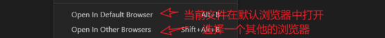
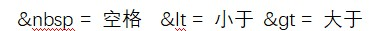

# HTML

## Day06_HTML与标签

### 网页

就是一个文件，不同的文件它的后缀名是不一样的，网页的后缀名htm或者html（标准），打开一个网页就是打开一个文件

### Html:超文本标记语言(标签)

<标签名字>

#### 标签：

1.双标签	
<开始标签></结束标签>

2.单标签 自结束标签
<标签名/>

快捷键：
	Ctrl+s保存

敲标签的时候  
	可以先敲标签名 在按tab键它会自动生成

标签是不区分大小写的，但是我们在写的时候尽量保持小写

`<!DOCTYPE html> 告诉浏览器我当前是html5的模板 你要以html5的模板来进行解析,如果不加 一些浏览器会以怪异模式解析  标准模式`

`<html lang='en'></html> 网页的起始和结束 html叫做根 标签 root`

`lang=’en’ 表示的当前的网页是英文的网页 浏览器在看到这个东西的时候它会出现翻译`

`lang=’en’ 英文网页`

`lang=‘zh-CN’ 中文网页`

`https://www.w3school.com.cn/tags/html_ref_country_codes.asp`

`<head></head> 网页的头部

<meta charset=’utf-8’/> 告诉浏览器以什么样的字符集来解析我这个文件

<title></title>  网页的标题  网站的名字

<body></body> 网页的主体区域`

如果说需要快速生成网页的模板 !（英文状态下的！） 回车

Html的规范  w3c机构指定

规则：你必须按照它的要求来   规范：约定俗成，所有程序员的一种默契

H1:标题标签 一级标题  双标签

H2:标题标签 二级标题  双标签

标题标签只有h1-h6 标题标签

用的多 h1-h3用的比较多，h1一个页面只能出现一次

#### P：段落标签

Strong：加粗标签 以加粗的形式突出内容的重要性

#### B：加粗标签  以样式的形式加粗

​	 他们的区别：

1. 再一些特殊的设备底下这个两个标签展示方式是不一样，如盲人阅读模式，strong语气会重，b就是正常语气
2. SEO搜索引擎优化的时候 strong容易被爬虫爬取

#### Em:

突出内容的重要性 斜体标签 以斜体的形式突出内容的重要性的

 

#### 语义化标签和非语义化标签

##### 语义化标签：

​	有含义的 语义化的标签并不是它的长相是如何的，而是它本身真正含义

​	代码可读性增强，给其它程序员看的

​	有利于seo优化

​	输出的效果也是比较特殊

##### 没有语义化的标签:

######  Div:

盒子标签，定义网页中的某一部分区域的，最终我们需要通过css来定义这个内容

###### Span:

定义一部分文本内容,也是后期通过样式来处理这一块文本内容

 

#### 其他一些标签

Sup:上标文字标签

Sub:下标文字标签

Del:删除文本标签

Ins:插入标签

U:下滑线标签

Code：代码标签

i: 斜体标签

cite:引用标签

small：附属标签,如:版权

bdo:文字方向标签 属性 dir:文字的方向  ltr: left to right 从左往右   rtl:从右往左

 

#### 总结需要记得内容:

H1-h6标题标签

P 段落标签

Strong ：以加粗的形式突出内容的重要性

Em:以斜体的方式突出内容的重要性

#### 代码的格式化操作

​	可以让代码看起来更加整齐

​	鼠标右键 

#### 特殊符号:

​	再html种有一些东西浏览器解析出来是有问题，或者说跟我们想要的结果是不同的，可以使用特殊符号来代替

​	参考 https://blog.csdn.net/six6de6/article/details/125809517 

​	这些东西全部不需要记

 

Br:换行标签  单标签  单标签 /是写在结束位置 

Hr:水平线标签  单标签 

> 这里目前知道 但是有问题, 学了css以后再回过来总结

**P:目前里面除了p h1 div 不可以放放 其余的都可以放**

**Div:里面可以放任何东西**

**H1-h6里面它不可以放p 不可以放h1-h6 不可以放div 其余都可以**

> 其余的文本标签 可以放 除了p h1-h6 div以外的任何文本标签

#### 属性:

标签上有一些属性,不同的属性和不同的属性值 可以让这个标签起到的效果是不一样的，**属性的形式** key=value  **属性名=属性值** 属性值必须是双引号或者单引号 并且是英文状态的
	Age = 13

##### Img:图片标签  单标签

​	Src:图片的地址

服务器地址：
	 

##### 绝对路径

> 

##### 相对路径

> 

#### 图片或视频中用到的属性

> Width:图片的宽度
> Height：图片的高度  单位默认是px（像素）
> Title:鼠标放到该标签上的一个提示文字，可以再任何标签上使用
> Alt：图片加载失败时候的提示内容
>
> Video:视频标签
> Controls：视频播放控件
> Muted：静音属性
> Autoplay:自动播放,自动播放必须和静音一起使用，
> 	原因：浏览器的安全限制
> Loop:循环播放
> Poster:视频的第一帧 第一帧的图片地址