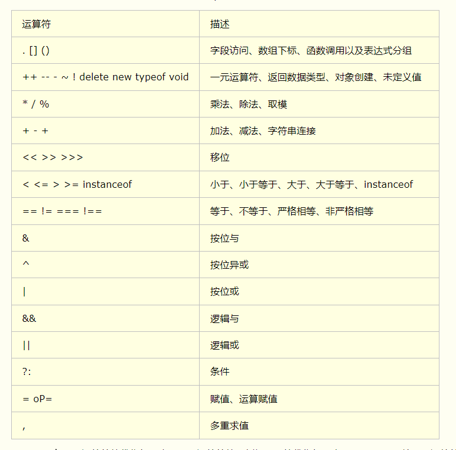
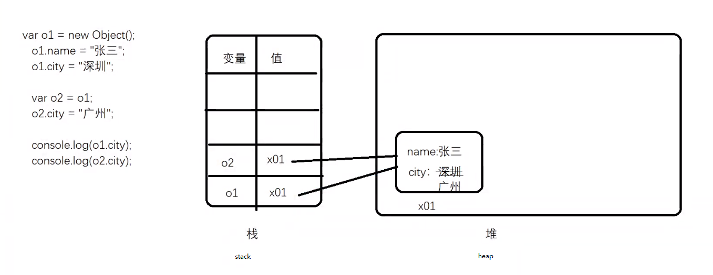
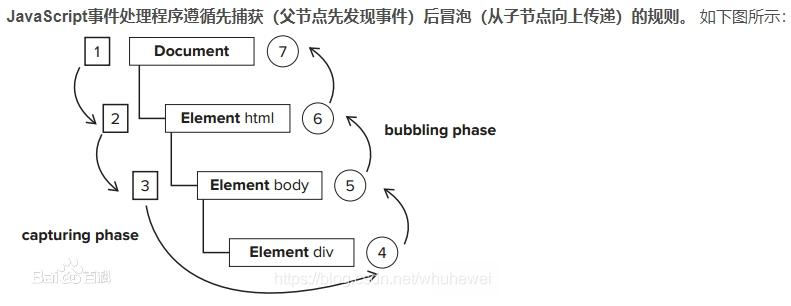
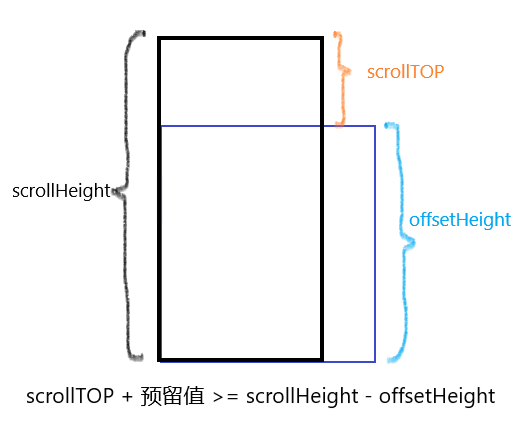
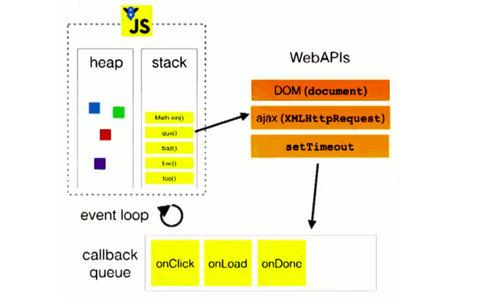
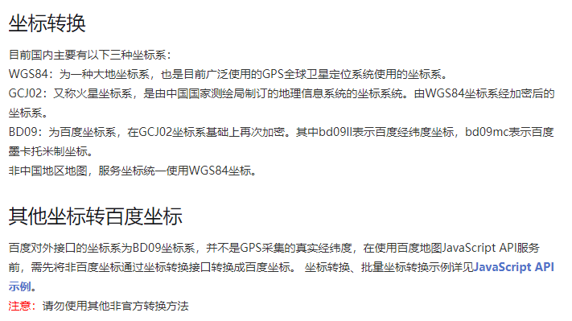
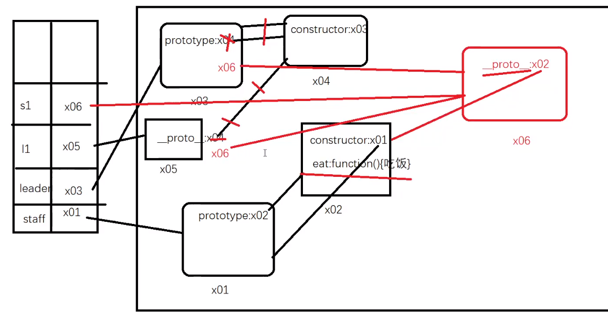
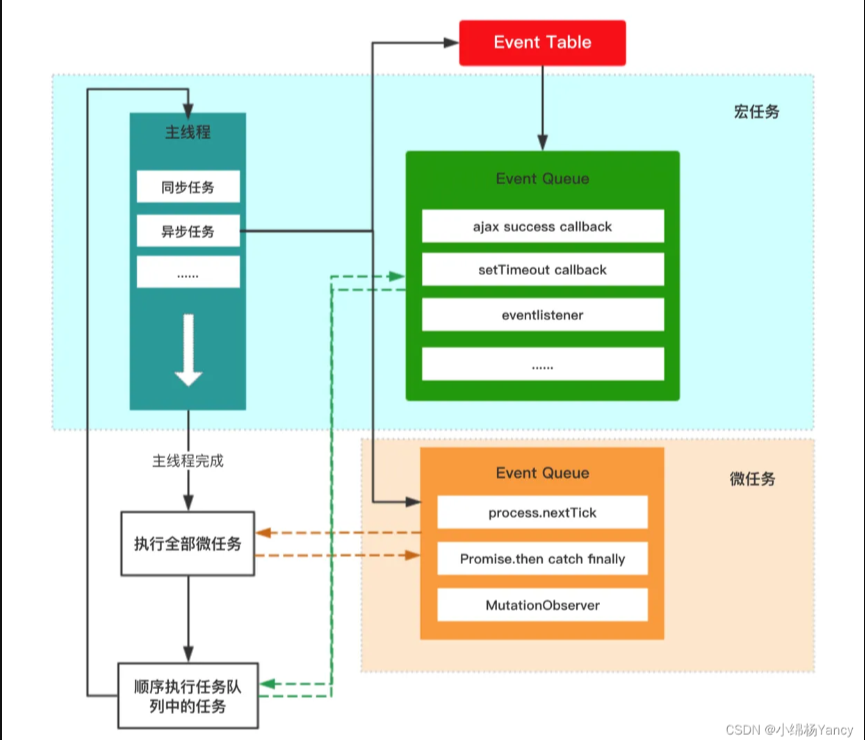

# JavaScript（ECMAScript/DOM/BOM）

## Day22_JS基本介绍与数据类型转换

### JS介绍

> ​	html:结构
>
> ​	css:样式
>
> ​	javascript:行为 编程语言


>    95年时候网景公司 为了表单验证功能 花了10几天的时间开发了一款在浏览器环境中运行语言 livescript,
>
>    sun公司(java),javaScript, navigator浏览器
>
>    微软ie浏览器，jScript，
>
>    网景在被收购之前，把javascript捐给了 ECMA  ECMAscript(标准，说明书)  ES  javaScript(实现 代码) JS
>
>    ES === JS
>
>    框架：vue  react  uniapp

------


### JS书写位置

#### 1. 在标签中直接书写

```html
<button onclick="alert('哈哈')">按钮</button>
```

------


#### 2. 在script标签中书写js代码 

> ​	script标签可以放在任何的位置

```javascript
<script>
	window.onload = function(){
		document.querySelector("button").onclick = function(){
			alert("呵呵")
		}
	}
</script>
```

------


#### 3. 使用script标签引入js后缀文件  

​			当这个script标签引用了js文件以后，就不能在它之间继续写js代码了

```html
<script src="./index.js"></script>
```

------


### JS中的注释

**单行注释 ctrl+/**

```javascript
// alert("弹窗")
```

------

**多行注释**

**ctrl+shift+/**  

**Alt+Shift+a**（默认的）

```javascript
/*     alert(123)
    alert(123)
    alert(123) */
```

------


### JS中3条输出语句

**1.弹窗语句**

```javascript
alert(110)
```


> **弹窗的换行**
>
> ​	**\n可以进行换行**

```javascript
alert('窗前明月光,\n疑是地上霜,')
```

------


**2.在控制台中输出日志** 

> **两者的区别：**
>
> ​	**在浏览器控制台中查看 DOM 元素时，**
>
> ​	**`console.log()` 提供了元素的 HTML 表示。**
>
> ​	**`console.dir()` 提供了更多的 JavaScript 详细信息，这意味着您可以看到其所有的属性和方法，而不仅仅是其 HTML 表示。**

```javascript
console.log(120)
console.dir(dom元素名)
```

------


**3.在文档中（在页面中）输出语句**

>  	其中单引号双引号都行

```javascript
document.write('<h1>10086</h1>')
```

------


### JS中的输入语句

> ​	当用点击确定以后会返回用户输入的内容**(这个内容永远是string类型的)**,
>
> ​	如果说用户点击了取消,会返回**null，并且数据类型是object**

```javascript
    var res = prompt('请输入一个数字:');
    console.log(res);
    console.log(typeof res);
```

------


### 写JS的注意事项

**1.js中需要注意大小写问题**


**2.一条语句结束以后 最好加上; 一条语句写完以后最好换行**


**3.js中所有符号都必须是英文状态的**


**4.js中的语句不要随意换行 该换行的地方得换,(多写就知道额)**

------


### 变量

> 可以用来存储值可以发生变化的标识
>
> ​    如：设x = 10;  x 就是变量  10数据


**声明变量**

```javascript
var x;
```

**赋值变量**

```javascript
x = 10;
```

**使用变量**

```javascript
alert(x);
```

**重新赋值**

```javascript
x = 20;
alert(x);
```

**声明的同时赋值**

```javascript
var x = 10;
x = 20;
x = 30;
alert(x);
```

**同时声明了多个变量**

```javascript
var x, y, z;
```

**同时声明多个变量并且同时赋值**

```javascript
var x = 10, y = 20, z = 30;
```

------

**tips**

> ​	（不推荐）在es5以下的版本中 重新声明相同的变量是可以的不会有问题，但是这种做法在编程界是不可以的。不允许声明相同的变量，以后可能会出很严重的bug

```
var x = 10;
var x = 20;
```

> ​	重新赋值 这个是可以的

```
var x = 10;
x = 20;
```

> ​	（不推荐）声明的变量的时候如果不加var关建字也是可以的,虽然也可以。但是这种代码是不合理的，所以尽量不要这么去做。后面出现bug很难定位到问题。

```
x = 20;
console.log(x);
```

------


#### 变量的命名规则

> ​	变量名不可以以数字开头，但是可以包含数字
>
> ​    变量不可以包含除了$和_以外的特殊符号
>
> ​    不可以使用es的关建字和保留字
>
> > ​		（它现在不属于关建字，以后这个词可能属于关建字）
>
> ​    按照驼峰命名规范来声明变量。
>
> > ​		当变量由多个关建字组成的 首字母小写，后面所有关建字首字母大写。


> JS:  ECMA标准部分(语法，规定，标准...,非常重要)  DOM  BOM

------


#### 	变量的交换

```javascript
<script>
    var x = "张三";
    var y = "李四";
    /* 补充代码 */
    var z;
    z = x;
    x = y;
    y = z;
    console.log(x) //李四
    console.log(y) //张三
</script>
```

------


### 常量

>  	存储值不可以发生变化的标识
>
> ​    一些数据确定以后不会发生变化的，就用常量的规则，如果会发生变化的就用变量


> ​	es5中声明常量就可以将变量名取成**大写** 它就是意义上的常量 
>
> ​		但是也可以修改, 虽然可以改变，但是所有的程序如果看到**这个变量是大写**的别人就不会取改它了(约定)


```javascript
/* 存储一个 地址 http://123.0.0.1 */
http://123.0.0.1 */
```

------


### 通过控制台查看错误

> ​	当报错了以后 后面j**s代码就会中断不会在运行**，可以从控制台查看错误信息 定位到错误的位置去查看你的代码

```java
a没有被定义,就是没有声明过这个变量
console.log(a);
console.log("hahah")
console。log("哈哈哈");
var a = abc;
console.log(a)
```

------


### **基本数据类型（原始数据类型）** 

> ​	先说es5中的基本数据类型其余的以后在说
>
> ​     	**Number(数值类型):** 0，合法的数字, Infinity(正无穷)、-Infinity(负无穷)、NaN(not a number)
>
> ​     	**String(字符类型):** 放在双引号或者单引号里面的内容都是属于字符类型. 注意单引号和双引号肯定是成对出现的, 
>
> ​     	**Boolean(布尔类型):** 它的作用是用来做逻辑判断的. true（真）  false（假）
>
> ​     	**Undefined(未定义):** 
>
> ​			变量声明了没有赋值，它的值就是undefined
>
> ​			对象如果没有某个属性，那么这个属性返回的值是undefined
>
> ​			一个数组中对应的下标位置没有存储过数据的时候，它返回的值就是undefined。比如下标[2]没有赋值，[3]赋了值，那么[2]它返回的值就是undefined
>
> ​			(以后还有很多种情况)
>
> ​     	**Null(空对象):** 值只有一个null,返回的数据类型 object,它表示的是空无

 

------

### **引用数据类型(复杂数据类型)**

> **Object（万物皆对象）Array，Function，Date，Set，Map， RegExp（正则）**

------


**转义**

​	\\" 表示转义 告诉浏览器解析的时候 把这个引号看成是普通的引号来解析 不要看成字符它本身的引号

```javascript
var x = "李白说:\"今天天气很好\"";
```

------

**typeof**

通过typeof**运算符**来检查数据类型，它会返回一个值

**typeof显示的值是字符串的数据类型**

```javascript
var ty = typeof x;
console.log(ty);
console.log(typeof x);
console.log(typeof 10);
```

------


### 数据类型转换

> ​	暂时无法将其余类型转化为Undefind和Null，因为没有意义。


#### 转换为Number类型

##### 方案一：使用Number()函数转换 

​    **语法:Number(需要转换的内容)，会返回一个转换以后的结果**

> ​    string类型通过该方案：
>
> > ​     	1.字符串里面如果是合法的数字（包括第一个小数点）,那么就直接转换成Number
> >
> > ​     	2.如果里面有非法数字，它就返回NaN，但是它也转成了number 因为NaN就是number
> >
> > ​     	3.**空字符串（包括什么都不写和空格）转换是0**
>
> ​    Boolean类型通过该方法:
>
> > ​     	true -- 1  false -- 0
>
> ​    Undefined: NaN
>
> ​    Null: 0
>
> ​	**注意！：在转换数据类型时候可能遇到String数据的0,"0"。这种要按照String的格式转换，不能按照Number的。**

```javascript
var x = "";
x = Number(x);  
console.log(x);
console.log(typeof x);
```

------


##### 方案二：使用隐式转换 +

​	**语法：+ 数据。顺序不能颠倒**

​    **所有类型通过该方法转换它得到的结果和Number函数的结果是一致的**

```javascript
var x = + " ";
console.log(x);
console.log(typeof x);
```

------


##### 方案三:使用parseInt()函数转换 

​	**它会返回一个转换以后的结果  取整数**

​	**语法:parseInt(需要转换的数据)**

> ​    	**String类型通过该方案转换:**
>
> > ​		它会从string中第一个字符开始查找,直到碰到一个非法数字返回前面合法数字部分, 如果说第一个就是非法数字,返回 NaN
>
> ​		**其余的数据类型:**
>
> ​			通过该方法转换，全部返回NaN

```javascript
    var x = 10.212;
    x = parseInt(x);
    console.log(x);
    console.log(typeof x);
```

------


##### 方案四:使用parseFloat()函数转换 

​	**它会返回一个转换以后的结果  取小数**

​	**语法:parseFloat(需要转换的数据)**

> ​		**String类型通过该方案转换:**
>
> > ​     		它会从string第一个字符开始查找,直到碰到一个非法数字（不包含第一个小数点）返回前面合法数字部分, 如果说第一个就是非法数字,返回 NaN
>
> ​		**其余的数据类型:** 
>
> > ​			通过该方法转换，全部返回NaN

```javascript
    var x = true;
    x = parseFloat(x);
    console.log(x);
    console.log(typeof x);
```

------


#### 转换为String类型

##### **方案一：通过String()函数进行转换** 

​	**返回一个转换以后的值**

​    **语法：String(需要转换的数据)**

> ​	其余的数据类型通过该方式转换以后，就是相当于在原本的数据上加了双引号或者单引号

```javascript
var x = undefined;
x = String(x);
console.log(x);
console.log(typeof x);
```

------


##### 方案二: 通过隐式转换 +'' 或者 +""

​	**语法: 需要转换的数据 + ''  或者 需要转换的数据 + ""。顺序不能颠倒，引号里可以用空格**

> ​    该方案最终转换以后的结果和String()函数一致

```javascript
var x = null+"";
console.log(x);
console.log(typeof x);
```

------


#####  方案三:通过toString()方法转换  

​    **语法:需要转换的数据.toString()  会返回转换以后的结果**

> ​    该方法**undefined和null会报错**
>
> ​	.前面不能直接加数字
>
> ​	其余的数据类型转换就是加了双引号或者单引号

```javascript
var x = null;
x = x.toString();
console.log(x);
console.log(typeof x);
```

------


#### 转换为Boolean类型

##### 方案一：使用Boolean()函数

​    **语法:Boolean(需要转换的数据) 返回一个结果**

> ​    Number通过该方法转换：
>
> > ​		0和NaN转换是false
> >
> > ​		其余的全部都是true
>
> ​	Sstring通过该方式转换:
>
> > ​		空字符串(连一个空格都没有的)是false
> >
> > ​		只要字符串中有内容就是true
>
> ​    undefined：false
>
> ​	null：false

```javascript
     var x = "";
     x = Boolean(x);
     console.log(x);
     console.log(typeof x);
```

------


##### 方案二:使用隐式转换 !!

​    **语法:!!需要转换的数据。顺序不能颠倒，中间可以有空格**

> ​	该方式转换的结果 和Boolean()返回的结果是一样的

```javascript
    var x = !!4561;
    console.log(x);
    console.log(typeof x);
```

​	**语法：!需要转换的数据。只有一个感叹号, 顺序不能颠倒，中间可以有空格**

> ​	该方式转换的结果 和Boolean()返回的结果是相反的
>
> > ​		将变量转换成boolean类型, 然后再反转这个boolean类型
> >
> > ​		false变true，true变false

```javascript
    var a = 10;
    a = String(!Boolean(Number(String(a))));
    console.log(a);
    console.log(typeof a);

   	//a = false 
    //类型：String
```

------


## Day23_运算，运算符，运算符优先级，判断

### 算数运算符

####    **+: 加**

> ​    1.任何数据类型和**字符串相加**都会进行拼接（拼串）
>
> ​    2.其余的数据类型相加，会先转换成Number,然后进行相加运算
>
> ​    3.NaN和任何数据类型相加都会返回**NaN**,但是**除了字符串**以外（拼接）
>
> ​    4.Infinity和任何数据类型相加都是**Infinity**，**除了字符串**以外（拼接）

------


####    **-: 减**

> ​    任何数据类型进行相减运算的时候都会先转换成Number类型，然后进行运算
>
> ​    任何数据类型和NaN相减,返回的结果都是NaN

------


####    ***: 乘**

> ​     任何数据类型进行相乘运算的时候都会先转换成Number类型，然后进行运算
>
> ​     任何数据类型和NaN相乘,返回的结果都是NaN

------


####    **/: 除**

> ​    任何数据类型进行相除运算的时候都会先转换成Number类型，然后进行运算
>
> ​     任何数据类型和NaN相除,返回的结果都是NaN

------


####    **%: 模（余数）**

> ​     任何数据类型进行相余运算的时候都会先转换成Number类型，然后进行运算
>
> ​     任何数据类型和NaN相余,返回的结果都是NaN 

------


#### ++:自增

> ​	在自己的本身+1
>
> ​    注意：赋值的时候有不同,如果说**++在前面,它先运算在赋值**
>
> ​    如果是在后面的时候，先赋值在运算

```javascript
    // var a = 10;
    // var b = a++;
    // console.log(a);
    // console.log(b);
```

------


#### --:自减

> ​	在自己的本身-1
>
> ​    注意：赋值的时候有不同,如果说**--在前面,它先运算在赋值**
>
> ​    如果是在后面的时候，先赋值在运算

```javascript
    // var a = 10;
    // var b = --a;

    // console.log(a);
    // console.log(b);
```

------


### 赋值运算

####    =

> ​		将右边的值赋值给左边的变量

------


####    +=

> ​		在自己本身增加对应内容
>
> ​		 var a = 10;
>
> ​    	 a += 5; 等价于 a = a + 5；

------


####    -=

> ​    	在本身的基础上减多少
>
> ​		var a = 10;
>
> ​    	a -= 5; 等价于 a = a - 5；

------


####    *=

> ​    	在本身的基础上乘多少
>
> ​		 var a = 10;
>
> ​    	 a *= 5; 等价于 a = a * 5；

------


####    /=

> ​    	在本身基础上除多少
>
> ​		 var a = 10;
>
> ​    	 a /= 5; 等价于 a = a / 5；

------


####    %=

> ​    	在本身的基础上模多少
>
> ​		 var a = 10;
>
> ​    	 a %= 5; 等价于 a = a % 5；

------


### 比较运算

> 比较运算得到的**结果永远是boolean**


#### **\>， >=，  <， <=** 

> ​    大小比较：基本比较的时候是比较的数字,
>
> ​    其余的数据类型会先转换乘Number类型进行比较，
>
> ​    任何东西都不可以和NaN比较  没法比较

 

------


#### == 相等运算 

> ​	比较的是值
>
> ​	它在比较的时候，如果是同一个数据类型比较的那就不需要转换了，
>
> ​    如果是不同的数据类型进行比较它会转换成数字去作比较 (特殊情况除外)

​    **特殊情况: null == 0  false， null == undefined true，NaN == NaN false**

------


#### === 全等运算  

不仅要**比较值** 还要**比较数据类型**，就是在==的基础上增加比较的类型

------


#### != 不等运算 

> ​	比较的是的**值**

------


#### !== 不全等运算  

> ​	比较的是**值和数据类型**


### 逻辑运算符

#### boolean情况

##### && 与（并且 and）

> ​    它作比较的时候， 判断两边是否全部满足条件, 如果全部满足返回true，只要一边不满最返回的是false

------


##### || 或（或者 or）

> ​    它在比较的时候，判断两边是否有一个满足,只要一个满足就返回true，两边全部不满足返回false

------


##### !  非（取反）

> ​    真变假，假变真，如果是非boolean的情况，自动转换成boolean然在取反

------


#### 非boolean情况

##### &&

> ​    在判断第一个条件满足的情况下才会去执行第二个条件，如果说第一个不满足不会执行第二个条件了
>
> ​    **它在比较的时候如果说第一个不满足了（false），它会返回第一个的值(原本的值)，如果说第一个满足（true）返回第二个的值(原本的值)**

------


##### ||

> ​    在判断第一个条件满足的情况下就不会去执行第二个条件了，如果第一个不满足才会去执行第二个条件,
>
> ​    **它在比较的时候如果第一个满足（false），直接返回第一个的值(原本的值)，如果第一个不满足（false）直接返回第二个的值(原本的值)**

------


### 一元运算符

####     \+ 

> ​    对于number来说没有什么变化的
>
> ​	对于其它数据类型来说，它可以将数据转换成Number

------


####     \-

> ​     对于number数字来说，它是将正数转换成负数，负数转换成正数。
>
> ​     对于非Number类型的数据来说，它可以将这个数据转换成Number类型, **如果说能转过来**
>
> ​     它是将正数转换成负数，负数转换成正数。

------


### 三元运算符

> **语法**:
>
> ​    **条件判断 ? 执行语句1 : 执行语句2;**
>
> ​    如果说条件满足 执行语句1  如果说不满足条件 执行语句2

```javascript
// false ? alert('哈哈') : alert('呵呵');

// 12 > 13 ? alert('满足条件') : alert('不满足');

// 判断一个人的年龄如果说大于等于18岁,弹窗成年了,否则就是未成年
// var age = 15;
// age >= 18 ? alert('成年了') : alert("未成年");

// 判断一个数字是否是偶数,偶数就弹窗偶数,否则弹窗奇数
// var num = 9;
// num % 2 === 0 ? alert("偶数") : alert("奇数");


// 判断一个人的年龄小于18未成年,如果说大于等于18并且小于60中年,大于等于60老年
// var age = 67;
// (age < 18) ? (alert("未成年")) : (age >= 18 && age < 60 ? alert('中年') : alert("老年")) 
```

------


### 判断是否为NaN

> **语法：**
>
> ​	isNaN:is not a number（是否不是一个数字） 是不是NaN
>
>    如果是NaN返回true  否则返回false
>
>    如果是非Number类型的数据，它会先**自动转换成Number**，然后判断是否是NaN

```javascript
    var res = isNaN(null)
    console.log(res)
```

------


### 条件分支语句

#### if

>   语法:
>
>    if(条件表达式1){
>
> ​    	// 执行语句代码块
>
>    }else if(条件表达式2){
>
> ​     	// 执行语句代码块
>
>    }else if(条件表达式3){
>
> ​     	// 执行语句代码块
>
>    }else {
>
> ​    	// 执行语句代码块
>
>    }
>
> >    哪个条件满足它会执行对应的代码块
> >
> > ​	当**多条语句都满足条件**的时候，它会从**一个条件开始判断**,只要前面的满足了就进入它的代码块， **不会往后面执行了**,
> >
> > ​	在写条件的时候，条件尽可能的写全

```javascript
    if(false){
      alert("满足了")
    }else{
      alert("不满足")
    }
```

------


#### switch

> 语法:
>
> ​    switch(条件){
>
> ​     case 匹配条件1:
>
> ​     	代码执行块；
>
> ​     	break;
>
> ​     case 匹配条件2:
>
> ​      	代码执行块；
>
> ​      	break;
>
> ​     ...
>
> ​     default:
>
> ​     	代码执行块；
>
> ​	}


> ​	它会拿着条件和匹配条件去进行匹配，匹配上来就执行对应代码块，然后碰到break跳除switch
>
> ​    如果说全部没有匹配上 它就执行default后面的代码块

```javascript
    var num = +prompt("请输入一个1-4的数字:");
    switch (num) {
      // 匹配是全等匹配
      case 1: 
        console.log("向上移动了");
        break;
      case 2:
        console.log("向右移动了");
        break;
      case 3:
        console.log("向下移动了");
        break;
      case 4:
        console.log("向左移动了");
        break;
      default:
        console.log("输入的内容有问题");
    }
```

------


### 运算符优先级

> 可能后续补充更全面的



------


### 练习

#### 判断数字

```javascript
   /* 
      让用户输入一个数字，如果不是数字，弹窗不是合法数，如果说点击了取消弹窗还没输入内容
      如果是数字的情况，判断是否是一个偶数，偶数弹窗偶数 否则弹窗奇数
    */
    // var num = prompt('请输入一个数字:');
    // num === null ? alert("没有输入内容") : isNaN(num) ? alert("您输入的不是一个数字") : num % 2 === 0 ? alert("偶数") : alert("奇数")

    
    // var a = false ? '哈哈' : '呵呵';
    // console.log(a)


    /* 设定一个背景颜色,用户输入了一个偶数,我希望是红色,否则就蓝色 */
    // var bgcolor;
    // var num = prompt("请输入一个数字,偶数表示红色,奇数表示蓝色");
    // bgcolor = num % 2 === 0 ? 'red' : 'blue';
    // console.log(bgcolor)
    /* 给body上背景颜色 以后会详细讲 */
    // document.body.style.backgroundColor = bgcolor


    /* 三元运算符的缺陷:
        1.多个条件的时候 这个代码会很乱 不容易维护
        2.它不能执行多条语句 只能执行一条语句

        使用场景，一些简单判断和执行语句只有一条的时候可以使用
    */
    /* 满足要在页面中弹窗111 并且在body中输入111，否则 弹窗222 在body输出222 */

    // true ? alert(111) document.write(111) : 
```

------


#### 模拟登录

```javascript
    /* 已经有两个账号注册成功了
       账号:admin 密码：123456
       账号:andy  密码: 666666 
    */
   /* 初始数据 */
    // var u1 = 'admin';
    // var p1 = '123456'

    // var u2 = 'andy';
    // var p2 = '666666';

    // /* 获取用户输入的账号密码 */
    // var username = prompt("请输入账号:");
    // var password = prompt("请输入一个密码:");
    // if(username === u1 && password === p1 || username === u2 && password === p2){
    //   // 登录成功
    //   document.write("<h1>登录成功</h1>");
    // }else{
    //   // 登录失败
    //   alert("账号或者密码有误");
    // }


    // var res = prompt("请输入一个内容")
    // if(res){
    //   alert("你输入了内容")
    // }
```

------


## Day24_循环与对象

### while循环

> 循环: 不断去重复做一件事情

> **语法:**
>
> ​	**while(条件){**
>
> ​     **代码执行块**
>
> ​    **}**

> 执行： 第一次判断条件是否满足满足执行代码块 
>
> ​	-- 代码块执行完成以后再去判断条件是否满足
>
> ​	--满足就又执行代码
>
> ​    一直重复下去，知道条件不满足退出循环
>
> ​    只要条件满足就会一直执行代码块

```javascript
/* 在页面输出10个1 */
    // var a = 1;//1.初始条件
    // while(a <= 10){ //2.条件判断
    //   document.write(1);
    //   a++; //3.条件更新
    // }

    /* 在页面中输出1-10 */
    // var a = 1;
    // while(a <= 10){
    //   document.write(a);
    //   a++;
    // }

    /* 在页面输出10-1 */
    // var a = 10;
    // while (a > 0) {
    //   document.write(a);
    //   a--;
    // }


    /* 在页面中输出1-100的偶数 */
    // var a = 1;
    // while (a <= 100) {
    //   /* 偶数的时候才输出 */
    //   if (a % 2 === 0) {
    //     document.write(a + "&nbsp;");
    //   }
    //   a++;
    // }


    /* 输出1-100之间的偶数的和 */
    // var a = 1;
    // var sum = 0;
    // while (a <= 100) {
    //   if (a % 2 === 0) {
    //     document.write(a);
    //     // sum + 2 + 4 + 6 + 8+ 10
    //     // sum = sum + a;  
    //     sum += a;
    //   }
    //   a++;
    // }
    // alert(sum);


    /* 得到水仙花数:
       3位数 100-999
       153 = 1*1*1 + 5*5*5 + 3*3*3
    */
    // var n = 100;
    // while (n <= 999) {
    //   /* 计算每一个三位数是否是水仙花数 */
    //   var ge = n % 10;
    //   var shi = parseInt(n / 10) % 10;
    //   var bai = parseInt(n / 100);
    //   if (ge * ge * ge + shi * shi * shi + bai * bai * bai === n) { 
    //     document.write(n + "&nbsp;&nbsp;");
    //   }
    //   n++;
    // }
```


**死循环**

> 无限循环，不会停止，直到内存溢出

------

```javascript
    // while(true){
    //   console.log("我是一句话")
    // }
```

------


### dowhile循环

> **语法：**
>
> ​	**do{**
>
> ​    	**循环代码块**
>
> ​	**}while(条件判断)**

> 
>
>    它的循环和while循环几乎一致，只要条件判断是满足的情况就会去执行 循环代码块


> **while和dowhile的区别**
>
> > ​	while:先判断在执行
> >
> > ​	dowhile:先执行在判断 即使条件不满足至少会执行一遍


```javascript
    var a = 1;
    var sum = 0;
    do {
      if (a % 2 === 0) {
        document.write(a);
        sum += a;
      }
      a++;
    } while (a <= 10)
    alert(sum);
```

------


### break和continue

>    **break:结束当前循环**
>
>    **continue：跳过当次循环 进入到下一次循环中**

```javascript
    var a = 1;
    while (a <= 5) {
      document.write(a);
      if (a === 3) {
        /* break可以结束当前循环 */
        break;
      }
      a++;
    }
```

```javascript
    var a = 0;
    while(a <= 5){
      a++;
      if(a === 3){
        // 碰到continue 会跳过当次循环 进入到写一次循环
        continue;
      }
      document.write(a);
    }
```

------


### 随机数

> **语法：**
>
> ​	**Math.random()**
>
> ​	**它可以得到0-1之间的随机数，包含0不包含1**


```javascript
    /*
      希望得到1-10之间的随机数
      0   --- 0.999999999999999999
    */
     

    var a = 1;
    while (a <= 1000) {
      console.log(parseInt(Math.random() * 10) + 1);
      a++;
    }

```

------


### for循环

> **语法：**
>
> ​	**for(1.初始条件;2.判断条件;3.更新条件){**
>
> ​		**循环语句**
>
> ​	**}**


```javascript
    for(var a = 1; a <= 5; a++){
      document.write(a);
    }


    for (var i = 1; i <= 100; i++) {
      if (i % 2 === 0) {
        document.write(i);
      }
    }


    /* 
      让用户输入一个数字，得到该数字的阶乘
    */
    var n = prompt("请输入一个数字");
    var res = 1;
    for (var i = 1; i <= n; i++) { 
      // document.write(i)
      res *= i; //res = res * i
    }
    console.log(res)
```

------


### 嵌套循环

> 一个循环里面再套至少一个循环


```javascript
// 九九乘法表
/* 
1*1=1  i=1  j=1
1*2=2 2*2=4   i=2  j=1 2
1*3=3 2*3=6 3*3=9 i=3  j=123
                  i=4 j=1234
*/


for (var i = 1; i <= 9; i++) {
	for (var j = 1; j <= i; j++) {
		document.write('<span>'+j+ '*' + i + '=' + j * i+'</span>')
	}
	document.write("<br>")
}
```

------


### 对象

> ​    **通过key=value无序形式存储数据**
>
> ​	**对象中可以存储任何的数据类型**
>
> ​		**JS中万物皆对象的概念**


#### 创建对象

> ​	通过构造函数的形式先创建一个对象 
>
> ​    返回的数据类型是Object引用数据类型


> ​	**语法1：**
>
> ​		**var o1 = new Object();**

```javascript
var o1 = new Object();
```

------


> ​	**语法2：**
>
> ​		 **var o = {}；**
>
> ​		以字面量的形式创建对象

```javascript
    var o = {};
```

------


#### 添加属性和属性值 

> **对象中属性其实就是字符串**

> ​	**语法1:**
>
> ​		**对象.属性=属性值**
>
> ​		**这里必须要使用一个实际的属性名**

```javascript
    var o1 = new Object();
	o1.username = "张三";
    o1.age = 13;
    o1.gender = '男';
    console.log(o1);
```

------


> ​	**语法2:**
>
> ​		**对象[属性]=属性值** 
>
> ​		**可以使用一个字符串或变量作为属性名**

> ​	注意！：如果有前面声明了这个属性，它会去找这个**变量的值来当做属性名**添加到对象中去，比如如下。
>
> ​		**var age = 'hehe';**
>
> ​		**o[age] = 13; 等价于 o.hehe = 13；**
>
> 
>
> **对象中属性的本质就是字符串，所以 [] 中写字符串如[“age”]，也能创建属性名为age的属性。**

```javascript
	var o = new Object();
    o.name = "张三";
    o['age'] = 13; //原因是属性名为字符串
    var age = 'hehe';
    o[age] = 13;  //等价于o.hehe = 13
    console.log(o);
```


> **注意！：**
>
> ​	**对象[属性]=属性值，这种方法下，属性名是基本数据类型值的时候它会直接帮你转换成string类型当做属性添加到对象中去**
>
> ​    **如果中括号中不是基本数据类型的值，它会当做变量去查找，查找到对应值当做属性存放到对象中**
>
> ​    **如果找不到就报错**

```javascript
    o[1] = 13;
    o[true] = 14;
    o[null] = 15;
    o['age'] = 15;
    console.log(o);
```

------


##### 属性的key和value问题

```javascript
    var o = {
      name: '张三',
      age: 13,
    }
    var o1 = {}
    //为什么能这么写？把o的key和value拷贝给o1
    for (var key in o) {
      o1[key] = o[key]
    }
    
```

1. **`object[prop]` 是访问对象属性的方式**：
   > - **使用一个变量 `prop` 的值作为属性名来访问一个对象的属性。**

2. **它的作用取决于在赋值语句中的位置**：
   - 在赋值语句的**右侧**时，它用来**读取**对象的属性值**（value）**
   
     **（例如 `o[key]` 在 `o1[key] = o[key]` 中）：**
   
     > - 这时，我们是在读取一个对象的属性值。`o[key]` 用 `key` 的值（这里是 `'name'`）作为属性名来访问对象 `o` 的属性，并获取这个属性的值（这里是 `'张三'`）。
   
   - 在赋值语句的**左侧**时，它用来**设置**对象的属性名**（key）**
   
     **（例如 `o1[key]` 在 `o1[key] = o[key]` 中）：**
   
     > - 这时，我们是在设置一个对象的属性值。`o1[key]` 用 `key` 的值（这里是 `'name'`）作为属性名来访问对象 `o1` 的属性，并设置这个属性的新值（这里是 `'张三'`）。
     > - 如果 `o1` 对象原本就有一个 `'name'` 属性，那么这个操作会更新这个已有属性的值。
     > - 如果 `o1` 对象原本没有 `'name'` 属性，那么这个操作会在 `o1` 对象中创建一个新的属性，名字是 `'name'`，并将其值设置为 `'张三'`。

------


#### 修改属性值

> ​	**语法1：**
>
> ​		**对象.属性=新的值**

```javascript
o.age = 15;
```

------


> ​	**语法2：**
>
> ​		**对象[属性]=新的值**
>
> ​		**注意！：这里要加引号变成 字符串，或者属性是基本数据类型。**
>
> ​		**否则它会当做变量去查找，查找到对应值当做属性存放到对象中**
>
>   	  **如果找不到就报错**

```javascript
o["age"] = 15;
```

------


#### 删除指定属性

> ​	**语法1：**
>
> ​		**delete 对象.属性**
>
> ​		**如果属性在对象中不存在，不会报错**

```javascript
    var o = new Object();
    o.name = "张三";
    o.age = 13;
    o.gender = '男';
    delete o.gender;
	console.log(o)
```

------


> ​	**语法2：**
>
> ​		**delete 对象[属性]**
>
> ​		**注意！：这里要加引号变成 字符串，或者属性是基本数据类型。**
>
> ​		**否则它会当做变量去查找，查找到对应值当做属性存放到对象中**
>
>   	  **如果找不到就报错**

```javascript
    var abc = "age"；
    var o = new Object();
    o.name = "张三";
    o.age = 13;
    o.gender = '男';

    delete o[abc];
    //或者
    delete o["age"];
```

------


#### 查询（获取）对应的属性与属性值

> **暂时使用如下，详细看Day39**
>
> 对象如果没有该属性 返回的是undefined

```javascript
console.log(o.name);
console.log(o["name"]);
console.log("a" in o); // 输出 true 或者 false
console.log(alice.hasOwnProperty("name")); // 输出true 或者 false
```

------


### 循环对象（key in 对象）

> ​	**语法：**
>
> ​		**for(var 变量 in 对象){**
>
> ​			**执行语句**
>
> ​		**}**
>
> ​	**这里面有多少个属性 它就会循环多少次**


> ​	**输出属性名：**
>
> ​		**console.log(o.key)**
>
> ​	**输出属性值：**
>
> ​		**console.log(o[key])**

```javascript
    var o = new Object();
    o.name = "张三";
    o.age = 13;
    o.gender = '男';
    o.address = '深圳';
    
    for(var key in o){
      console.log(o[key])
    };
```

------


### 练习

#### 无法结束的输入框

```javascript
    /* 希望让用户输入一个数字，如果说不是数字就提示内容不是数字，并且让用户继续输入
       如果是数字就结束
    */
    var n;
    while (true) {
      n = prompt("请输入一个数字:");
      if (n !== "" && n !== null && !isNaN(n)) {
        break;
      } else {
        // 不是数字
        alert('输入的不是一个合法数');
      }
    }


    var n;
    var flag = true;
    while (flag) {
      n = prompt("请输入一个数字:");
      if (n !== "" && n !== null && !isNaN(n)) {
        flag = false;
      } else {
        // 不是数字
        alert('输入的不是一个合法数');
      }
    }

    var n;
    do{
      n = prompt("请输入一个数字:")
      if (n !== "" && n !== null && !isNaN(n)) {
        break;
      } else {
        // 不是数字
        alert('输入的不是一个合法数');
      }
    }while(true)
```

------


#### 猜数字

```javascript
    /* 猜数字案例 */
	var rn = parseInt(Math.random() * 10) + 1;
    console.log(rn);
    var n;
    while(true){
      n = prompt("请猜一个1-10之间的数字");
      if(n !== null && n !== "" && !isNaN(n) && n <=10 && n >= 1){
        if(n < rn){
          alert("猜小了，往大了猜");
        }else if(n > rn){
          alert("猜大了，往小了猜");
        }else{
          alert("猜对了");
          break;
        }
      }else{
        alert("没有按照规则输入数字");
      }
    }
```

------


#### 石头剪刀布

```javascript
/* 
      1.第一位用户输入姓名：张三
      2.第二位用户输入姓名：李四
      
      3.请张三出拳(剪刀、石头、布)
      4.请李四出拳(剪刀、石头、布)

      5.谁赢了，平局...
    */
    var user1 = prompt("请第一位玩家输入姓名:");
    var user2 = prompt("请第二位玩家输入姓名:");
    var quan1, quan2;
    while (true) {
      quan1 = prompt("请" + user1 + "出拳(剪刀、石头、布)");
      if (quan1 === "剪刀" || quan1 === "石头" || quan1 === "布") {
        break;
      } else {
        alert("请按照规则出拳");
      }
    }
    while (true) {
      quan2 = prompt("请" + user2 + "出拳(剪刀、石头、布)");
      if (quan2 === "剪刀" || quan2 === "石头" || quan2 === "布") {
        break;
      } else {
        alert("请按照规则出拳");
      }
    }
    /* 比较两个人谁赢 */
    if (quan1 === "石头" && quan2 === "剪刀" || quan1 === "剪刀" && quan2 === "布" || quan1 === "布" && quan2 === "石头") {
      // 用户1赢
      alert(user1 + "赢了");
    } else if (quan1 === quan2) {
      alert("平局");
    } else {
      alert(user2 + "赢了");
    }
```

------


#### 猜大小游戏

```html
<!DOCTYPE html>
<html lang="en">

<head>
  <meta charset="UTF-8">
  <meta name="viewport" content="width=device-width, initial-scale=1.0">
  <title>Document</title>
</head>

<body>

  <!-- 
    3颗骰子  每一颗 1-6  
    三颗骰子的和  3 - 18   如果说点数的和大于10位大 小于等10位小

    1.先输入一个玩家用户名 张三
    2.让玩家输入游戏次数 合法的大于0的数字（不考虑小数）
    3.开始第几次游戏
    3.让该玩家输入押注金额 请张三押注金额 合法的大于0的数字（不考虑小数）
    4.让玩家猜大和小 （不可以输入大和小以外的内容）
    5.出现骰子结果
      列子：
        第一颗骰子:3点
        第二颗骰子:2点
        第三颗骰子:5点
        总点数：10点
        您压了'大'输了
        本次押注赢取200
    6.游戏次数结束:统计整个游戏总共赢了多少或者输了多少,或者平
   -->
  <script>
    var username = prompt("请输入用户名:");
    var count;
    // 判断游戏的次数
    do {
      count = prompt(username + "您想玩几次游戏?(只能输入合法的正整数)");
      if (count !== null && count !== "" && count > 0) {
        break;
      } else {
        alert("您输入的游戏次数不合理");
      }
    } while (true)

    /* 游戏过程 */
    var money, bigOrSmall;
    var winMoney = 0;
    for (var i = 0; i < count; i++) {
      var dice1 = parseInt(Math.random() * 6) + 1;
      var dice2 = parseInt(Math.random() * 6) + 1;
      var dice3 = parseInt(Math.random() * 6) + 1;
      var sum = dice1 + dice2 + dice3;
      alert('第' + (i + 1) + '次游戏开始了！');
      // 判断输入的金额
      do {
        money = prompt("请押注金额:(只能输入合法的正整数)");
        if (money !== null && money !== "" && money > 0) {
          break;
        } else {
          alert("请输入一个合法的金额;");
        }
      } while (true)


      // 猜大或者小
      do {
        bigOrSmall = prompt("请猜大或者小:(只能是输入大和小)");
        if (bigOrSmall === '大' || bigOrSmall === '小') {
          break;
        } else {
          alert('只能输入大或者小');
        }
      } while (true)
      /* 
        sum:<= 10 开了小
        sum > 10 开了大
      */

      if (sum > 10 && bigOrSmall === "大" || sum <= 10 && bigOrSmall === '小') {
        /* 我猜大或者猜小赢了 */
        alert('第一颗骰子:' + dice1 + '点\n第二颗骰子:' + dice2 + '点\n第三颗骰子:' + dice3 + '点\n总点数：' + sum + '点\n您压了"' + bigOrSmall + '"赢了\n本次押注赢取' + money);
        winMoney += +money;

      } else {
        // 输入
        alert('第一颗骰子:' + dice1 + '点\n第二颗骰子:' + dice2 + '点\n第三颗骰子:' + dice3 + '点\n总点数：' + sum + '点\n您压了"' + bigOrSmall + '"输了\n本次押注输了' + money);
        winMoney -= +money;
      }

    }
    /* 总结总共输赢 */
    if(winMoney > 0){
      alert("总共赢了:"+winMoney);
    }else if(winMoney < 0){
      alert("总共输了:"+(-winMoney));
    }else {
      alert("没输赢");
    }


  </script>

</body>

</html>
```

------


## Day25_数组

### 基本和引用数据类型的不同

> ​	基本数据类型存储的就是普通数据类型值
>
> ​		栈：存放基本类型数据，系统会自动分配内存空间，由系统自动释放，占据固定大小的空间；
>
> ​	引用数据类型存储的值是一个引用地址
>
> ​		堆：存放引用类型数据，系统会动态分配内存空间，系统不会自动释放，且占据的空间大小不定




------


### 数组

> ​	**数组:引用数据类型**
>
>    	 存储数据，数组存储数据的方式是**以下标的形式**存储数据
>
> ​		可以当作一个有序的对象
>
> ​		**数组中是可以存放任何数据的**

------


### 创建数组

#### 以构造函数的形式创建数组

> ​	**语法**
>
> ​		**var arr = new Array();**


> ​	Array中可以传递参数
>
> ​		如果说**传递是数字(一个数字的时候)**，它表示的是指定当前数组的长度,当数据超出指定长度，数组的长度就根据数据变大了
>
> ​		传递的是**多个数字**会按照顺序存储到数组的对应下标中
>
> ​		传其它的**数据类型**，会按照顺序存储到数组的对应下标中

------


#### 以字面量的形式创建数组

> ​	**语法**
>
> ​		**var arr = ['张三',,,,'李四','王五'];**

```javascript
    var arr = ['张三',,,,'李四','王五'];
    arr[0] = "张三";
    arr[1] = "李四"
    console.log(arr)
    console.log(typeof arr);
```

------


#### 通过下标存储数组中的数据

> ​	**语法**
>
> ​		**arr[0] = '张三';**

```
    arr[0] = '张三';
    arr[1] = "李四";
    arr[2] = "王五";
    arr[3] = "赵六";
    arr[100] = "田七"
```


> **如果没有按照顺序去存储数据  直接会在前面预留位置**
>
> **预留的位置会显示empty**

------


#### 通过下标的形式修改原本数组中的数据

> ​	**语法**
>
> ​		**arr[1] = "奥特曼"**

------


#### 使用数组中的数据

> ​	console.log(arr[2])


> 当一个数组中对应的下标位置没有存储过数据的时候 它返回的就是undefined

```javascript
// 返回值为undefined
console.log(arr[4])
```

------


#### 获取数组的长度

> ​	**语法**
>
> ​		**arr.length**

```javascript
    console.log(arr)
    console.log(arr.length)
```

------


### 伪数组

> ​	**这个数据其实是对象（object）,但是修改了数据的key以后，使用方式就类似于数组了**
>
> ​	可以在这个伪数组后面加括号查询（o[1]），只要是基本数据类型这里都不用加引号，它会自动将基本数据类型转成字符串的形式跟数组里面的属性名匹配。数组其实也是这样的原理。
>
> 	 **这种对象我们叫做伪数组**

```javascript
    var o = {
      0:'张三',
      1:'李四',
      2:'王五',
      length:3
    }
    console.log(o[1])
    console.log(o.length)
```

------


### 判断数组

```javascript
    var o = {
      0: "张三",
      1: '李四',
      2: '王五',
      length: 3
    }
    var arr = ["张三", '李四', '王五'];
```


**以下语法，如果是数组返回true 否则返回false**

**`数据 instanceof Array`**

```javascript
    console.log(o instanceof Array)
    console.log(arr instanceof Array)
```

**`数据.constructor === Array`**

```javascript
    console.log(o.constructor === Array)
    console.log(arr.constructor === Array)
```

**`数据.__proto__ === Array.prototype`**

```javascript
    console.log(o.__proto__ === Array.prototype)
    console.log(arr.__proto__ === Array.prototype)
```

**`Array.prototype.isPrototypeOf(数据)`**

```javascript
    console.log( Array.prototype.isPrototypeOf(o))
    console.log( Array.prototype.isPrototypeOf(arr))
```

**`Object.prototype.toString.call(数据) === '[object Array]'`**

```javascript
console.log(Object.prototype.toString.call(o) === '[object Array]')
console.log(Object.prototype.toString.call(arr) === '[object Array]')
```

**`Array.isArray(数据)`** 

> ​	es6推出的  推荐使用

```javascript
    console.log(Array.isArray(o))
    console.log(Array.isArray(arr))
```

------


### 数组的循环

> ​	**可以用for循环来循环数组中的内容**
>
> ​	**格式**
>
> ​		**for (var i = 0; i < arr.length; i++) {}**

```javascript
    var arr = ["张三", '李四', '王五', '赵六', '田七','网吧'];
    for (var i = 0; i < arr.length; i++) {
      // console.log(arr[i])
      if(arr[i] !== "王五"){
        console.log(arr[i])
      }
    }

	var arr = [
      { name: '张三', age: 13 },
      { name: '李四', age: 14 },
      { name: '王五', age: 15 }
    ]
    
    for (var i = 0; i < arr.length; i++) {
      console.log(arr[i].name)
      console.log(arr[i].age)
    }


    var arr = [1, 2, 3, 4, 5];
    for (var i = 0; i < arr.length; i++) {
      arr[i] + 10
      // arr[i] += 10 
      // arr[0] = arr[0]+10
      // arr[1] = arr[1]+10
      // arr[2] = arr[2]+10
    }
    console.log(arr);


    var arr = [1, 2, 3, 4, 5]
    for (var i = 0; i < arr.length; i++) {
      // var item = arr[i]
      item += 10;
    }
    console.log(arr)


    var arr = [
      { name: '张三', age: 13 },
      { name: '李四', age: 14 },
      { name: '王五', age: 15 }
    ]

    for (var i = 0; i < arr.length; i++) {
      var item = arr[i]
      item.age += 10
    }
    console.log(arr)
```


#### 二维数组

​	**数组里面还有数组**

> ​		循环二维数组就需要for里面再套一个for

```javascript
    var arr = [[1, 2, 3, 4], [5, 6, 7, 8]]
    for (var i = 0; i < arr.length; i++) {
      // console.log(arr[i])
      var item = arr[i]
      for(var j = 0; j < item.length; j++){
        console.log(item[j])
      }
    }
```

------


#### 数组循环的案例

##### 获取该数组中偶数的和

```javascript
    var arr = [10,20,3,4,5,6,3,2];
    var sum = 0;
    for(var i = 0; i < arr.length; i++){
      if(arr[i] % 2 === 0){
        // console.log(arr[i])
        sum += arr[i]
      }
    }
    console.log(sum)
```


##### 获取一个数组的最大值

```javascript
var arr = [100,99,112,3,119,32]
    /* 代码... */
    var max = arr[0]; //100
    for(var i = 1; i < arr.length; i++){
      if(arr[i] > max){
        max = arr[i]
      }
    }
    console.log(max)
```


##### 商品最大值

```javascript
var arr = [
      { id: 100, name: '华为', price: 3300, count: 3, isChecked: 1 },
      { id: 101, name: '小米', price: 3200, count: 2, isChecked: 0 },
      { id: 102, name: '三星', price: 2000, count: 1, isChecked: 1 },
      { id: 103, name: 'iphone', price: 3100, count: 3, isChecked: 0 },
    ]
    var total = 0;
    for (var i = 0; i < arr.length; i++) {
      if(arr[i].isChecked){
        total += arr[i].price * arr[i].count;
      }
    }
    console.log(total)
```


##### 二维数组变对象

```javascript
var arr = [['name', '张三'], ['age', 13], ['gender', '男']]
    var o = {}
    /* 代码... */
    for(var i = 0; i < arr.length; i++){
      // ['name', '张三']
      o[arr[i][0]] = arr[i][1]
      // console.log(arr[i][0],arr[i][1])
    }
    console.log(o)
```

------


### 数组的方法

> ​	**其实就是对数组的一些操作，类似增删改查**


#### 数组.push()

> push(追加的数据1,追加的数据2...)
>
> > ​	在数组的末尾追加一条或者多条数据  
> >
> > ​	-返回值:追加完成以后最新的数组长度
> >
> > ​	-是否影响原数组:是

```javascript
    var arr = ["张三", '李四', '王五', '赵六', '田七']
    var len = arr.push('奥特曼','怪兽');
    console.log(len)
    console.log(arr)
```

------


#### 数组.pop()

> 删除数组中的最后一项数据
>
> > ​	-返回值：被删除的那一项数据
> >
> > ​	-是否影响原数组:是

```javascript
    var arr = ["张三", '李四', '王五', '赵六', '田七']
    var item = arr.pop()
    console.log(arr);
    console.log(item);
```

------


#### 数组.unshift()

> unshift(添加的数据1,添加的数据2...)
>
> > ​	往数组的最前面添加一项或者多项数据
> >
> > ​	-返回值：追加完成以后最新的数组长度
> >
> > ​	-是否影响原数组:是

```javascript
    var arr = ["张三", '李四', '王五', '赵六', '田七']
    var len = arr.unshift("奥特曼",'怪兽')
    console.log(len)
    console.log(arr)
```

------


#### 数组.shift()

> 删除数组中第一个数据
>
> > ​	-返回值:被删除的那一项数据
> >
> > ​	-是否会影响原数组：是

```javascript
    var arr = ["张三", '李四', '王五', '赵六', '田七']
    var item = arr.shift()
    console.log(item)
    console.log(arr)
```

------


#### 数组.splice()

> splice(起始下标,数量,追加的数据1,追加的数据2,...) 
>
> ​	**功能：**
>
> > ​		删:
> >
> > ​			arr.splice(1,2)  起始下标（包含下标）开始删除,删除个数
> >
> > ​			arr.splice(2)  从起始下标开始删 删除后面所有的数据
>
> > ​		改：
> >
> > ​			arr.splice(2,1,'奥特曼') 起始位置开始删除，删除指定个数，并且用其它数据替换
>
> > ​		增：
> >
> > ​			arr.splice(2,0,'奥特曼','怪兽') 把新的数据添加道指定的位置去
>
> 
>
> > ​		-返回值:是删除以后的数据组成的一个新数组,如果说没有删除 返回的就是空数组
> >
> > ​		-是否会影响原数组：是

```javascript
	var arr = ["张三", '奥特曼', '王五', '李四', '王五', '赵六', '田七', '王五']
    var abc = arr.splice(2,1,'奥特曼','怪兽')
    console.log(abc)
    console.log(arr);
```

------


#### 数组.indexOf()

> indexOf(查找的数据) 
>
> 从前向后查找指定的数据在数组中第一次出现索引（下标）位置, 找到了就返回下标，没有找到返回-1。只要找到了就返回，然后结束。多个重复的只看最先查找的。
>
> > ​	-返回值:查找的索引下标
> >
> > ​	-是否会影响原数组:否

```javascript
	var arr = ["张三", '奥特曼', '王五', '李四', '王五', '赵六', '田七', '王五']
	var index = arr.indexOf("王五")
	console.log(index)
	console.log(arr)
```

------


#### 数组.lastIndexOf()

> lastIndexOf(查找的数据)
>
> 从后向前查找指定的数据在数组中第一次出现索引（下标）位置,找到了就返回下标，没有找到返回-1。只要找到了就返回，然后结束。多个重复的只看最先查找的。
>
> > ​    -返回值:查找的索引下标
> >
> > ​    -是否会影响原数组:否

```javascript
	var arr = ["张三", '奥特曼', '王五', '李四', '王五', '赵六', '田七', '王五']
	var index = arr.lastIndexOf("王五")
	console.log(index)
```


#### 数组.includes()

> includes("查找的元素")
>
> 查找数组中是否存在指定元素，存在就返回true 不存在就返回false
>
> > ​	-返回值:找到就是true,否则就是false
> >
> > ​	-是否会影响原数组:否

```javascript
    var o1 = {name:'张三',age:13}
    var o2 = {name:'李四',age:14}
    var arr = [o1,o2]
    console.log(arr.includes(o1)) 
```

------


#### 数组.slice()

> slice(起始位置,结束位置)
>
> > ​    从起始位置开始截取，截取结束位置,**包含起始位置，但是不包含结束位置**,
> >
> > ​    将截取的数据变成一个新的数组返回，如果说**第二个参数不传那么就是从开始位置直接截取到最后**
>
> > ​    -返回值:截取以后的新的数组
> >
> > ​    -是否会影响原数组:否

```javascript
	var arr = ["张三", '奥特曼', '王五', '李四', '赵六', '田七']
    var newArr = arr.slice(2,5)
    console.log(newArr)
    console.log(arr)
```

------


#### 数组.jion()

>  将数组每一项取出来变成一个以**参数分割的字符串**,如果没有传出那么就以逗号分割
>
> > ​     -返回值：转换以后的字符串
> >
> > ​     -是否会影响原数组:否

```javascript
	var arr = ["张三", '奥特曼', '王五', '李四', '赵六', '田七']
    var str = arr.join('')
    console.log(str)
    console.log(arr)
```

------


#### 数组.reverse()

> 翻转数组
>
> > ​    -返回值:翻转以后的数组
> >
> > ​    是否会影响原数组:是

```javascript
    var arr = ["张三", '奥特曼', '王五', '李四', '赵六', '田七']
    var newArr = arr.reverse()
    console.log(newArr)
    console.log(arr)
```

------


#### 数组.concat()

> concat(数组1,数组2...)
>
> > ​    合并一个或者多个数组
>
> > ​    -返回值：合并以后新的数组
> >
> > ​    -是否会影响原数组:否

```javascript
    /* 将两个数组合并成一个数组 */
    var arr1 = [1,2,3,4,5]
    var arr2 = ["张三",'李四','王五']
    var arr3 = ['a','b','c']
    var newArr = arr1.concat(arr2,arr3)
    console.log(newArr)
```

------


#### 数组.sort(function（a，b）)

> ​	**高阶循环（回调函数）**

> > ​	sort(function(a,b){ 
> >
> > ​		升序：return a-b
> >
> > ​		降序：return b-a
> >
> > ​	})
>
> > ​	数组排序,它默认是以**utf-16元值**来进行排序的，
>
> > ​	如果说需要让**数字**正常的排列顺序,需要传一个函数,
> >
> > ​	函数中有两个参数分别是a,b 当返回**a-b就是升序**,返回b-a就是降序
>
> > ​	-返回值:它排序以后的数组
> >
> > ​	-是否会影响原数组:是

```javascript
    var arr = [3, 2, 1, 4, 5, 10, 6, 9]
    arr.sort(function (a, b) {
      return b - a
    })
    console.log(arr);
```

------


#### 去除数组的重复项

```javascript
var arr = [1, 2, 3, 1, 1, 2, 3, 5, 9, 1];
    var newArr = [];
    /* 
      去除数组中重复项  indexOf push
      [1,2,3,5,9]
    */
    for (var i = 0; i < arr.length; i++) {
      if(newArr.indexOf(arr[i]) === -1){
        /* 数组里面没有 */
        newArr.push(arr[i])
      }
    }
    console.log(newArr)
```

------


#### 区分数组的方法

> ​	**是否影响原数组分类**
>
> > ​	影响原数组：
> >
> > ​		push、pop、unshift、shift、splice、revrse、sort
>
> > ​	不影响原数组
> >
> > ​		indexOf 、lastIndexOf、includes（es6）、concat、slice、join

### 数组对象作业

**1.数组去重 使用另外的方案实现 不可以用indexOf和、lastIndexOf、includes**

```javascript
    var arr = [2, 3, 1, 3, 3, 2, 2, 5];
    for (var i = 0; i < arr.length; i++) {
      for (var j = i + 1; j < arr.length; j++) {
        if (arr[i] === arr[j]) {
          /* 比较上了那就删除 */
          arr.splice(j, 1)
          j--;
        }
      }
    }

    console.log(arr)
```

------


**2.让用户输入一个id或者一个手机名 然后删除以下数组中指定哪一项**

```javascript
    var cart =[
        {id:100,name:'苹果', num:1, price:300}, //0
        {id:101,name:'索尼', num:2, price:1000}, // 1
        {id:102,name:'华为', num:1, price:1300}, //2
        {id:103,name:'三星', num:2, price:3000} //3
      ]
     var res;
     while(true){
        res =  prompt("请输入一个手机id或者手机名字:");
        if(res !== null && res !== ""){
          break;
        }else{
          alert("请输入内容");
        }
     }

     for(var i = 0; i < cart.length; i++){
        if(cart[i].id == res || cart[i].name === res){
          /* 肯定找到了要删除 */
          cart.splice(i,1)
          break;
        }
     }
```

------


**3.将下面数组中的name值提取出来成为一个新数组**

```javascript
    var cart = [
      { name: '苹果', num: 1, price: 300 },
      { name: '索尼', num: 2, price: 1000 },
      { name: '华为', num: 1, price: 1300 },
      { name: '三星', num: 2, price: 3000 }
    ]
    var newArr = []
    for (var i = 0; i < cart.length; i++) {
      newArr.push(cart[i].name)
    }
    console.log(newArr)
```

------


**4.过滤出来下面数组中价格高于1000的商品 成为一个新数组**

```javascript
    var cart = [
      { name: '苹果', num: 1, price: 300 },
      { name: '索尼', num: 2, price: 1000 },
      { name: '华为', num: 1, price: 1300 },
      { name: '三星', num: 2, price: 3000 }
    ]
    var newArr = []
    for(var i = 0; i < cart.length; i++){
      if(cart[i].price > 1000){
        // console.log(cart[i])
        newArr.push(cart[i])
      }
    }
    console.log(newArr)
```

------


**5.提示输入几个人的信息，输入对应的信息,将多个人信息最终变成一个数组,一个人信息是一个对象，用户的名字不可以重复，重复了提示用户已经存在，对应的用户会自动生成一个id，id 默认会自增1**

```javascript
    var t;
    while (true) {
      t = prompt("请问需要输入几个人的信息?");
      if (t !== null && t !== "" && !isNaN(t) && t > 0) {
        break;
      } else {
        alert("必须是一个大于0的数字")
      }
    }
    var id = 100;
    var userArr = []
    for (var i = 0; i < t; i++) {
      var username;

      while (true) {
        var flag = false;
        username = prompt("请输入第" + (i + 1) + "个人的姓名:");
        for (var j = 0; j < userArr.length; j++) {
          if (userArr[j].name === username) {
            /* 当前用户已经存在了 */
            flag = true;
            break;
          }
        }
        if (flag) {
          alert("当前用户名已经存在了");
        } else {
          break;
        }
      }
      var age = prompt("请输入第" + (i + 1) + "个人的年龄:");
      var gender = prompt("请输入第" + (i + 1) + "个人的性别:");
      var info = {
        id: id,
        name: username,
        age: age,
        gender: gender
      }
      id++
      userArr.push(info)
    }
    console.log(userArr)
```

------


## Day26_函数，作用域，window，this

### 函数

> **作用:可以将一组代码语句进行封装，在使用的时候调用该函数就可以,可以不断的调用**
>
> **通过typeof 验证返回类型是function  但是是属于引用数据类型**

------


### 创建函数

#### 以构造函数的形式创建函数

> ​	**语法**
>
> ​	**var fun = new Function("功能1；功能2；功能3");**
>
> ​	**此方法用的不多，基本都是用声明或者表达式的方式 创建**

```javascript
var fun = new Function("alert('哈哈哈1');alert('哈哈哈2'); var a = 10;");
```

------


#### 以函数声明的方式创建函数

> ​	**语法**
>
> ​	  **function 函数名(){**
>
>    		**功能1；**
>																																												
>    		**功能2；**
>																																												
>   	**}**

```javascript
    function fun(){
      alert('哈哈哈');
      alert('呵呵');
    }
    fun()
    console.log(fun);
    console.log(typeof fun)
```

------


#### 以函数表达式的方式创建函数

> ​	**语法**
>
> ​	**var 函数名 = function(){**
>
>    	**功能1;**
>																																												
>    	**功能2;**
>
> ​	**}**

```javascript
    var fun = function(){
      alert('哈哈哈');
      alert('呵呵');
    }

    fun()
    console.log(fun);
    console.log(typeof fun);
```

------


### 调用函数

> **可以反复调用**
>
> ​	**语法：函数名()**
>
> > ​	**后续this指向部分会详细讲其他调用的方式**

```javascript
fun()
//还有其他调用方式，比如匿名函数的自调用
```

------


### 函数的参数

> **语法：**
>
> ​    **function fn(形参1,形参2,...){}**
>
> ​    **fn(实参1,实参2..)**
>
> ​    **形参和实参是一一对应关系**
>
> ​    **传递实参的时候 参数如果没有传递 那么该参数就是undefined，就是声明了变量没有赋值**
>
> ​	**参数的类型可以使任何数据类型**

```javascript
    /* 设定形参 */
    function fun(a){
      alert(a)
    }
    
    /* 传递实参 */
    fun(123)
    fun('哈哈')
```

------


#### 小练习

> **封装一个函数可以用来判断是否是偶数 偶数就弹窗true 否则就弹窗false**

```javascript
    function isEven(n) {
      // if(n % 2 === 0){
      //   alert(true);
      // }else {
      //   alert(false)
      // }
      // n % 2 === 0 ?  alert(true) : alert(false)
      // 9 % 2 === 0 // true false
      alert(n % 2 === 0);
    }
```

------


### 函数的返回值

> **一个函数没有返回任何内容的时候，那它默认返回的（返回值）就是undefined**
>
> 
>
> **给函数添加一个返回值** 
>
> ​		**return后面写的什么内容 ，当函数调用的时候返回的值就是什么内容**
>
> ​		**并且，当函数碰到return 关键字以后它会结束当前函数**
>
> 
>
> **函数的返回值或者说returen后面的内容， 返回的数据也可以是任何的数据类型**

------


#### 小练习

> **封装一个函数,传入一个参数是数组,可以将数组去重**

```javascript
   function quChong(arr) {
      if (!Array.isArray(arr)) {
        console.log("报错了:您传入的不是一个数组")
        return
      }
      var newArr = []
      for (var i = 0; i < arr.length; i++) {
        if (!newArr.includes(arr[i])) {
          newArr.push(arr[i])
        }
      }
      return newArr
    }
    var res = quChong([10,20,304,40, 2, 3, 3, 3])
    console.log(res)
```


> **封装一个函数,可以用来判断两个数字或者3个数字的最大值**

```javascript

    function max(n1, n2, n3) {
      var max;
      if (n3 === undefined) {
        /* 只传入了两个参数 n1 n2 */
        if (n1 > n2) {
          max = n1
        } else {
          max = n2
          // return n2
        }
      } else {
        /* 传入了3个参数 */
        if (n1 > n2 && n1 > n3) {
          max = n1
        } else if (n2 > n1 && n2 > n3) {
          max = n2
        } else {
          max = n3
        }
      }
      return max
    }
    var m = max(510, 20, 40) //20
    console.log(m)
```

------


### arguments

> **在函数中一个默认的参数arguments**
>
> ​	**arguments将函数的实参进行了已封装变了一个集合(伪数组)**

------


#### 小练习

> **封装一个函数，可以用来判断n个数组最大值**

```javascript
function max() {
      var max = arguments[0];
      for (var i = 1; i < arguments.length; i++) {
        if(arguments[i] > max){
          max = arguments[i]
        }
      }
      return max;
    }
    var m = max(10, 20, 30,10, 50)
    console.log(m)
```

------


### 对象中的方法（详细看Day39）

> **如果说函数成为对象中属性的形式存在，那么我们称该函数为该对象的方法**
>
> ​	**所以就存在了，数组的方法，字符串的方法，数字的方法，数学的方法，时间对象的方法等**
>
> > ​	**对象也是有方法的，单独Day39会讲**

------


### window对象

> **window称为全局对象，浏览器自动给我们的**
>
> ​	**Bom的一些方法和属性都是在这个window里面**
>
> ​	**所以不要用name去声明变量，因为window里面已经有默认的name变量名了**

------

**全局声明的var(不在函数内声明的)是全局变量，它会自动以window属性的形式存在**

```javascript
    console.log(window)
    console.log(typeof window)

    var a = 10; //window.a = 10
    console.log(window)
    console.log(a);
    console.log(window.a)
```

------

**全局声明的函数会成为window对象的方法**

```javascript
    function sayHi(){
      console.log("我是一个saiHi函数")
    }  //window.sayHi = function sayHi(){}

    sayHi()
    window.sayHi()
    console.log(window)
```

------

**window中的属性和方法在使用的时候不需要通过window点出来**

```javascript
    window.a = 10;
    console.log(window);
    console.log(a)

    window.fn = function(){
      console.log("我是window中的方法")
    }
    fn()

    var a = 10; // window.a = 10
    console.log(a)
    console.log(window.a)
```


### this对象（详细看Day39）

> **this是一个对象,它基本是函数中使用**
>
> ​	**目前这个阶段我们先知道this谁调用这个函数 这个this指向就是调用这个函数的对象		后续会修改**
>
> ​	**不要用name去声明变量，因为this里面已经有默认的name变量名了（可能？）**

------


### 函数体

> ​	**语法**
>
> ​	**function fn(){**
>
>    	**console.log("我是一个函数")**
>
> ​	**}**


> ​	**以上格式就称作为一个函数体，函数体和函数调用的区别 赋值不同（原因，预处理不同）**
>
> ​		**即预处理阶段函数声明方式创建的函数，返回值是函数体**
>
> ​		**而以表达式创建的函数，返回值是undefined**

------


### 匿名函数

> **匿名函数:没有名字函数**
>
> ​	**函数名()  === 函数体()**
>
> ​	**给匿名函数套个括号 他就不会报错了**

​	

> ​	**语法**
>
> ​	**(function (参数) {**
>
> ​		**功能1；**
>
> ​	**})**

------


#### 匿名函数的自调用

> **给匿名函数要给参数，并且让他自己调用。**
>
> > **其实就是立即调用函数表达式**
>
> ​	**语法**
>
> ​		**(function (形参1) {**
>
> ​		**功能1；****
>
> ​		**})（实参1）****

```javascript
    (function (a) {
      console.log("我是一个函数", a)
    })(10)

    fn()

	//如果函数有返回值，也可以赋予一个变量
	var fun = (function (a) {
      return console.log("我是一个函数", a)
    })(10)
```

------


### 作用域与作用域链

#### 作用域

> ​    **变量或者函数的作用范围**
>
> ​	**重复命名变量这个概念指定的是在一个作用域内不要重复声明**
>
> ​	**声明变量不加var 会变成全局变量  （了解就行 不会这样使用）**


> ​    **1.全局作用域**
>
> > ​     **在全局范围内（不是在函数内部生命的变量或者方法）声明的变量或者方法,可以在任何一个地方使用**
>
> 
>
> ​    **2.函数作用域**
>
> > ​     **在函数内部声明的变量或者方法只能在当前函数内部使用**

------


##### 作用域链

> ​	**当在使用一个变量和方法的时候，它会先在自己的作用域内查找，**
>
> ​		**如果说自己作用域没有，它会去上一层作用域查找，上一层还没有，他会去上上层查找。**
>
> ​		**直到找到全局作用域还没有，就报错。这个查找的过程叫做作用域链。**

------


### 函数作业

**封装一个函数，可以随机得出两个参数之间的整数值，包含最大值和最小值**

```javascript
    function getRandomIntInclusive(min, max) {
      min = Math.ceil(min);
      max = Math.floor(max);
      return Math.floor(Math.random() * (max - min + 1)) + min; //含最大值，含最小值
    }

    console.log(getRandomIntInclusive(888,100))
```

------

**封装一个函数 可以获取到几的几次幂  fun(2,3)**

```javascript
    function pow(n1, n2) {
      var res = 1;
      for (var i = 0; i < n2; i++) {
        res *= n1
      }
      return res;
    }
    var abc = pow(2, 4)
    console.log(abc)
```

------

**封装一个函数 可以用来获取一个数字的阶乘  fun(4)**

```javascript
    function fect(n) {
      var res = 1;
      for (var i = 1; i <= n; i++) {
        res *= i
      }
      return res;
    }
    console.log(fect(6))
```

------

**封装一个函数 可以随机获取rgb颜色  fun()  'rgb(244,123,111)'**

```javascript
    function randColor(){
      var color;
      var r = getRandomIntInclusive(0,255)
      var g = getRandomIntInclusive(0,255)
      var b = getRandomIntInclusive(0,255)
      return 'rgb('+r+','+g+','+b+')';
    }
    const res = randColor()
    console.log(res)
    document.body.style.backgroundColor = res //应用在body中
```

------

**封装一个函数,可以用来获取任何一个数组中 第一项 和 最后一项的和**

```javascript
    // 如果说传入的数组中它第一项和最想一项不是数字,结束代码 并且提示用户
    function arrSum(arr) {
      /* 获取到数组中第一个值 和 最后一个值 */
      var firstNum = arr[0];
      var lastNum = arr[arr.length - 1];
      if (isNaN(firstNum) || isNaN(lastNum)) {
        console.log("传入的数组有问题,第一项或者最后一项不是数字")
        return
      }
      return firstNum + lastNum
    }
    console.log(arrSum([10, 20, 30, 40, 50, 90]))
```

------


## Day27_预处理，高阶函数，数组的高阶循环

### 变量的全局预处理

> **js在真正的执行代码之前，有一个阶段叫预处理阶段，预处理阶段完成以后才会真正的执行代码**


> **这个阶段会通过var 声明的变量放在GO中，也就是被提升到当前作用域的最前面**
>
> ​	**变量默认值为undefined**
>
> 
>
> ​	**语法**
>
> ​	**GlobalObject(GO):{**
>
> ​    	**window:this,**
>
> ​    	**a:undefined,  -> 10**
>
> ​    	**b:undefined  -> 20**
>
> ​	**}**

```javascript
    console.log(a); //undefined
    var a = 10;
    var b = 20;
	了解
      window:{
        window:this
      }
     console.log( window.window.window.window.window)
```

------


### 函数的全局预处理

> ​    **如果是声明函数的方式创建函数 那么在预处理阶段(GO阶段)的时候赋值的是函数体**
>
> ​    **fn:x01(函数体)   堆内存:[x01:function fn(){}]**
>
> 
>
> ​    **如果是表达式的方式创建函数,你可以理解为是变量声明，在预处理阶段赋值的是undefined**
>
> ​    **fn:undefined**
>
> 
>
> ​    **如果说预处理阶段的时候 同时声明过函数和变量是同一个名字的时候，预处理是会将函数体赋值给这个名字的, 函数在js中属于一等公民**

------


### 函数内的预处理形式

> **当一个函数被执行的时候，会在当前函数作用域内部创建一个对象（Activive Object）进行预处理过程，与GO类似。**


> ​	**语法**
>
> ​	**Activive Object(AO对象)：{**
>
> ​    	**a:undefined, - 10**
>
> ​    	**abc:function(){},**
>
> ​    	**fn:undefined -函数体**
>
> ​	**}**

```javascript
    function fn() {
      console.log(a)
      var a = 10;
      function abc() { }
      var fn = function () {
        var a = 10
      }
    }
    fn()
```

------


### 高阶函数

> **当一个函数 如果说它的参数或者说返回值是函数的时候，那么该函数就称作是高阶函数**
>
> ​	**或者叫回调函数？**

```javascript
    function fn(callback){
      callback(10)
    }
    fn(function(n){
      console.log("我是一个函数作为了参数传到了函数中",n)
    })


    function fn(){
      return function(n){
        console.log("我是一个返回的函数",n)
      }
    }
    var callback = fn()
    callback(10)
    console.log(callback)
```

------


### 数组的高阶循环

#### forEach

> **数组的循环**
>
> ​    **参数是一个函数,数组中有多少项,这个函数就会被执行几遍**
>
> ​    **语法:arr.forEach(function(item,index){})**
>
> 
>
> ​	**回调函数中参数:**
>
> ​		**item:当前数组中的每一项,**
>
> ​		**index:数组每一项的下标,**
>
> ​		**arr:原本的数组**

```javascript
    var arr = [
      { name: '华为', price: 3000, count: 3 },
      { name: '小米', price: 4000, count: 3 },
      { name: '三星', price: 2000, count: 3 }
    ]
    var total = 0;
    for (var i = 0; i < arr.length; i++) {
      if (arr[i].price > 2000) {
        total += arr[i].price * arr[i].count
      }
    }
    
    //用forEach实现
    var total = 0;
    arr.forEach(function(item){
      if(item.price > 2000){
        total+= item.count* item.price
      }
    })
    console.log(total)


    var arr = [1,2,3,4,5]
    arr.forEach(function(item){
      item += 10
    })
```

------


#### filter

> **数组的循环(过滤循环)**
>
> ​    **参数是一个函数,数组中有多少项,这个函数就会被执行几遍**
>
> ​    **语法:arr.filter(function(item,index){})**
>
> 
>
> ​	**回调函数中参数:**
>
> ​		**item:当前数组中的每一项,**
>
> ​		**index:数组每一项的下标,**
>
> ​		**arr:原本的数组**
>
> 
>
> ​	**这个循环会有一个返回值 这个返回值是一个新的数组**
>
> ​	**该循环的回调函数中 如果说return的值为true（returen值会转为Boolean类型来判断真假），它就会将当前这项item添加整个返回的数组中去。如果返回false就不会添加**

```javascript
    var newArr = arr.filter(function(item,index,arr){
      /* 0 1 2*/
      if(index <= 1){
        return "abc"
      }else{
        return undefined
      }
    })
    console.log(newArr)
    
	var arr = [
      { name: 'iphone', price: 3000, isChecked: 0 },
      { name: '华为', price: 3000, isChecked: 1 },
      { name: '小米', price: 3000, isChecked: 1 },
      { name: '三星', price: 3000, isChecked: 0 },
      { name: '索尼', price: 3000, isChecked: 1 },
	]

    /* 过滤出来商品被打勾那些数据 */
    var newArr = arr.filter(function(item){
      return item.isChecked
    })
    console.log(newArr)
```

------


#### some

> **数组的循环** 
>
> ​	**回调函数中满足返回 只要有一项满足就返回true 所有都不满足返回的就false**
>
> ​	**参数是一个函数,数组中有多少项,这个函数就会被执行几遍**
>
> ​	**语法:arr.some(function(item,index){})**
>
> 
>
> ​	**回调函数中参数:**
>
> ​		**item:当前数组中的每一项,**
>
> ​		**index:数组每一项的下标,**
>
> ​		**arr:原本的数组**
>
> 
>
> ​	**返回值:这个循环，它会返回一个boolean类型,true,false**
>
> ​	**只要该次循环的回调函数中有一次返回了true，整体返回true，**
>
> ​	**全部返回的是false，它整体返回false**
>
> 
>
> ​	**可以查看数组中的数据是否有满足条件数据项，有满足就返回true，没有满足就返回false**
>
> ​	**优点：**
>
> ​	**当返回了true以后 后面循环就步会在去做判断了**

```javascript
    var arr = [1,4,3,5,3,2,1,123,12,3,123,1,23,1,23,1,23,1,23,1,23,1,23123]
    var boo = arr.some(function(item){
      return item % 2 === 0
      // if(item % 2=== 0){
      //   return true
      // }
    })
    console.log(boo)
```

------


#### every

> ​	**参数是一个函数,数组中有多少项,这个函数就会被执行几遍**
>
> ​	**语法:arr.every(function(item,index){})**
>
> 
>
> ​	**回调函数中参数:**
>
> ​		**item:当前数组中的每一项,**
>
> ​		**index:数组每一项的下标,**
>
> ​		**arr:原本的数组**
>
> 
>
> ​	**返回值:这个循环，它也会返回一个boolean类型,true,false**
>
> 
>
> ​	**需要所有的条件都满足才会整体返回true，只要有一项不满足，返回的就是false**
>
> ​	**只要有一个false就会立马结束循环，跟some刚刚相反**

```javascript
    var arr = ["张三", "李四", '王五', "赵六"]
    var boo = arr.every(function (item, index, arr) {
      if(index === 0){
        return false
      }else{
        return true
      }
    })

    console.log(boo)
```

------


#### map

> **数组的循环** 
>
> ​	**参数是一个函数,数组中有多少项,这个函数就会被执行几遍**
>
> ​	**语法:arr.map(function(item,index,arr){})**
>
> 
>
> ​	**回调函数中参数:**
>
> ​		**item:当前数组中的每一项,**
>
> ​		**index:数组每一项的下标,**
>
> ​		**arr:原本的数组**
>
> 
>
> ​	**调用这个循环以后，返回值为一个新数组。回调函数中return什么东西，它就会向该返回值的数组中添加什么东西**

```javascript
    var arr = [
      { name: '张三', age: 13, gender: '男' },
      { name: '李四', age: 14, gender: '女' },
      { name: '王五', age: 15, gender: '男' },
      { name: '赵六', age: 16, gender: '男' },
    ]
    var newArr = arr.map(function (item) { 
      return item.name
    })
    console.log(newArr)
```

------


#### find

> **数组的循环 查找数组中满足条件**
>
> ​	**参数是一个函数,数组中有多少项,这个函数就会被执行几遍**
>
> ​	**语法:arr.find(function(item,index,arr){})**
>
> 
>
> ​	**回调函数中参数:**
>
> ​		**item:当前数组中的每一项,**
>
> ​		**index:数组每一项的下标,**
>
> ​		**arr:原本的数组**
>
> 
>
> ​	**用于查找数组中满足条件的那一项的**
>
> ​	**若回调函数的return值满足条件,它会将当前这项数据（item）当作返回值，并且终止后面循环**
>
> ​	**如果说找不到返回值是undefined**

```javascript
    var arr = [
      { name: '张三', age: 13, gender: '男' },
      { name: '李四', age: 14, gender: '女' },
      { name: '王五', age: 15, gender: '女' },
      { name: '赵六', age: 16, gender: '男' },
    ]
    var item = arr.find(function (item, index, arr) {
      return index === 1
    })
    console.log(item)
```

------


#### findIndex

> **数组的循环** 
>
> ​	**参数是一个函数,数组中有多少项,这个函数就会被执行几遍**
>
> ​	**语法:arr.find(function(item,index,arr){})**
>
> 
>
> ​	**回调函数中参数:**
>
> ​		**item:当前数组中的每一项,**
>
> ​		**index:数组每一项的下标,**
>
> ​		**arr:原本的数组**
>
> 
>
> ​	**查找数组中满足条件的那一项的下标，找到了 返回下标值,并且终止后面循环.如果说找不到返回-1**
>
> ​	**跟上面find的区别就是：**
>
> ​		**一个查找到以后返回那一项数据，**
>
> ​		**一个是查找的以后返回那一项数据的下标**

```javascript
    var arr = [
      { name: '张三', age: 13, gender: '男' },
      { name: '李四', age: 14, gender: '男' },
      { name: '王五', age: 15, gender: '男' },
      { name: '赵六', age: 16, gender: '男' },
    ]
    var index = arr.findIndex(function (item) {
      return item.gender === "女"
    })
    console.log(index)
```

------


#### reduce

> ​	**语法:arr.reducer(function(preValue,item,index,arr){},初始值)**
>
> 
>
> ​	**回调函数中参数:**
>
> ​	**preValue:看后面的初始值有没有传递传递了第一次循环就是哪个初始值，后面的循环就是上一次该函数返回的值**
>
> ​	**如果说初始值没有传递，那么第一次循环就是数组的第一项，后面的循环就是上一次该函数返回的值**
>
> ​	**item:当前这一项数据**
>
> ​	**index:下标**
>
> ​	**arr:原本的数组**
>
> ​	**初始值：一般为0或者字符串等**
>
> 
>
> ​	**返回值为它的整体循环结束以后preValue的结果，最后一次循环返回的时候什么它就是什么**
>
> ​	**可以用于数组内部数据的相加等？**

```javascript
    var arr = [21, 10, 2]
    var res = arr.reduce(function (preValue, item, idx, arr) {
      /* 
        1.preValue:0  item:21
        2.preValue:21  item:10
        3.preValue:31  item:2

      */
      return preValue + item
    })
    console.log(res)
    console.log(typeof res)
```

------


#### 小练习

```javascript
/* 
     将下面数组最终转换成
       [
           {name:'张三',age:13}
           {name: '李四', age: 14}
           {name: '王五', age: 15}
           {name: '赵六', age: 16}
         ...
       ]
   */
    var arr = [
      { name: '张三', age: 13, gender: '男' },
      { name: '李四', age: 14, gender: '男' },
      { name: '王五', age: 15, gender: '男' },
      { name: '赵六', age: 16, gender: '男' },
    ]
    var newArr = []
    arr.forEach(function(item){
      var obj = {
        name:item.name,
        age:item.age
      }
      newArr.push(obj)
    })
    console.log(newArr)
    var newArr = arr.map(function(item){
      return {name:item.name,age:item.age}
    })
    console.log(newArr)
```

```javascript

    /* 大家好,我是一个奥特曼,嘻嘻 */
    var arr = ["大", '家', '好', '！', '我', '是', '奥', '特', '曼']
    var res = arr.reduce(function (pValue, item, index) {
      /* 
        1.pValue:''  item:'大'
        2.pValue:'大' item:家
        3.pValue：'大家' item:好
        4.pValue:'大家好' item:!
        ....
        pValue:'大家好!我是奥特' item:'曼'
      */
      // if (arr.length - 1 === index){
      //   return pValue+item+"哈哈"
      // }else{
      //   return pValue+item
      // }
      return arr.length - 1 === index ? pValue + item + "哈哈" : pValue + item

    }, '')
    console.log(res)
```

```javascript
    var str = ''
    arr.forEach(function (item, index) {
      /* 判断是否循环到了最后一次 */
      if (arr.length - 1 === index) {
        str += item + '哈哈'
      } else {
        str += item
      }
    })
    console.log(str)
```

```javascript
   /* 计算出来选中商品的总价 方案使用3种方案实现 */
    var arr = [
      { name: 'iphone', price: 3000, count: 2, isChecked: 0 },
      { name: '华为', price: 3000, count: 4, isChecked: 1 },
      { name: '小米', price: 3000, count: 2, isChecked: 1 },
      { name: '三星', price: 3000, count: 5, isChecked: 0 },
      { name: '索尼', price: 3000, count: 3, isChecked: 1 },
    ]
    /* 
      filter和reduce来实现
    */
    var newArr = arr.filter(function (item) { 
      return item.isChecked
    })
    var res = newArr.reduce(function(pValue,item){
      return pValue + item.count*item.price
    },0)
    console.log(res)
    
    /* 
      链式编程
    */
    var res = arr.filter(function (item) {
      return item.isChecked
    }).reduce(function (pValue, item) {
      return pValue + item.count * item.price
    }, 0)
    console.log(res)
    
    var total = 0
    arr.forEach(function (item) {
      if (item.isChecked) {
        total += item.price * item.count
      }
    })
    console.log(total)
```

```javascript
    var total = arr.reduce(function(pValue,item){
      /*
        1.pValue:0 item: { name: 'iphone', price: 3000, count:2,isChecked: 0 }
        2.pValue:0 item: { name: '华为', price: 3000, count:4,isChecked: 1 },
        3.pValue:12000 item:{ name: '小米', price: 3000,count:2, isChecked: 1 }
        4.pValue:18000 item: { name: '三星', price: 3000,count:5, isChecked: 0 } 18000
        5.pValue:18000 item: { name: '索尼', price: 3000,count:3, isChecked: 1 } 18000+9000 27000
      */
      // if(item.isChecked){
      //   return pValue + item.count * item.price
      // }else{
      //   return pValue
      // }
      return item.isChecked ? pValue + item.count * item.price : pValue
    },0)
    console.log(total)
```


### 高阶数组作业

```javascript
    var arr = [
      {id:100,name:'华为',price:3000,count:2,isChecked:1},
      {id:101,name:'小米',price:4000,count:7,isChecked:0},
      {id:102,name:'三星',price:5000,count:2,isChecked:0},
      {id:103,name:'iphone',price:2200,count:2,isChecked:1},
      {id:104,name:'索尼',price:7000,count:2,isChecked:1},
    ]
    
     /* 
      1.让用户输入一个id,删除对应id的那一项数据
    */

    var id = +prompt("请输入需要删除那个商品ID:");

    arr = arr.filter(function(item){
      return item.id !== id
    })
    console.log(arr)
    var index = arr.findIndex(function(item){
      return item.id === id
    })
    arr.splice(index,1)
    console.log(arr)


    /* 2.根据价格从低到高进行排序*/
    arr.sort(function(a,b){
      return a.price - b.price
    })
    console.log(arr)


    // 3.根据下面数组 变成 [{name:'张三'},{name:'李四'},{name:'王五'}]
    var arr = [['name','张三'],['name','李四'],['name','王五']]

    var nweArr = arr.map(function(item){
      var o = {
        [item[0]]:item[1]
      }
      return o
    })
    console.log(nweArr)

    var arr = ["abc"]

    console.log(arr[0])
    var o = {
      name:'张三'
    }

    o.age = 13;
    o['age'] = 13
    o[age] = 13
    o[arr[0]] = 13

    console.log(o)
```


```javascript
/* 
      预处阶段 画图 文字描述
      结果是什么

      GO:{
        a:undefined, - 10
        b:undefined, - 20
        fn1:函数体
        fn2：undefined - 函数体
      }
*/
    var a = 10;
    var b = 20;
    function fn1(){
      /* 
        AO:{
          c:undefined - 30
        }
      */
      console.log(c) //undefined
      var c = 30;
    }
    var fn2 = function(){
      /* 
        AO:{
          b:undefined
        }
      */
      console.log(b) //undefined
      fn1()
      var b;
    }
    fn2()
```

------


## Day28_字符串/数字/数学方法，时间对象/时间库

### 字符串的方法

> **它的底层存储方式其实和数组差不多**
>
> ​    **可以通过下标的方式去操作字符串**
>
> ​    **并且它也有长度属性**
>
> ​    **虽然说和数组很类似，但是不代表说数组的所有方法它都可以使用**
>
> ​    **它只能使用自己内置的方法**


#### str.length

> **str为字符串的变量名**
>
> **返回字符串的 UTF-16 码元长度**

```javascript
const emoji = "😄";
console.log(emoji.length); // 2
console.log([...emoji].length); // 1
const adlam = "𞤲𞥋𞤣𞤫";
console.log(adlam.length); // 8
console.log([...adlam].length); // 4
const formula = "∀𝑥∈ℝ,𝑥²≥0";
console.log(formula.length); // 11
console.log([...formula].length); // 9
```

------


#### str.charAt(下标)

> **str为字符串的变量名**

> **根据下标返回值为对应下标的字符 了解**

```javascript
var str = '大家好,家我叫奥特曼';
var s = str.charAt(1)   //str[1]
console.log(s)
```

------


#### str.concat(str2,str3)

> **用来拼接多个字符串 了解**

> **返回值为拼接的内容**

```javascript
    var str2 = "哈哈哈"
    var str3 = "呵呵呵"
    var newStr = str.concat(str2,str3)
    var newStr = str + str2 + str3;
```

------


#### str.indexOf(字符)

> **类似于数组的**
>
> ​    **可以查找，给定的字符串，然后去查找对应的下标**
>
> ​    **从前往后找，返回值为第一次找到下标 ，如果说没有找到返回值为-1**

```javascript
var index  = str.indexOf("b")
```

------


#### str.lastIndexOf(字符)

> **类似于数组的**
>
> ​    **可以查找，给定的字符串然后去查找对应的下标**
>
> ​    **从后往前找，返回值为第一次找到下标 ，如果说没有找到返回-1**

```javascript
    var index  = str.lastIndexOf("家")
    console.log(index)
```

------


#### str.includes("字符")

> **查找当前字符串中是否有包含的字符，有则返回值为true 没有就为false**

```javascript
    var boo = str.includes("家")
    console.log(boo)
```

------


#### str.padStart(长度,填充内容)

> **根据长度判断当前字符串是否符合长度**
>
> ​	**如果说不符合那么以第二个参数来进行填充(起始位置填充)**
>
> ​    **如果说符合了就不管了，并且返回值为填充完成以后最新的字符串**

```javascript
    var str = "哈哈";
    var newStr = str.padStart(5,'a')
```

------


#### str.padEnd(长度,填充内容)

> **根据长度判断当前字符串是否符合长度,**
>
> ​	**如果说不符合那么以第二个参数来进行填充(结束位置填充)**
>
> ​    **如果说符合了就不管了，并且返回填充完成以后最新的字符串**

```javascript
    var newStr = str.padEnd(4,'a')
    console.log(newStr)
```

------


#### str.slice(起始位置,结束位置)

> **从起始位置开始截取，截取到结束的位置，不包含结束位置。**
>
> ​	**返回值为把截取的字符串，如果说第二个参数不传，那么就是从当前位置截取到最后**
>
> ​	**如果起始位置负数，那么它规定从数组尾部开始算起的位置。也就是说，-1 指最后一个元素，-2 指倒数第二个元素，以此类推。**
>
> ​	**如果结束位置为负数，也表示结束位置为从数组尾部开始算起的第几位，字符串最后一位是-1**
>
> ​	**如果只传一个参数，表示从字符串末尾开始往前数第几位，到字符串最后一位**

```javascript
var str = 'abcdefg';
    console.log(str.length)
    var newStr = str.slice(4,2)
    console.log(newStr)
    var o = {
      name:'张三',
      age:13,
      gender:'男'
    }
    var str = ''
    for(var key in o){
      console.log(key,o[key])
      str+=key+'='+o[key]+'&'
    }
    newStr = str.slice(0,str.length-1)
    newStr = str.slice(0,-1)
    console.log(newStr)
    var str = "name=张三&age=13&gender=男"
    
    //负数的情况
    var str = 'name=zhangsan&age=13&';
	newStr = str.slice(-4)
	console.log(newStr) //=13&
	
    var str = 'name=zhangsan&age=13&';
	newStr = str.slice(-7, -1)
	console.log(newStr) //age=13
```

------


#### str.substring(起始位置,结束位置)

>  **从起始位置开始截取，截取到结束的位置，不包含结束位置，**
>
> ​	**返回值为截取的字符串，如果说第二个参数不传，那么就是从当前位置截取到最后**
>
> ​    **结束位置参数比起始位置参数小 它会自动交换位置**
>
> ​	**如果两个值为负数,则截取的值为空**
>
> ​	**如果一正,一负,前面无论是正数还是负数,都只会取正数的值来截取,从最前面开始截取**
>
> ​	**如若前面是0,后面是负数,那还是为空**

```javascript
    var str = 'abcdefg';
    var newStr = str.substring(2,-8)
    console.log(newStr)
```

------


#### str.toLowerCase() 

> **字符串转换成小写, 返回值**

```javascript
    var str = "hahaHeHeXi";
    var newStr = str.toLowerCase()
```

------


#### str.toUpperCase()

> **字符串转换成大写, 返回值**

```javascript
    var newStr = str.toUpperCase()
    console.log(newStr)
```

------


#### str.split("字符")

> **将字符串转换成数组,以传入的参数位分隔符进行转换**
>
> ​	**如果说没传，那么默认就是整个字符串添加到数组中**

```javascript
    var str = "name&age&gender" //['name','age','gender']
    // ["name&age&gender"]
    var arr = str.split("&")
    console.log(arr)
```

------


#### str.trimStart()

> **返回值为去除原字符串前面空格的内容**

```javascript
var str = "          大家好           "；
var newStr = str.trimStart()
```

------


#### str.trimEnd()

> **返回值为去除原字符串后面空格的内容**


```javascript
var str = "          大家好           "；
var newStr = str.trimEnd()
```

------


#### str.trim()

> **返回值为去除原字符串两端空格的内容**

```javascript
var str = "          大家好           "；
var newStr = str.trim()
```

------


#### str.repeat(次数)

> **返回值为原字符串重复次数的内容**

```javascript
var str = "我是字符串";
var newStr = str.repeat(4)
console.log(newStr)
```

------


#### str.replace("需要替换的内容","新的内容")

> **替换。返回值为将旧的内容替换成新的内容，但是默认只会替换第一个**
>
> ​	 **这里可以可以使用正则表达式匹配(以后再说)**

```javascript
    var str = "你好吗?你真的好吗?你很好";
    var newStr = str.replace("你","我")
    console.log(newStr)
```

------


#### str.replaceAll("需要替换的内容","新的内容")

> **它和replace功能基本一致，只是返回值为它全部替换掉的内容**

```javascript
    var str = "你好吗?你真的好吗?你很好";
    var newStr = str.replaceAll("你","我")
    console.log(newStr)
```

------


#### str.rmatch(正则表达式)

> **用于检索字符串与[正则表达式](https://developer.mozilla.org/zh-CN/docs/Web/JavaScript/Guide/Regular_expressions)进行匹配的结果。**
>
> **有返回值，返回值是找到的结果**

```javascript
const str = "ABCDEFGHIJKLMNOPQRSTUVWXYZabcdefghijklmnopqrstuvwxyz";
const regexp = /[A-E]/gi;
const matches = str.match(regexp);

console.log(matches);
// ['A', 'B', 'C', 'D', 'E', 'a', 'b', 'c', 'd', 'e']
```


### numer的方法

#### Number.isFinite()

> ​	**可以简写isFinite(Infinity)**
>
> ​	**用来判断是否是一个有穷**
>
> ​    **有穷数就是返回值为true  其余的都是false**

```javascript
    console.log(Number.isFinite(Infinity)) //false
    console.log(Number.isFinite(10))  //true
    console.log(Number.isFinite(20))  //true
    console.log(Number.isFinite(10.2))  //true
    console.log(Number.isFinite("张三"))  //false
```

------


#### Number.isInteger()

> **判断是否是一个整数**
>
> ​	**是就返回true 不是就返回false** 

```javascript
    console.log(Number.isInteger(10)) //true
    console.log(Number.isInteger(20)) //true
    console.log(Number.isInteger(10.2)) //false
    console.log(Number.isInteger(10.3)) //false
    console.log(Number.isInteger(-10))  //true
    console.log(Number.isInteger('张三')) //false
    console.log(Number.isInteger(NaN))  //false
    console.log(Number.isInteger(Infinity))  //false
```

------


#### 变量.toFixed(3)

> **前面必须是变量，并且变量必须是number类型**
>
> **可以格式化数字 传入数字 它就会帮忙取小数 最终会返回一个格式化以后的字符串**

```javascript
	var n = 10.123456789;
	var str = n.toFixed(3)
	console.log(str)
	console.log(typeof str)
```

------


### 数学方法

#### Math.random()

> **返回值生成一个0-1（不包括1）的随机数，谷歌浏览器中最多16为小数？**

```javascript
    var a = Math.random()
    console.log(a)
```

------


#### Math.abs()

> **返回一个数字的绝对值 简单理解就是取正整数**

```javascript
	var n = Math.abs(-10)
	console.log(n)
```

------


#### Math.ceil()

> **表示的就是向上取整 返回一个比传入参数大的那个整数**

```javascript
    var n = Math.ceil(4.3); 
    console.log(n)
```

------


#### Math.floor()

> **表示的就是向下取整 返回一个比传入参数小的那个整数**

```javascript
    var n = Math.floor(-3.9)
    console.log(n)
```

------


#### Math.round()

> **表示四舍五入取整数，只判断小数点后一位的四舍五入**

```javascript
    var n = Math.round(1.49)
    console.log(n)
```

------


#### Math.pow()

> **返回几的几次幂**

```javascript
    var n = Math.pow(2,3)
    console.log(n)
```

------


> **也可以用以下方法返回几的几次幂**
>
> n = 3 ** 4

```javascript
    var n = 2**4
    console.log(n)
```

------


#### Math.max()

> **返回最大值**

```javascript
   var n =  Math.max(99,10,20,30,40,50)
   console.log(n)
```

------


#### Math.mim()

> **返回最小值**

```javascript
	var m =  Math.min(99,10,20,30,40,50)
	console.log(m)
```

------


### 时间对象及方法

> **时间对象是一个引用数据类型**

#### new Date()

> **除了传字符串还可以传时间戳 它会自动转换成时间对象，返回**
>
> **获取一个当前的时间对象，不写参数即可**
>
> **获取某个的时间，参数格式2023-10-1 0:0:0 或者 2023/10/1 0:0:0**

```
	var dt = new Date()
    var dt = new Date("2018-10-1 0:0:0")
    console.log(dt)
```

------


#### new Date().setTime(timeValue)

> **timeValue**
>
> ​	**一个整数，表示从 1970-1-1 00:00:00 UTC 开始计时的毫秒数。**

> ​	setTime()方法设置一个日期对象的毫秒值，从而改变当前日期对象的日期和时间，返回的是改变后的日期对象。
>
> ​	setTime() 方法需要接收一个参数表示从1970年1月1日开始计算，经过的毫秒数。可以是正负整数，也可以是浮点数，负数表示比1970年1月1日更早的时间，正数表示更晚的时间。

> ​	**可以将timeValue的值设置为一个未来相对于当前的时间戳，这样就可以根据new Date（）特性将时间戳转换为时间格式。**
>
> ​	**一般可以用于浏览器cookie的过期判断**

```javascript
	//获取距离现在时间7天后的时间格式
	var date = new Date();
	date.setTime(date.getTime() + 7 * 24 * 60 * 60 * 1000);

	var date = new Date();
	date.setTime(10000000); // 毫秒值从1970年1月1日开始计算
```

------


#### new Date().getFullYear()

> **获取年份**

```
	var dt = new Date()
	var yy = dt.getFullYear()
```

------


#### new Date().getMonth()

> **获取月份 获取的是0-11  0就是一月 1就是二月... 注意月份必须+1**

```
	var dt = new Date()
	var mm = dt.getMonth() + 1
	console.log(mm)
```

------


#### new Date().getDate()

> **获取的是日期 几号**

```
	var dt = new Date()
    var dd = dt.getDate()
    console.log(dd)
```

------


#### new Date().getDay()

> **获取礼拜几 获取到0-6  就是如果是0的时候表示的是礼拜天**

```
	var dt = new Date()
    var d = dt.getDay()
    console.log(d)
```


#### new Date().getHours()

> **获取小时**

```
	var dt = new Date()
    var hh = dt.getHours()
    console.log(hh)
```


#### new Date().getMinutes()

> **获取分钟**

```
	var dt = new Date()
    var m = dt.getMinutes()
    console.log(m)
```


#### new Date().getSeconds()

> **获取秒钟**

```
	var dt = new Date()
	var ss = dt.getSeconds()
    console.log(ss)
```


#### new Date().getTime()

> **获取一个时间戳 当前时间离1970-1-1 0:0:0的毫秒数** 
>
> ​	1h - 60m
>
> ​	1m - 60s
>
> ​	1s - 1000ms
>
> **可以做某一点时间到某一点的差值，计算出离某一点还有多久**

```
	var dt = new Date()
	var t = dt.getTime()
    console.log(t)
    var newDt = new Date("2023-11-11 0:0:0")
    newDt.getTime() - dt.getTime()
```

------


#### Date.now()

> **直接获取当前的时间戳**

```
	var dt = new Date()
	console.log(dt.getTime())
	console.log(Date.now())
```

------


#### new Date().getUTCHours()

> **获取UTC判断时区的小时数**

```
	var dt = new Date()
	var hh = dt.getUTCHours()
```

------


#### 小案例

```javascript
    /* 
          // 2012年1月1日 0点03分12秒
     */
    function formatDate(time) {
      var dt;
      if (typeof time === "number" || typeof time === "string") {
        dt = new Date(time)
      } else {
        dt = new Date()
      }

      var yyyy = dt.getFullYear()
      var mm = (dt.getMonth() + 1).toString().padStart(2, 0)
      var dd = (dt.getDate()).toString().padStart(2, 0)
      var hh = (dt.getHours()).toString().padStart(2, 0)
      var m = (dt.getMinutes()).toString().padStart(2, 0)
      var ss = dt.getSeconds().toString().padStart(2, 0)
      // console.log(yyyy,mm,dd,hh,m,ss)
      return yyyy + '年' + mm + '月' + dd + '日 ' + hh + '点' + m + '分' + ss + '秒'
    }
    var s1 = formatDate(123123712361)
    console.log(formatDate("2012-1-1 10:3:12"))
    console.log(formatDate("2022/2/1 0:0:0"))
    console.log(formatDate())

      var time = 230087
      var s =parseInt(time / 1000).toString().padStart(2,0)
      var m = parseInt(s / 60).toString().padStart(2,0)
      var rs = s % 60
      var d = m+":"+rs
      console.log(d)
```

------


### 时间库的使用

>    **Moment.js（老库，出很久了，还在维护）**
>
> ​    	**https://moment.nodejs.cn/**
>
>    **day.js（新库，才出几年）**
>
> ​    	**https://moment.nodejs.cn/**


> **首先要导入这两个库的JS文件，然后再用这两个库的语法调用时间**
>
> ​	**具体语法查询两个官网的文档**

**moment.js**

```
    console.log(moment().format("YYYY年MM月DD日 H"))
    console.log(moment)
    console.log(moment(1231233).format("YYYY"))
    var time = 230087
    console.log(moment(230087).format("mm:ss"))
```


**day.js**

```
console.log(dayjs(230087).format("mm:ss"))
```

------


### 模拟打包过程

> ​	**以后具体讨论，暂时了解就行**

------


### 作业

> **离10月1号还有多久 还剩多少天 多少小时 多少分钟 多少秒 呈现再页面（不能使用第三发插件）**

```javascript
    /* 
      离10月1号还有多久 还剩多少天 多少小时 多少分钟 多少秒 呈现再页面（不能使用第三发插件）
    */

    var cdt = new Date();
    var ndt = new Date("2023-10-1 0:0:0");

    var ctime = ndt.getTime() - cdt.getTime()
    // 5060306828 / 1000 / 60 / 60/ /24
    var d = parseInt(ctime / 1000 / 3600 / 24);
    var h = parseInt(ctime / 1000 / 3600 % 24);
    var m = parseInt(ctime / 1000 / 60 % 60);
    var s = parseInt(ctime / 1000 % 60)
    document.write("<h1>10月1号倒计时：" + d + "天" + h + "小时" + m + "分钟" + s + "秒</h1>")
```

------


## Day29_Dom对象，事件，操作属性/类/表单/样式

### 获取Dom对象

**DOM**

> DOM（Document Object Model——文档对象模型）是用来呈现以及与任意 HTML 或 XML 文档**交互的 API**。DOM 是载入到浏览器中的文档模型，以**节点树的形式来表现文档**，每个节点代表文档的构成部分（例如：页面元素、字符串或注释等等）。
>
> 简而言之，我们可以使用Dom对页面中的html和css进行交互。

------


##### document.querySelector(选择器) 

> ​	**根据选择器的方式来获取dom对象，h5新增**
>
> ​	**(css中选择器可以怎么写 这里面就一模一样都可以写)**
>
> ​    **返回的是第一次查询到dom对象**

```javascript
	<button id="btn1">按钮1</button>
	<button class="btn2">按钮2</button>
	<button class="btn2">按钮3</button>
	<div id="box1">1</div>
	<div id="box2">2</div>


	<input type="text" name="username"/>
	<input type="text" name="username"/>
	<input type="password" name="password"/>
	<div name="username"></div>
	
	var dom = document.querySelector("button:last-of-type")
	console.log(dom)
```

------


##### document.querySelectorAll("选择器")

> ​	**根据选择器的方式来获取dom对象，h5新增**
>
> ​	**(css中选择器可以怎么写 这里面就一模一样都可以写)**
>
> ​    **返回的是到dom集合对象（伪数组）**
>
> ​	
>
> > ​	**注意！：若选择器返回值是一个合集对象（伪数组），在修改后续属性等值的时候，一定要加入下标（dom[i]）,这样才能正确找到是对象中的第几项数据。否则会修改错误的属性。**

```javascript
  var btns = document.querySelectorAll(".btn2")
  console.log(btns[0])
  console.log(btns[1])
```

------


##### document.getElementById("id名")

> ​    **根据id名获取到dom对象**
>
> ​    **-返回值就是一个dom对象**
>
> ​	**id名不加引号也不会报错（但是不推荐这样写）**
>
> ​		**原因是标签上如果说加了id 那么它自动会将id成window的属性** 
>
> ​		**并且保存值就是这个dom对象**

```javascript
    var btnDom = document.getElementById('btn1')
    var box2Dom = document.getElementById('box2')
    console.log(btnDom)
    console.log(box2Dom)
```

------


##### document.getElementByClassName("类名")

> ​	**根据类名获取元素**
>
> ​	**返回的也是一个集合对象（伪数组）**

```javascript
   var btns = document.getElementsByClassName("btn2")
   console.log(btns)
```

------


##### document.getElementByTagName("标签名")

> ​    **根据标签的名字获取元素**
>
> ​    **它返回的是一个集合对象（伪数组）**

```javascript
    var btn = document.getElementsByTagName("button")
    console.log(btn)
```

------


##### document.getElementByName("name属性的属性值")

>    **根据属性与name的值来获取dom对象**
>
>    **返回的是一个集合对象（伪数组）**
>
> ​	**其实就是查询name属性，属性值是输入的值的这个属性**

```javascript
  var udom = document.getElementsByName("username")
  console.log(udom)
```

------


### 事件

> **获取了某属性的Dom对象以后，就可以对这个Dom进行绑定事件，然后进行监听（交互）了**


#### 事件绑定

> **给dom对象绑定事件 （如点击事件）**
>
> ​	**语法：dom.onclick = 函数体**
>
> ​    	**在对该dom点击的时候就会执行它对应函数体**
>
> ​    	**同样的事件只能监听一次**

```javascript
 	// 获取dom对象
    var btn = document.querySelector("button")
    btn.onclick = function () {
      alert("哈哈")
    }
    btn.onclick = function () {
      alert("嘻嘻")
    }
```

------


> **监听事件**
>
> ​	**语法：btn.addEventListener("事件名", 回调函数, 布尔类型(false))**
>
> ​	**事件名字不能乱写，不需要带on。最后布尔类型可以留空，默认为false**
>
> ​      **当触发这个事件的时候，执行回调函数**
>
> ​      **同样是事件可以监听多个**

```javascript
 	// 获取dom对象
    var btn = document.querySelector("button")
    
    btn.addEventListener("click", function () {
      console.log("我是按钮的点击事件1")
    })

    btn.addEventListener("click", function () {
      console.log("我是按钮的点击事件2")
    })
```

------


#### 解除事件绑定

> **dom对象解除绑定事件**
>
> ​	**语法：btn.onclick = null**

```javascript
    var btn = document.querySelector("button");
    btn.onclick = function () {
      alert("弹窗了")
      btn.onclick = null;
    }
```

------


> **监听事件解除绑定事件**
>
> ​	**语法：btn.removeEventListener("click",fn)**
>
> ​	写fn的原因（还是堆内存）	
>
> ​		dom.removeEventListener(事件, 回调函数)
>
> ​    	它会把dom指定哪个事件以及对应回调函数解除绑定
>
> ​    	解绑的函数必须和原本绑定的函数地址是同一个

```javascript
    btn.onclick = null;
    function fn() {
      alert("绑定了")
    }
    
    btn.addEventListener("click", fn)
    btn.removeEventListener("click",fn)
```

------


#### innerHTML和innerText

> ​	**语法：dom.innerHTML = "内容"**
>
> ​				**dom.innerText = "内容"**
>
> 
>
> **这两个功能用于修改双标签之间的内容，但单标签不能修改。**
>
> 
>
> **innerHTML: 可以获取到元素内部html内容,它返回的是一个字符串 解析标签（将字符变成编码的形式，如`<`表示成`&lt；`）**
>
> **innerText: 获取元素内部的文本内容, 不会解析标签**

```html
    <div class="box">
    <h1>我是标题</h1>
    <a href="">我是超链接</a>
    </div>

    <script>
	var box = document.querySelector(".box")
    console.log(box.innerHTML) //&lt;h1&gt;xixi&lt;/h1&gt;
    console.log(box.innerText) //<h1>xixi</h1>
    </script>
```

------


#### 循环绑定事件

> **其实就是在循环里面开启事件处理器**
>
> 这样就能将某个循环的全部元素开启绑定
>
> 事件绑定选择器返回的是集合（伪数组）才行

```javascript
    for(var i = 0; i < btns.length; i++){
      btns[i].onclick = function(){
        alert("点击了")
      }
    }
```

------


#### 事件中的this

> **当前这个事件中的this指向的是这个触发事件的dom对象**
>
> **`this` 在事件发生时总是指向触发事件的元素（即你点击的按钮等）**


#### 循环事件案例

> **点击按钮时候变成0，同时其他按钮变成1**


**循环事件中的i（下标）问题**

> 为什么这里一定要 `this.innerHTML = "0"`而不能`btns[i].innerHTML = "0"`
>
> ​	原因：当程序执行的时候，在未点击的情况下，外面第一个for循环已经结束了，，所以最后btns[i] == 4，从而在点击的时候开启事件处理器的时候，程序不知道这个4指向的是哪里，所以会报错。因为 `this` 在事件发生时**总是指向触发事件的元素**（即你点击的按钮），而 `btn[i]` 在**事件发生时并不指向任何一个按钮**。

```javascript
    var btns = document.querySelectorAll("button");
    for (var i = 0; i < btns.length; i++) {
      btns[i].onclick = function () {
        for (var j = 0; j < btns.length; j++) {
          btns[j].innerHTML = "1"
        }
        this.innerHTML = "0"
      }
    }
```

------


### 操作属性

> **获取元素的Dom以后，就可以对这个元素的属性值进行修改**
>
> ​	**语法：dom.属性名 = "要修改的内容"**

```html
  <a href="http://www.baidu.com" title="百度">百度</a>

  

  <button>按钮</button>

  <script>
    var btn = document.querySelector("button")
    var aDom = document.querySelector("a")
    var imgDom = document.querySelector("img")
    btn.onclick = function(){
      aDom.innerHTML = "京东"
      /* 获取dom身上的属性值 */
      // console.log(aDom.href)
      /* 设置dom身上的属性值 */
      aDom.href = "http://www.jd.com"
      aDom.title = "京东"
      imgDom.src = "./2.png"
    }

  </script>
```

------


#### 获取属性值

> **获取元素中的属性名的属性值，参数是获取的属性名**
>
> ​	**可以获取到标签中的指定属性名的属性值，找不到这个属性名就返回null**
>
> ​	**但是当属性名的属性值为boolean类型的时候（比如checked，这种单属性） **
>
> ​	**获取到的结果并不是true和false，而是它后面=的那个值**


> ​	**语法：**
>
> ​	**元素的Dom名.getAttribute("属性名")**

```javascript
	  console.log(input.getAttribute("fdf"))
      console.log(input.checked)
```

------


#### 设置（添加/修改）属性

> ​	**语法：**
>
> ​	**元素的Dom名.setAttribute("属性名","属性值")**
>
> ​	**基本数据类型的属性值不用加引号，js会自动转换成字符串**

```javascript
	   input.setAttribute("data-index",100)
       input.setAttribute("checked",false)
```

------


#### 删除指定元素的属性

> ​	**语法：**
>
> ​	**元素的Dom名.removeAttribute("属性名")**

```javascript
	  input.removeAttribute("data-index")
      console.log(img.src)
      console.log(img.getAttribute("src"))
```

------


#### 自定义属性

> **元素（标签）自带的属性,h5以后可以在标签上行自己去定义属性**
>
> ​    **规定:data-属性值 = "属性值" 。后面需要有个属性名,**
>
> ​    **对于html来说没有任何作用,但是对于js来说就是说可以给标签添加数据**


> ​	**获取元素dom名上自定义属性的数据**
>
> ​	**语法：**		
>
> ​	**元素的Dom名.dataset**
>
> ​	**返回的是一个对象，格式为data- 后面自己定义的属性名和属性值**

```html
	<button data-abc="0" data-index="哈哈">按钮1</button>
  	<button data-abc="1" data-index="呵呵">按钮2</button>
  	<button data-abc="2">按钮3</button>
  	
  	<script>
    var btns = document.querySelectorAll("button")
    for (var i = 0; i < btns.length; i++) {
      btns[i].onclick = function () {
        /* 获取dom上自定义属性的数据  data- */
        console.log(this.dataset)
      }
    }
  	</script>
  	
```

------


### 操作类（class）

> **可以自己封装个函数对类进行增删改查**


> **判断一个元素Dom名中是否有指定类名，**
>
> ​	**有就返回true 没有就返回false**

```javascript
   function hasClass(el, prop) {
    var classNames = el.className
    var classList = classNames.split(" ")
    return classList.includes(prop)
  }
```


> **给指定的元素Dom名添加一个类名**

```javascript
  function addClass(el, prop) {
    if (hasClass(el, prop)) {
      return
    }
    el.className += (" " + prop)
  }
```


> **删除指定元素Dom名的指定的类名**

```javascript
  function removeClass(el, prop) {
    if (!hasClass(el, prop)) {
      return
    }
    var classNames = el.className
    var classList = classNames.split(" ")
    var removeClassNameIndex = classList.indexOf(prop)
    classList.splice(removeClassNameIndex, 1)
    el.className = classList.join(" ")
  }
```


> **切换类名,判断当前元素是否有该类名 **
>
> ​	**有就删除，没有就加上**

```javascript
  function toggleClass(el, prop) {
    if (hasClass(el, prop)) {
      removeClass(el, prop)
    } else {
      addClass(el, prop)
    }
  }
```

------


#### h5新增类的操作方式

> **获取到类名封装好的集合**
>
> > ​	**语法：**
> >
> > ​	**元素Dom名.classList**
> >
> > ​	**其实后面的增删改查都是在这个基础上拓展的**

```javascript
	var btn = document.getElementById('btn')
    var box = document.getElementById('box')
    
	console.log(box.classList)
```

------


> **判断指定元素是否有指定的类名**
>
> ​	**有就返回true，没有就返回false**
>
> > ​	**语法：**
> >
> > ​	**元素Dom名.classList.contains("指定类名")**

```javascript
	console.log(box.classList.contains("abc"))
```

------


> **向指定元素添加指定的类名**
>
> > ​	**语法：**
> >
> > ​	**元素Dom名.classList.add("指定类名")**

```javascript
	box.classList.add("hehe")
```

------


> **给指定元素删除指定的类名**
>
> > ​	**语法：**
> >
> > ​	**元素Dom名.classList.remove("指定类名")**

```javascript
	box.classList.remove("abc")
```

------


> **切换，判断是否有指定的类名**
>
> ​	**有就删除  没有就加上**
>
> > ​	**语法：**
> >
> > ​	**元素Dom名.classList.toggle("指定类名")**

```javascript
	box.classList.toggle("abc")
```

------


> **替换，将指定的类名替换成新的类名**
>
> > ​	**语法：**
> >
> > ​	**元素Dom名.classList.replace("旧类名", "新类名")**

```javascript
	box.classList.replace("ooo", "abc")
```

------


### 操作表单

> **操作表单与操作元素的属性类型**
>
> ​	**表单中有些属性是没有属性值的（checked/selected属性等），所以这里只能判断他们的Boolean类型，只有true和flase两种选中。**
>
> ​	**这些没有属性值的属性有可能不会显示在html的属性里面，只能通过js去操作查看。**


```javascript
	// 获取当前表单是否选中状态 可以简写的值它返回的就是boolean
	console.log(checkboxDom.checked)
	//获取当前表单是否选中状态 可以简写的值它返回的就是boolean
	checkboxDom.checked = false
    
    
    var input = document.querySelector("input")
    btn.onclick = function(){
      // 获取表单的属性值
      // console.log(input.value)
      // 设置表单的值
      // input.value = "哈哈哈"
    }
```

------


#### 选中表单的值

> **当我们想知道事件中我们选中的表单中某元素是什么值，**
>
> ​	**比如想知道哪个按钮被选中了或者文本框中用户输入的是什么。**
>
> ​	**我们可以获取元素dom.value的值来做判断。**
>
> 
>
> > ​	**注意！：一定要确定使用的是哪种dom选择器**
> >
> > ​	**若选择器返回值是一个合集对象（伪数组）**
> >
> > ​	**那么在选择value的时候, 就一定要带上正确的下标才行（dom[i].value）**
> >
> > ​	**修改其他属性也适用于这一点。**

```html
<body>

  <!-- <label>
    男:<input type="radio" name="gender" value="男"/>
  </label>
  <label>
    女:<input type="radio" name="gender" value="女"/>
  </label> -->


  <label>
    <span>java</span>
    <input type="checkbox" value="java"/>
  </label>
  <label>
    <span>PHP</span>
    <input type="checkbox" value="PHP"/>
  </label>
  <label>
    <span>Node</span>
    <input type="checkbox" value="Node"/>
  </label>
  <label>
    <span>python</span>
    <input type="checkbox" value="python"/>
  </label>

  <button>要知道现在谁被选中了</button>

  <script>
    //知道哪个按钮被选中了
    var btn = document.querySelector("button")
    var checkoxs = document.querySelectorAll("input")
    btn.onclick = function () {
      for (var i = 0; i < checkboxs.length; i++) {
        if (checkboxs[i].checked) {
          console.log(checkboxs[i].value)
        }
      }
    }


    /* 怎么去获取选中时候的radio值 */
    var radios = document.querySelectorAll("input")
    btn.onclick = function(){
      /* 获取到被选中的那个表单 */
      for(var i = 0; i < radios.length; i++){
        if(radios[i].checked){
          console.log(radios[i].value)
        }
      }
    }
  </script>

</body>
```

------


### 操作样式（style）

> **也能在JS中操作CSS的样式**

------


**获取想要操作的对象**

```javascript
var box = document.querySelector(".box")
```

------


**读取样式属性**

> ​	**语法：**
>
> ​	**对象.style.css的属性名**

```javascript
console.log(box.style.color)
```

------


**设置（操作）样式**

> **操作样式的时候如果说css的样式属性名是以-分割的 后面单词首字母大写**

​	

​	**操作（添加/修改）行内样式**

> ​	**语法：**
>
> ​		**对象.style.css的属性名**

> ​		**这种方式只能获取和操作行内样式**
>
> ​		**如果行内样式没有这个属性，或者想修改外部css样式。那么这个操作会把修改后的css保存在了行内样式里面**
>
> ​		**如果行内和外部都有同样的样式属性。这种操作内联样式的属性和属性值会覆盖外部样式**

```javascript
box.style.color = "blue"
```

------

​	**操作内联（行内）和外部引用样式中的样式** 

> ​	**语法：**
>
> ​		**getComputedStyle(对象).css的属性名**
>
> ​		**getCompute前面可以加window. 也可以省略**

> ​		**获取该元素所有css的样式** 
>
> ​		**只读**

```html
console.log(getComputedStyle(box).backgroundColor)
console.log(getComputedStyle(box).width)
console.log(getComputedStyle(box).color)
```

------


### 小案例

##### 图片切换

```html
<!DOCTYPE html>
<html lang="en">

<head>
  <meta charset="UTF-8">
  <meta name="viewport" content="width=device-width, initial-scale=1.0">
  <title>Document</title>
  <style>
    .box {
      width: 300px;
      height: 400px;
      box-shadow: 0 0 3px rgba(100, 100, 100, .4);
      background-color: green;
    }

    img {
      width: 100%;
      height: 100%;
    }
  </style>
</head>

<body>

  <div class="box">
    
  </div>
  <button>上一张</button>
  <button>下一张</button>

  <script>
    var nextBtn = document.querySelector("button:nth-of-type(2)");
    var prevBtn = document.querySelector("button:nth-of-type(1)");
    var imgDom = document.querySelector("img")
    console.log(imgDom.src)
    /* 存放图片数据 */
    var imgArr = ['./img/数字一.jpg', './img/数字二.jpg', './img/数字三.jpg']
    // 起始位置 []
    var index = 0;
    nextBtn.onclick = function () {
      index++
      /* 判断到最后一张回到起点 */
      if (index >= imgArr.length) {
        index = 0
      }
      imgDom.src = imgArr[index]
    }
    /* 上一张按钮 */
    prevBtn.onclick = function () {
      index--
      /* 判断第一章就回到最后一张 */
      if (index < 0) {
        index = imgArr.length - 1
      }
      imgDom.src = imgArr[index]
    }

  </script>


</body>

</html>
```


##### 隐藏密码功能

```html
<!DOCTYPE html>
<html lang="en">

<head>
  <meta charset="UTF-8">
  <meta name="viewport" content="width=device-width, initial-scale=1.0">
  <title>Document</title>
</head>

<body>

  <label>
    输入密码：<input type="text" />
  </label>
  <span></span>
  <script>
    var span = document.querySelector("span")
    var input = document.querySelector("input")


    /* 密码可见 */
    var showPwd = "1";
    /* 密码不可以看见 */
    var hidePwd = "0";
    /* 给span标签初始内容 */
    span.innerHTML = showPwd
    span.onclick = function () {
      if (this.innerHTML === showPwd) {
        // 表示现在是可见状态
        this.innerHTML = hidePwd
        input.type = "password"
      } else {
        // 现在是不可见状态
        this.innerHTML = showPwd
        input.type = "text"
      }
      // this.innerHTML = this.innerHTML === showPwd ? hidePwd : showPwd
    }


    // 这个变量如果是true时候就是显示密码 否则就是隐藏密码
    // var isShowPassword = true
    // span.onclick = function(){
    //   if(isShowPassword){
    //     this.innerText = "显示密码"
    //     isShowPassword = false
    //     input.type = "password"
    //   }else{
    //     this.innerText = '隐藏密码'
    //     isShowPassword = true
    //     input.type = "text"
    //   }
    // }

  </script>

</body>

</html>
```


##### 复选框切换

```html
<!DOCTYPE html>
<html lang="en">

<head>
  <meta charset="UTF-8">
  <meta name="viewport" content="width=device-width, initial-scale=1.0">
  <title>Document</title>
</head>

<body>
  <input type="checkbox" />
  <button>切换选中状态</button>
  <script>
    var btn = document.querySelector("button")
    var checkbox = document.querySelector("input")
    btn.onclick = function () {
      // checkbox.checked = true
      // if (checkbox.checked) {
      //   checkbox.checked = false
      // } else {
      //   checkbox.checked = true
      // }
      checkbox.checked = !checkbox.checked
    }

  </script>
</body>

</html>
```


##### 添加用户

```html
<!DOCTYPE html>
<html lang="en">

<head>
  <meta charset="UTF-8">
  <meta name="viewport" content="width=device-width, initial-scale=1.0">
  <title>Document</title>
</head>

<body>


  <label for="username">用户名:</label>
  <input type="text" id="username" />
  <button>添加用户</button>
  <ul>
    <!-- <li>张三</li>
    <li>李四</li> -->
  </ul>

  <script>

    var ulDom = document.querySelector("ul");
    var usernameArr = ["张三", '李四', "王五"]

    var htmlStr = usernameArr.map(function(user){
      return "<li>"+user+"</li>"
    }).join("")
    ulDom.innerHTML = htmlStr


    // var htmlStr = ''
    /* 根据数据自动生成li标签 */
    // usernameArr.forEach(function (item) {
    //   htmlStr += "<li>" + item + "</li>"
    // })
    // ulDom.innerHTML = htmlStr

    // console.log(htmlStr)


    var btn = document.querySelector("button");
    var usernameDom = document.getElementById('username');
    // var ulDom = document.querySelector("ul");
    btn.onclick = function () {
      /* 获取表单的值 */
      var value = usernameDom.value
      // 生成一个li标签
      var newLi = "<li>" + value + "</li>"
      /* 将生成的新li放入到ul中 */
      // ulDom.innerHTML = ulDom.innerHTML + newLi
      ulDom.innerHTML += newLi
      //  console.log(ulDom.innerHTML + newLi)
      // 清空输入框
      usernameDom.value = ""

    }

  </script>
</body>

</html>
```


### 作业

**选择框之间的相互触发事件**

```html
<!DOCTYPE html>
<html lang="en">

<head>
  <meta charset="UTF-8">
  <meta name="viewport" content="width=device-width, initial-scale=1.0">
  <title>Document</title>
</head>

<body>
  <p>
    <button id="allBtn">全选</button>
    <button id="allNoBtn">全不选</button>
    <button id="revBtn">反选</button>
  </p>

  <p>
    全选<input type="checkbox" class="allCheckbox" />
  </p>
  <p>
    java<input type="checkbox" class="itemCheckbox" />
    php<input type="checkbox" class="itemCheckbox" />
    node<input type="checkbox" class="itemCheckbox" />
    python<input type="checkbox" class="itemCheckbox" />
  </p>

  <script>
    /* 获取到所有的itemCheckbox */
    var checkboxItems = document.querySelectorAll(".itemCheckbox")
    var checkboxAll = document.querySelector(".allCheckbox")
    /* 点击全选按钮 */
    var allBtn = document.getElementById('allBtn');
    allBtn.onclick = function () {
      for (var i = 0; i < checkboxItems.length; i++) {
        checkboxItems[i].checked = true
      }
      checkboxAll.checked = true
    }

    /* 全不选点击 */
    var allNoBtn = document.getElementById('allNoBtn')
    allNoBtn.onclick = function () {
      for (var i = 0; i < checkboxItems.length; i++) {
        checkboxItems[i].checked = false
      }
      checkboxAll.checked = false
    }


    /* 点击全选的复选框 */
    checkboxAll.onclick = function () {
      for (var i = 0; i < checkboxItems.length; i++) {
        checkboxItems[i].checked = this.checked
      }
      // if (this.checked) {
      //   /* 全选属于选中状态 */
      //   for (var i = 0; i < checkboxItems.length; i++) {
      //     checkboxItems[i].checked = true
      //   }
      // } else {
      //   /* 全选属于不选中状态 */
      //   for (var i = 0; i < checkboxItems.length; i++) {
      //     checkboxItems[i].checked = false
      //   }
      // }
    }


    /* 反选按钮 有bug*/
    var revBtn = document.getElementById('revBtn')
    revBtn.onclick = function () {
      checkboxAll.checked = true
      for (var i = 0; i < checkboxItems.length; i++) {
        checkboxItems[i].checked = !checkboxItems[i].checked
        if (!checkboxItems[i].checked) {
          checkboxAll.checked = false
        }
        // if (checkboxItems[i].checked) {
        //   /* 当前这一项选中了 */
        //   checkboxItems[i].checked = false
        // } else {
        //   /* 当前这一项没选中 */
        //   checkboxItems[i].checked = true
        // }
      }
      // checkboxAll.checked = !checkboxAll.checked
    }

    /* 给4个item项点击 */
    // for (var i = 0; i < checkboxItems.length; i++) {
    //   checkboxItems[i].onclick = function () {
    //     checkboxAll.checked = true;
    //     for (var j = 0; j < checkboxItems.length; j++) {
    //       /* 判断是否有一项是不选中 */
    //       if (!checkboxItems[j].checked) {
    //         checkboxAll.checked = false;
    //         break;
    //       }
    //       // if(checkboxItems[j].checked){
    //       //   checkboxAll.checked = true 
    //       // }else{
    //       //   checkboxAll.checked = false
    //       // }
    //     }
    //   }
    // }

    /* 改造 */
    checkboxItems = Array.from(checkboxItems)
    checkboxItems.forEach(function(item){
      item.onclick = function(){
        checkboxAll.checked= checkboxItems.every(function(citem){
          return citem.checked
        })
      }
    })


  </script>

</body>

</html>
```

------


## Day30_Dom的层级，Dom的增删改，节点的类型

### 伪数组转换成数组

>  **伪数组不可以直接使用数组的方法**
>
> > ​	**如果希望这些集合可以使用数组的方法 转换成数组就可以了**

> ​	**语法：**
>
> ​	**Array.from(集合)**

```javascript
	var btns = document.querySelectorAll("button")
    console.log(btns)
    var btns = document.getElementsByTagName("button")
    console.log(btns)
    
	var arr = Array.from(btns)
	var arr = Array.from(btns)
    console.log(Array.isArray(arr))
    btns = Array.from(btns)
    btns.push()
    btns.filter(function(){
      console.log("循环")
    })

    /* forEach就是对for简化 */
    btns.forEach(function(item){
      item.onclick = function(){
        console.log("213123")
      }
    })
```

------


### Dom的层级查询

**表示在文档中根据选择器去查找**

```
    <ul class="users">
    <li>张三</li>
    <li class="ls">李四</li>
    <li>王五</li>
    <li>赵六</li>
    <p>我是段落</p>
    <strong>加粗</strong>
    </ul>
    
	var users = document.querySelector(".users")
```

**在指定的dom元素中再去查找 内部元素**

```
	var list = users.querySelectorAll("li")
```

------


**获取所有子元素,不包含换行或者注释**

```
	console.log(users.children)
```

**获取所有的子节点，包含换行和注释**

```
   	console.log(users.childNodes)
    console.log(Array.isArray(users.childNodes))
```

------


**获取第一个孩子节点,不包含换行或者注释**

```
	console.log(users.children[0])
	console.log(users.firstElementChild)
```

**获取第一个孩子节点,包含换行或者注释**

```
	console.log(users.firstChild)
```

------


**获取最后一个孩子节点,不包含换行或者注释**

```
	console.log(users.lastElementChild)
```

**获取最后一个孩子节点,包含换行或者注释**

```
	console.log(users.lastChild)
```

------


**查找后一个兄弟元素,不包含换行或者注释**

```
	var ls = document.querySelector(".ls")
	console.log(ls.nextElementSibling)
```

**查找后一个兄弟元素,包含换行或者注释**

```
	console.log(ls.nextSibling)
```

------


**查找前一个兄弟元素,不包含换行或者注释**

```
	console.log(ls.previousElementSibling)
```

**查找前一个兄弟元素,包含换行或者注释**

```
	console.log(ls.previousSibling)
```

------


**查找父亲节点**

```
	console.log(ls.parentNode)
```


**获取html**

```
	console.log(document.documentElement)
```


**获取网页头部**

```
	console.log(document.head)
```


**获取body部分**

```
	console.log(document.body)
```


**获取当前网页的标题  也可以设置标题**

```
	console.log(document.title)
    document.title = "网易"
```

------


**用来判断当前元素下是否有子节点 有就返回true 没有就返回false（了解）**

```
	var ul = document.querySelector("ul");
	console.log(ul.hasChildNodes())
```

**统计当前元素的孩子元素有多少（了解）**

```
	console.log(ul.childElementCount)
```

**判断指定元素中是否包含指定的元素 有就返回true 没有返回false（了解）**

```
	var a = document.querySelector("a")
	console.log(ul.contains(a))
```

**指定的元素对象和传入参数对象是否是同一个（了解）**

```
	var a = document.querySelector("a")
	console.log(ul.lastElementChild.isEqualNode(a))
```

------


### Dom的增删改

**案例前提**

```html
<body>
  <input type="text" />
  <button>添加最后</button>
  <button>添加指定的位置</button>
  <button>删除指定的元素</button>
  <button>修改指定的元素</button>
  <button>复制指定的元素</button>

  <ul>
    <li id="zbc">张三</li>
    <li>李四</li>
    <li>王五</li>
  </ul>
</body>

<script>
	var addBtn = document.querySelectorAll("button")[0]
    var btn2 = document.querySelectorAll("button")[1]
    var btn3 = document.querySelectorAll("button")[2]
    var btn4 = document.querySelectorAll("button")[3]
    var btn5 = document.querySelectorAll("button")[4]
  
    var input = document.querySelector("input")
    var ulDom = document.querySelector("ul")
    var zs = ulDom.firstElementChild
    
    zs.onclick = function(){
      console.log("张三的点击事件")
    }
    
</script>
```


#### 复制节点

> ​	**语法：**
>
> ​	**var 克隆的节点 = 被克隆节点.cloneNode(true)**
>
> ​	**克隆元素,默认是浅克隆,只克隆了标签,深度克隆就需要传一个参数true，事件不会被克隆**

```javascript
	var colneZs = zs.cloneNode(true)
```

------


#### 替换指定的元素

> ​	**语法：**
>
> ​	**父元素.replactChild(新元素,旧元素)**

```javascript
   btn4.onclick = function(){
      var liEle = document.createElement("li")
      var textNode = document.createTextNode(input.value)
      liEle.appendChild(textNode)
      var zs = ulDom.firstElementChild
      
      /* 父元素.replactChild(新元素,旧元素) */
      ulDom.replaceChild(liEle,zs)
    }
```

------


#### 删除指定的元素

> ​	**1.父元素.removeChild(子元素)**

```javascript
	btn3.onclick = function(){
      var zs = ulDom.firstElementChild
      
      /* 1.父元素.removeChild(子元素) */
      ulDom.removeChild(zs)
    }
```


> ​	**2.元素.remove()** 
>
> ​		**自删 自己删自己**

```javascript
	zs.remove()
```

------


#### 修改指定的位置

> ​	**语法：**
>
> ​	**父元素.insertBefore(新元素,旧元素)**
>
> ​	**在旧元素之前插入一个拥有指定父节点的子元素**

```javascript
    btn2.onclick = function(){
      var liEle = document.createElement("li")
      var textNode = document.createTextNode(input.value)
      liEle.appendChild(textNode)
      var zs = ulDom.firstElementChild
      
      /* 父元素.insertBefore(新元素,旧元素) */
      ulDom.insertBefore(liEle,zs)
    }
```

------


#### 往节点后面添加（创建Dom元素）

##### 	方案1

> ​	**缺点:语法麻烦**
>
> ​	**优点:只会渲染添加的那一个**


> ​	**创建一个li元素对象标签**
>
> ​		**语法：**
>
> ​		**document.createElement("标签名")**

```javascript
	var liElm = document.createElement("li")
```

> ​	**创建一个文本节点对象**
>
> ​	**语法：**
>
> ​	**document.createTextNode(data)**
>
> ​	***`data`* 是一个字符串，包含了要放入文本节点的内容。**

```javascript
	var textNode = document.createTextNode(input.value)
```

> **往父节点添加子节点，在父节点最后添加的**
>
> ​		**语法：**
>
> ​		**父节点对象.appendChild(子节点对象)** 

```javascript
	liElm.appendChild(textNode)
	ulDom.appendChild(liElm)
```

------


##### 方案2

> ​	**缺点:消耗性能**
>
> ​	**优点:语法简单**


> **使用innnerHTML**
>
> ​	**它是会将新的内容从新全部进行替换,那么也就是全部重新渲染**

```javascript
	var newLi = "<li>" + input.value + "</li>"
	ulDom.innerHTML += newLi
```

------


### Dom的增加节点（创建Dom元素，常用）

##### 方案3

> ​	**h5新增：低版本浏览器不兼容**

> ​	**语法：**
>
> ​	**父元素.insertAdjacentHTML("位置",结构)**
>
> ​		**beforebegin:添加当前元素的开始之前  当期那标签外部的前面**
>
> ​		**beforeend：添加到前元素结束之后   当前标签内部的最后面**
>
> ​		**afterbegin:添加到元素的开始之后   当前标签内部的最前面**
>
> ​		**afterend:添加到元素结束之后     当前标签的外部的后面**

```html
<body>
  <button>添加</button>
  <ul class="box">
    <li>张三</li>
    <li>李四</li>
    <li>王五</li>
  </ul>
</body> 

<script>
  	document.body.insertAdjacentHTML("beforeend","<li>赵六</li>")
    var btn = document.querySelector("button")
    var box = document.querySelector(".box")
    
    btn.onclick = function () {

   	box.insertAdjacentHTML("beforeend","<li>赵六</li>")
</script>  
```

------


### 节点的类型

> **节点类型:**
>
> ​	**元素节点类型是1**  
>
> ​	**属性节点类型是2** 
>
> ​	**文本节点类型是3**  
>
> ​	**注释节点类型是8**
>
> 
>
>    **元素的nodeName就是它的标签名 大写**

------


#### 标签（元素）节点

> ​	**获取元素节点**

```javascript
	<ul class="box">
    <!-- 我是注释 -->
    <li>张三</li>
  	</ul>
  
	var ul = document.querySelector("ul")
    var zsLi = ul.firstElementChild
```

> ​	**查询节点的名字，类型，值**

```javascript
    console.log(zsLi.nodeName) //节点的名字 LI
    console.log(zsLi.nodeType) //如果是元素节点  1
    console.log(zsLi.nodeValue) //null  
```

------


#### 属性节点

> ​	**获取属性节点**
>
> ​	**语法：父元素节点.getAttributeNode("属性名")**

```javascript
	var attrNode = ul.getAttributeNode("class")
```

> ​	**查询节点的名字，类型，值**

```javascript
    console.log(attrNode.nodeName) //class
    console.log(attrNode.nodeType) //2
    console.log(attrNode.nodeValue) //box
```

------


#### 文本节点

> ​	获取元素节点

```javascript
	var zsText = zsLi.firstChild
```

> ​	**查询节点的名字，类型，值**

```javascript
    console.log(zsText.nodeName) //#text
    console.log(zsText.nodeType) // 3
    console.log(zsText.nodeValue) //张三
```

------


#### 注释节点

> ​	**获取元素节点**

```javascript
	var com = ul.childNodes[1]
```

> ​	**查询节点的名字，类型，值**

```javascript
    console.log(com.nodeName) //#comment
    console.log(com.nodeType) //8
    console.log(com.nodeValue) // 我是注释
```

------


### 案例

#### 添加单元格案例

```html
<!DOCTYPE html>
<html lang="en">

<head>
  <meta charset="UTF-8">
  <meta name="viewport" content="width=device-width, initial-scale=1.0">
  <title>Document</title>
  <style>
    table {
      width: 600px;
      border: 1px solid;
      text-align: center;
    }
  </style>
</head>

<body>
  姓名:<input type="text" class="username" />
  年龄:<input type="text" class="age" />
  <button class="add">添加</button>
  <br>
  <br>
  <br>
  <table>
    <thead>
      <tr>
        <th>姓名</th>
        <th>年龄</th>
        <th>操作</th>
      </tr>
    </thead>

    <tbody>
      <tr>
        <td>张三</td>
        <td>13</td>
        <td><button class="del">删除</button></td>
      </tr>
      <tr>
        <td>李四</td>
        <td>14</td>
        <td><button class="del">删除</button></td>
      </tr>
    </tbody>

  </table>

  <script>

    var addBtn = document.querySelector(".add")
    var username = document.querySelector(".username")
    var age = document.querySelector(".age")
    var tbody = document.querySelector("tbody")
    /* 添加 */
    addBtn.onclick = function () {
      tbody.insertAdjacentHTML("beforeend", "<tr>" +
        "<td>" + username.value + "</td>" +
        "<td>" + age.value + "</td>" +
        "<td><button class='del'>删除</button></td>" +
        "</tr>")
      username.value = age.value = ""
      /* 新增完成了以后需要给新增的这个tr中的按钮绑定点击事件 */
      /* 获取到最新的那个新增按钮 */
      var newBtn = tbody.lastElementChild.querySelector(".del")
      newBtn.onclick = function(){
        this.parentNode.parentNode.remove()
      }
    }

    /* 删除 */
    var dels = document.querySelectorAll(".del")
    Array.from(dels).forEach(function (item) {
      item.onclick = function () {
        this.parentNode.parentNode.remove()
      }
    })

  </script>
</body>

</html>
```

------


#### **随机上色**

```html
<!DOCTYPE html>
<html lang="en">

<head>
  <meta charset="UTF-8">
  <meta name="viewport" content="width=device-width, initial-scale=1.0">
  <title>Document</title>
</head>

<body>
  <button>随机上色</button>
  <ul>
    <li>张三</li>
    <li>李四</li>
    <li>王五</li>
    <li>赵六</li>
  </ul>
  <script>
    function getRandomIntInclusive(min, max) {
      min = Math.ceil(min);
      max = Math.floor(max);
      return Math.floor(Math.random() * (max - min + 1)) + min; //含最大值，含最小值
    }
    var btn = document.querySelector("button")
    var list = document.querySelectorAll("li")
    btn.onclick = function () {
      Array.from(list).forEach(function (item) {
        var r = getRandomIntInclusive(0, 255);
        var g = getRandomIntInclusive(0, 255);
        var b = getRandomIntInclusive(0, 255);
        item.style.backgroundColor = "rgb(" + r + "," + g + "," + b + ")"
      })
    }
  </script>
</body>

</html>
```


#### 八卦图循环

```html
<!DOCTYPE html>
<html lang="en">
<head>
  <meta charset="UTF-8">
  <meta name="viewport" content="width=device-width, initial-scale=1.0">
  <title>Document</title>
  <style>
    @keyframes anm {
      0%{
        transform: rotate(0);
      }
      100%{
        transform: rotate(360deg);
      }
    }
    *{
      margin: 0;
      padding: 0;
    }
    .box{
      width: 300px;
      height: 150px;
      border: 2px solid black;
      border-top: 150px solid black;
      border-radius: 50%;
      margin: 50px auto;
      position: relative;

      animation:anm .5s infinite linear;
      /* paused running*/
      animation-play-state: paused;
    }
    .box::before{
      content: '';
      width: 40px;
      height: 40px;
      background-color: #000;
      display: block;
      border-radius: 50%;
      border: 55px solid #fff;
      position: absolute;
      top: -50%;
    }
    .box::after{
      content: '';
      width: 40px;
      height: 40px;
      background-color: #fff;
      display: block;
      border-radius: 50%;
      border: 55px solid #000;
      position: absolute;
      right: 0;
      top: -50%;
    }
  </style>
</head>
<body>
  <button class="start">开始</button>
  <button class="stop">停止</button>
  <div class="box"></div>
  <script>
    var startBtn = document.querySelector(".start")
    var stopBtn = document.querySelector(".stop")
    var box = document.querySelector(".box")
    startBtn.onclick = function(){
      box.style.animationPlayState = "running"
    }
    stopBtn.onclick = function(){
      box.style.animationPlayState = "paused"
    }

  </script>
</body>
</html>
```


#### 实现遮罩层

```html
<!DOCTYPE html>
<html lang="en">

<head>
  <meta charset="UTF-8">
  <meta name="viewport" content="width=device-width, initial-scale=1.0">
  <title>Document</title>
  <style>
    .w {
      position: fixed;
      left: 0;
      top: 0;
      bottom: 0;
      right: 0;
      background-color: rgba(0, 0, 0, .5);
      display: none;
    }
    .main{
      width: 400px;
      height: 400px;
      background-color: #fff;
      position: absolute;
      left: 0;
      top: 0;
      bottom: 0;
      right: 0;
      margin: auto;
    }
  </style>
</head>

<body>
  <button class="addBtn">新增</button>

  <div class="w">
    <div class="main">
      <input type=""/>
      <button class="submit">确定</button>
    </div>
  </div>

  <script>
    var btn = document.querySelector(".addBtn");
    var submit = document.querySelector(".submit");
    var w = document.querySelector(".w")
    btn.onclick = function(){
      w.style.display = "block"
    }

    submit.onclick = function(){
      w.style.display = "none"
    }
  </script>
</body>

</html>
```

------


### 购物车作业

```html
<!DOCTYPE html>
<html lang="en">

<head>
  <meta charset="UTF-8">
  <meta name="viewport" content="width=device-width, initial-scale=1.0">
  <title>Document</title>
  <style>
    .box {
      width: 900px;
      padding: 20px;
    }

    h2 {
      text-align: center;
    }

    .box p {
      display: flex;
      justify-content: space-between;
    }

    .item {
      width: 100%;
      height: 40px;
      display: flex;
      justify-content: space-between;
      align-items: center;
      box-shadow: 0 0 3px rgba(100, 100, 100, .4);
      padding: 0 10px;
      margin: 10px 0;
    }

    footer {
      font-size: 36px;
    }

    .w {
      position: fixed;
      left: 0;
      top: 0;
      bottom: 0;
      right: 0;
      background-color: rgba(0, 0, 0, .4);
      display: none;
    }

    .content {
      width: 400px;
      height: 200px;
      border-radius: 10px;
      background-color: #fff;
      position: absolute;
      left: 0;
      top: 0;
      bottom: 0;
      right: 0;
      margin: auto;
      display: flex;
      flex-direction: column;
      padding: 20px;

    }

    .content label {
      height: 50px;
      display: flex;
      align-items: center;
    }

    .content label span {
      width: 80px;
      display: inline-block;
    }

    .content label input {
      border: none;
      border: 1px solid #ccc;
      border-radius: 6px;
      width: 300px;
      height: 25px;

    }
  </style>
</head>

<body>

  <div class="box">
    <h2>购物车</h2>
    <p>
      <label>
        <input type="checkbox" class="allCheckbox" />全选
      </label>
      <button class="addBtn">添加商品</button>
    </p>

    <div class="main">
      <!-- <div class="item">
        <input type="checkbox" />
        <span>华为</span>
        <span>8件</span>
        <span>3000</span>
        <button>删除</button>
      </div> -->
    </div>
    <footer>
      总价:1000
    </footer>
  </div>


  <div class="w">
    <div class="content">
      <label><span>商品名:</span><input type="text" class="productName" /></label>
      <label><span>数量:</span><input type="text" class="productCount" /></label>
      <label><span>价格:</span><input type="text" class="productPrice" /></label>
      <p>
        <button class="submitBtn">确定</button>
        <button class="closeBtn">取消</button>
      </p>
    </div>
  </div>


  <script>
    var cart = [
      { id: 1000, name: '华为', count: '8', price: 3000, isCheked: true },
      { id: 1001, name: '小米', count: '6', price: 2000, isCheked: true },
      { id: 1002, name: '三星', count: '5', price: 1000, isCheked: false },
      { id: 1003, name: 'iphone', count: '2', price: 3400, isCheked: true },
    ]

    /* 
      根据数据渲染页面
      需求：
        1.根据已有的数据渲染页面,如果说是isChecked为true商品应该被选中，并且选中状态应该该区域有个背景颜色
        2.添加商品弹出遮罩层 可以输入商品价格商品数量 商品名字 确定和取消
        3.全选功能
        4.商品删除功能
        5.总价，计算选中状态总价
    */
    /* 根据数据渲染页面 因为这里要复用*/
    var main = document.querySelector(".main")
    var footer = document.querySelector("footer")
    function renderByData() {
      main.innerHTML = ""
      cart.forEach(function (item) {
        main.insertAdjacentHTML("beforeend", '<div class="item">' +
          '<input type="checkbox" class="itemCheckbox"/>' +
          '<span>' + item.name + '</span>' +
          '<span>' + item.count + '件</span>' +
          '<span>' + item.price + '</span>' +
          '<button class="delBtn">删除</button>' +
          '</div>')
      })
      /* 计算总价并且渲染到页面 */
      var totalPrice = cart.reduce(function (p, c) {
        return c.isCheked ? p + c.count * c.price : p
      }, 0)
      footer.innerHTML = "总价:"+totalPrice
      /* 循环结束了,结束了以后,在去判断是否要选中和上颜色 */
      var itemCheckboxs = document.querySelectorAll(".main .itemCheckbox")
      // 循环itemCheckBoxs的每一项
      Array.from(itemCheckboxs).forEach(function (item, index) {
        // 判断是否选中和上颜色
        item.checked = cart[index].isCheked
        item.parentNode.style.backgroundColor = item.checked ? 'rgb(0 156 255)' : ''
        // 监听点击事件
        item.onclick = function () {
          /* 点击,获取到当前是否会选中状态 */
          cart[index].isCheked = this.checked
          allCheckboxIsChecked()
          renderByData()
        }
      })

      /* 获取到所有的删除按钮做删除功能 */
      var dels = document.querySelectorAll(".delBtn")
      Array.from(dels).forEach(function (item, index) {
        item.onclick = function () {
          cart.splice(index, 1)
          renderByData()
        }
      })

    }
    renderByData()

    var addBtn = document.querySelector(".addBtn")
    var wBox = document.querySelector(".w")
    var productName = document.querySelector(".productName")
    var productCount = document.querySelector(".productCount")
    var productPrice = document.querySelector(".productPrice")
    /* 点击添加按钮 */
    addBtn.onclick = show;
    /* 点击取消按钮 */
    var closeBtn = document.querySelector(".closeBtn")
    closeBtn.onclick = function () {
      hide()
      clearAddproductInfo()
    }
    /* 点击确定添加按钮 */
    var submitBtn = document.querySelector(".submitBtn")
    submitBtn.onclick = function () {
      /* 获取新的商品 */
      var newProduct = createNewProduct()
      if (!newProduct) {
        return
      }
      cart.push(newProduct)

      renderByData()
      /* 如果说添加成功了 */
      /* 隐藏遮罩层 */
      hide()
      // 清空输入框内容
      clearAddproductInfo()

    }
    /* 生成一个新的商品对象 */
    function createNewProduct() {
      /* 获取输入的信息 生成一个对象,往数组中添加,成功以后渲染页面 */
      /* 生成一个唯一id */
      if (!productName.value.trim().length) {
        alert("商品名不能为空")
        return
      }

      if (!productCount.value.trim().length) {
        alert("数量不能为空")
        return
      }

      if (!productPrice.value.trim().length) {
        alert("价格不能为空")
        return
      }

      var newProduct = {
        id: cart.length ? cart[cart.length - 1].id + 1 : 1000,
        name: productName.value,
        count: +productCount.value,
        price: +productPrice.value,
        isCheked: true
      }
      return newProduct
    }

    /* 显示遮罩层 */
    function show() {
      wBox.style.display = "block"
    }
    /* 关闭遮罩层 */
    function hide() {
      wBox.style.display = "none"
    }

    /* 清空添加输入框的内容 */
    function clearAddproductInfo() {
      productName.value = productCount.value = productPrice.value = ""
    }


    // 获取全选复选框
    var allCheckbox = document.querySelector(".allCheckbox")
    allCheckboxIsChecked()
    /* 给全选复选框绑定点击事件 */
    allCheckbox.onclick = function () {
      /* 判断当前全选是否选中 如果是 那么数据就全部为true 如果不是 数据全部为false */
      cart.forEach(function (item) {
        item.isCheked = allCheckbox.checked
      })
      renderByData()
    }


    /* 判断是否全选状态 */
    function allCheckboxIsChecked() {
      allCheckbox.checked = cart.every(function (item) {
        return item.isCheked
      })
    }


  </script>


</body>

</html>
```

------


### 用for循环添加点击事件，无法使用下标的问题

> **以下在这种方式获取不到指定按钮的下标**

```javascript
    for(var i = 0; i < btns.length; i++){
      btns[i].onclick = function(){
        console.log(i)
      }
    }
```

------


> **以下这种方式可以获取到对应的下标，利用的是闭包(高级在讲)**
>
> ​	**其实就是用数组的高阶方法**

```javascript
    Array.from(btns).forEach(function(item,index){
      item.onclick = function(){
        console.log(index)
      }
    })
```

------


### 数组循环里面开启点击事件后，里面再进行循环this指向的问题

> **以下函数点击事件里面的this和点击事件里面再用循环后的this指向的不一样，**
>
> ​	**点击事件里面的this就是点击的这个事件本身（就是按钮）**
>
> ​	**而点击事件里面再用循环的this指向的是window**
>
> ​	**解决方法，在点击事件循环前加一个变量 that = this，最后循环里用that表示**

```javascript
    var arr = ["张三",'李四','王五']
    Array.from(btns).forEach(function (item, index) {
      item.onclick = function () {
        console.log(this)
        // var that = this;
        arr.forEach(function(citem){
          console.log(this)
          console.log(that)
        })
      }
    })
```

------


## Day31_常用事件，load事件

### 常用事件

> ​	**以下常用事件绑定的时候需要加on，但是用监听的方式就不需要要加on**
>
> ​	**绑定事件的语法：dom.onclick = 函数体**
>
> ​	**监听事件的语法：dom.addEventListener("事件名", 回调函数, 布尔类型(false))**


> **click:点击事件 鼠标左键点击并且松开**

```javascript
<body> 
    <button>按钮</button>
    <div class="outer">
    	<div class="inner"></div>
    </div>
</body>

	var btn = document.querySelector("button")
    var outer = document.querySelector(".outer")
    var input = document.querySelector("input")
    var select = document.querySelector("select")
    
    btn.ondblclick = function () {
      console.log("双击")
    }
```


> **dblclick:双击左键事件**

```javascript
    btn.ondblclick = function () {
      console.log("双击")
    }
```


> **mousedown:鼠标按下就出发  鼠标左键点下立马触发 不需要松开**

```javascript
    btn.onmousedown = function () {
      console.log("鼠标按下了")
    }
```


> **mouseup：鼠标松开就触发  鼠标左键松开** 

```javascript
    btn.onmouseup = function () {
      console.log("鼠标抬起了")
    }
```


> **mouseover：鼠标进入该元素触发  经过子元素的时候会重复触发**

```javascript
    outer.onmouseover = function(){
      console.log("鼠标移入了")
    }
```


> **mouseout:鼠标离开该元素触发 经过子元素的时候会重复触发**

```javascript
    outer.onmouseout = function(){
      console.log("鼠标离开了")
    }
```


> **mouseenter:鼠标进入该元素触发 经过子元素的时候不会重复触发**

```javascript
    outer.onmouseenter = function(){
      console.log("鼠标进入了")
    }
```


> **mouseleave:鼠标离开该元素触发  经过子元素的时候不会重复触发**

```javascript
    outer.onmouseleave = function(){
      console.log("鼠标离开了")
    }
```


> **mousemove:当鼠标进入到这个元素中移动就会触发**

```javascript
    outer.onmousemove = function(){
      console.log("移动事件")
    }
```


> **window.onresize：当窗口发生变化的时候 它就会被执行**

```javascript
    //作用在window上
    window.onresize = function(){
      console.log("改变大小")
    }
```


> **change:当值被修改了以后就会触发**

```javascript
    input.onchange = function(){
      console.log("改变了")
    }
```


> **input:表单在输入的时候会实时触发**

```javascript
    input.oninput = function(){
      console.log("输入")
    }
```


> **focus:获取焦点触发**

```javascript
    input.onfocus = function(){
      console.log("表单获取焦点的时候")
    }
```


> **blur:失去焦点触发**

```javascript
    input.onblur = function(){
      console.log("表单失去焦点的时候触发")
    }
```


> **keydown:键盘按下事件**

```javascript
    input.onkeydown = function(){
      console.log("键盘敲下了")
    }
```


> **keyup：键盘抬起事件**

```javascript
    input.onkeyup = function(){
      console.log("键盘抬起了")
    }
```


> **scroll:滚动事件**

```javascript
    outer.onscroll = function () {
      console.log("滚动条滚动事件")
    }
```


> **animationend：动画执行结束的事件监听**
>
> > ​	**可以监听当某元素的动画结束之后才执行一些操作**

```javascript
        this.parentNode.onanimationend = function () {
          this.remove()
        }
```

------


### load事件

> ​	**语法：**
>
> ​	**元素的Dom名.onload**


> **可以用load事件解决，script内容在元素之上的问题，防止先加载script再加载后续内容，导致脚本失效的问题**
>
> ​	**解决：window.onload监听，等到页面加载完成以后再去获取**

```javascript
    window.onload = function () {
      /* 在这里获取按钮是获取不到的，因为页面还没加载完成 */
      /* 解决，等到页面加载完成以后再去获取 */
      var btn = document.querySelector("button")
      console.log(btn)
      btn.onclick = function () {
        console.log("点击饿了")
      }
    }
```

------


> **可以用load事件解决，由于异步问题导致的加载数据出错的问题。**
>
> > ​	**比如由于图片内容加载是异步加载（需要时间），当它加载时，脚本就同步加载了完成了，很有可能图片外的div高度就计算不正常。**
> >
> > ​	**解决：img.onload监听，等到图片加载完成以后再去获取**

> ​	**补充语法：**
>
> ​	**元素的Dom名.offsetHeight**
> ​	**获取指定元素的高度**

```html
body>
  <button>按钮</button>
  <div>
    
  </div>
  <script>
    var img = document.querySelector("img")
    var div = document.querySelector("div")
    /* 获取div的高度 图片加载是异步加载(需要时间) 3s*/
    // console.log(div.offsetHeight)
    img.onload = function(){
      // console.log("图片加载完成")
      console.log(div.offsetHeight)
    }

  </script>
</body>
```

------


### 案例

> **切换兄弟元素之间的css效果**

```html
<!DOCTYPE html>
<html lang="en">

<head>
  <meta charset="UTF-8">
  <meta name="viewport" content="width=device-width, initial-scale=1.0">
  <title>Document</title>
  <style>
    nav {
      width: 400px;
      height: 50px;
      border: 2px solid;
      display: flex;
    }

    div {
      flex: 1;
      display: flex;
      align-items: center;
      justify-content: center;
    }

    .active {
      background-color: pink;
      color: #fff;
    }
  </style>
</head>

<body>

  <nav>
    <div class="active">首页</div>
    <div>购物车</div>
    <div>新闻</div>
    <div>体育</div>
  </nav>


  <script>

    var divs = document.querySelectorAll("div")
    Array.from(divs).forEach(function (div) {
      div.onclick = function () {
        divs.forEach(function(itemDiv){
          itemDiv.classList.remove("active")
        })
        this.classList.add("active")
      }
    })

  </script>


</body>

</html>
```

------


> **给添加删除的元素增加动画效果，可以使用第三方动画库**

```html
<!DOCTYPE html>
<html lang="en">

<head>
  <meta charset="UTF-8">
  <meta name="viewport" content="width=device-width, initial-scale=1.0">
  <title>Document</title>
  <link rel="stylesheet" href="./animate.css">
  <style>
    li {
      margin: 30px;
      background-color: pink;
    }
  </style>
</head>

<body>

  <input type="text" />
  <button class="addbtn">添加</button>
  <ul>
    <li>张三 --- <button class="del">删除</button></li>
    <li>李四 --- <button class="del">删除</button></li>
  </ul>

  <script>
    var addbtn = document.querySelector(".addbtn")
    var input = document.querySelector("input")
    var ul = document.querySelector("ul")
    addbtn.onclick = function () {
      ul.insertAdjacentHTML("beforeend", '<li class="del animate__animated animate__bounceInDown">' + input.value + ' --- <button>删除</button></li>')
    }
    var btns = document.querySelectorAll(".del")
    Array.from(btns).forEach(function (btn) {
      btn.onclick = function () {
        this.parentNode.classList.add("animate__animated")
        this.parentNode.classList.add("animate__bounceOutDown")
        this.parentNode.onanimationend = function () {
          this.remove()
        }
        // this.parentNode.remove()
      }
    })
  </script>


</body>

</html>
```

------


## Day32_超链接的点击事件，事件对象，获取鼠标的坐标，事件委派，事件机制，client系列，scroll系列

### 超链接的点击事件

> **有一些元素会有默认行为，如当给超链接添加点击事件后，超链接还是会跳转。**

​	解决超链接的默认跳转行为

> ​	**方案一：在超链接的href链接里添加 # 或者 javascript:; **

> ​	**方案二：在超链接的点击事件最后加 return false**

```html
<body>

  <!-- 通过以下两种方案可以阻止事件的默认行为 -->
  <!-- <a href="#">添加</a> -->
  <!-- <a href="javascript:;">添加</a> -->
  <a href="">添加</a>
  <script>
    var a = document.querySelector("a")
    /* 有一些元素会有默认行为 */
    a.onclick = function () {
      // alert("哈哈")
      document.body.innerHTML += "<h1>我是新增的内容</h1>"
      /* 阻止事件的默认行为 */
      return false
    }

  </script>


</body>
```

------


### 事件对象

> **这个对象中包装一个属性**
>
> ​	**比如你敲击了哪个键盘，或者鼠标坐标,屏幕坐标.....**
>
> ​	**这个对象中都能获取到这些信息**

> ​	**语法：**
>
> ​	**对象的Dom名.事件名 = function (形参，一般用event) {}**
>
> ​	比如event.key就能获取用户键盘上输入的按键。

```javascript
    var input = document.querySelector("input")
    var ul = document.querySelector("ul")
    input.onkeyup = function (event) {
    
      // 添加一个li
     if (event.key === "Enter") {
        console.log("敲了回车")
        ul.innerHTML += "<li>" + this.value + "</li>"
      }
    }
```

------


### 获取鼠标的坐标

> **从而我们可以根据事件对象中的信息，获取到某对象中的实时鼠标坐标**
>
> > ​	**语法：**
> >
> > ​	**X轴：event（形参）.clientX**
> >
> > ​	**Y轴：event（形参）.clientY**

```html
<body>

  <div class="box"></div>

  <h1>当前坐标:X=0 , Y=0</h1>

  <script>
    var box = document.querySelector(".box")
    var h1 = document.querySelector("h1")
    box.onclick = function (e) {
      var x = e.clientX
      var y = e.clientY
      h1.innerText = "当前坐标:X=" + x + " , Y=" + y
    }

  </script>

</body>
```

------


### 事件委派

> **把共有的事件，绑定给他们的祖先元素,  然后通过判断是否是需要执行的目标对象， 最终来执行这个代码**

> ​	**解决：可以很轻松解决原来给旧数据上添加新数据时候导致新数据某些按钮绑定不上事件的问题。**

> ​	**语法：**
>
> ​	**当前事件被触发真实目标对象**：
>
> ​	**event.target:当前事件被触发真实目标对象**
>
> ​	**确认真实对象节点名**：
>
> ​	**event（形参）.target.nodeName === "标签元素的节点名字，大写"**

```html
<body>
  <button class="addBtn">添加</button>
  <ul>
    <li>张三</li>
    <li>李四</li>
    <p>段落</p>
  </ul>


  <script>
    var addBtn = document.querySelector(".addBtn")
    var ul = document.querySelector("ul")
    addBtn.onclick = function () {
    ul.insertAdjacentHTML("beforeend", "<li>赵六</li>")
    }

    ul.onclick = function (event) {
      if (event.target.nodeName === "LI") {

        event.target.remove()
      }
    }
    
	//就是类似此类的问题
    // var list = document.querySelectorAll("li")
    // list.forEach(function (item) {
    //   item.onclick = function () {
    //     console.log("删除")
    //   }
    // })


  </script>
</body>
```

------


### 事件机制

> **其实就是发生事件委派的原因**



> **事件流机制:**
>
> > ​    **标准的事件机制:** 
> >
> > ​     **捕获阶段  目标阶段  冒泡阶段** （在冒泡阶段执行事件）
>
> > ​    **ie:**
> >
> > ​     **捕获阶段 目标阶段 冒泡阶段**  （在捕获阶段执行事件）


> > ​	**语法：**
> >
> > ​	**元素的Dom名.addEventListener("事件名",function(){},false)**
>
> > **addEventListener第三个参数可以用来修改冒泡和捕获阶段执行**
> >
> > **默认是false就是冒泡执行  true就是捕获执行**


> **阻止事件冒泡**
>
> ​	**阻止由于点击子元素，父元素也出现事件**

> ​	**语法：**
>
> ​	**event（前面这个是形参）.stopPropagation()**

> **阻止事件的默认行为**
>
> ​	**比如a标签的跳转等**

> ​	**语法：**
>
> ​	**event（前面这个是形参）.preventDefault()**

```html
<!DOCTYPE html>
<html lang="en">
<head>
  <meta charset="UTF-8">
  <meta name="viewport" content="width=device-width, initial-scale=1.0">
  <title>Document</title>
  <style>
    .box1{
      width: 500px;
      height:500px;
      background-color: pink;
      margin: auto;
    }
    .box2{
      width: 300px;
      height:300px;
      background-color: green;
    }
    .box3{
      width: 100px;
      height:100px;
      background-color: blue;
    }
  </style>
</head>
<body>

  <div class="box1">
    box1
    <div class="box2">
      box2
      <a href="http://www.baidu.com" class="box3">box3</a>
    </div>
  </div>
  <script>
    var box1 = document.querySelector(".box1"),
        box2 = document.querySelector(".box2"),
        box3 = document.querySelector(".box3")

  
    box1.addEventListener("click",function(){
      alert("box1")
    },false)
    box2.addEventListener("click",function(){
      alert("box2")
    },false)
    box3.addEventListener("click",function(event){
      /* 阻止事件冒泡 */
      event.stopPropagation()
      // 阻止事件的默认行为
      event.preventDefault()
      alert("box3")
    },false)
  </script>
</body>
</html>
```

------


### client系列（获取宽高，都是只读）

#### 获取样式值

> ​	**获取元素样式中的宽高**

> ​	**语法：**
>
> ​	**getComputedStyle(元素的Dom名).width**
>
> ​	**getComputedStyle(元素的Dom名).height**

```html
<!DOCTYPE html>
<html lang="en">

<head>
  <meta charset="UTF-8">
  <meta name="viewport" content="width=device-width, initial-scale=1.0">
  <title>Document</title>
  <style>
    html{
      border: 1px solid;
    }
    .box {
      width: 200px;
      height: 200px;
      background-color: pink;
      border: 10px solid;
      padding: 10px;

    }

    * {
      margin: 0;
      padding: 0;
    }

    .outer {
      width: 300px;
      height: 300px;
      background-color: blue;
      margin: 10px;
      padding: 10px;
      /* position: relative; */
    }
  </style>
</head>

<body>
  <div class="outer">
    <div class="box"></div>
  </div>
  <script>
  
    var box = document.querySelector(".box")
    // 获取样式值
    console.log(getComputedStyle(box).width)
    console.log(getComputedStyle(box).height)
    
  </script>
</body>

</html>
```

------


#### 获取可见的宽高

> ​	**但是行内元素就为0**
>
> ​	**= width+padding**
>
> ​	**= height+padding**

> ​	**语法：**
>
> ​	**元素的Dom名.clientWidth**
>
> ​	**元素的Dom名.clientHeight**
>
> ​	**clientHeight:对于其余的块元素就是height+padding  但是对于html来说就是整个屏幕的高度**

```javascript
	console.log(box.clientWidth)
	console.log(box.clientHeight)

    console.log(document.documentElement.clientWidth)
    console.log(document.documentElement.clientHeight)
    console.log(document.documentElement.offsetWidth)
    console.log(document.documentElement.offsetHeight)
```

------


#### 获取left border和top border的宽度

> ​	**语法：**
>
> ​	**元素的Dom名.clientLeft**
>
> ​	**元素的Dom名.clientTop**

```javascript
    console.log(box.clientLeft)
    console.log(box.clientTop)
```

------


#### 获取到元素的可见宽高 

> ​	**= width+border+padding+scrollbar**
>
> ​	**= height+border+padding+scrollbar**

> ​	**语法：**
>
> ​	**元素的Dom名.offsetWidth**
>
> ​	**元素的Dom名.offsetHeight**

```javascript
    console.log(box.offsetWidth)
    console.log(box.offsetHeight)
```

------


#### 获取当前元素的左和上的距离

> ​	**就是离最近开启定位祖先元素为基**
>
> ​	**当前元素左边（视觉上最外层）和上面（最外层）距离祖先元素左边和上边的距离**
>
> ​	**如果祖先没有开启 那就是离窗口的左上距离，类似绝对定位那种**

> ​	**语法：**
>
> ​	**元素的Dom名.offsetLeft**
>
> ​	**元素的Dom名.offsetTop**

```javascript
    console.log(box.offsetLeft)
    console.log(box.offsetTop)
```

------


### scroll系列

> **元素中滚动条的绑定事件**
>
> > **注意：不同浏览器，获取滚动的方法不一样，有的是监听html，有的是body，要实际尝试才知道。**
>
> ​	**语法：**
>
> ​	**元素的Dom名.onscroll = function () {}**


> **元素滚动了多少距离**
>
> > ​	**元素内容高度的度量，包括由于溢出导致的视图中不可见内容**
> >
> > ​	**语法：**
> >
> > ​	**this.scrollTop**
> >
> > ​	**元素的Dom名.scrollTop**


> **元素滚动的区域**
>
> > ​	**可以获取或设置一个元素的内容垂直滚动的像素数**
> >
> > ​	**语法：**
> >
> > ​	**this.scrollHeight**
> >
> > ​	**元素的Dom名.scrollHeight**



```javascript
        <script>
        var outer = document.querySelector(".outer")
        outer.onscroll = function () {
        /* 滚动了多少距离 */
        // console.log(this.scrollTop)
        /* 滚动的区域 */
        console.log(this.scrollHeight)
        }
        </script>
```

------


### 案例

#### 拖拽案例 

>   **1.拖拽**
>
>   **2.移动 根据键盘移动**
>
>   **3.到边界了就不可以移动了**

##### **思路1：**

```html
<!DOCTYPE html>
<html lang="en">

<head>
  <meta charset="UTF-8">
  <meta name="viewport" content="width=device-width, initial-scale=1.0">
  <title>Document</title>
  <style>
    * {
      margin: 0;
      padding: 0;
    }

    div {
      width: 100px;
      height: 100px;
      background-color: pink;
      position: absolute;
      left: 0;
      top: 0;
    }
  </style>
</head>

<body>
  <!-- 拖拽案例 
    1.拖拽
    2.移动 根据键盘移动
    3.到边界了就不可以移动了
  -->
  <!--  -->
  <div></div>

  <script>
    var box = document.querySelector("div")
    var clientWidth = document.documentElement.clientWidth,
      boxWidth = box.offsetWidth,
      boxOffsetLeft = 0,
      clientHeight = document.documentElement.clientHeight,
      boxHeight = box.offsetHeight,
      boxOffsetTop = 0;
    /* 拖拽
        1.点下去以后 鼠标到哪里 元素就跟着到哪里
    */
    /* 点下去事件 */
    box.onmousedown = function (e) {
      /* 获取到鼠标水平方向和垂直方法的偏移量 */
      var ol = e.clientX - box.offsetLeft
      var ot = e.clientY - box.offsetTop
      // 获取在屏幕中移动的鼠标坐标
      window.onmousemove = function (e) {
        boxOffsetLeft = box.offsetLeft;
        boxOffsetTop = box.offsetTop;
        // 实时判断当前元素是否贴边了
        if (clientWidth - boxWidth <= boxOffsetLeft) {
          console.log("到右边了")
          window.onmousemove = null
          box.style.left = clientWidth - boxWidth - 1 + "px"
          return
        }
        if (boxOffsetLeft < 0) {
          console.log("到左边了")
          window.onmousemove = null
          box.style.left = 1 + "px"
          return
        }

        if (boxOffsetTop < 0) {
          console.log("到上边了")
          window.onmousemove = null
          box.style.top = 1 + "px"
          return
        }
        if (clientHeight - boxHeight <= boxOffsetTop) {
          console.log("到下边了")
          window.onmousemove = null
          box.style.top = clientHeight - boxHeight - 1 + "px"
          return
        }

        var mouseX = e.clientX
        var mouseY = e.clientY
        box.style.left = mouseX - ol + "px"
        box.style.top = mouseY - ot + "px"
      }
    }
    /* 鼠标抬起 */
    box.onmouseup = function () {
      /* 鼠标松开以后 就是图片不要在跟着当前的鼠标移动了 */
      window.onmousemove = null
    }


  </script>
</body>

</html>
```

------


##### **思路2：**

```html
<!DOCTYPE html>
<html lang="en">

<head>
  <meta charset="UTF-8">
  <meta name="viewport" content="width=device-width, initial-scale=1.0">
  <title>Document</title>
  <style>
    * {
      margin: 0;
      padding: 0;
    }

    div {
      width: 100px;
      height: 100px;
      background-color: pink;
      position: absolute;
      left: 0;
      top: 0;
    }
  </style>
</head>

<body>
  <!-- 拖拽案例 
    1.拖拽
    2.移动 根据键盘移动
    3.到边界了就不可以移动了
  -->
  <!--  -->
  <div></div>

  <script>
    var box = document.querySelector("div")
    /* 拖拽
        1.点下去以后 鼠标到哪里 元素就跟着到哪里
    */
    var oldMouseX, newMouseX;
    var clientWidth = document.documentElement.clientWidth;
    var boxWidth = box.offsetWidth;
    var boxOffsetLeft;


    var oldMouseY, newMouseY;
    var clientHeight = document.documentElement.clientHeight;
    var boxHeight = box.offsetHeight;
    var boxOffsetTop;

    /* 点下去事件 */
    box.onmousedown = function (e) {
      /* 获取到鼠标水平方向和垂直方法的偏移量 */
      var ol = e.clientX - box.offsetLeft
      var ot = e.clientY - box.offsetTop
      oldMouseX = e.clientX;
      oldMouseY = e.clientY;
      // 获取在屏幕中移动的鼠标坐标
      window.onmousemove = function (e) {
        boxOffsetLeft = box.offsetLeft;
        boxOffsetTop = box.offsetTop;
        /* 判断现在是在向右边还是左边拖拽 */
        newMouseX = e.clientX;
        newMouseY = e.clientY;
        /* 向右边移动 */
        if (newMouseX > oldMouseX) {
          if (boxOffsetLeft >= clientWidth - boxWidth) {
            window.onmousemove = null;
            box.style.left = clientWidth - boxWidth + "px"
            return
          }
        }
        /* 向左边移动 */
        if (newMouseX < oldMouseX) {
          if (boxOffsetLeft <= 0) {
            window.onmousemove = null;
            box.style.left = 0 + "px"
            return
          }
        }
        /* 向上移动 */
        if (newMouseY < oldMouseY) {
          if (boxOffsetTop <= 0) {
            box.style.top = 0 + "px"
            window.onmousemove = null;
            return;
          }
        }
        /* 向下一栋 */
        if (newMouseY > oldMouseY) {
          if (boxOffsetTop >= clientHeight - boxHeight) {
            window.onmousemove = null;
            box.style.top = clientHeight - boxHeight + "px"
            return;
          }
        }
        var mouseX = e.clientX
        var mouseY = e.clientY
        box.style.left = mouseX - ol + "px"
        box.style.top = mouseY - ot + "px"
      }
    }
    /* 鼠标抬起 */
    box.onmouseup = function () {
      /* 鼠标松开以后 就是图片不要在跟着当前的鼠标移动了 */
      window.onmousemove = null
    }

    var speed = 30;

    /* 给window帮点键盘事件 */
    window.onkeydown = function (e) {
      boxOffsetLeft = box.offsetLeft
      boxOffsetTop = box.offsetTop
      /* 实时获取元素的左便宜量 */
      switch (e.key) {
        case "ArrowUp":
          if (boxOffsetTop <= 0) {
            box.style.top = 0 + "px"
            return;
          }
          box.style.top = boxOffsetTop - speed + "px"
          break;
        case "ArrowRight":
          if (boxOffsetLeft >= clientWidth - boxWidth) {
            box.style.left = clientWidth - boxWidth + "px"
            return
          }
          box.style.left = boxOffsetLeft + speed + "px"
          break;
        case "ArrowDown":
          if (boxOffsetTop >= clientHeight - boxHeight) {
            box.style.top = clientHeight - boxHeight + "px";
            return
          }
          box.style.top = boxOffsetTop + speed + "px"
          break;
        case "ArrowLeft":
          if (boxOffsetLeft <= 0) {
            box.style.left = 0 + "px"
            return
          }
          box.style.left = boxOffsetLeft - speed + "px"
          break;
      }
    }


  </script>
</body>

</html>
```

------


#### 滚动条滚动到最后才能点击按钮

```html
<!DOCTYPE html>
<html lang="en">

<head>
  <meta charset="UTF-8">
  <meta name="viewport" content="width=device-width, initial-scale=1.0">
  <title>Document</title>
  <style>
    .box {
      width: 300px;
      height: 300px;
      background-color: pink;
      overflow: auto;
      margin: auto;
    }
  </style>
</head>

<body>

  <div class="box">
    <h3>合同条款</h3>
    <p>1.xxxxxxxxxxxxxxxxxxxxxxxxxxxxx</p>
    <p>2.xxxxxxxxxxxxxxxxxxxxxxxxxxxxx</p>
    <p>3.xxxxxxxxxxxxxxxxxxxxxxxxxxxxx</p>
    <p>4.xxxxxxxxxxxxxxxxxxxxxxxxxxxxx</p>
    <p>5.xxxxxxxxxxxxxxxxxxxxxxxxxxxxx</p>
    <p>6.xxxxxxxxxxxxxxxxxxxxxxxxxxxxx</p>
    <p>7.xxxxxxxxxxxxxxxxxxxxxxxxxxxxx</p>
    <p>8.xxxxxxxxxxxxxxxxxxxxxxxxxxxxx</p>
    <p>9.xxxxxxxxxxxxxxxxxxxxxxxxxxxxx</p>
    <p>10.xxxxxxxxxxxxxxxxxxxxxxxxxxxxx</p>
    <p>11.xxxxxxxxxxxxxxxxxxxxxxxxxxxxx</p>
    <p>12.xxxxxxxxxxxxxxxxxxxxxxxxxxxxx</p>
    <p>13.xxxxxxxxxxxxxxxxxxxxxxxxxxxxx</p>
    <p>14.xxxxxxxxxxxxxxxxxxxxxxxxxxxxx</p>
    <p>15.xxxxxxxxxxxxxxxxxxxxxxxxxxxxx</p>
    <p>16.xxxxxxxxxxxxxxxxxxxxxxxxxxxxx</p>
  </div>


  <div style="margin:20px auto; width: 300px;">
    <input type="checkbox" />已阅读
  </div>

  <script>
    var checkbox = document.querySelector("input")
    var box = document.querySelector(".box")
    /* 没有阅读完成 */
    var flag = true;

    checkbox.onclick = function () {
      if (flag) {
        alert("请选阅读条款")
        this.checked = false
      }
    }

    var scrollHeight = box.scrollHeight;
    var offsetHeight = box.offsetHeight;
    var scrollTop;
    /* 监听box的滚动事件 */
    /* 
      判断滚动条是否触底
      滚动区域的高度 - 元素可见的高度 <= 滚动的距离+预留值
    */
    box.onscroll = function () {
      scrollTop = this.scrollTop;
      if (scrollHeight - offsetHeight <= scrollTop + 5) {
        flag = false
      }
    }

  </script>

</body>

</html>
```

------


## Day33_cookie，json，h5新增的本地存储，定时器

### cookie

> **作用就是在浏览器存储数据**


#### 设置cookie 

> ​	**格式 key=value**
>
> ​    **document.cookie = "key=value;"**
>
> ​    **默认存储的事件是临时的**
>
> ​    **存储位置是当前的服务器**


#### 获取当前时间

> ​	**从而确认expires的值**

```javascript
    var dt = new Date()
    var newTime = dt.getTime() + 7 * 24 * 60 * 60 * 1000;
    //将时间戳转换成时间对象
    dt.setTime(newTime)   
    //设置
    document.cookie = "name=张三;expires=" + dt;
    document.cookie = "age=13;expires="+dt
    document.cookie = "gender=男;expires="+dt
```

------


#### 更新cookie 

> ​	**重新赋值**
>
> > ​	**语法：**
> >
> > ​	**document.cookie = "key=value; expires=" + dt;**

```
document.cookie = "name=李四;expires=" + dt;
```

------


#### 删除cookie 

> ​	**将有效期设置位当前的前一天让expires过期就行**

```javascript
    var dt = new Date()
    var newTime = dt.getTime() - 1 * 24 * 60 * 60 * 1000;
    dt.setTime(newTime)
    document.cookie = "name=xxx;expires=" + dt;
```

------


#### 获取cookie

> ​	**由于cookie是个很长字符串，所以我们需要将字符串先分割成数组，在遍历数组进行二次分割拿到key和value，最后将两个组合起来放到一个新的对象中。就可以拿到这些数据。**

```javascript
    //首先拿到所有的cookie数据
    var cookies = document.cookie;
    console.log(typeof cookies)
    //将cookie转换成一个对象过程
    //先以；字符串转换成数组
    var cookieArr = cookies.split(";")
    console.log(cookieArr)
    //创建一个空数组
    var cookieObj = {}
    //遍历数组，将数组中的每一项转换成对象的属性和值
    cookieArr.forEach(function (item) {
      //将每一项的前后空格去掉，并且以等号分割成数组
      var itemArr = item.trim().split("=")
      console.log(itemArr)
      //让遍历数组的第0项作为对象的属性，第1项作为对象的值
      cookieObj[itemArr[0]] = itemArr[1]
    })
```

------


#### 封装cookie增删改查函数

> ​	**由于以上方式太麻烦，并且一次只能设置一个cookie所以可以自己封装个函数达到优化的效果。**

```javascript
	/* 封装cookie函数 */

    var Cookie = {
      set: function () {
        var exp = arguments[2] || arguments[1]
        var dt = new Date()
        dt.setTime(dt.getTime() + exp * 24 * 60 * 60 * 1000)
        if (typeof arguments[0] === "object") {
          /* 设置多个cookie */
          for (var key in arguments[0]) {
            var value = arguments[0][key]
            document.cookie = key + "=" + value + ";expires=" + dt;
          }
        } else if (typeof arguments[0] === "string") {
          /* 设置单个cookie */
          document.cookie = arguments[0] + "=" + arguments[1] + ";expires=" + dt;
        }
      },
      get: function (key) {
        var cookies = document.cookie;
        var cookieArr = cookies.split(";")
        var cookieObj = {}
        cookieArr.forEach(function (item) {
          var itemArr = item.trim().split("=")
          cookieObj[itemArr[0]] = itemArr[1]
        })
        return cookieObj[key]
      },
      remover: function (key) { 
        this.set(key,'xxxx',-1)
      }
    }
    
    /* 设置cookie */
    // Cookie.set("age", 13,10)
    // Cookie.set({
    //   name: '李四',
    //   age: 13,
    //   gender:'男'
    // }, 7)


    // var value = Cookie.get("age")
    // console.log(value)
```

------


#### 使用第三方库操作cookie

> ​	**我们可以使用第三方库来达到优化的目的**
>
> ​	找个github上star最多的就行
>
> ​	地址：https://github.com/js-cookie/js-cookie

> **加密**
>
> ​	**encodeURI(变量)**
>
> **解密**
>
> ​	**decodeURI('%E5%93%88%E5%93%88%E5%93%88')**

```javascript
 // Cookies.set()
    // Cookies.get()
    // Cookies.remove()

    /* 设置 */
    // Cookies.set("abc", "哈哈哈", { expires: 7 })
    // Cookies.set("ooo", "123456", { expires: 7 })


    /* 读取 */
    //  console.log( Cookies.get("abc"))
    //  console.log( Cookies.get("age"))

    /* 删除 */
    // Cookies.remove("ooo")


    // var str = "哈哈哈"
    /* 加密 */
    // console.log(encodeURI(str))
    /* 解密 */
    // 		console.log(decodeURI('%E5%93%88%E5%93%88%E5%93%88'))

```

------


#### cookie，localStorage ，sessionStorage的区别

> **cookie：前后端都访问操作，并且请求的时候的它会自动携带上cookie给后端，存储容量是4kb 可以设置有效期**


> **localStorage：只能前端访问，永久存储,存储容量是5MB(不同的浏览器存储大小有区别)**


> **sessionStorage：只能前端访问  临时存储的，存储的容量5MB**

------


### json

> ​    **json就是一个种数据格式,它就是一个字符串**
>
> ​	**是一个规则**
>
> ​    **很多时候就是用来左交互数据**
>
> ​	**为了规范前端与后端相互交互**


> ​	**语法：**
>
> > ​	**json数据转换我们能用对象**
> >
> > ​		**JSON.parse(json数据的变量名)**
>
> > ​	**将我们数据转换成json**
> >
> > ​		**JSON.stringify(我们数据的变量名)**

```javascript
    var json = '{"name":"张三","age":13}'
    /* 将json数据转换我们能用对象 */
    var o = JSON.parse(json)
    console.log(o)
    
    var arr = [
    	{ id: 100, name: '华为', price: 3000 },
    	{ id: 101, name: '华为', price: 3000 },
    	{ id: 102, name: '华为', price: 3000 },
    ]
    /* 我们的数据转换成JSON */
    console.log(JSON.stringify(arr))
```

------


### h5新增的本地存储

> **存储数据,存的时候值必须是字符串,如果不是字符它会自动去转换成字符串**
>
> **在存的时候如果是引用数据类型（会存成都是object）或者说boolean 最好是先自己转换成字符串**
>
> **如果是null或者undefined的话，可能报错或都提示null**
>
> **localStorage:永久存储的**


#### localStorage存储方式

##### 添加/更新数据

> ​	**更新数据就是重新赋值**

> ​	**语法：**
>
> ​	**key就是属性名，value就是属性值**
>
> ​	**localStorage.setItem("key","value")**

```javascript
var o = {
  name: '李四',
  age: 14
}
localStorage.setItem("obj", JSON.stringify(o))
localStorage.setItem("abc",JSON.stringify(undefined))
localStorage.setItem("flag2", false)
localStorage.setItem("name","李四")
```

------


##### 删除指定数据

> ​	**语法：**
>
> ​	**localStorage.removeItem("key")**

```javascript
localStorage.removeItem("name")
```

------


##### 清空所有储存数据的信息

> ​	**语法：**
>
> ​	**localStorage.clear()**

```javascript
localStorage.clear()
```

------


##### 获取数据

> ​	**语法：**
>
> ​	**localStorage.getItem("key")**

```javascript
    console.log(localStorage.getItem("name"))
    console.log(localStorage.getItem("age"))
    console.log(localStorage.getItem("flag1"))
    console.log(localStorage.getItem("flag2"))
    var und = localStorage.getItem("abc")
    if(und === "undefined"){
      und = undefined
    }
    console.log(und)
```

------


#### sessionStorage存储方式

> ​	**该存储所有的方法和 localStorage一模一样,临时存储**

##### 添加/更新数据

> ​	**语法：**
>
> ​	**sessionStorage.setItem("key","value")**

```javascript
    sessionStorage.setItem("abc","haha")
    sessionStorage.setItem("age","xixi")
```

------


##### 删除指定数据

> ​	**语法：**
>
> ​	**sessionStorage.removeItem("key")**

```javascript
	sessionStorage.removeItem("age")
```


------


##### 清空所有信息

> ​	**语法：**
>
> ​	**sessionStorage.clear()**

```javascript
	sessionStorage.clear()
```


------


##### 获取数据

> ​	**语法：**
>
> ​	**sessionStorage.getItem("key")**

```javascript
	console.log(sessionStorage.getItem("age"))
```

------


### 定时器

>  **setInterval(回调函数,毫秒数)**
>
> > ​    **它会每隔对应时间执行一下回调函数**
> >
> > ​    **每开启一个定时器,它会返回一个唯一ID**
> >
> > ​    **关闭定时器以后，当前这个回调函数后面的代码是会执行完成的**
> >
> > ​    **定时器第一次的执行时机是会先等一次设定的时间**


#### 开启定时器

> ​	**语法：**
>
> ​	**var 定时器变量名（可选） = setInterval(function () {}, 时间)**
>
> ​	**时间为毫秒**
>
> ​	**变量名会返回一个唯一ID，与延迟函数一样**

```javascript
    var interId1 = setInterval(function () {
      console.log("回调函数")
      n--;
      if (n <= 0) {
        clearInterval(interId1)
        console.log("关闭了")
      }
      console.log("后面的代码")
      h1.innerHTML = n
    }, 1000)
```


#### 关闭定时器

> ​	**语法：**
>
> ​	**clearInterval(对应的定时器id或变量名)** 

```javascript
    clearInterval(interId1)
    var interId2 = setInterval(function () {
      n--;
      h1.innerHTML = n
    }, 1000)
```


### 案例

#### 跑马灯效果

```html
<!DOCTYPE html>
<html lang="en">

<head>
  <meta charset="UTF-8">
  <meta name="viewport" content="width=device-width, initial-scale=1.0">
  <title>Document</title>
</head>

<body>

  <button>开始</button>
  <button>停止</button>
  <h1>大家好,我是一段文字,呵呵~</h1>

  <script>
    var h1 = document.querySelector("h1");
    var startBtn = document.querySelectorAll("button")[0];
    var stopBtn = document.querySelectorAll("button")[1];

    var interId;
    startBtn.onclick = function () {
      /* 开启一个新的定时器之前把上一次的定时器关闭 */
      clearInterval(interId)
      interId = setInterval(function () {
        var str = h1.innerHTML;
        var f = str.substring(0, 1)
        var l = str.substring(1)
        h1.innerHTML = l + f
      }, 200)
      // console.log('interId :>> ', interId);
    }
    /* 这里面关闭的时候关就是最后一次 */
    stopBtn.onclick = function () {
      clearInterval(interId)
      // console.log(interId)
    }


  </script>
</body>

</html>
```

------


#### 电子时钟

```html
<!DOCTYPE html>
<html lang="en">

<head>
  <meta charset="UTF-8">
  <meta name="viewport" content="width=device-width, initial-scale=1.0">
  <title>Document</title>
  <style>
    ul,
    li {
      list-style: none;
      padding: 0;
      margin: 0;

    }

    ul {
      width: 400px;
      height: 100px;
      background-color: #ddd;
      display: flex;
      font-size: 50px;
      justify-content: center;
      align-items: center;
      margin: 50px auto;
    }
  </style>
</head>

<body>


  <ul>
    <li>0</li>
    <li>1</li>
    <li class="cir">:</li>
    <li>0</li>
    <li>1</li>
    <li class="cir">:</li>
    <li>0</li>
    <li>1</li>
  </ul>


  <script>
    function time() {
      var dt = new Date()
      var h = dt.getHours()
      var m = dt.getMinutes()
      var s = dt.getSeconds()
      var cirs = document.querySelectorAll(".cir")

      document.querySelector("li:nth-of-type(1)").innerHTML = parseInt(h / 10)
      document.querySelector("li:nth-of-type(2)").innerHTML = h % 10

      document.querySelector("li:nth-of-type(4)").innerHTML = parseInt(m / 10)
      document.querySelector("li:nth-of-type(5)").innerHTML = m % 10

      document.querySelector("li:nth-of-type(7)").innerHTML = parseInt(s / 10)
      document.querySelector("li:nth-of-type(8)").innerHTML = s % 10
      if (s % 2 === 0) {
        cirs[0].style.color = "#ddd"
        cirs[1].style.color = "#ddd"
      } else {
        cirs[0].style.color = "#000"
        cirs[1].style.color = "#000"
      }
    }
    time()
    setInterval(time, 1000);


  </script>


</body>

</html>
```

------


#### 浮动广告

```html
<!DOCTYPE html>
<html lang="en">

<head>
  <meta charset="UTF-8">
  <meta name="viewport" content="width=device-width, initial-scale=1.0">
  <title>Document</title>
  <style>
    * {
      margin: 0;
      padding: 0;
    }

    .box {
      width: 150px;
      height: 150px;
      background-color: pink;
      position: fixed;
      left: 0;
      top: 0;
    }
  </style>
</head>

<body>
  <div class="box">
    <span>关闭</span>
  </div>


  <script>
    var box = document.querySelector(".box")


    var interId;
    // 速度
    var speedX = 10;
    var speedY = 10;
    function move() {
      // 屏幕宽度
      var cw = document.documentElement.clientWidth
      // 屏幕的高度
      var ch = document.documentElement.clientHeight
      // 元素的高度
      var bh = box.offsetHeight
      // 元素的宽度
      var bw = box.offsetWidth
      // 元素左偏移量
      var ol;
      // 上偏移量
      var ot;
      interId = setInterval(function () {
        ol = box.offsetLeft;
        ot = box.offsetTop;
        if (ol >= cw - bw || ol < 0) {
          speedX = -speedX
        }
        if (ot >= ch - bh || ot < 0) {
          speedY = -speedY
        }
        box.style.left = ol + speedX + "px"
        box.style.top = ot + speedY + "px"

      }, 30)

    }
    move()

    box.onmouseenter = function () {
      clearInterval(interId)
    }
    box.onmouseleave = function () {
      move()
    }


  </script>
</body>

</html>
```

------


#### 机械时钟

```html
<!DOCTYPE html>
<html lang="en">

<head>
  <meta charset="UTF-8">
  <meta name="viewport" content="width=device-width, initial-scale=1.0">
  <title>Document</title>
  <style>
    .box {
      width: 200px;
      height: 200px;
      background-color: pink;
    }
  </style>
</head>

<body>
  <div class="box"></div>

  <script>
    /* 
      setTimeout(函数,时间)
        -当时间到达以后只会执行一次
    */
    // var timeId = setTimeout(function(){
    //   console.log("settimeout")
    // },2000)
    /* 关闭延迟调用 */
    // clearTimeout(timeId)


    // var box = document.querySelector(".box")
    // setTimeout(function () {
    //   box.style.display = "none"
    // }, 5000)

    // var n = 0;
    // var interId = setInterval(function () {
    //   n++
    //   if (n === 5) {
    //     box.style.display = "none"
    //     clearInterval(interId)
    //   }
    // }, 1000)

  </script>
</body>

</html>
```

------


## Day34_延迟调用，事件循环基础版（异步），回调函数，navigator，location, history，文件读取，头像预览功能，地理定位，地图开发

### 延迟调用（延迟器）

> **当时间到达以后只会执行一次该函数**

#### 开启延迟调用函数	

> ​	**语法：**
>
> ​	**var 变量名 = setTimeout(function(){}, 时间)**
>
> ​	**时间为毫秒**
>
> ​	**变量名会返回一个唯一ID，与定时器一样**

```javascript
    var timeId = setTimeout(function(){
      console.log("settimeout")
    },2000)
```

------


#### 关闭延迟调用函数

> ​	**语法：**
>
> ​	**clearTimeout(开启延迟调用的变量名)**

```javascript
	clearTimeout(timeId)
```

------


### 事件循环基础版 （JS的执行顺序，异步）

> **js属于单线程**
>
> > ​	**如果碰到需要等待的地方代码就会阻塞**
> >
> > ​	**浏览器就会进行异步事件队列**


> **js中有自己的堆和栈**
>
> > ​	**当js运行时，语句会按照循序在stack中从上到下执行。**
> >
> > ​	**当遇到回调函数，事件的时候，会单独把这些提出来放到WebAPIs中。**
> >
> > ​	**WebApIs中的这些函数按照设定时间的先后顺序，进入calllback queue**
> >
> > ​	**当js stack中的语句全部运行完毕的时候，在把回调队列中的函数放入stack中。**
> >
> > ​	**执行完一个，再将callback queue的下一个函数放入stack**



```javascript
    //fn1 fn2 set2 set4 set1 set3 set5
    function fn() {
      console.log("fn1")
      setTimeout(function () {
        console.log("set2")
        setTimeout(function () {
          console.log("set3")
        })
      })
    }
    function fn2() {
      console.log("fn2")
      setTimeout(function () {
        console.log("set4")
        setTimeout(function () {
          console.log("set5")
        })
      })
    }
    
    fn() 
    fn2() 
    setTimeout(function () {
      console.log("set1") 
    })
```

------


### 回调函数

> **什么叫回调函数，简单来说具有以下性质的函数**
>
> > ​	**1.函数是我们定义的**
> >
> > ​	**2.我们没有调用**
> >
> > ​	**3.这个函数最终执行了**
> >
> > ​	**回调函数最终肯定会在某一个阶段被执行**

```javascript
    setTimeout(function(){
      console.log("123")
    })

    btn.onclick = function(){
      console.log("123")
    }
```

------


### location

> **属性返回一个 [`Location`](https://developer.mozilla.org/zh-CN/docs/Web/API/Location) 对象，其中包含有关文档当前位置的信息**


#### location.href

> ​	**获取当前路径 并且设置（跳转）当前路径**
>
> ​	**语法：**
>
> ​	**location.href = "网页地址"**

```javascript
    var btn = document.querySelector("button")
    btn.onclick = function(){
      /* 获取当前路径 并且设置当前路径 */
      // location.href = "http://www.baidu.com"
      location.href =  "./PC端的页面.html"
    }
```


#### location.hash

> ​	**地址栏中 #后面那一步分信息**
>
> ​	**其实就是hash锚点，可以做到页面之间的参数传递**
>
> ​	**语法：**
>
> ​	**location.hash**

```
console.log(location.hash)
```

------


#### location.search

> ​	**地址栏中？后面的全部信息** 
>
> ​	**可以做到页面之间的参数传递，query参数/search参数**
>
> > ​		**比如，?id=123&name=zhangsan**

```javascript
    var list = document.querySelectorAll("li")
    list.forEach(function (li) {
      li.onclick = function () {
        var id = this.dataset.id
        console.log(id)
        var name = this.dataset.name
        console.log(name)
        location.href = "./商品详情页.html?id="+id+"&name="+name
      }
    })
```


> **然后，跳转的详情页的得到具体的信息，从而渲染页面**
>
> > **（URL函数同理）**
> >
> > ​	**语法：**
> >
> > ​	**var 变量名 = new URLSearchParams(location.search)**
> >
> > ​	**可以将search参数直接转换成对象，格式是固定的，**
> >
> > > ​		**类似：?id=123&name=zhangsan**


> **进一步，获取search参数种对应的值**
>
> > ​	**语法：**
> >
> > ​	**变量名.get("key")**

```javascript
    var h1 = document.querySelector("h1")

    var usp = new URLSearchParams(location.search)
    console.log(usp.get("id"))
    console.log(usp.get("name"))

    h1.innerHTML = '商品详情页面 ---'+usp.get("id")+usp.get("name")
```

------


#### location.reload()

>  **重新加载当前页面**

```javascript
location.reload()
```

#### location.replace("")

> **替换当前页面 不会留历史栈记录，不能返回**
>
> > **location.href = ""，这种方式会留下历史栈，可以进行返回操作**

```javascript
location.replace("http://www.baidu.com")
```

#### window.open("")

> **这个也可以打开页面 默认再新的窗口打开**

```javascript
location.replace("http://www.baidu.com")
```

------


### history

> **history接口允许操作浏览器的曾经在标签页或者框架里访问的会话历史记录。**


#### history.length

> **历史会话的长度**

```javascript
console.log(history.length)
```

#### history.back()

> **返回上一个历会话**

```javascript
console.log(history.back())
```

#### history.forward()

> **去下一个历史会话**

```javascript
console.log(history.forward())
```

#### history.go()

> **可以指定跳转到哪一个历史会话**

```javascript
history.go(-1)
history.go(1)
```

------


### 文件读取

> **可以对文件域中的多个文件进行读取，**
>
> ​	**文件域上传的文件，其事件的监听方式要用change**

#### 读取的文件对象

> ​	**语法：**
>
> ​	**变量名.files**
>
> ​	**会拿到一个文件的对象，类似 FileList {0: File, length: 1}**

```javascript
<body>

  <input type="file" />
  <p></p>
</body>

<script>
var fileInput = document.querySelector("input")
var p = document.querySelector("p")

var file = this.files[0]
console.log(this.files)

</script>
```


#### 创建一个读取文件对象工具对象

> ​	**语法：**
>
> ​	**var 变量名 = new FileReader()**
>
> ​	**可以帮我们读取我们上传的文件，可以读很多类型的文件**
>
> 

```javascript
var readFile = new FileReader()
```


#### 读取文件的文本

> ​	**读到了文件的话，变量名本身身上会有个result**
>
> ​	**但是如果直接打印result，结果显示null。因为js执行顺序的问题，读取是回调函数，需要时间。**

> ​	**读取文本**
>
> ​	**上面的变量名.readAsText(file)**

> ​	**读取图像等**
>
> ​	**上面的变量名.readAsDataURL(变量名)**


#### 文件加载，获取读取到的结果

> **由于上述原因，所有要添加个事件，当文件读取完毕以后，再去把result打印出来。**


##### 变量名.onloadstart

> ​	**文件读取开始（类似打开一本书）**

##### 变量名.onprogress

> ​	**文件正在读取（类似一本书正在读）**
>
> ​	变量名.onprogress = function(){}

##### 变量名.onloadend

> ​	**文件读取结束（类似读完最后一页）**
>
> ​	**成功会执行，失败也会执行**
>
> ​	变量名.onloadend = function(){}

##### 变量名.onload

> ​	**读取结束（类似关上一本书）**
>
> ​	变量名.onload = function(){}

```javascript
     readFile.onload = function(){
        console.log(readFile.result)
        p.innerHTML = readFile.result
      }
```

##### 变量名.onerror

> ​	**读取错误**
>
> ​	变量名.onerror = function(){}

------


### 头像预览功能

> **由于input中 type为file类型的标签才能上传文件，并且自带按钮**
>
> > ​	**我们如果需要使用自己想用的按钮，可以将自己的按钮绑定一个其他按钮的点击事件**
> >
> > ​	**意思就是，当我们点击我们想要的按钮，可以出来默认按钮的效果**


**代替按钮点击事件**

> ​	**语法：**
>
> ​	**旧按钮等的Dom名.click()**

```javascript
	<input type="file" />
	<button>选择头像</button>
	btn.onclick = function () {
	/* 触发当前元素的点击事件 */
		inputFile.click()
	}
```

------

**读取图片信息**

> ​	**读取一个图片的信息，跟文件读取一样**
>
> ​	**读取图片的信息 是一个数据结构 base64数据结构 它里面可以存一些信息**

> ​	**语法：**
>
> ​	**var 变量名 = new FileReader()**
>
> ​	**变量名.readAsDataURL(file)**

```javascript
    var btn = document.querySelector("button")
    var inputFile = document.querySelector("input")
    var img = document.querySelector("img")
    
    btn.onclick = function () {
      /* 触发当前元素的点击事件 */
      inputFile.click()
    }

    inputFile.onchange = function(){
      var file = this.files[0]
      var readFile = new FileReader()
      readFile.readAsDataURL(file)

      readFile.onload = function(){
        //替换scr地址，从而实现预览
        img.src = readFile.result
      }
    }
```

------


### navigator

> ​	**展示当前浏览器的信息**
>
> ​    **可以通过不同的浏览器来判断当前用户设备**
>
> ​	**其实是BOM的操作，前缀window可以省略**


> **navigator.userAgent 和 navigator.appVersion** 
>
> ​	**可以查看用户的系统信息，从而判定用户使用的设备**
>
> ​	**使用正则表达式可以查看系统信息是否为真，为真则为移动端，为假则为pc端**

```javascript
var res = /ipad|iphone|midp|rv:1.2.3.4|ucweb|android|windows ce|windows mobile/

var info = window.navigator.userAgent.toLowerCase()

if (res.test(info)) {
  console.log("移动端的页面")
} else {
  console.log("pc端的页面")
}

/* 中间商 */
if (window.navigator.userAgent.match(/(phone|pad|pod|iPhone|iPod|ios|iPad|Android|Mobile|BlackBerry|IEMobile|MQQBrowser|JUC|Fennec|wOSBrowser|BrowserNG|WebOS|Symbian|Windows Phone)/i)) {
  location.href = "./移动端.html"
} else {
  location.href = "./PC端的页面.html"
}
```

------


### 地理定位（navigator）

> **获取当前用户定位信息 当一调用该方法会去请求用户的地理信息，**
>
> ​	**获取到以后就会执行 回调函数**
>
> ​	**在使用这个方法的时候,默认打开 或者服务形式打开** 
>
> ​	**一些浏览器不行就换几个浏览器试（由于安全的原因）**

 

> ​	**语法：**
>
> ​	**navigator.geolocation.getCurrentPosition(function (形参) {}**
>
> ​		**形参.coords.longitude 经度**
>
> ​		**形参.coords.latitude 纬度**

```javascript
navigator.geolocation.getCurrentPosition(function (p) {
	console.log(p.coords.latitude)
	console.log(p.coords.longitude)
	/* 后面根据经纬请求对应信息 */
})
```

------


### 地图开发

> **可以借助第三方地图的开发者平台来完成地图开发**

> ​	百度开发者平台: https://lbsyun.baidu.com/index.php?title=%E9%A6%96%E9%A1%B5	
>
> ​	高德高发者平台
>
> ​	腾讯开发者平台
>
> ​	谷歌开发者平台


**百度地图开发者平台**

> **开发文档，JavaScriptAPI**

```html
<!DOCTYPE html>
<html lang="en">

<head>
  <meta charset="UTF-8">
  <meta name="viewport" content="width=device-width, initial-scale=1.0">
  <title>Document</title>
  <style>
    #container {
      width: 800px;
      height: 600px;
      border: 2px solid;
      margin: auto;
    }
  </style>
  <script type="text/javascript"
    src="https://api.map.baidu.com/api?v=1.0&&type=webgl&ak="></script>
</head>

<body>
  <div id="container"></div>

  <script>
    /* 创建一个地图的实例对象 */
    var map = new BMapGL.Map('container');

    navigator.geolocation.getCurrentPosition(function (p) {
      /* 根据经度创建一个坐标对象 创建这个点坐标是有问题的,不准确 */
      var point = new BMapGL.Point(p.coords.longitude, p.coords.latitude);
      /* 创建点坐标 */
      // var marker = new BMapGL.Marker(point);

      var marker = new BMapGL.Marker3D(point, Math.round(Math.random()) * 130000, {
        size: 70,
        shape: 'BMAP_SHAPE_CIRCLE',
        fillColor: '#454399',
        fillOpacity: 0.6
      });
      map.addOverlay(marker);
      /* 创建一个信息框对象 */
      var infoWindow = new BMapGL.InfoWindow('地址：深圳xx区xx路xx号', {
        width: 300,
        height: 150,
        title: 'xx公司'
      });
      /* 给点标记绑定事件 */
      marker.addEventListener("click", function () {
        map.openInfoWindow(infoWindow, point);
      })
      /* 禁用地图拖拽 */
      // map.enableScrollWheelZoom(true);
      /* 将点坐标添加到地图对象身上 */
      map.addOverlay(marker);
      /* 将坐标位置添加到地图上 */
      map.centerAndZoom(point, 18);

    })

  </script>
</body>

</html>
```

------


### 解决百度地图中坐标准确的问题



> **由于创建坐标时是用的WGS84格式，但是百度地图只支持BD09的格式，所以会出现偏差，所以需要进行格式坐标转换，才能显示正确的坐标**

```javascript
 /* 创建一个信息框对象 */
      var infoWindow = new BMapGL.InfoWindow('地址：深圳xx区xx路xx号', {
        width: 300,
        height: 150,
        title: 'xx公司'
      });
      /* 给点标记绑定事件 */

      setTimeout(function () {
        /* 鼠标滚轮滚动缩放地图 */
        map.enableScrollWheelZoom();
        /* 创建一个转换坐标的对象 */
        var convertor = new BMapGL.Convertor();
        /* 把原本错误坐标添加到了数组 */
        var pointArr = [];
        pointArr.push(point);
        /* 这个方法就是将错误坐标数组 转换成某一种,转换成功以后执行*/
        convertor.translate(pointArr, 1, 5, translateCallback)
      }, 500)
      //转换以后的回调函数
      var translateCallback = function (data) {
        if (data.status === 0) {
          var marker = new BMapGL.Marker(data.points[0]);
          marker.addEventListener("click", function () {
            map.openInfoWindow(infoWindow, data.points[0]);
          })
          map.addOverlay(marker);
          map.setCenter(data.points[0]);
        }
      }
      /* 将点坐标添加到地图对象身上 */
      // map.addOverlay(marker);
      /* 将坐标位置添加到地图上 */
      map.centerAndZoom(point, 18);
    })
```

------


## Day35_视频的属性和方法，自定义视频元素

### 视频的属性，方法，事件

> **可以对视频进行一系列的操作，详情请看这个链接**
>
> **https://developer.mozilla.org/zh-CN/docs/Web/HTML/Element/video**

#### **视频播放**

> ​	**语法：**
>
> ​	**视频的dom名.play()**

```javascript
 	var btn1 = document.querySelectorAll("button")[0]
    var btn2 = document.querySelectorAll("button")[1]
    var btn3 = document.querySelectorAll("button")[2]
    var video = document.querySelector("video")
    
    btn1.onclick = function () {
      /* 视频播放 */
      video.play()
    }
```

------


#### **视频暂停**

> ​	**语法：**
>
> ​	**视频的dom名.pause()**

```javascript
    btn2.onclick = function () {
      /* 视频的暂停 */
      video.pause()
    }
```

------


#### **判断当前视频处于什么状态** 

> ​	**播放就是false 暂停就是true**
>
> ​	**语法：**
>
> ​	**视频的dom名.paused**

```javascript
	btn3.onclick = function () {
      /* 判断当前视频处于什么状态 播放就是false 暂停就是true */
      // console.log(video.paused)
    }
```

------


#### **视频的总时长**

> ​	**以秒位单位**
>
> ​	**语法：**
>
> ​	**视频的dom名.duration**

```javascript
	btn3.onclick = function () {
      console.log(video.duration)
    }
```

------


#### **视频播放的当前时间** 

> ​	**可读可写**
>
> ​	**语法：**
>
> ​	**video.currentTime**

```javascript
	btn3.onclick = function () {
      console.log(video.currentTime)
    }
```

------


#### **视频的倍数播放**

> ​	**一般0.25-5**
>
> ​	**语法：**
>
> ​	**video.playbackRate = 2**

```javascript
	btn3.onclick = function () {
      video.playbackRate = 2
    }
```

------


#### **静音播放**

> ​	**语法：**
>
> ​	**video.muted**

```javascript
	btn3.onclick = function () {
     video.muted = true
    }
```

------


#### **当前媒体的状态**

> 在HTML中的`<video>`和`<audio>`标签中，`readyState`属性描述了媒体的当前状态。这个属性返回一个整数值，每个值都对应媒体的某个特定状态。
>
> 对于`<video>`标签，`readyState`属性可以有以下值：
>
> > 1. **HAVE_NOTHING (0)**：媒体资源还没有任何可用的信息。
> > 2. **HAVE_METADATA (1)**：媒体资源的元数据已经可用，但还没有视频或音频数据。
> > 3. **HAVE_CURRENT_DATA (2)**：当前播放位置的数据是可用的，但没有足够的数据来播放媒体资源的下一帧/毫秒。
> > 4. **HAVE_FUTURE_DATA (3)**：当前和至少下一帧的数据都是可用的。
> > 5. **HAVE_ENOUGH_DATA (4)**：有足够的数据开始播放，并且很可能不会因缓冲而中断。

```javascript
	btn3.onclick = function () {
     console.log(video.readyState) // 返回4，有足够的数据开始播放，并且很可能播放过程中不会因为缓冲而被中断
    }
```

------


#### **监听视频播放了事件**

> ​	**语法：**
>
> ​	**video.onplay = function () {}**

```javascript
    video.onplay = function () {
      console.log("播放")
    }
```

------


#### **监听视频暂停事件**

> ​		**语法：**
>
> ​		**video.onpause = function () {}**

```javascript
    video.onpause = function () {
      console.log("暂停")
    }
```

------


#### **监听视频结束事件**

> ​	**语法：**
>
> ​	**video.onended = function () {}**

```javascript
    video.onended = function () {
      console.log("视频结束了")
    }
```

------


### 自定义视频播放框


------


### 第三方视频播放框库

> **可以使用第三方库，然后再基础之上再修改**
>
> > ​	**地址：**
> >
> > ​	**https://juejin.cn/post/6975140802208989221**


#### DPlayer使用

```html
<!DOCTYPE html>
<html lang="en">

<head>
  <meta charset="UTF-8">
  <meta name="viewport" content="width=device-width, initial-scale=1.0">
  <title>Document</title>
  <style>
    #dplayer {
      width: 600px;
      height: 400px;
    }

    .dplayer-logo {
      max-width: 120px !important;
      max-height: 200px !important;
    }
    .dplayer-logo img{
      max-width: 120px !important;
      width: 120px;
      max-height: 200px !important;
      height: 200px;
    }
  </style>
</head>

<body>
  <!-- https://juejin.cn/post/6975140802208989221 -->
  <div id="dplayer"></div>
  
</body>

</html>


<script src="./DPlayer.min.js"></script>
  <script>
    // 创建播放器的实例对象 参数是播放器的配置参数
    new DPlayer({
      // 视频播放容器
      container: document.getElementById('dplayer'),
      danmaku:{
        addition: ['https://api.prprpr.me/dplayer/v3/bilibili?aid=[aid]'],
      },
      video: {
        // url: './Katie Sky,Timeflies - Monsters.mp4'
        quality: [
            {
                name: '720',
                url: './Katie Sky,Timeflies - Monsters.mp4',
                type: 'hls',
            },
            {
                name: '1080',
                url: './iu.mp4',
                type: 'normal',
            },
        ],
        defaultQuality: 0,
      },
      theme: '#f50',
      playbackSpeed: [0.75, 1, 1.5, 2, 3],
      volume: 0.1,
      logo: 'https://p3-juejin.byteimg.com/tos-cn-i-k3u1fbpfcp/b6c867d2476f400882c7f9cdddcc8243~tplv-k3u1fbpfcp-zoom-in-crop-mark:4536:0:0:0.awebp'

    })
  </script>
```

------


#### artplayer使用

```html
<!DOCTYPE html>
<html lang="en">

<head>
  <meta charset="UTF-8">
  <meta name="viewport" content="width=device-width, initial-scale=1.0">
  <title>Document</title>
  <style>
    .artplayer-app {
      width: 600px;
      height: 300px;
    }
  </style>
</head>

<body>
  <div class="artplayer-app"></div>
  <video src=""></video>

</body>

</html>


<script src="./artplayer.js"></script>
<script>
  var art = new Artplayer({
    container: '.artplayer-app',
    // container: document.querySelector('.artplayer-app'),
    url: './Katie Sky,Timeflies - Monsters.mp4',
    poster: 'https://img1.baidu.com/it/u=1758920328,3681403198&fm=253&fmt=auto&app=138&f=JPEG?w=334&h=500',
    theme:'blue',
    volume:0.1,
    muted: true,
    quality: [
      {
          default: true,
          html: 'SD 480P',
          url: '/assets/sample/video.mp4',
      },
      {
          html: 'HD 720P',
          url: '/assets/sample/video.mp4',
      },
  ],
  },function(){
    // console.log("213")
  });
</script>
```

------


## Day36_轮播图（Swiper）


### 轮播图动画函数的封装

> ​	**其实就是用定时器来执行每次定位移动多少**

```html
/* 
  el:操作动画的元素
  attr:属性，如"left" "top"等
  target:目标位置，移动的距离 px
  speed:动画速度
  callback:动画结束以后的回调，动画结束以后还想执行什么函数
*/
function animate(el, attr, target, speed, callback) {
  // var interId;
  /* 如果是往左走的  那旧要改成负数 */
  var currentValue = parseInt(getComputedStyle(el)[attr]) // 600
  if (target < currentValue) {
    speed = -speed
  }
  /* 清除上一次的定时器 */
  clearInterval(el.interId)
  el.interId = setInterval(function () {
    /* 获取当前旧的样式 */
    var oldValue = parseInt(getComputedStyle(el)[attr]) // 600
    /* 再旧的样式上每次增加多少 */
    var newValue = oldValue + speed; // 590
    /* 新的值如果说大于了旧的值 */
    if (newValue >= target && speed > 0) {   //newValue = 100
      newValue = target
    }
    /* 判断往左边走的情况 */
    if (newValue <= target && speed < 0) {
      newValue = target
    }
    /* 设置新的样式 */
    el.style[attr] = newValue + "px"
    // 到达目标位置停止
    if (newValue === target) {
      clearInterval(el.interId)
      callback && callback() //如果有回调才执行
    }
  }, 30)
}
```

------


### 轮播图

```html
<!DOCTYPE html>
<html lang="en">

<head>
  <meta charset="UTF-8">
  <meta name="viewport" content="width=device-width, initial-scale=1.0">
  <title>Document</title>
  <style>
    * {
      margin: 0;
      padding: 0;
    }

    .swiper {
      width: 500px;
      height: 300px;
      border: 2px solid;
      margin: 50px auto;
      /* box-sizing: border-box; */
      position: relative;
      overflow: hidden;
    }

    .swipter-item {
      width: 500px;
      height: 300px;

      text-align: center;
      line-height: 300px;
      font-size: 48px;
      font-weight: bold;
      float: left;

    }

    .content {
      width: 2500px;
      height: 300px;
      border: 1px solid red;
      position: absolute;
      left: 0;
    }

    .swipter-item:nth-of-type(1),
    .swipter-item:nth-of-type(5) {
      background-color: pink;
    }

    .swipter-item:nth-of-type(2) {
      background-color: greenyellow;
    }

    .swipter-item:nth-of-type(3) {
      background-color: gray;
    }

    .swipter-item:nth-of-type(4) {
      background-color: orange;
    }

    .nav {
      position: absolute;
      bottom: 10px;
      display: flex;
      left: 50%;
      transform: translate(-50%);
    }

    .nav div {
      margin: 0 10px 0 0;
    }

    .nav a {
      width: 15px;
      height: 15px;
      border: 1px solid;
      display: block;
      text-decoration: none;
      border-radius: 50%;
      font-size: 12px;
      text-align: center;
      line-height: 15px;

    }

    .active {
      background-color: orange;
      color: #fff;
    }
  </style>
</head>

<body>

  <div class="swiper">
    <div class="content">
      <div class="swipter-item">1</div>
      <div class="swipter-item">2</div>
      <div class="swipter-item">3</div>
      <div class="swipter-item">4</div>
      <div class="swipter-item">1</div>
    </div>
    <div class="nav">
      <div><a href="" class="active">1</a></div>
      <div><a href="">2</a></div>
      <div><a href="">3</a></div>
      <div><a href="">4</a></div>
    </div>
  </div>


  <script src="./myUtils.js"></script>
  <script>
    var content = document.querySelector(".content")
    var index = 0
    var navList = document.querySelectorAll("a")
    var interId;
    navList.forEach(function (item, i) {
      item.onclick = function (e) {
        clearInterval(interId)
        e.preventDefault()
        index = i
        animate(content, "left", -500 * index, 40, function () {
          changeActive()
          autoPlay()
        })
      }
    })
    function autoPlay() {
      changeActive()
      interId = setInterval(function () {
        index++
        // content.style.left = index * -500 + "px"
        animate(content, "left", -500 * index, 40, function () {
          changeActive()
        })

      }, 2000)
    }
    autoPlay()
    function changeActive() {
      if (index >= 4) {
        index = 0
        content.style.left = 0
      }
      navList.forEach(function (item) {
        item.classList.remove("active")
      })
      navList[index].classList.add("active")
    }

  </script>


</body>

</html>
```

------


### 第三方轮播图插件Swiper

> **地址：**
>
> **https://www.swiper.com.cn**


> **载入文件**

```
  <script src="./swiper.js"></script>
  <link rel="stylesheet" href="./swiper.css">
```


> **初始化轮播图**

```html
<script>
new Swiper(".swiper", {
      loop: true,
      pagination: {
        el: '.swiper-pagination',
        type:'custom',
        renderCustom:function(swiper, current, total){
          var arr = ["a","b","c","d"]
          return arr[current-1]
        }
      },
      autoplay: {
        delay: 1500,
        // stopOnLastSlide: true,
        // disableOnInteraction: false,
        // reverseDirection: true
      },
      navigation: {
        nextEl: '.swiper-button-next',
        prevEl: '.swiper-button-prev',
      },
      // slidesPerView: 'auto',
      // loopedSlides: 2,
    })
</script>
    
<body>

  <div class="swiper">
    <div class="swiper-wrapper">
      <div class="swiper-slide" style="background-color: pink;">Slide 1</div>
      <div class="swiper-slide" style="background-color: greenyellow;">Slide 2</div>
      <div class="swiper-slide" style="background-color: gray;">Slide 3</div>
      <div class="swiper-slide" style="background-color: orange;">Slide 4</div>
      <div class="swiper-slide" style="background-color: blueviolet;">Slide 5</div>
    </div>
    <!--左箭头。如果放置在swiper外面，需要自定义样式。-->
    <div class="swiper-button-prev"></div>
    <!--右箭头。如果放置在swiper外面，需要自定义样式。-->
    <div class="swiper-button-next"></div>
    <!-- 分页器 -->
    <div class="swiper-pagination"></div>
  </div>
  <!-- <button class="prev">上一页</button> -->
  <!-- <button class="next">下一页</button> -->

</body>
```

------


## Day37_构造函数，批量创建对象，构造函数的问题，原型，原型链

> **开始JS高级**

### 构造函数

> **什么是构造函数**？
>
> > ​	**构造函数就是普通的函数,只是调用的方式不同**
> >
> > ​	**如果说这个函数 是用通过new的方式去调用的，那么该函数就叫构造函数**
> >
> > ​	**规范：构造函数首字母基本都是大写的**


> **构造函数的特点？**
>
> > ​    **1.构造函数再被调用的时候会返回一个对象, 这个返回的对象是当前构造函数的实例对象,**
> >
> > ​    **2.构造函数的this指向的是实例对象**


> **当new一个构造函数的时候发生了什么事情？**
>
> > ​     **1.在函数内部创建了个对象**
> >
> > ​     **2.将函数内的this指向这个对象**
> >
> > ​     **3.执行函数中的代码**
> >
> > ​     **4.返回该对象**


> **语法：**
>
> **创建构造函数**

```javascript
function Person(name, age) {
  this.name = name;
  this.age = age;
}
```

> **调用构造函数**

```javascript
var person1 = new Person('张三', 25);
var person2 = new Person('李四', 30);
```


> **语法：**
>
> **对象 instanceof 构造函数**
>
> > ​	**该对象是否是该构造函数的实例对象**
> >
> > ​    **Object:顶级对象，优先级最高**
> >
> > ​	**任何对象都是Objece的实例对象**

```html
  <script>
    // function Fun(name, age) {
    //   this.name = name
    //   this.age = age
    // }
    // var o1 = new Fun("张三", 13)
    // var o2 = new Fun("李四", 14)
    // console.log(o1)
    // console.log(o2)

    // var that;
    // function Fun() {
    //   console.log(this)
    //   that = this
    // }
    // var res = new Fun()
    // var o2 = new Fun()
    // console.log(res === that)


    // function Fn() {
    //   console.log("hello")
    // }
    // fn()
    // new Fn()


    // console.log(Object)
    // new Array()
    // console.log(Array)
    // var dt = new Date()
    // console.log(Date)

    // function Fun1() { }
    // function Fun2() { }


    // var a = new Date()
    // var b = new Array()
    // var c = new Fun1()
    // var d = new Fun2()
    // var e = new Object()
    // console.log(typeof a)
    // console.log(typeof b)
    // console.log(typeof c)
    // console.log(typeof d)
    // console.log(typeof e)
    /* 对象 instanceof 构造函数
          改对象是否是该构造函数的实例对象
       Object:顶级对象

    */
    // console.log(a instanceof Object)
    // console.log(b instanceof Object)
    // console.log(c instanceof Object)
    // console.log(d instanceof Object)
    // console.log(e instanceof Object)

  </script>
```

------


### 批量创建对象

> **构造函数最重要的一点就是可以批量创建对象**
>
> **并且可以明确判断出该对象是由谁创建出来的**
>
> **而普通创建对象不行**

```html
<script> 
    /* 创建商品 工厂函数 */
    function createProductObj(name, price, count) {
      var obj = new Object()
      obj.name = name
      obj.price = price
      obj.count = count
      return obj
    }

    /* 商品对象 */
    var p1 = createProductObj("华为", 3000, 4)
    var p2 = createProductObj('小米', 200, 5)
    var p3 = createProductObj('iphone', 4000, 6)
    console.log(p1,p2,p3)

    /* 员工 */
    function createStaffObj(name, job) {
      var obj = new Object()
      obj.name = name
      obj.job = job
      return obj
    }

    var s1 = createStaffObj("张三", '前端')
    var s2 = createStaffObj("李四", '后端')
    
    console.log(s1,s2)
    console.log(p1,s1)
</script>
```

```html
<script>
/* 构造函数创建的对象 可以明确判断出该对象是由谁创建出来的 */
    function Product(name, price, count) {
      this.name = name
      this.price = price
      this.count = count
    }
    var p1 = new Product("华为", 3000, 3)


    function Staff(name, job) {
      this.name = name
      this.job = job
    }

    var s1 = new Staff("张三",13)


    console.log(p1 instanceof Product)
    console.log(s1 instanceof Staff)
</script>
```

------


### 构造函数的问题

> **当构造函数中存在方法（函数）的时候，如果使用构造函数创建了很多实例，那么这些实例中的方法都会在栈内存中存储。**
>
> > ​	**如果实例很多，就消耗内存性能，造成浪费**
>
> > ​	**解决1：**
> >
> > ​	**将构造函数的方法设置在全局里面。** 
> >
> > ​	**缺点：会污染环境变量（造成全局变量冲突），协同办公的时候会造成错误。****
>
> > ​	**解决2：**
> >
> > ​	**使用原型和原型链的特性**

------


### 原型和原型链

> **前提概念：函数其实也是对象**


> **原型: 其实是个对象**
>
> > ​    **任何函数身上都有一个属性叫原型(prototype),指向的是一个对象,该对象身上有一个属性constructor(构造器,就是构造函数),**
> >
> > ​    **实例对象有一个属性(proto),指向的也是一个对象，该对象身上有一个属性constructor(构造器,就是构造函数),**
> >
> > ​    **构造函数的属性prototype(显示原型) 和 该构造函数创建出来的实例对象中的属性proto(隐式原型)指向的是同一个对象,这个对象就是原型**

   

> **原型的作用:**
>
> > ​    **可以在原型对象中存放一些属性和方法,所有该构造函数创建的实例对象都可以来访问，这些属性和方法**
> >
> > ​	**这个就解决了构造函数中方法会浪费内存的问题**
> >
> > ​	**进而可以使用原型进行面向对象的编程方法**


> **原型链: 其实是一个查找过程**
>
> > ​    **当一个对象再访问属性或者方法的时候，会先再自己本身查找,如果本身没有那会去原型上查找,**
> >
> > ​    **原型还没有就去原型的原型查找，直到找到顶级对象的原型还没有 就返回undefined,这个查找的**
> >
> > ​    **这个过程叫做原型链**

------


### 原型的使用

> **尽量不要去修改内置对象中的属性和方法 没特殊情况的时候也不要去添加**


> **重写数组的方法**

```javascript
    console.log(Array.prototype)

    var arr = [10, 20, 30, 40];

    /* 重写数组的方法 */
    Array.prototype.push = function () {
      console.log("哈哈")
    }
    arr.push("100")
    console.log(arr)
```


> **数组中最大值是哪一个,给数组手动添加了一个方法**

```javascript
    Array.prototype.max = function () {
      var max = this[0]
      this.forEach(function (item) {
        if (item > max) {
          max = item
        }
      })
      return max
    }

    var res = arr.max()
    console.log(res)
    var arr2 = [100,20,100,300,400,100]
    console.log(arr2.max())
```


> **将日期改变成年月日**

```javascript
    var dt = new Date()
    console.dir(Date)
    console.log( dt.getFullYear())
    Date.prototype.format = function () {
      var yyyy = this.getFullYear()
      var mm = this.getMonth() + 1
      var dd = this.getDate()
      return yyyy + "年" + mm + "月" + dd + "日"
    }
    var dt2 = new Date("2013-1-1 0:0:0")
    console.log(dt.format())
    console.log(dt2.format())
```

------


## Day38_面向对象编程，面向对象案例， defineProperty, proxy, 严格模式，函数柯里化

### 面向对象编程

> ​	**前端一般都是面向过程的编程方法，类似于一步一步依次执行**

```javascript
    // 1.获取到按钮
    // 2.给按钮绑定点击事件
    // 3.获取到h1
    // 4.往h1中innerHTML = "hello"
```

> ​	**而面向对象是指的是，将用户（使用者）和作者（写代码的人）分开来。**
>
> ​	**作者会写出一个自定义的框架。让用户根据需求，结合作者给出的规范。则程序会自动生成一套符合用户需求的东西出来。**

------


### 面向对象案例

#### 屏幕中随机出现div

> ​	**用户根据需求和规则写出来一个构造函数**
>
> ​	**里面大部分属性和方法都是作者设定好的框架，只需要填值等即可**

```html
<!DOCTYPE html>
<html lang="en">

<head>
  <meta charset="UTF-8">
  <meta name="viewport" content="width=device-width, initial-scale=1.0">
  <title>Document</title>
  <style>
    #box {
      width: 600px;
      height: 400px;
      border: 2px solid;
    }

    #box2 {
      width: 400px;
      height: 300px;
      border: 2px solid;
    }
  </style>
</head>

<body>
  <div id="box"></div>
  <div id="box2"></div>


  <script src="./box.js"></script>
  <script>
    /* 初始化过程 */
    var box = new Box("#box", {
      width: 30,
      height: 30,
      backgroundColor: 'blue',
      count: 20,
      isRandom: true
    })
    box.removeClick()

    var box2 = new Box("#box2",{
      width:10,
      height:10,
      backgroundColor:'red',
      count:10,
      isRandom:true,
    })
    box2.removeClick()
    console.log(box2)

  </script>

</body>

</html>
```


> **作者写出一个框架，将用户填入的值带入这个框架，即可以完成用户的需求**。
>
> **将某些函数可以挂载到构造函数的原型上，从而完成需要**

```javascript
function Box(el, options) {
  this.el = document.querySelector(el);
  /* 只是用初始一些属性 */
  this.width = options.width || 20;
  this.height = options.height || 20;
  this.backgroundColor = options.backgroundColor || "red";
  this.count = options.count || 1;
  this.isRandom = options.isRandom;
  this._divArr = [];
  this.init();
}

Box.prototype.init = function () {
  /* 创建一个div */
  for (var i = 0; i < this.count; i++) {
    var _div = document.createElement("div");
    if (this.isRandom) {
      /* div需要随机出现 */
      _div.style.position = "absolute";
      this.el.style.position = "relative";
      _div.style.left =
        getRandomIntInclusive(0, this.el.clientWidth - this.width) + "px";
      _div.style.top =
        getRandomIntInclusive(0, this.el.clientHeight - this.height) + "px";
    }
    _div.style.width = this.width + "px";
    _div.style.height = this.height + "px";
    _div.style.backgroundColor = this.backgroundColor;
    this.el.appendChild(_div);
    this._divArr.push(_div);
  }
};

Box.prototype.removeClick = function () {
  this._divArr.forEach(function (item) {
    item.onclick = function () {
      this.remove();
    };
  });
};

function getRandomIntInclusive(min, max) {
  min = Math.ceil(min);
  max = Math.floor(max);
  return Math.floor(Math.random() * (max - min + 1)) + min; //含最大值，含最小值
}
```

------


#### 创建导航栏和内容区域

> **用户**

```html
<!DOCTYPE html>
<html lang="en">

<head>
  <meta charset="UTF-8">
  <meta name="viewport" content="width=device-width, initial-scale=1.0">
  <title>Document</title>
  <style>
    .box {
      width: 600px;
      height: 400px;
      border: 2px solid;

    }
  </style>
</head>

<body>
  <div class="box">
    <div class="nav"></div>
    <div class="main"></div>
  </div>
  <script src="./tab.js"></script>
  <script>
    /* 
       面向过程
       面向对象
    */
    var tab = new Tab('.box', {
      navigate: {
        el: '.nav',
        list: ['新闻', '娱乐', '体育'],
        // backgroundColor: 'pink',
        height: 60,
        activeColor: {
          backgroundColor:'blue',
          textColor:'#fff'
        }
      },
      content: {
        el: '.main',
        list: ["新闻的内容", "娱乐内容", "体育的内容"],
        backgroundColor: "pink"
      },
      switchTab:'mouseenter'
    
    })
    // tab.init()
  </script>
</body>

</html>
```


> **作者**

```javascript
function Tab(el, options) {
  /* 整个大盒子 */
  this.el = document.querySelector(el);
  /* 导航相关的配置 */
  this.navigate = options.navigate || {};
  /* 内容相关的配置 */
  this.content = options.content || {};
  var boxHeight = this.el.clientHeight;
  this.content.boxHeight = boxHeight;
  this.content.navHeight = this.navigate.height || 50;

  /* 现在用户希望怎么来进行切换 */
  this.switchTab = options.switchTab;

  /* 收集导航的div */
  this.navItems = [];

  // 收集内容的div
  this.contentItems = [];
  this.init();
}

Tab.prototype.init = function () {
  initNavigate(this.navigate, this);
  initContent(this.content, this);
  /* 根据用户选择切换方式进行切换 */
  initSwitch(this);
};

/* 根据不同的类型进行事件绑定 */
function initSwitch(tab) {
  var type = tab.switchTab;
  var navItems = tab;
  var activeColor = tab.navigate.activeColor;
  var navItems = tab.navItems;
  var contentItems = tab.contentItems
  if (!type) {
    return;
  }
  navItems.forEach(function (item,index) {
    item.addEventListener(type, function () {
      /* 点的哪一些是this    */
      navActiveStyle(navItems, this, activeColor);
      /* content */
      contentActive(contentItems,contentItems[index])
    });
  });
}

/* 初始化内容的函数 */
function initContent(contentOption, tab) {
  var el = document.querySelector(contentOption.el);
  var list = contentOption.list || [];
  var backgroundColor = contentOption.backgroundColor || "transparent";
  css(el, "backgroundColor", backgroundColor);
  css(el, "height", contentOption.boxHeight - contentOption.navHeight + "px");
  var activeEl = null;
  list.forEach(function (text, index) {
    var _div = createElement(text);
    css(_div, "height", "100%");
    // css(_div, "display", "none");
    el.appendChild(_div);
    if (index === 0) {
      activeEl = _div;
    }
    tab.contentItems.push(_div);
  });
  // css(activeEl, "display", "block");
  contentActive(tab.contentItems, activeEl);
}

/* 内容显示和隐藏 */
function contentActive(contentItems, activeEl) {
  contentItems.forEach(function(item){
    css(item,"display","none")
  })
  css(activeEl,"display","block")
}

/* 初始化导航 */
function initNavigate(navigateOption, tab) {
  var el = document.querySelector(navigateOption.el);
  var list = navigateOption.list || [];
  var backgroundColr = navigateOption.backgroundColor || "transparent";
  var height = navigateOption.height || 50;
  var activeColor = navigateOption.activeColor || {};
  /* 给nav开启相对定位 */
  css(el, "display", "flex");
  css(el, "height", height + "px");
  css(el, "backgroundColor", backgroundColr);
  // 根据导航配置list生成对应div放入到nav中
  var activeEl = null;
  list.forEach(function (item, index) {
    var _div = createElement(item);
    css(_div, "flex", "1");
    css(_div, "textAlign", "center");
    css(_div, "lineHeight", height + "px");
    el.appendChild(_div);
    if (index === 0) {
      activeEl = _div;
    }
    tab.navItems.push(_div);
  });
  // css(activeEl, "backgroundColor", activeColor.backgroundColor || "red");
  // css(activeEl, "color", activeColor.textColor || "#000");
  navActiveStyle(tab.navItems, activeEl, activeColor);
}

/* 封装一个函数 选中的情况加对应的样式 */
function navActiveStyle(navItems, activeEl, activeColor) {
  /* 1.告诉所有需要改变样式的所有navdiv 全局去除样式
     2.告诉我需要选中的是哪个div
  */
  navItems.forEach(function (item) {
    css(item, "backgroundColor", "transparent");
    css(item, "color", "#000");
  });
  css(activeEl, "backgroundColor", activeColor.backgroundColor || "red");
  css(activeEl, "color", activeColor.textColor || "#000");
}

/* 根据文本创建元素 */
function createElement(textNode) {
  var _div = document.createElement("div");
  var _textNode = document.createTextNode(textNode);
  _div.appendChild(_textNode);
  return _div;
}

/* 给指定的元素添加样式 */
function css(el, styleName, styleValue) {
  el.style[styleName] = styleValue;
}
```

------


### defineProperty

> **用于监听对该对象的所有属性的设置和读取**

#### 基本语法

> - **`Object.defineProperty(obj, prop, descriptor)`**
> - **参数：**
>   - **`obj`：要在其上定义属性的对象。**
>   - **`prop`：要定义或修改的属性的名称。**
>   - **`descriptor`：将被定义或修改的属性描述符。**

------


#### 属性描述符对象

- > **`**configurable`：是否可以删除属性，以及是否可以再次修改属性的特性（`writable`, `configurable`, `enumerable`）。****
  >
  > - **创建一个不可配置的属性（不能被删除）：**

  ```javascript
  var book = {};
  Object.defineProperty(book, 'title', {
    value: 'JS Guide',
    configurable: false
  });
  delete book.title; // 尝试删除属性
  console.log(book.title); // 输出 'JS Guide'，属性没有被删除
  ```

- > **`enumerable`：是否可以通过 `for...in` 循环或 `Object.keys()` 方法枚举属性。**
  >
  > - **创建一个不可枚举的属性：**

  ```javascript
  var person = { name: 'Alice' };
  Object.defineProperty(person, 'age', {
    value: 30,
    enumerable: false
  });
  console.log(Object.keys(person)); // 输出 ['name']，'age' 属性没有被枚举
  ```

- > **`value`：设置属性的值。**
  >
  > - **创建一个具有初始值的属性：**

  ```javascript
  var car = {};
  Object.defineProperty(car, 'price', {
    value: 30000
  });
  console.log(car.price); // 输出 30000
  ```

- > **`writable`：属性值是否可以被修改。**
  >
  > - **创建一个只读属性：**

  ```javascript
  var car = {};
  Object.defineProperty(car, 'price', {
    value: 30000,
    writable: false
  });
  car.price = 35000; // 尝试修改值
  console.log(car.price); // 输出 30000，属性值没有被修改
  ```

- > **`get`：一个给属性提供 getter 的方法，当访问该属性时将调用此方法。**
  >
  > - **使用 get 来读取属性：**

  ```javascript
  var student = { firstName: 'Alice', lastName: 'Brown' };
  Object.defineProperty(student, 'fullName', {
    get: function() {
      return this.firstName + ' ' + this.lastName;
    }
  });
  console.log(student.fullName); // 输出 'Alice Brown'
  ```

- > **`set`：一个给属性提供 setter 的方法，当属性值被修改时将调用此方法。****
  >
  > - **使用 set来修改属性：**

  ```javascript
  var student = { firstName: 'Alice', lastName: 'Brown' };
  Object.defineProperty(student, 'fullName', {
    set: function(value) {
      [this.firstName, this.lastName] = value.split(' ');
    }
  });
  student.fullName = 'Bob Smith';
  console.log(student.firstName); // 输出 'Bob'
  console.log(student.lastName);  // 输出 'Smith'
  ```

------


#### 注意事项

> - **如果一个描述符不具有 `value`、`writable`、`get` 和 `set` 中的任意一个键，那么它将被认为是一个数据描述符。**
> - **如果一个描述符同时有 `value` 或 `writable` 和 `get` 或 `set` 键，则会产生一个异常。**
> - **使用 `Object.defineProperty()` 方法来定义一个属性时，这个属性并不一定需要在对象中预先存在。在定义时，可以使用 `get` 和 `set` 访问器函数来创建一个新的属性。这个新的属性可以是完全基于现有属性的计算属性，或者是一个全新的属性。**
> - **`get` 是一个函数，当你访问一个属性时，它会被调用，然后返回一个值。`set` 是一个函数，当你修改一个属性的值时，它会被调用，并接收一个参数，这个参数是你设置的新值。**

------


### proxy

#### 基本语法

> **`Proxy` 对象用于定义在一个对象上的自定义行为。它是一个包含一组方法的对象。这些方法定义了在代理对象上执行各种操作时要如何改变它们的默认行为。**

```javascript
var proxy = new Proxy(target, handler);
```

- `target`：要代理的对象。
- `handler`：包含陷阱（traps）的对象，这些陷阱定义了代理对象的各种操作。

------


#### 常用陷阱（Traps）

1. **`get`：拦截对象属性的读取操作**。

   > - **自定义读取对象属性的行为：**

   ```javascript
   var person = { name: 'Alice' };
   var proxyPerson = new Proxy(person, {
     get: function(target, property) {
       return property in target ? target[property] : 'Unknown';
     }
   });
   console.log(proxyPerson.name); // 输出 'Alice'
   console.log(proxyPerson.age);  // 输出 'Unknown'
   ```

2. **`set`：拦截对象属性的设置操作**。

   > - **验证设置的属性值：**

   ```javascript
   var person = { name: 'Alice', age: 25 };
   var proxyPerson = new Proxy(person, {
     set: function(target, property, value) {
       if (property === 'age' && typeof value !== 'number') {
         console.log('Age must be a number.');
       } else {
         target[property] = value;
       }
     }
   });
   proxyPerson.age = '30'; // 输出 'Age must be a number.'
   proxyPerson.age = 30;   // 有效设置
   ```

3. **`has`：拦截 `in` 操作符**。

   > - **隐藏某个属性，使其不在 `in` 操作符的检查范围内：**

   ```javascript
   var person = { name: 'Alice', age: 25 };
   var proxyPerson = new Proxy(person, {
     has: function(target, property) {
       return property !== 'age' && property in target;
     }
   });
   console.log('age' in proxyPerson); // 输出 false
   console.log('name' in proxyPerson); // 输出 true
   ```

4. **`deleteProperty`：拦截 `delete` 操作符**。

   > - **阻止删除某个属性：**

   ```javascript
   var person = { name: 'Alice', age: 25 };
   var proxyPerson = new Proxy(person, {
     deleteProperty: function(target, property) {
       if (property === 'name') {
         return false;
       } else {
         delete target[property];
         return true;
       }
     }
   });
   delete proxyPerson.name; // 返回 false，'name' 属性不会被删除
   delete proxyPerson.age;  // 返回 true，'age' 属性会被删除
   ```

------


#### 注意事项

> - **`Proxy` 对象是一个代理，所以对它的操作实际上是对 `target` 对象的操作。**
> - **`Proxy` 可以拦截并自定义基本操作（如查找、赋值、枚举、删除等）的行为。**

------


### 严格模式

#### 什么是严格模式

- > **严格模式是一个在 JavaScript 中可选的限制版本。它不仅可以捕获一些常见的编码错误，还可以阻止某些操作的执行，这样代码会以一种“更安全”的方式运行。**

------


#### 如何启用严格模式

- > **在全局范围或函数范围的最开始添加一行特殊的字符串：`"use strict";`。**

  > **全局范围**

  ```javascript
  "use strict";
  // 以下代码将在严格模式下执行
  ```

  > **函数范围**

  ```javascript
  function myFunction() {
    "use strict";
    // 以下代码将在严格模式下执行
  }
  ```

------


#### 严格模式的主要改变和限制

1. **变量必须声明后再使用**

   > - **在严格模式下，给未声明的变量赋值会抛出错误。**

   ```javascript
   "use strict";
   x = 3.14; // 抛出错误，因为 x 没有被声明
   ```

2. **禁止使用一些保留字**

   > - **不能使用 `eval` 或 `arguments` 等作为变量名。**

   ```javascript
   "use strict";
   var eval = 3.14; // 抛出错误，因为 eval 是保留字
   ```

3. **函数必须声明在顶层**

   > - **在严格模式下，函数不能在语句块中声明（比如 `if` 语句、循环等）。**

   ```javascript
   "use strict";
   if (true) {
     function myFunction() { // 抛出错误
       // some code
     }
   }
   ```

4. **禁止删除变量**

   > - **在严格模式下，不能删除变量、函数或函数参数。**

   ```javascript
   "use strict";
   var x = 3.14;
   delete x; // 抛出错误
   ```

5. **更安全的 `eval`**

   > - **在严格模式下，`eval()` 有自己的作用域，并且不能影响其所处的作用域。**

   ```javascript
   "use strict";
   eval("var x = 3.14;");
   console.log(x); // 抛出错误，因为 x 在 eval 之外是未定义的
   ```

------


#### 为什么使用严格模式

> - **严格模式有助于编写更安全、更健壮的代码。**
> - **它能够帮助开发者更早地在开发过程中发现潜在的错误。**
> - **它减少了一些 JavaScript 静默错误，通过将它们转换为抛出错误的方式，使得问题更早地被发现和修复。**

------


### 函数柯里化

#### 什么是函数柯里化

> - **函数柯里化（Currying）是一种在函数式编程中常用的技巧。它指的是将一个接受多个参数的函数转换为一连串单一参数（或少数参数）的函数，也就是将一个多参数函数转换为一系列单参数或固定数量参数的函数。**

------


#### 基本用法和案例

1. **基本的柯里化函数：**

   > - **通过闭包，返回一个新函数，每次固定一部分参数。**

   ```javascript
   function sum(n1) {
     return function (n2) {
       return function (n3) {
         return n1 + n2 + n3;
       };
     };
   }
   var result = sum(10)(20)(30);
   console.log(result); // 输出 60
   ```

2. **更通用的柯里化函数：**

   > - **创建一个函数，它可以将其他函数转换为柯里化函数。**

   ```javascript
   function curry(fn) {
     return function curried(...args) {
       if (args.length >= fn.length) {
         return fn.apply(this, args);
       } else {
         return function(...args2) {
           return curried.apply(this, args.concat(args2));
         }
       }
     };
   }
   
   function sum(a, b, c) {
     return a + b + c;
   }
   
   const curriedSum = curry(sum);
   console.log(curriedSum(1)(2)(3)); // 输出 6
   console.log(curriedSum(1, 2)(3)); // 输出 6
   console.log(curriedSum(1, 2, 3)); // 输出 6
   ```

------


#### 为什么使用柯里化

> - **参数复用**：每一步调用都可以固定一些参数，这种方式在处理多个参数，并且部分参数固定的场景下非常有用。
> - **提前确认**：允许你将一个函数的执行分开，先传递一部分参数，后续再决定是否继续执行。
> - **延迟计算/执行**：能够创建一系列用于累积最终结果的函数，直至真正需要结果的时候再计算。
> - **更清晰、更易读的代码**：每个函数都有明确的输入/输出，这可以使代码更易于理解和维护。

------


#### 注意事项

> - **柯里化的实现依赖于闭包，这可能会导致一些内存使用上的问题。**
> - **柯里化可能使函数的调用变得更复杂，特别是当一个函数有很多参数时。**

------


## Day39_this的指向，构造函数中的继承，对象的方法，抛出错误，捕获异常，eval，垃圾回收机制，闭包

### this的指向

> **每当函数被调用的时候，就会在函数内部创建一个this，这个this永远指向的是一个对象**


#### **规律**

> **函数是通过谁来调用的，这this指向的就是前面调用的那个对象**
>
> **如果说没有任何对象来调用这个函数，指向的就是window**
>
> **回调函数中的this基本上指向的都是window, 但是事件绑定的回调函数指向的是绑定的DOM对象**
>
> **构造函数中的this指向的构造函数创建的实例对象**


1. **普通函数调用**：
    - > 当函数在全局作用域中被调用时，`this` 通常指向全局对象（在浏览器中是 `window`）。
      
      ```javascript
      function fun() {
        console.log(this);
      }
      fun();  // 输出：window（在非严格模式下）
      ```
    - > 在严格模式 (`"use strict"`) 下，`this` 的值为 `undefined`。
      
      ```javascript
      "use strict";
      function fun() {
        console.log(this);
      }
      fun();  // 输出：undefined
      
      function fun(){
        "use strict"
        console.log(this) // undefined
      }
      fun() 
      
      function fun(){
        // "use strict"
        console.log(this)
      }
      "use strict"
      fun() // window，原因是因为声明函数之后开启的，所以this指向的是window
      ```
    
2. **方法调用**：
   
    - > 当函数作为对象的方法被调用时，`this` 指向调用该方法的对象。
      
      ```javascript
      const o = {
        name: 'zhangsan',
        sayhi: function() {
          console.log(this);
        }
      };
      o.sayhi();  // 输出：o 对象
      ```
    
3. **箭头函数**：
    - > 箭头函数不绑定自己的 `this`。它继承了外部函数的 `this` 值。
      
    - > 箭头函数是没有this指向,它指向上一层函数作用域中的this,如果上一层没有 那么会继续往上找，直到找到全局 还没有 就是window
      
      ```javascript
      const o = {
        name: 'zhangsan',
        sayhi: () => {
          console.log(this);
        }
      };
      o.sayhi();  // 输出：window（在非严格模式下，因为箭头函数继承了全局作用域的 `this`）
      ```
    
4. **通过 `call`、`apply`、`bind` 调用**：
    - > 这些方法允许你明确地设置函数调用时的 `this` 值。
      
      ```javascript
      function fun() {
        console.log(this);
      }
      const o = {name: 'zhangsan'};
      fun.call(o);  // 输出：o 对象
      ```
    
5. **回调函数**：
    - > `this` 的值取决于函数如何被调用。例如，定时器的回调函数中，`this` 指向 `window`。
      
      ```javascript
      setTimeout(function() {
        console.log(this);
      }, 100);  // 输出：window（在非严格模式下）
      ```
    
6. **事件监听器**：
    - > 在事件监听器中，`this` 通常指向触发事件的元素。

7. **构造函数**：
    - > 当使用 `new` 关键字调用函数时（将其作为构造函数使用），`this` 指向新创建的实例对象。

------


#### 改变this指向的方法

> **以下是在 JavaScript 中各种函数调用方式的 `this` 指向，以及它们之间的区别**

1. **常规函数调用**：

   > - **`this` 指向**：全局对象（在浏览器中是 `window`）；在严格模式下，`this` 是 `undefined`

   ```javascript
   function fn() {
     console.log(this);
   }
   fn(); // 输出全局对象 window 或 undefined（在严格模式下）
   ```

2. **作为对象的方法调用**：

   > - **`this` 指向：调用这个方法的对象。**

   ```javascript
   const obj = {
     name: 'Alice',
     greet: function() {
       console.log(this.name);
     }
   };
   obj.greet(); // 输出 'Alice'，此时 this 指向 obj
   ```

3. **作为构造函数调用**：

   > - **`this` 指向：新创建的对象实例。**

   ```javascript
   function Person(name) {
     this.name = name;
   }
   const alice = new Person('Alice');
   console.log(alice.name); // 输出 'Alice'，此时 this 指向新创建的对象 alice
   ```

4. **通过 `.call()` 方法调用**：

   > - **`this` 指向：`call` 方法的第一个参数。**
   > - **该函数会立马执行，第一个参数传一个对象，这个对象会成为该函数中的this**
   > - **后面的参数就是正常函数传参方式**

   ```javascript
   function greet(greeting) {
     console.log(greeting + ', ' + this.name);
   }
   const user = { name: 'Alice' };
   greet.call(user, 'Hello'); // 输出 'Hello, Alice'，此时 this 指向 user
   ```

5. **通过 `.apply()` 方法调用**：

   > - **`this` 指向：`apply` 方法的第一个参数。**
   > - **该函数会立马执行,第一个参数传一个对象,这个对象会成为该函数中的this**
   > - **后面的参数就是传一个数组，数组中的每一项会成为函数参数中的实参**

   ```javascript
   function greet(greeting) {
     console.log(greeting + ', ' + this.name);
   }
   const user = { name: 'Alice' };
   greet.apply(user, ['Hello']); // 输出 'Hello, Alice'，此时 this 指向 user
   ```

6. **通过 `.bind()()` 方法调用**：

   > - **`this` 指向：`bind` 方法的第一个参数。**
   > - **bind()其实就相当于是一个函数体，但是他跟原函数的内存地址不同**
   > - **当调用该方法的时候会返回一个和原本函数一样的函数体**
   > - **第一个参数传一个对象,这个对象会成为返回函数中的this,**
   > - **传递参数的时候类似于call 一个一个正常传递就可以了**

   ```javascript
   function greet(greeting) {
     console.log(greeting + ', ' + this.name);
   }
   const user = { name: 'Alice' };
   const greetAlice = greet.bind(user);
   greetAlice('Hello'); // 输出 'Hello, Alice'，此时 this 指向 user
   ```

7. **立即调用函数表达式（IIFE）**：

   > - **`this` 指向：与常规函数调用相同，通常是全局对象或在严格模式下是 `undefined`。**

   ```javascript
   (function() {
     console.log(this);
   })(); // 输出全局对象 window 或 undefined（在严格模式下）
   ```

8. **箭头函数调用**：

   > - **`this` 指向：箭头函数的 `this` 是在定义时继承自外层函数或全局作用域的 `this`。箭头函数本身没有自己的 `this`。**

   ```javascript
   const obj = {
     name: 'Alice',
     greet: function() {
       const arrowFn = () => {
         console.log(this.name);
       };
       arrowFn();
     }
   };
   obj.greet(); // 输出 'Alice'，此时箭头函数中的 this 继承自外层函数，指向 obj
   ```

9. **fn``的调用**


**总结**：

- `this` 的值完全取决于函数如何被调用，而不是在哪里被定义。
- 在常规函数调用和IIFE中，`this` 通常指向全局对象，但在严格模式下会是 `undefined`。
- 在作为对象的方法调用时，`this` 指向调用该方法的对象。
- 在作为构造函数调用时，`this` 指向新创建的对象实例。
- `.call()`、`.apply()` 和 `.bind()` 允许你明确地设置 `this` 的指向。
- 箭头函数没有自己的 `this`，它继承自定义时的外层函数或全局作用域的 `this`。

------


#### 改变this指向的应用场景

##### 事件中定时器改变this

> **由于定时器要延迟执行所以只能用bind的方式。将点击事件调用的时候创建的this，给了setTimeout中回调函数的this**

```javascript
    function fn() {
      this.style.backgroundColor = "red"
    }
    document.querySelector("button").onclick = function () {
      // setTimeout(fn.bind(this), 2000)
      setTimeout((function(){
        console.log(this)
      }).bind(this),2000)
    }
```

------


##### 数组的高阶循环中改变this

> **第二个参数可以传一个对象,这个对象会自动成为前面回调函数中的this**
>
> **但是reduce不行，不能写第三个参数改变this。**

```javascript
    var btn = document.querySelector("button")
    var arr = [10,20,30]
    btn.onclick = function(){
      arr.forEach((function(){
        console.log(this)
      }).bind(this))
    }
    
    var obj = {
      name: '张三'
    }
    var arr = [10, 20, 30]
    arr.filter(function () {
      console.log(this)
    }, obj)
```

------


### 构造函数中的继承

> **继承：**
>
> ​    **就是将共有的属性和共有方法提取成一个独立构造函数,**
>
> ​    **当子类希望使用这些共有方法和属性 就去继承这个独立的构造函数就可以了**

------


#### 构造函数继承方法



> **其实就是将子类的原型链断掉，重新链接到父类的原型上去，然后将子类的构造器重新绑定成子类的构造器**
>
> > **作用是可以将自己创建的构造函数，具备数组，字符串，时间对象等的方法，从而直接调用这些方法。**


> **子类继承父类的方法：子类的原型赋值为父类实例对象** 
>
> ​    **子类的原型 = 父类的实例对象**
>
> ​    **子类的构造器会发生变化 所以需要重新指回自己**

```javascript
    var s1 = new Staff()
    Leader.prototype = s1 //这两个都行
    Leader.prototype = new Staff() //这两个都行
    
    Leader.prototype.constructor = Leader
```

```javascript
function Staff(name, age, salary) {
      this.name = name
      this.age = age
      this.salary = salary
    }
    
Staff.prototype.eat = function () {
  console.log("我会吃饭")
}

function Leader(name, age, salary, xxx) {
  console.log("领导")
  this.xxx = xxx
}

var s1 = new Staff()
Leader.prototype = s1
Leader.prototype = new Staff()
Leader.prototype.constructor = Leader
Leader.prototype.meeting = function () {
  console.log("领导在开会")
} 

Leader.prototype.constructor()
```

------


#### 构造函数继承属性

> **在子类里面去调用父类的构造函数,并且改变this的指向，为当前子类的实例对象，这样就可以继承父类的属性。**
>
> **达到了不用重复在子类里面声明属性的目的。**

```javascript
    function Staff(name, age, salary) {
      this.name = name
      this.age = age
      this.salary = salary
    }
    function Leader(name, age, salary, xxx) {
      /* 继承了父类的属性 */
      Staff.call(this, name, age, salary)
      this.xxx = xxx
    }
    var l1 = new Leader("张三", 13, 3000, "xxxx")
    console.log(l1)
```

------


#### 总结

**完整的继承** 

> ​    **1.在子类里面去调用父类的构造函数,并且改变this的指向为当前子类的实例对象，这样就可以继承属性了**

```javascript
//Staff是父类 在子类的构造函数中写就能改变this指向从而继承属性
Staff.call(this, name, age, salary)
```

> ​    **2.父类的实例对象赋值给子类的原型  这样就继承了方法 并且要讲子类的构造器重新改回成自己的**

```javascript
    var s1 = new Staff()
    Leader.prototype = s1 //这两个都行
    Leader.prototype = new Staff() //这两个都行
    
    Leader.prototype.constructor = Leader
```

------


### 对象的方法

#### 查看对象

1. **使用点符号访问属性**：
   
   > - **语法：`object.property`**
   > - **它访问的是对象属性的值。你只需要使用点符号，后面跟着属性的名称**
   
   ```javascript
   const person = { name: 'Alice' };
   console.log(person.name); // 输出 'Alice'
   ```
   
2. **使用方括号语法访问属性**：
   > - **语法：`object["property"]`**
   > - **它访问的是对象属性的值。这种方法允许你通过一个字符串来访问对象的属性，这个字符串可以是变量**
   
   ```javascript
   const person = { name: 'Alice' };
   console.log(person['name']); // 输出 'Alice'
   ```

3. **使用 `in` 运算符检查对象是否有某个属性**：
   > - **语法：`"property" in object`**
   > - **它访问的是对象的属性名（key）。这会返回一个布尔值，表示对象是否具有指定的属性。这包括该对象自身的属性和从原型链继承来的属性**
   
   ```javascript
   const person = { name: 'Alice' };
   console.log('name' in person); // 输出 true
   console.log('age' in person);  // 输出 false
   ```

4. **使用 `hasOwnProperty` 方法检查对象是否有某个自有属性**：
   > - **语法：`object.hasOwnProperty("property")`**
   > - **它访问的是对象的属性名（key）。这会返回一个布尔值，表示对象是否具有指定的自有属性（即直接属于该对象的属性，而不是从原型链继承来的）**
   
   ```javascript
   const person = { name: 'Alice' };
   console.log(person.hasOwnProperty('name')); // 输出 true
   console.log(person.hasOwnProperty('age'));  // 输出 false
   ```

5. **使用 `Object.keys()` 方法获取对象所有的key（属性名）**

   > 1. **返回值为一个数组，按照对象中属性的顺序排列**
   > 2. **语法：`Object.keys(object)`**
   >

   ```javascript
   const person = { name: 'Alice', age: 30 };
   console.log(Object.keys(person)); // 输出 ['name', 'age']
   ```

6. **使用 `Object.values()` 方法获取对象所有的value作为一个数组**：

   > 1. **返回值为一个数组，按照对象中属性的顺序排列**
   > 2. **语法：`Object.values(object)`**
   >

   ```javascript
   const person = { name: 'Alice', age: 30 };
   console.log(Object.values(person)); // 输出 ['Alice', 30]
   ```

------


#### 冻结对象

> **冻结当前的对象,不允许对该对象进行增删改的操作**

> **语法：`Object.freeze(object)`**

```javascript
    var o = {
      name: '张三',
      age: 13,
      gender: '男'
    }
    
    Object.freeze(o)
```

------


#### 合并对象

> **可以合并一个或者多个对象,会将后面的对象中的属性合并到第一个对象中，并且将第一个对象返回，返回值就等于新的第一个对象。**
>
> **如果合并对象的时候有相同的属性,后面对象中的该属性会覆盖掉前面对象中的该属性**

```javascript
    var o = {
      name: '张三',
      age: 13,
      gender: '男'
    }
    var o1 = {
      city: '深圳',
      age: 16
    }
    var o2 = {
      like: '敲代码',
      gender: '女'
    }
    Object.assign(o, o1, o2)
    console.log(o)
    var xxx = Object.assign(o, o1, o2)
    console.log(xxx === o) //true
```

------


### 抛出错误

#### 什么是抛出错误

- > **在 JavaScript 中，当代码中出现异常情况时，可以通过 `throw` 语句抛出一个错误。这会立即停止当前函数的执行，并且控制权将被传递到调用堆栈中的第一个可用的异常处理代码。**

------


#### 如何抛出错误

- > **使用 `throw` 语句，后面跟一个表示错误或异常情况的值。这个值可以是一个字符串、数字、布尔值或一个对象。但一般推荐使用 `Error` 对象或其派生对象。**

  ```javascript
  throw "An error occurred"; // 抛出一个字符串作为错误
  throw 404; // 抛出一个数字作为错误
  throw new Error("An error occurred"); // 抛出一个 Error 对象作为错误
  ```

------


#### 基本用法

1. **验证函数参数**
   
   > - **检查函数参数是否满足特定条件，如果不满足则抛出错误。**
   
   ```javascript
   function divide(a, b) {
     if (b === 0) {
       throw new Error("Division by zero");
     }
     return a / b;
   }
   
   try {
     console.log(divide(10, 2)); // 输出 5
     console.log(divide(10, 0)); // 不会执行到这里
   } catch (error) {
     console.log(error.message); // 输出 "Division by zero"
   }
   ```
   
2. **处理不合理的状态**
   > - **当函数或程序的状态不可用或不合理时，可以抛出错误。**
   
   ```javascript
   function checkAge(age) {
     if (age < 0) {
       throw new Error("Age cannot be negative");
     }
     // ... 其他代码
   }
   
   try {
     checkAge(-1);
   } catch (error) {
     console.log(error.message); // 输出 "Age cannot be negative"
   }
   ```

------


#### 如何捕获和处理抛出的错误

- > **使用 `try...catch` 语句块来捕获和处理抛出的错误。**

  ```javascript
  try {
    // 尝试执行的代码块
    throw new Error("An error occurred");
  } catch (error) {
    // 当抛出错误或异常时执行的代码块
    console.log(error.message);
  } finally {
    // 无论是否发生错误，都将执行的代码块
    console.log("Cleanup");
  }
  ```

------


#### 注意事项

> - **抛出错误时，`throw` 语句后面的代码将不会继续执行。函数会立即退出，并把控制权交给最近的异常处理代码（`catch` 块）。**
> - **如果在代码中没有找到 `catch` 块来处理抛出的错误，则该错误将被传递给宿主环境（通常是浏览器或 Node.js），这可能导致程序的终止。**
>

------


### 捕获异常

#### 什么是捕获异常

- > **在 JavaScript 中，当代码运行时可能出现错误或异常情况。为了处理这些错误或异常，可以使用 `try...catch` 语句来捕获异常，并定义当异常发生时应如何处理。**

------


#### 如何捕获异常

- > **使用 `try...catch` 语句块，将可能引发异常的代码放在 `try` 块中，并将处理异常的代码放在 `catch` 块中。**

  ```javascript
  try {
    // 尝试执行的代码块
    // ...
  } catch (error) {
    // 当抛出错误或异常时执行的代码块
    // ...
  }
  ```

------


#### 基本用法和案例

1. **捕获可能出现的错误**
   > - **将可能出现错误的代码放在 `try` 块中，如果出现错误，则立即跳到对应的 `catch` 块。**
   
   ```javascript
   try {
     var result = 10 / 0;
   } catch (error) {
     console.log(error.message); // 输出 "Infinity" 或相关错误信息
   }
   ```

2. **提供错误的备选操作**
   > - **当 `try` 块中的代码引发错误时，可以在 `catch` 块中提供一个替代的操作。**
   
   ```javascript
   function divide(a, b) {
     try {
       return a / b;
     } catch (error) {
       console.log("An error occurred: " + error.message);
       return 0; // 返回一个默认值
     }
   }
   
   console.log(divide(10, 2)); // 输出 5
   console.log(divide(10, 0)); // 输出 "An error occurred: Division by zero" 并返回 0
   ```

3. **处理特定类型的错误**
   > - **可以根据捕获到的错误类型进行不同的处理。**
   
   ```javascript
   try {
     // ... some code
   } catch (error) {
     if (error instanceof ReferenceError) {
       console.log("ReferenceError caught: " + error.message);
     } else {
       console.log("Other error caught: " + error.message);
     }
   }
   ```

------


#### 可选的 `finally` 块

- > `**finally` 块包含在异常处理后一定会执行的代码，无论是否捕获到错误。**

  ```javascript
  try {
    // ... some code
  } catch (error) {
    // ... handle error
  } finally {
    // ... cleanup or final code
  }
  ```

------


#### 注意事项

> - **`catch` 块可以捕获 `try` 块中抛出的任何错误或异常。**
> - **如果 `try` 块中没有错误，`catch` 块将被跳过。**
> - **`finally` 块（如果存在）将在 `try` 和 `catch` 块之后无条件执行。**
>

------


### eval

#### 什么是 `eval()`

> - **`eval()` 是一个全局函数，在 JavaScript 中用来执行一个字符串表达式，并返回结果。**
> - **这个字符串表达式可以是任何有效的 JavaScript 代码。**
>

------


#### 基本用法和案例

1. **执行数学表达式：**
   > - **将字符串形式的数学表达式计算并返回结果。**
   > - **案例：**
   
   ```javascript
   var result = eval('2+2');
   console.log(result); // 输出 4
   ```
   
2. **创建变量：**
   > - **使用 `eval()` 可以从字符串代码中创建变量。**
   > - **案例：**
   
   ```javascript
   eval('var person = {name:"张三", age: 30};');
   console.log(person.name); // 输出 "张三"
   ```
   
3. **定义和调用函数：**
   > - **使用 `eval()` 定义一个函数，并立即或稍后调用它。**
   > - **案例：**
   
   ```javascript
   eval('function add(a, b) { return a + b; }');
   console.log(add(5, 3)); // 输出 8
   ```

------


#### 注意事项和潜在风险

1. **安全风险：**
   - `eval()` 函数执行的代码具有与调用 `eval()` 的代码相同的权限。这意味着它可以访问、修改和删除全局变量和函数。因此，恶意代码可以利用 `eval()` 来执行有害操作，从而引发严重的安全问题。

2. **性能问题：**
   - `eval()` 在运行时解析和执行字符串代码，这可能导致性能下降。因为每次调用 `eval()`，都需要重新解析和解释执行代码。

3. **维护困难：**
   - 使用 `eval()` 的代码可能难以阅读和维护，因为它允许动态生成和执行代码。

4. **作用域问题：**
   - 在严格模式下，`eval()` 拥有自己的词法作用域，因此其中声明的变量和函数不会添加到周围的环境中。

5. **被 CSP（Content Security Policy） 策略限制：**
   - 为了增加安全性，许多现代 Web 应用采用 CSP 策略来限制不安全的操作，其中可能包括禁止使用 `eval()`。

------


#### 替代 `eval()` 的安全选项

> - **鉴于 `eval()` 的潜在风险，通常建议避免使用它，除非绝对必要。有许多安全的替代方案可以用来达到类似的目的，例如 `JSON.parse()` 用于解析 JSON 数据，或者 `Function` 构造函数用于创建新的函数。**
>

------


### 垃圾回收机制

#### 什么是垃圾回收

> - **在 JavaScript 中，内存管理是自动完成的。对象被创建时（例如通过 `new` 关键字）分配内存，并在它们不再被引用时自动释放。这个自动释放内存的过程被称为“垃圾回收”。**
>

------


#### 如何工作

> - **JavaScript 的垃圾回收器定期（周期性地）执行，查找那些不再被其他对象引用的对象，然后释放它们的内存。**
>

------


#### 主要的垃圾回收策略

> **垃圾回收机制适用于所有的数据结构**
>
> **浏览器会根据自己的算法,去内存中查找, 如果对象没有被引用了，就会把它销毁**
>
> **销毁的是数据结构占用的内存空间，而不是数据结构本身。当数据结构的内存被释放后，这块内存空间可以被重新用于其他数据。**
>
> 
>
> **变量，对象，所有的数据结构，都是有生命周期的**
>
> ​	**全局变量的生命周期，执行代码的时候，创建内存,关闭页面的时候它就从内存中销毁**
>
> ​	**函数中变量的生命周期，函数调用时被创建，函数执行完成以后销毁**


1. **引用计数：**
   > - **这是最直观的垃圾收集形式。当一个对象的引用数降到0时，意味着没有引用指向这个对象，它将被垃圾收集器回收。**
   > - **问题：循环引用。如果两个对象互相引用，尽管它们已经没有其他引用，但它们的引用计数永远不会是0。**

2. **标记-清除：**
   > - **这是现代主流浏览器中最常用的垃圾收集策略。垃圾收集器将“可达”（reachable）和“不可达”（unreachable）对象区分开来，并只删除不可达对象。**
   > - **“可达”对象是指在根（root）集合中的对象，或者能够从根通过引用链访问到的对象。**

------


#### 示例和解释

1. **局部变量和函数执行：**
   > - **局部变量只在函数执行期间存在。当函数执行结束，局部变量就会被销毁。**
   > - **案例：**
   
   ```javascript
   function example() {
     var localVariable = "I am local";
   }
   example();
   // 当函数 example 执行完后，localVariable 就不再被引用，它的内存会被回收。
   ```
   
2. **全局变量和对象：**
   > - **全局变量的生命周期贯穿整个页面会话。它们在页面被加载时创建，只有在页面关闭时才会被销毁。**
   > - **案例：**
   
   ```javascript
   var globalVariable = "I am global";
   // globalVariable 在整个页面会话中都是可达的，所以它不会被垃圾回收。
   ```
   
3. **手动解除引用：**
   > - **为了加速内存回收，可以手动解除不再需要的对象的引用，这样它们会更快被垃圾回收。**
   > - **案例：**
   
   ```javascript
   var obj = { name: 'John' };
   obj = null; // 释放 obj 对象的引用
   // 由于 obj 已经被设置为 null，原来的 { name: 'John' } 对象没有引用指向它，将被垃圾回收。
   ```

------


#### 注意事项

> - **尽量避免全局变量或全局对象的滥用，因为它们会一直存在，直到页面关闭。**
> - **避免循环引用，因为这可能会导致内存泄漏。**
>

------


### 闭包

#### 闭包（Closure）定义

>  **当函数嵌套函数,内部函数使用了外部函数的变量或者方法就会产生闭包**
>
> > ​    **优点:可以缓存数据**
> >
> > ​    **缺点:容易造成内存溢出**

> 闭包是指那些能够访问自由变量（自由变量即在闭包创建时，能够访问的非局部变量）的函数。换句话说，闭包是一个函数和该函数外部变量的引用环境的组合。

------


#### 闭包的优点

> 1. **缓存数据：闭包可以用来缓存数据，这样数据会保留在内存中，不会被垃圾回收机制回收。**
> 2. **可以让外部访问内部的数据（变量）**
> 3. **模拟私有变量和方法：JavaScript 没有原生支持私有变量和方法，但我们可以使用闭包来模拟。**
>

------


#### 闭包的缺点

> 1. **内存消耗：由于闭包会使得函数中的变量都被保存在内存中，长时间占用内存会导致内存泄漏。**
>

------


#### 闭包的应用

**例子 1：闭包用于缓存数据**

```javascript
function counter() {
  var count = 0;
  return function() {
    count++;
    return count;
  }
}

var increment = counter();

console.log(increment()); // 输出 1
console.log(increment()); // 输出 2
console.log(increment()); // 输出 3
// count 变量被保存在闭包中，每次调用 increment() 时都会访问和更新这个 count 变量
```


**例子 2：闭包解决循环中使用异步回调问题**

> **在下面的 HTML 示例中，闭包用于解决在循环中使用事件回调的问题。由于 JavaScript 的事件是异步的，当事件回调执行时，循环已经完成，使用循环变量 `i` 的值会有问题。闭包可以“捕获”每次循环的 `i` 的值。**

```html
<button>按钮</button>
<button>按钮</button>
<button>按钮</button>

<script>
  var btns = document.querySelectorAll("button");
  for (var i = 0; i < btns.length; i++) {
    (function(i) {
      btns[i].onclick = function() {
        console.log(i);
      }
    })(i);
  }
</script>
```

> **在这个例子中，每个按钮点击事件的回调函数都有一个自己的闭包环境，这个闭包环境中保存了 `i` 的当前值。因此，当点击按钮时，每个回调函数都能正确地访问到当时循环的 `i` 值。**


**例子3：让外部访问内部的数据（变量），并且外部只能修改内部的指定的一些数据。**

> **外部能访问到内部的数据，并且外部能直接修改内部的数据（无闭包）**
>
> > ​	**相当于直接return的是内部的对象，其实就是返回的内部对象的引用地址**

```javascript
   /* 虽然外部能访问到内部的数据，但是外部同时也可以去修改这个数据
   		没有闭包的时候
   */
    // function fun() {
    //   var o = {
    //     name: '张三',
    //     age: 13
    //   }
    //   return o
    // }
    // var res = fun()
    // res.name = "李四"
    // console.log(res)
```


> **外部能访问内部的数据，并且也实现了外部无法直接修改里面数据（无闭包）**
>
> > ​	**相当于return了一个新的对象，并将内部数据赋予到新对象里面**

```javascript
    function fun() {
      var o = {
        name: '张三',
        age: 13
      }
      return {
        name: o.name,
        age: o.age
      }
    }
    var newObj = fun()
    newObj.name = "王五"
    console.log(newObj)
```


> **外部能访问内部的数据，实现了外部只能直接修改里内部的指定数据（使用了闭包）**
>
> ​	**相当于return的是函数，如getName可以返回内部的变量值，setName可以设置在特定条件下可以修改内部的值**

```javascript
    function fun() {
      var o = {
        name: '张三',
        age: 13
      }
      return {
        getName: function () {
          return o.name
        },
        setName: function (newValue) {
          if (newValue === "李四" || newValue === "王五") {
            o.name = newValue
          }

        }
      }
    }
    var res = fun()
    console.log(res.getName())
    res.setName("赵六")
```

------


#### 总结

> **闭包是一种强大的 JavaScript 特性，它允许一个函数访问其外部的父级作用域中的变量。它可以用于创建有状态的函数，模拟私有变量和方法，以及解决异步编程中的作用域问题。但同时，需要注意闭包可能会导致内存泄漏，因此在使用闭包时要特别注意内存的管理。**

------


## Day40_递归，数据拷贝，防抖函数，节流函数，正则表达式

### 递归

> **递归（英文名称：Recursion）是一种编程技术，它允许一个函数调用自身。一种常见的递归形式是一个函数直接调用自己，但递归也可能涉及多个函数之间的相互调用。**
>
> > ​	**函数内部调用了自己本身,**
> >
> > ​	**使用递归的时候必须得有终止条件,不然就会出现死循环**

------


#### 关键点

1. **基本情况（Base Case）**：
   > - **每个递归函数都必须有一个明确的终止条件（也叫基本情况），用于停止递归。**
   
2. **递归情况（Recursive Case）**：
   
   > **当递归情况被调用时，问题规模相比原始问题要小。**
   
3. **每次递归调用必须靠近基本情况**：
   > - **这确保了递归总会结束。**

4. **可能的风险：栈溢出**：
   
   > - **递归函数如果没有正确设计，很容易导致栈溢出错误，因为每个函数调用都需要额外的栈空间。**

------


#### 示例

1. **计算阶乘（Factorial）**：
   ```javascript
   function factorial(n) {
     if (n === 0) {
       return 1;  // 基本情况
     } else {
       return n * factorial(n - 1);  // 递归情况
     }
   }
   console.log(factorial(5));  // 输出: 120 (5 * 4 * 3 * 2 * 1)
   ```
   > **这个例子展示了如何使用递归来计算一个数的阶乘。`n === 0` 是基本情况，`n * factorial(n - 1)` 是递归情况。**

2. **计算数字之和**：
   
   ```javascript
   function sumDigits(n) {
     if (n < 10) {
       return n;  // 基本情况
     } else {
       return n % 10 + sumDigits(Math.floor(n / 10));  // 递归情况
     }
   }
   console.log(sumDigits(1234));  // 输出: 10 (1 + 2 + 3 + 4)
   ```
   > **这个例子展示了如何使用递归来计算一个数各个位上数字的和。`n < 10` 是基本情况，`n % 10 + sumDigits(Math.floor(n / 10))` 是递归情况。**	

3. **各位数之和**

> ​			**封装一个函数 传入是数字  5 5+4+3+2+1 和 3   3+2+1**

```javascript
    function sum(n) {
      if (n <= 1) {
        return 1
      }
      return n + sum(--n)
    }
    console.log(sum(3))

    //在页面中使用递归输出1-5
    function fun(n) {
      console.log(n)
      n++;
      if (n > 5) {
        return
      }
      fun(n)
    }
    fun(1)
```

------


### 数据拷贝

> **在编程中，数据拷贝可以分为两种：浅拷贝（Shallow Copy）和深拷贝（Deep Copy）**

------


#### 浅拷贝（Shallow Clone）

**关键点：**

1. **复制原对象的属性值到新对象**：对于基本数据类型（如数字、字符串、布尔值等），直接复制值；对于引用数据类型（如数组、对象等），复制引用（地址）。
2. **不会创建新的子对象**：新对象和原对象的引用类型属性指向同一块内存空间。

------


#### 浅拷贝的方法

1. **利用循环进行拷贝**

```javascript
	var o = { name: '张三', age: 13, address: { city: '深圳' } };
	var o1 = {};

    for (var key in o) {
      o1[key] = o[key]
    }
    o1.address.city = "广州"

    console.log("o", o)
    console.log("o1", o1)
```

2. **使用对象的方法进行拷贝**

```javascript
    Object.assign(o1, o)
    o1.address.city = "广州"
    console.log("o", o)
    console.log("o1", o1)
```

3. **使用3点运算符进行拷贝（先记，后面会详细）**

```javascript
    var o1 = {
      ...o
    }
    o1.address.city = "广州"
    console.log("o", o)
    console.log("o1", o1)
```

------


#### 深拷贝（Deep Clone）

**关键点：**

> 1. **完全复制原对象的结构和数据：对于基本数据类型，直接复制值；对于引用数据类型，创建一个新的对象并复制内容，而不是复制引用。**
> 2. **新对象与原对象互不影响：因为它们指向不同的内存空间。**
>

------


#### 深拷贝的方法

1. **使用JSON字符串互相转换的方法（最常用）**

   > **缺陷:当数据中有一些特数据的时候(函数 Symbol) 会丢失**
   >
   > **并且一定要是符合JSON格式的数据**

```javascript
    var o = { name: '张三', age: 13, address: { city: '深圳' } };

	var jsonStr = JSON.stringify(o)
    console.log('jsonStr :>> ', jsonStr);
    var o1 = JSON.parse(jsonStr)
    o1.address.city = "广州"
    console.log("o", o)
    console.log("o1", o1)
```

2. **使用递归的方式**

   > **什么类型都行，但是都要做条件判断比较麻烦**

```javascript
    var o = {
      name: '张三',
      age: 13,
      address: {
        city: '深圳'
      },
      say: function () { },
      abc: Symbol()
    }
    
    function deepClone(o) {
      var newObj = {}
      for (var key in o) {
        if (Array.isArray(o[key])) {
          // 数组
        } else if (typeof o[key] === "object") {
          // 对象
          newObj[key] = deepClone(o[key])
        } else if (typeof o[key] === "function") {
          // 函数
        } else {
          // 基本数据类型
          newObj[key] = o[key]
        }
      }
      return newObj
    }
    var o1 = deepClone(o)
    o1.address.city = "广州"
    console.log('o :>> ', o);
    console.log('o1 :>> ', o1);
```

------


#### 使用lodash第三方库进行数据拷贝

> **lodash的js库很全，里面有很多功能函数**
>
> **https://www.lodashjs.com/**

```javascript
  //载入库
  <script src="./lodash.js"></script>
  
  <script>
    // https://www.lodashjs.com/
    var o = {
      name: '张三',
      age: 13,
      address: {
        city: '深圳',
        a:{
          c:10
        }
      },
      say: function () { },
      abc: Symbol(),
      arr:[1,2,3,4]
    }
	
	//使用第三方库命令进行拷贝
    var o1 = _.cloneDeep(o)
    o1.address.city = "广州"
    console.log(o1)
    console.log(o)
	</script>
```

------


#### 拷贝案例

> **将昨日销量和最新销量分开**

```html
<!DOCTYPE html>
<html lang="en">

<head>
  <meta charset="UTF-8">
  <meta name="viewport" content="width=device-width, initial-scale=1.0">
  <title>Document</title>
</head>

<body>
  <h1>昨日销量:, 最新销量</h1>

  <button>添加商品</button>
  <script>
    document.querySelector("button").onclick = function(){
      arr.push({name:'诺基亚',price:400})
      render()
    }
    var arr = [
      { name: '华为', price: 300 },
      { name: '小米', price: 400 },
      { name: '三星', price: 500 },
    ]

    var oldArr = JSON.parse(JSON.stringify(arr))

    var h1 = document.querySelector("h1")

    function render() {
      var oldT = oldArr.reduce(function (p, c) {
        return p + c.price
      }, 0)
      var newT = arr.reduce(function (p, c) {
        return p + c.price
      }, 0)
      h1.innerHTML = '昨日销量:'+oldT+', 最新销量:'+newT
    }
    render()

  </script>

</body>

</html>
```

------


### 防抖函数

#### 定义
> **防抖函数 (Debouncing)是一种优化高频率触发函数的技术。当连续触发某个函数时，防抖技术使得该函数在最后一次触发后的一定时间内只执行一次。如果在这个时间间隔内再次触发该函数，则重新开始计时。**

------


#### 使用场景

> 1. **搜索框输入时，实时搜索建议（用户在输入框中连续输入时，不会频繁地发送请求，而是在用户暂停输入一段时间后发送一次请求）。**
> 2. **窗口大小调整（`resize` 事件）时，减少事件处理频率。**
> 3. **滚动加载更多数据，减少滚动事件处理的频率。**
>

------


#### 示例

1. **搜索框实时搜索建议**

   > **用户在搜索框中输入关键词，当用户停止输入一段时间后（如500毫秒），再发送请求到后台获取搜索建议。**

   ```javascript
   //这个就是最简单的防抖函数
   function debounce(callback, time) {
     var timeoutId;
     return function () {
       var that = this;
       clearTimeout(timeoutId);
       timeoutId = setTimeout(function () {
         callback.call(that);
       }, time);
     }
   }
   
   var input = document.querySelector('input');
   input.oninput = debounce(function () {
     console.log(this.value, '发送请求根据关键字获取到搜索结果');
   }, 500);
   ```

2. **窗口大小变化时重新计算布局**

   > **当窗口大小发生变化时，不立即执行重排与重绘，而是等用户停止改变窗口大小一段时间后再执行。**

   ```javascript
   window.onresize = debounce(function(){
     console.log("窗口大小发生变化，重新计算布局");
   }, 500);
   ```

3. **滚动事件优化**

   > **当用户滚动页面时，不立即执行逻辑（例如“懒加载”或“无限滚动”），而是等用户停止滚动一段时间后再执行。**

   ```javascript
   var div = document.querySelector("div");
   var html = document.documentElement;
   
   window.onscroll = debounce(function () {
     div.style.height = html.scrollTop + "px";
     console.log("滚动停止，开始执行逻辑");
   }, 500);
   ```

------


#### 使用lodash进行防抖

> ​	**搜索框防抖优化**

```html
<!DOCTYPE html>
<html lang="en">

<head>
  <meta charset="UTF-8">
  <meta name="viewport" content="width=device-width, initial-scale=1.0">
  <title>Document</title>
</head>

<body>

  <input type="text" />

  <script src="./lodash.js"></script>
  <script>
    var input = document.querySelector("input")
	
    //这里就是第三方的防抖函数
    input.oninput = _.debounce(function () {
      console.log("发送请求")
    },500,{
      leading:true,
      trailing:false
    })

  </script>

</body>

</html>
```

------


#### 总结

> **防抖函数其实就是一个定时器，设置延迟触发某些事件，并且要在定时器之前，设置一个关闭定时器函数，这样每次触发事件的时候都是会延迟最后一个触发。达到优化的目的。**

------


### 节流函数

#### 定义
> **节流函数 (Throttling)是一种优化高频率触发函数的技术。当连续触发某个函数时，节流技术使得该函数在一定时间段内无论触发多少次，都只执行一次。**

------


#### 使用场景
> 1. **鼠标移动。**
> 2. **滚动加载更多数据。**
> 3. **搜索框实时搜索。**
>

------


#### 示例

1. **使用时间戳实现节流**

   > **使用时间戳来实现。函数会立即执行，然后每次触发事件时都刷新计时器。**

   ```javascript
   //用时间戳封装节流函数
   function throttle(callback, time) {
     var oldTime = Date.now();
     return function () {
       var newTime = Date.now();
       if (newTime - oldTime >= time) {
         callback.call(this);
         oldTime = newTime;
       }
     }
   }
   
   window.onmousemove = throttle(function(){
     console.log("鼠标移动");
   }, 500);
   ```

2. **使用定时器实现节流**

   > **使用 `setTimeout` 来实现。当首次触发事件时，不会立即执行函数，而是在延迟了固定的时间后执行。**

   ```javascript
   //用定时器封装节流函数
   function throttle(callback, time) {
     var flag = false;
     return function () {
       var that = this;
       if (flag) {
         return;
       }
       flag = true;
       setTimeout(function () {
         callback.call(that);
         flag = false;
       }, time);
     }
   }
   
   var btn = document.querySelector("button");
   btn.onclick = throttle(function () {
     console.log("发射子弹");
   }, 1000);
   ```

3. **页面滚动时的节流示例**

   > **在页面滚动时，控制滚动事件的触发频率，避免过于频繁的计算和 DOM 操作。**

   ```javascript
   window.onscroll = throttle(function(){
     console.log("滚动事件");
   }, 500);
   ```

------


#### 使用lodash进行节流

> **对鼠标快速移动进行节流**

```html
<!DOCTYPE html>
<html lang="en">
<head>
  <meta charset="UTF-8">
  <meta name="viewport" content="width=device-width, initial-scale=1.0">
  <title>Document</title>
  <style>
    body{
      height: 5000px;
    }
  </style>
</head>
<body>
  <script src="./lodash.js"></script>
  <script>
    window.onmousemove = _.throttle(function(){
      console.log("滚动了")
    },1000,{
      leading:false,
      trailing:false
    })


  </script>
</body>
</html>
```

------


#### 总结

> **节流（Throttling）是一种优化技术，它通过设置一个固定的时间间隔，来控制函数的执行频率，使得即使在高频率触发的情况下，函数的执行频率也只能是按照固定时间间隔来运行。这种技术对于优化鼠标移动、窗口大小调整、页面滚动等场景非常有用，可以显著提高页面性能和用户体验。**

------


### 节流阀

#### 定义

> **节流阀 (Throttle Valve)是一种控制事件或函数执行频率的方法。它可以用于限制某一时间段内事件或函数的执行次数，从而防止过于频繁地触发某些操作，如发送请求或更新界面。这种技术可以用于优化性能和改善用户体验。**


#### 使用场景
> 1. **防止用户频繁点击按钮，如提交表单。**
> 2. **控制请求的发送频率。**
>


#### 示例

1. **使用标志位实现节流阀**

   > **使用一个标志位 `flag` 来控制函数的执行。当 `flag` 为 `false` 时，函数可以执行；当 `flag` 为 `true` 时，函数不执行。**

   ```javascript
   var btn = document.querySelector("button");
   var flag = false;
   btn.onclick = function () {
     if (flag) { return; }
     console.log("请求后端开始付款");
     flag = true;
     setTimeout(function () {
       alert("支付成功了");
       flag = false;
     }, 5000);
   }
   ```

2. **使用 `disabled` 属性（或者遮罩层）实现节流阀**

   > **使用 HTML 元素的 `disabled` 属性来控制按钮的可点击状态**。

   ```javascript
   var btn = document.querySelector("button");
   btn.onclick = function () {
     this.disabled = true;
     console.log("请求后端开始付款");
     setTimeout(function () {
       alert("支付成功了");
       btn.disabled = false;
     }, 5000);
   }
   ```

3. **使用 `lodash` 库的 `throttle` 函数**

   > **使用第三方库 `lodash` 的 `throttle` 函数来实现节流阀。**

   ```javascript
   var btn = document.querySelector("button");
   btn.onclick = _.throttle(function () {
     console.log("请求后端开始付款");
     setTimeout(function () {
       alert("支付成功了");
     }, 5000);
   }, 5000);
   ```

------


#### 总结

> **节流阀（Throttle Valve）是一种控制事件或函数执行频率的技术。它通过设置一个状态标志或使用其他方式来决定在一定时间内是否允许函数执行。这种技术可以有效地防止因用户的频繁操作而导致的不必要的重复请求或其他重复操作，从而优化性能和改善用户体验。**

------


### 正则表达式

#### 定义
> **正则表达式 (Regular Expression)是一种用于匹配字符串中字符组合的模式。在搜索、替换、验证和解析文本时经常使用正则表达式。**
>
> **正则表达式在js中属于引用数据类型**
>
> **写正则的时候，首先捋清楚思路和要求，其次不要追求完美**

------


#### 创建正则表达式的两种方式

1. **使用正则表达式字面量**：
   
   ```javascript
   var reg = /abc/;
   console.log(reg.test("abcdef")); // 输出 true
   ```
   
2. **使用 `RegExp` 构造函数**：
   
   ```javascript
   var reg = new RegExp("abc");
   console.log(reg.test("abcdef")); // 输出 true
   ```

------


#### 常用正则表达式规则

1. **字符类**：

   > - `[a]`：匹配字符串中是否有a
   > - `[a-z]`：匹配任何一个小写字母
   > - `[a-c]`：匹配字符串中是否有a-c的字母
   > - `[A-Z]`：匹配任何一个大写字母
   > - `[A-Za-z]`：匹配字符串中是否有所有的大小写字母
   > - `[A-z]`：等价于[A-Za-z]
   > - `[0-9]`：匹配任何一个数字字符
   > - `[1-5]`：匹配任何一个包含1-5的字符
   > - `[A-z0-9]`：匹配非特殊符号, _不是特殊符号
   >

   示例：
   ```javascript
   var reg = /[a-z]/;
   console.log(reg.test("apple")); // 输出 true
   ```

   ------

   

2. **预定义字符类**：

   - `\d`：表示任意一个数字 [0-9]
   - `\D`：表示任意一个非数组 [[^^0-9]]
   - `\s`：表示的是任意一个空白符
   - `\S`：表示任意一个非空白符
   - `\w`：表示任意一个非特殊符号
   - `\W`：表示任意一个特殊符号， _不算特殊符号
   - `\xx`：转义，如果是空白符需要在加一个\。告诉它就是普通的字符不要拿特殊形式来匹配
   - `.`：表示任意一个字符

   示例：
   ```javascript
   var reg = /\d/;
   console.log(reg.test("123")); // 输出 true
   
   var reg = /\s/;
   console.log(reg.test("hello world")); // 输出 true，因为字符串中有一个空格字符
   console.log(reg.test("hello\tworld")); // 输出 true，因为字符串中有一个制表符
   console.log(reg.test("hello\nworld")); // 输出 true，因为字符串中有一个换行符
   
   var reg = /\S/;
   console.log(reg.test(" ")); // 输出 false，因为字符串中只有一个空格字符，它是一个空白字符
   console.log(reg.test("a")); // 输出 true，因为字符串中有一个非空白字符 'a'
   
   var reg = /\./;
   console.log(reg.test("1.23")); // 输出 true
   ```


##### 空白符

> **空白符（Whitespace）在正则表达式中是一个特殊的字符类，它包括以下几种字符：**
>
> > 1. **空格 (Space)：最常见的空白字符，通常用于分隔单词和其他文本元素。**
> > 2. **制表符 (Tab)：表示一个水平制表符，通常用于对文本和其他元素进行对齐。在字符串中，它通常表示为 `\t`。**
> > 3. **换行符 (Newline)：表示文本的新一行。在字符串中，它可以表示为 `\n`。**
> > 4. **回车符 (Carriage Return)：在字符串中，它表示为 `\r`。**
> > 5. **垂直制表符 (Vertical Tab)：在字符串中，它表示为 `\v`。**
> > 6. **换页符 (Form Feed)：在字符串中，它表示为 `\f`。**
> >

------


3. **量词**：

- `*`：匹配前一个元素0次或多次。
- `+`：匹配前一个元素1次或多次。
- `?`：匹配前一个元素0次或1次。
- `{n}`：匹配前一个元素恰好n次。n为数字
- `{3, 5}`：前面的表达式出现3次-5次，包括3和5
- `{3,}`：前面的表达式至少出现3次，大于等于3
- `{0,}`：等价于*
- `{1,}`：等价于+
- `{0,1}`：等价于?
- `{,9}`：错的，会报错

示例：
```javascript
var reg = /a{3}/;
console.log(reg.test("aaa")); // 输出 true
```

------


4. **边界**：

- `^`：得看放在哪个位置, 如果说放在中括号^[0-9]外面，表示是以什么开头。如果说是放在内部的，[[^^0-9]],表示取反
- `$`：以什么结尾
- `/^$/`: 为开启严格模式，一般都用此模式，即里面的一个表达式对于查找的一个字符。

示例：
```javascript
var reg = /^abc/;
console.log(reg.test("abcdef")); // 输出 true
```

------


5. **分组**：

- `()`：分组，将几个字符当作一个单元来使用。
- `|`：表示或，匹配前面或后面的子表达式。

示例：
```javascript
var reg = /(ab)+/;
console.log(reg.test("ababab")); // 输出 true

var reg = /a|b/;
console.log(reg.test("apple")); // 输出 true
```

------


6. **全局与大小写：**

- `g`：全局可以使用
- `i`：匹配正则的时候不区分大小写

​	

​	**字符串的方法里面也可以写入正则表达式**

> ​		**split:可以通过正则来匹配**

```javascript
var str = "haha10086HeHe10010xI18312001234Xi"
//表示以英文字母分割成数组，但是会有问题，第0项和最后一项为空
var arr = str.split(/[A-z]+/)
console.log(arr)
```


> ​		**replace:可以通过正则来匹配**

```javascript
var str = "haha10086HeHe10010xI18312001234Xi"
//其中g表示不止匹配第一个字符，全局的字符都匹配，i表示不区分大小写
console.log(str.replace(/[h]/gi, "o"))
//oaoa10086oeoe10010xI18312001234Xi
console.log(str.replace(/\s/g, ""))
```


> ​		**match:可以通过正则来匹配**

```javascript
var str = "我的电话号码是18312001234,我的qq:13412341,我的邮箱是:1234@qq.com,它的电话18212341234"
var arr = str.match(/([1](([3579][0-9]{9})|([4][7][0-9]{8})|([8][2345][0-9]{8})))/g)
var arr = str.match(/([a-zA-Z0-9_-]+[@][a-zA-Z0-9_-]+([\.][a-zA-Z0-9_-]+){1,2})/g)
console.log(arr)
```


> ​		**匹配中文**
>
> ​		**\u4e00-\u9fa5表示中文的标识符**

```javascript
// /* 匹配中文 */
var str = "12345喜喜777777哈哈wqe嘿嘿uqwle"
/* 匹配中文的正则表达式 */
console.log(str.split(/[\u4e00-\u9fa5]{2,}/))
```

------


#### 小案例

##### 密码强度检测

> 根据用户在输入框中输入的密码，使用正则表达式来检查密码中包含的字符类型，然后根据字符类型的多样性来评估密码的强度。密码强度分为三个等级：弱、中、强。
>
> > - **弱**：密码只包含一种字符类型，例如只有数字、只有字母或只有特殊字符。
> > - **中**：密码包含两种字符类型。
> > - **强**：密码包含三种字符类型。

```javascript
var span = document.querySelector("span")
var input = document.querySelector("input")

input.oninput = function () {
  var l = 0;
  if (/[0-9]/.test(this.value)) {
    l++;
  }
  if(/[A-z]/.test(this.value)){
    l++;
  }
  if(/[^A-z0-9]/.test(this.value) || /[_]/.test(this.value)){
    l++
  }
  
  if(l === 1){
    span.innerHTML = "弱"
  } else if(l === 2){
    span.innerHTML = "中"
  } else if(l === 3){
    span.innerHTML = "强"
  }
}
```


##### 手机号码验证

> 规则：支持中国大陆地区的手机号码格式，包括以 13、15、17、19、14、18 开头的11位数字。

```javascript
var reg = /^[1](([3579][0-9]{9})|([4][7][0-9]{8})|([8][2345][0-9]{8}))$/
var span = document.querySelector("span")
var input = document.querySelector("input")

input.oninput = function () {
  if (reg.test(this.value)) {
    span.innerHTML = "符合规则"
  } else {
    span.innerHTML = "不符合规则"
  }
}
```


##### 邮箱验证

> 规则：邮箱名可以包含字母、数字、下划线和减号，后跟@符号，然后是域名。域名可以有1到2个后缀名，如 `.com`、`.net`、`.org` 或 `.com.cn`。

```javascript
var reg = /^[a-zA-Z0-9_-]+[@][a-zA-Z0-9_-]+([\.][a-zA-Z0-9_-]+){1,2}$/
var span = document.querySelector("span")
var input = document.querySelector("input")

input.oninput = function () {
  if (reg.test(this.value)) {
    span.innerHTML = "符合规则"
  } else {
    span.innerHTML = "不符合规则"
  }
}
```


##### 座机电话号码验证

> 规则：前面可以是数字3-4位（区号），后面是5-7位电话号码，并且区号和电话号码之间有一个短横线（-）分隔。

```javascript
var reg = /^[0-9]{3,4}[\-][0-9]{5,7}$/
var span = document.querySelector("span")
var input = document.querySelector("input")

input.oninput = function () {
  if (reg.test(this.value)) {
    span.innerHTML = "符合规则"
  } else {
    span.innerHTML = "不符合规则"
  }
}
```


##### QQ号码验证

> 规则：最少是5位数，最多11位，只能是存数字，必须是1-9开头。

```javascript
var reg = /^[1-9][0-9]{4,10}$/
var span = document.querySelector("span")
var input = document.querySelector("input")

input.oninput = function () {
  if (reg.test(this.value)) {
    span.innerHTML = "符合规则"
  } else {
    span.innerHTML = "不符合规则"
  }
}
```

------


## Day41_get请求，post请求，jsonp请求，封装ajax，封装jsonp，url函数，token

### 请求

> **请求有很多种方式，ajax，表单，jsonp等。其中get和post就属于ajax**

> **get和post的区别**  
>
>  **1.get**
>
> > ​    **参数会再地址栏中显示,请求提交速度会比较快，参数的携带量比较少**
>
>    **2.post**
>
> > ​    **参数不会显示再地址栏，参数会放在请求体中，请求提交速度会比较慢，参数的携带量可以是多一点的**

------


### 同源策略

> ​	**域名，协议，端口三者都必须相同**
>
> ​	**如果说不同源,那么会发生错误,跨域**
>
> ​	**跨域前端和后端都能解决**
>
> > ​	目前前端解决方案：
> >
> > > ​		要么用谷歌低安全浏览器打开方式
> > >
> > > ​			-disable-web-security --user-data-dir=C:\MyChromeDevUserData
> > >
> > > ​			复制在谷歌浏览器快捷方式后面，要加空格
> >
> > > ​		要么使用jsonp请求方式

```javascript
http://123.4.4.1:8080 
http://123.4.4.1:8080/abc/index.html //同源
    
https://123.4.4.1:8080 //不同源 协议不同
http://123.4.4.2:8080  //不同源 域名不同
http://123.4.4.1:80    //不同源 端口不同
```

------


### ajax-get

> **ajax：**
>
> ​     **async javascript and xml**  
>
> ​     **前端请求后端数的一个工具  桥梁**
>
> ​    **请求后端数据:接口文档**
>
> ​     **1.请求服务器的地址  接口地址**
>
> ​     **2.得知道请求的方式什么**
>
> ​     **3.参数有哪些**


**1. 介绍：**

> **GET请求是HTTP协议中最常见的一种请求方法。它主要用于从服务器获取数据。在GET请求中，请求的数据通常附加在URL后面，通过查询字符串的形式传递。**


**2. 特点：**
> - **数据附加在URL后面，由"?"分隔URL和传输数据，多个参数用"&"连接。**
> - **URL的长度有限制，所以GET请求无法传输大量数据。**
> - **GET请求更容易被缓存和保存为书签。**
> - **GET请求可能会被浏览器历史记录记录下来。**
> - **GET请求相对不安全，因为数据在URL中是可见的，不适合传递敏感信息。**
>


**3. 使用XMLHttpRequest发起GET请求的步骤：**

> - **创建一个XMLHttpRequest对象。**
> - **使用`open()`方法初始化请求，指定请求方法(GET)、URL和是否异步处理。**
> - **使用`send(null)`方法发送请求。**
> - **使用`onreadystatechange`事件监听器监听请求的状态变化。当`readyState`为4且`status`为200时，表示请求成功，并且完整的响应数据已经可用。**
> - **使用`responseText`属性获取返回的数据，并进行相应的处理。**
>


> ​	**xhr.status: 状态码，200-500。基础班讲过**
>
>    	200:表示服务响应成功了，并且处理客户端的请求内容，然后将内容成功的返回给客户端
>															
>    	301：永久重定向，当前的服务器永远都不在使用了，最终都跳转到其他服务器
>															
>   	 302：临时重定向，某一个阶段先跳转到另外一个页面去，过了这个阶段以后 让你重新回到当前页面
>															
>    	304:告诉客户端请求成功了，但是这个资源不是由服务器提供的，而是从客户端本地缓存获取的资源，目的是节省传输开销，性能优化
>															
>    	403：表示访问服务器的资源权限不够，或者服务器ip被封掉
>															
>    	404：表示服务器上根本就没有这个资源，找不到这个资源
>															
>    	500或者5开头:服务器出问题了，或者服务器关闭了，服务器的代码出问题了
>															
>    	注意：4开头 我们在访问后端提供的接口的时候，出现了4开头，要先查看自己的代码


> ​    **xhr.readyState：请求的状态，0-4**
>
> ​		0:对象未初始化  还不知道去哪里以什么样的方式请求
>
> ​		1:对象初始化完成 知道去哪里请求了
>
> ​		2:服务器已经开始是接受请求
>
> ​		3.服务器开始处理请求，并且返回数据，但是这一步数据是不完整的
>
> ​		4.服务器处理完成，并且前端可以获取到完整的数据了


**4. 案例：**

```javascript
//点击按钮，查询天气

var btn = document.querySelector("button");
var input = document.querySelector("input");
var ul = document.querySelector("ul");

btn.onclick = function() {
    // 创建XMLHttpRequest对象
    var xhr = new XMLHttpRequest();
    // 初始化GET请求
    xhr.open("get", 'https://example.com/api/data?param=' + input.value);
    // 发送请求
    xhr.send(null);
    // 监听状态变化
    xhr.onreadystatechange = function() {
        if(xhr.readyState === 4 && xhr.status === 200) {
            // 解析返回的JSON数据
            var data = JSON.parse(xhr.responseText);
            // 数据处理...
        }
    };
};
```

------


### ajax-post

1. **基本概念：**

> **POST请求是一种用于向服务器发送数据的HTTP方法。与GET请求不同，POST请求将数据包含在请求体中，而不是URL。它通常用于提交表单数据或上传文件。**


**2. 创建请求：**

> 使用`XMLHttpRequest`对象，可以轻松地创建和发送POST请求。首先，需要创建一个`XMLHttpRequest`实例。

```javascript
var xhr = new XMLHttpRequest();
```


**3. 设置请求：**

> 使用`open`方法来初始化一个POST请求，指定请求方法、URL和其他可选参数。

```javascript
xhr.open("post", 'http://example.com/api/data');
```


**4. 设置请求头：**

> 在发送POST请求之前，经常需要设置一些请求头，例如`Content-Type`，以告诉服务器你正在发送什么类型的数据。

```javascript
//具体以后到nodejs中解释 目前的接口文档get请求不需要的
xhr.setRequestHeader('Content-type','application/x-www-form-urlencoded');
```


**5. 发送数据：**

> 使用`send`方法发送数据。对于`application/x-www-form-urlencoded`类型的数据，可以将数据作为键值对的形式传递。

```javascript
xhr.send("key1=value1&key2=value2");
```


**6. 处理响应：**

> 使用`onreadystatechange`事件处理器来处理服务器的响应。当请求完成并收到响应时，可以检查`status`和`readyState`属性并处理数据。

```javascript
xhr.onreadystatechange = function() {
    if(xhr.readyState === 4 && xhr.status === 200) {
        var data = JSON.parse(xhr.responseText);
        // 处理数据
    }
};
```


**7. 安全性：**

> POST请求通常比GET请求更安全，因为数据不会显示在URL中，也不会被保存在浏览器历史记录中。但仍然需要采取额外的安全措施，如使用HTTPS、验证和清理数据等。


**8. 数据大小：

> 与GET请求相比，POST请求可以发送更大的数据量，因为数据被包含在请求体中，而不是URL。


**9. 用途：**

> 常见的POST请求用途包括但不限于：用户登录、注册、数据提交、文件上传等。


**10. 案例：**

```javascript
//用户可以输入用户名和密码。当点击按钮时，会向服务器发送一个POST请求，包含用户输入的数据，然后处理服务器的响应。
var btn = document.querySelector("button");
var username = document.querySelector(".username");
var password = document.querySelector(".pwd");

btn.onclick = function() {
    var xhr = new XMLHttpRequest();
    
    xhr.open("post", 'http://example.com/api/login');
    xhr.setRequestHeader('Content-type','application/x-www-form-urlencoded');
    
    var data = "username=" + username.value + "&password=" + password.value;
    xhr.send(data);
    
    xhr.onreadystatechange = function() {
        if(xhr.readyState === 4 && xhr.status === 200) {
            var response = JSON.parse(xhr.responseText);
            if(response.success) {
                alert("登录成功！");
            } else {
                alert("登录失败：" + response.message);
            }
        }
    };
};
```

------


### jsonp

**1. 基本概念：**

> **JSONP是一种跨域数据请求的方法。由于同源策略的限制，使用常规的XMLHttpRequest对象无法直接从不同的源请求数据。JSONP通过动态插入`<script>`标签到HTML中来绕过这个限制，因为`<script>`标签的src属性请求是不受同源策略限制的。**


**2. 工作原理：**
> - **JSONP请求实际上并不是通过Ajax发送的，而是通过插入`<script>`标签实现的。**
> - **服务端返回的数据是一个函数调用（这个函数在客户端已经定义好了），并将所需的数据作为该函数的参数。**
> - **当`<script>`标签被插入HTML并执行时，之前在客户端定义的函数会被调用，并且获得数据。**
>


**3. 如何使用：**

> - **在客户端定义一个回调函数。**
> - **发送一个请求，通常是通过动态创建一个`<script>`标签，并在请求的URL中指定回调函数的名称。**
> - **服务器返回调用此回调函数的数据。**
>


**4. 注意事项：**
> - **JSONP只支持GET请求，不支持POST、PUT、DELETE等其他类型的HTTP请求。**
> - **它依赖于服务器的支持。如果服务器不支持JSONP，那么这个方法就无法使用。**
> - **安全问题：由于JSONP请求执行的是实际的JavaScript代码，因此存在安全风险。必须确保请求的服务器是可信任的。**
>


**5. 小案例：**
```javascript
//请求
function fetchDataFromServer(callbackName) {
    var script = document.createElement("script");
    script.src = 'http://api.example.com/data?callback=' + callbackName;
    document.body.appendChild(script);
}

function handleData(data) {
    console.log(data);
}

document.querySelector("button").onclick = function() {
    fetchDataFromServer('handleData');
}

// 这个函数会被JSONP请求自动调用，并且返回的数据会作为参数传递给这个函数
//接受回来的数据
window.renderReverse = function(data) {
    // 在这里处理从服务器返回的数据
    console.log(data);
    // ... 其他处理逻辑 ...
};
```

在上述案例中，当点击按钮时，会发起一个JSONP请求。服务器预期会返回类似`handleData({...data...})`的响应，其中`handleData`是客户端已经定义的回调函数，它会处理从服务器返回的数据。


**6. 总结：**

> **JSONP是一个有效的跨域请求方法，但需要注意其限制和安全性问题。现在有更现代的跨域请求方法，如CORS (Cross-Origin Resource Sharing)，但JSONP在某些旧的系统或浏览器中仍然有用。**

------


### 封装ajax

> 这个页面展示了一个封装的 `ajax` 函数，这个函数允许用户通过提供一个配置对象（`options`）来执行一个异步HTTP请求。以下是对这个函数的详细总结：


#### 函数内容：

1. **参数**：函数接受一个名为`options`的参数，该参数是一个对象，包含以下属性：
   - `url` (必需): 请求的URL。
   - `method` (可选): HTTP请求方法，如'GET', 'POST'等，默认为'GET'。
   - `params` (可选): 一个要发送的参数对象。
   - `success` (必需): 一个回调函数，当请求成功时被调用，其参数为服务器返回的数据。

2. **创建XMLHttpRequest对象**：使用`XMLHttpRequest()`构造函数创建一个新的请求对象。

3. **处理请求参数**：将`params`对象转换为一个查询字符串，例如"name=zhangsan&age=13"。

4. **配置请求**： 
   - 如果是'GET'请求，将参数添加到URL后，并使用`xhr.open()`初始化请求。
   - 如果是'POST'请求，只初始化请求，并使用`xhr.setRequestHeader()`设置适当的内容类型。

5. **发送请求**：使用`xhr.send()`方法发送请求。

6. **处理响应**：为`xhr`对象添加一个`onreadystatechange`事件处理程序，以处理请求的完成和响应。当请求成功完成时，解析返回的JSON数据并调用`success`回调函数。

7. 在页面上，该函数被调用并传入一个配置对象，该对象指定了URL、方法、参数和成功回调。


#### 示例：

```html
<!DOCTYPE html>
<html lang="en">

<head>
  <meta charset="UTF-8">
  <meta name="viewport" content="width=device-width, initial-scale=1.0">
  <title>Document</title>
</head>

<body>

  <script>

    function ajax(options) {
      var url = options.url
      var method = options.method || 'get'
      var params = options.params || {}
      var success = options.success;
      var xhr = new XMLHttpRequest()
      /* 处理参数 把对象转换成 name=zhangsan&age=13 */
      var paramsStr = ''
      for (var key in params) {
        paramsStr += key + "=" + params[key] + "&"
      }
      paramsStr = paramsStr.slice(0, -1)
      if (method.toLowerCase() === "get") {
        /* get请求 */
        xhr.open(method, paramsStr.trim().length <= 0 ? url : url + "?" + paramsStr)
        xhr.send(null)
      } else {
        /* post请求 */
        xhr.open(method, url)
        xhr.setRequestHeader('Content-type', 'application/x-www-form-urlencoded')
        xhr.send(paramsStr.trim().length <= 0 ? null : paramsStr)
      }

      xhr.onreadystatechange = function () {
        if (xhr.readyState === 4 && xhr.status === 200) {
          var data = JSON.parse(xhr.responseText)
          success(data)
        }
      }
    }

    ajax({
      url: 'http://106.52.244.167:8360/api/v4/user/signin',
      method: 'post',
      params: {
        name: 'stwd1215',
        password: 'stwd1215'
      },
      success: function (data) {
        console.log(data)
      }
    })

  </script>

</body>

</html>
```

------


### url函数

> **JavaScript 提供了一个 `URL` 构造函数，使得解析 URL 变得更为简单和直观。它可以分析一个给定的 URL 字符串并生成一个包含 URL 各个部分的对象。**

```javascript
var u = new URL("http://baodu.com:8080?id=123&name=333");
```

> **在这个示例中，我们使用 `URL` 构造函数创建了一个新的 URL 对象 `u`，并解析了给定的 URL 字符串。**


#### 获取查询参数

> **`URL` 对象的 `searchParams` 属性是 `URLSearchParams` 类型的实例。这个属性提供了一种方便的方式来解析和操作 URL 的查询参数。**
>
> **所以两种构造函数都能查询到ulr中的问号后面的指定字符串部分**

```javascript
// 方法1.解析url地址
var u = new URL("http://baodu.com:8080?id=123&name=333")
console.log(u)
console.log(u.searchParams.get("name"))

// 方法2.解析url地址的search参数的?id=21312&name="123"
var sp = new URLSearchParams(u.search)
console.log(sp.get("name"))
```

> **在上述示例中，我们使用了 `searchParams` 的 `get` 方法来获取名为 "name" 的查询参数的值。这行代码会输出 "333"。**


#### 总结

> - **`URL` 是一个 JavaScript 构造函数，用于解析和创建 URL。**
> - **`URL` 对象提供了许多有用的属性，如 `protocol`、`hostname`、`port`、`pathname` 和 `search`，这些属性允许我们访问 URL 的不同部分。**
> - **`searchParams` 是 `URL` 对象的一个属性，它提供了一系列的方法（如 `get`、`set`、`append` 等）来方便地处理 URL 的查询参数。**
> - **使用 `URL` 和 `URLSearchParams` 可以避免手动解析和操作 URL，这样可以使代码更加简洁和易于维护。**

------


### 封装jsonp

#### 函数内容：

在页面中提供的 `jsonp` 函数封装可以概括为以下步骤：

1. **定义 JSONP 函数**：该函数接受两个参数，一个是请求的 URL，另一个是处理返回数据的回调函数。

   ```javascript
   function jsonp(src, callback) {
     ...
   }
   ```

2. **解析 URL**：使用 `URL` 构造函数来解析提供的 URL。

   ```javascript
   var url = new URL(src);
   ```

3. **定义回调函数**：由于 JSONP 是基于回调的，服务器会返回一个函数调用，并将数据作为参数传递。为了使其工作，需要在全局作用域中定义这个回调函数。

   ```javascript
   window[url.searchParams.get("callback")] = function(data) {
     callback(data);
   }
   //这里，我们从 URL 中提取 `callback` 查询参数的值，并将其用作函数名称。这是因为服务端期望在返回的数据中调用这个特定名称的函数。
   ```

4. **创建并插入 script 标签**：通过 JavaScript 动态创建一个 `<script>` 标签，并设置其 `src` 属性为提供的 URL。这实际上会发起一个 GET 请求到指定的 URL。

   ```javascript
   var script = document.createElement("script");
   script.src = src;
   document.body.appendChild(script);
   ```

5. **回调执行**：一旦数据加载并执行（由于是 `<script>` 标签，所以返回的数据会立即执行），在步骤3中定义的全局函数就会被调用，并且数据会作为参数传递给它。然后，这个函数会调用在 `jsonp` 函数中作为参数提供的回调函数，并将数据传递给它。


#### **示例：**

```html
<!DOCTYPE html>
<html lang="en">

<head>
  <meta charset="UTF-8">
  <meta name="viewport" content="width=device-width, initial-scale=1.0">
  <title>Document</title>
</head>

<body>

  <script>

   
    function jsonp(src, callback) {
      var url = new URL(src)
      /* 这里定义了函数,运用ulr函数的方式找到callback函数的值，挂载到window身上，后端获取不到这个函数 */
      window[url.searchParams.get("callback")] = function(data){
        callback(data)
      }
      var script = document.createElement("script")
      script.src = src
      document.body.appendChild(script)
    }

    jsonp('http://api.map.baidu.com/geocoder/v2/?ak=C93b5178d7a8ebdb830b9b557abce78b&callback=renderReverse&location=22.62,114.07&output=json&pois=0', function (data) {
      console.log(data)
    })

    


    
  </script>


</body>

</html>
```

------


### token

> **Token 在 web 开发中是一种常用的身份验证机制，通常用于无状态的应用程序之间的身份验证和信息交换。根据上述 HTML 页面，我们可以得到以下关于 token 的总结：**

#### 1. **什么是 Token**
> - **Token 是一个加密的字符串，它由服务器生成并传递给客户端。客户端在后续的请求中将此 token 返回到服务器，以证明其身份或访问权限。**
> - **Token 常用于代替传统的用户名和密码验证方式，提供了一个更为安全和灵活的身份验证方法。**
>

#### 2. **Token 的使用场景**
> **在下面页面中，用户点击 "登录" 按钮后，通过 AJAX 请求登录 API。一旦验证成功，服务器会返回一个 token。这个 token 之后可以用来访问需要身份验证的资源，如 "获取购物车"。**

#### 3. **Token 的存储**
> - **一旦从服务器接收到 token，通常会将其存储在客户端，例如使用 Web Storage（如 sessionStorage 或 localStorage）。**
> - **在上述例子中，token 被保存在 `sessionStorage`，这意味着当浏览器会话结束时，token 将被清除。**
>

#### 4. **Token 的使用**
> **当客户端需要访问受保护的资源时（例如 "获取购物车"），它会从存储中获取 token，并在其请求的 `Authorization` 头部中发送给服务器。**

#### 5. **为什么使用 Token**
> - **无状态：服务器不需要保存 token 数据，它只需要验证来自客户端的 token 是否有效。**
> - **安全性：Token 可以被设计为短暂的（例如，有时间限制），这减少了其被恶意利用的风险。**
> - **跨域：Token 是跨域友好的，适合于分布式应用程序。**
> - **灵活性：Token 可以在多个服务器或应用程序之间轻松共享。**
>

#### 6. **注意事项**
> - **Token 应当在传输中被加密，通常通过 HTTPS。**
> - **Token 不应该在客户端进行解密或修改。**
> - **为了安全，Token 应该有有效期，并且服务器应当提供 token 刷新机制。**
>


#### 案例

```html
<!DOCTYPE html>
<html lang="en">

<head>
  <meta charset="UTF-8">
  <meta name="viewport" content="width=device-width, initial-scale=1.0">
  <title>Document</title>
</head>

<body>
  <button>登录</button>
  <button>获取购物车</button>
  <script src="./myUtils.js"></script>
  <script>
    var loginBtn = document.querySelectorAll("button")[0]
    var getCartBtn = document.querySelectorAll("button")[1]
    loginBtn.onclick = function () {
      ajax({
        url: 'http://106.52.244.167:8360/api/v4/user/signin',
        method: 'post',
        params: { name: 'aoteman', password: '123456' },
        success: function (res) {
          console.log(res.data.token)
          //保存在浏览器缓存中
          sessionStorage.setItem("token", res.data.token)

        }
      })
    }


    getCartBtn.onclick = function () {
      ajax({
        url:'http://106.52.244.167:8360/api/v4/cart/all',
        headers:{
          //保存在浏览器缓存中
          Authorization:sessionStorage.getItem("token")
        },
        success:function(data){
          console.log(data)
        }
      })
      
    }

  </script>
</body>

</html>
```


------


### 案例

> **根据定位获取当前城市**

#### 页面内容

1. 显示标题“当前城市”和一个占位符“定位中...”来告知用户正在进行定位操作。
2. 一个标题“一周天气情况”下方是一个无内容的列表，用于后续显示城市的天气预报。

#### JavaScript功能

1. **定位用户位置**：使用HTML5的`navigator.geolocation.getCurrentPosition()`方法来获取用户的地理位置。这个方法异步地返回用户的经纬度。
2. **获取城市名称**：
   - 使用百度地图的API，将用户的经纬度作为参数发送请求，以得到相应的城市名称。
   - 创建一个`<script>`标签并设置其`src`属性为百度地图API的URL（带有经纬度参数和一个回调函数`renderReverse`）。
   - 当该`<script>`标签加载并执行后，`renderReverse`函数会被调用，并传入返回的数据。
3. **在`renderReverse`函数中**：
   - 从返回的数据中解析出城市名称并显示在页面上。
   - 使用另一个API（`yiketianqi`）来根据城市名称获取该城市的一周天气预报。
   - 当收到天气预报数据后，解析数据并将天气信息添加到页面的列表中。

```javascript
<!DOCTYPE html>
<html lang="en">

<head>
  <meta charset="UTF-8">
  <meta name="viewport" content="width=device-width, initial-scale=1.0">
  <title>Document</title>
</head>

<body>
  <h1>当前城市:<span>定位中...</span></h1>

  <h2>一周天气情况</h2>
  <ul>
    <!-- <li></li> -->
  </ul>

  <script>
    var citySpan = document.querySelector("span")
    var ul = document.querySelector("ul")

    function renderReverse(data) {
      var city = data.result.addressComponent.city
      citySpan.innerHTML = city
      city = city.slice(0, -1)
      /* 根据城市去获取天气预报 */
      var xhr = new XMLHttpRequest()
      xhr.open("get", 'https://v0.yiketianqi.com/free/week?appid=66519423&appsecret=kxJjl8Ce&city=' + city)
      xhr.send(null)
      xhr.onreadystatechange = function () {
        if (xhr.readyState === 4 && xhr.status === 200) {
          // console.log(JSON.parse(xhr.responseText))
          var dataList = JSON.parse(xhr.responseText).data
          dataList.forEach(function (item) {
            ul.insertAdjacentHTML("beforeend", "<li>" + item.date + " " + item.wea + "  最高温度:" + item.tem_day + "   最低温度" + item.tem_night + "</li>")
          })
        }
      }
    }
    navigator.geolocation.getCurrentPosition(function (p) {
      // console.log(p.coords.latitude)//22.765886283535316
      // console.log(p.coords.longitude)//113.82547241599065
      var script = document.createElement("script")
      script.src = "http://api.map.baidu.com/geocoder/v2/?ak=C93b5178d7a8ebdb830b9b557abce78b&callback=renderReverse&location=" + p.coords.latitude + "," + p.coords.longitude + "&output=json&pois=0"
      document.body.appendChild(script)

    })


  </script>
</body>

</html>
```

------


## Day42-上_JS移动端案例讲解


## Day42-下_ES6变量和常量的声明，模板字符串，三点运算符，可选链运算符，空值合并运算符，函数的默认值，对象的简写形式，结构赋值

> **（开始学习 ES6）**

### ES6变量和常量的声明

#### 1. `const` 关键字（constant）
> `**const` 用于声明常量，这意味着一旦给定了值，它就不能被重新赋值。**


**特性**:

- > **不可重新赋值**: 一旦声明，其值就不能被重新分配。
```javascript
const BASEURL = "HTTP://WWW.BAODU.COM";
BASEURL = "HTTP://WWW.GOOGLE.COM"; // 这会抛出错误
```

- > **块作用域** (`Block Scope`): `const` 变量只在其被声明的块中有效。
  >
  > - > {}这个就是表示块作用域，除了函数{}这个不是，其余都是。
```javascript
if (true) {
  const username = "张三";
}
console.log(username); // 这会抛出错误，因为 `username` 只在 `if` 语句的块中有效。
```

- > **必须初始化**: 在声明时必须给 `const` 变量赋一个值。
```javascript
const MY_CONST; // 这会抛出错误
```

- > **引用类型的特性**: 当 `const` 声明的是一个引用类型（例如对象或数组）时，其内容是可以被修改的。
  >
  > - 不可以修改的值也就是引用地址,但是可以修改这个地址中的属性
```javascript
const obj = { name: '张三', age: 13 };
obj.name = "李四"; // 这是有效的
```


#### 2. `let` 关键字

> `**let` 用于声明变量，但与 `var` 不同，它具有块作用域。**

**特性**:
- > **块作用域** (`Block Scope`): `let` 声明的变量只在其被声明的块中有效。
```javascript
if (true) {
  let a = 10;
}
console.log(a); // 这会抛出错误，因为 `a` 只在 `if` 语句的块中有效。
```

- > **不会被变量提升** (`No Hoisting`): `let` 声明的变量不会在执行代码之前被提升。
```javascript
console.log(b); // 这会抛出错误
let b = 10;
```

- > **不可在同一作用域内重复声明**: 在同一作用域内，不能使用 `let` 重新声明同名变量。
```javascript
let c = 10;
let c = 20; // 这会抛出错误
```


#### 循环中的问题

页面中使用 `var` 在 `for` 循环中声明的 `i` 会导致所有的按钮点击事件都共享同一个 `i` 值。这是因为 `var` 不具有块作用域，而 `let` 可以解决这个问题，因为每次循环迭代都会为 `let` 创建一个新的绑定。

```javascript
    let btns = document.querySelectorAll('button')
    for (let i = 0; i < btns.length; i++) {
      btns[i].onclick = function () {
        console.log(i)
      }
    }
```

------


### 模板字符串

#### 1. 模板字符串（Template Literals）
> **模板字符串使用反引号 (\``) 而不是传统的单引号 (' ') 或双引号 (" ") 来定义。**

```javascript
let str = `我是一个字符串`;
```

#### 2. 插值（Interpolation）
> **可以使用 `${}` 语法直接在模板字符串中嵌入变量或表达式，而无需使用 `+` 进行字符串连接。**

> **在这个例子中，`${name}` 将被变量 `name` 的值替换，`${age+20}` 将被 `age` 的值加上 20 后的结果替换。**

```javascript
const name = "张三";
const age = 13;
console.log(`大家好我叫${name},我今年${age+20}岁了`);
```


#### 3. 标签模板
> **模板字符串可以与函数一起使用，使其成为“标记”模板。这允许您解析模板字符串的内容。在这种情况下，模板字符串的文字和表达式部分作为参数传递给函数。**

> **在这个例子中，`fn` 函数会接收到模板字符串的文字部分和表达式部分。这种技术主要用于一些特殊的用途，例如样式组件（如 React 的 styled-components）。**

```javascript
function fn(literals, ...values) {
  console.log(literals); // 输出模板字符串的文字部分
  console.log(values);   // 输出模板字符串的表达式部分
}
fn`我${10}你${20}它`
```
------


### 三点运算符

#### 1. 展开运算符（Spread Operator）

> **使用 `...` 可以“展开”数组或对象中的元素或属性，使其成为个别的参数或键值对。**

##### 数组展开

> **将数组的各个元素单独提取出来。**

```javascript
const arr = ["张三","李四","王五"];
const arr2 = [1, 2, ...arr, 3];
// 结果：[1, 2, "张三", "李四", "王五", 3]
```

##### 对象展开

> **将对象的各个属性提取出来，并可以合并到另一个对象中。**

```javascript
const o = {
  name: '张三',
  age: 13
}
const o1 = {
  ...o,
  name: '李四',
  gender: '男'
}
// 结果：{name: "李四", age: 13, gender: "男"}
```


#### 2. 剩余运算符（Rest Operator）

> **在函数参数列表中，`...` 用于收集后续的多余参数，将它们放入一个数组中。**

```javascript
function fun(n1, n2, ...args) {
  console.log(args);  // 输出: [30, 40, 50]
}
fun(10, 20, 30, 40, 50);
```


#### 3. 迭代对象和展开运算符

展开运算符只能用于可迭代对象。当一个对象的原型上或者自己本身有`（Symbol(Symbol.iterator): ƒ values()）`方法的时候就是迭代对象

```javascript
console.log(...document.querySelectorAll("button"));
```
`document.querySelectorAll` 返回一个 NodeList 对象，它是可迭代的，因此可以使用展开运算符。


#### 注意点

> - **`...` 在不同的上下文中可能表示展开或剩余，根据其所在位置来决定。**
> - **使用展开运算符可以轻松克隆数组或对象。**
> - **当你想将数组的元素或对象的属性合并到新的数组或对象中时，展开运算符非常有用。**
>

------


### 可选链运算符（Optional Chaining）

> **ES2020（ECMAScript 2020）中的可选链运算符（Optional Chaining）**
>
> **可选链运算符 `?.` 允许我们在查询对象内部的深层属性时，无需明确验证每一层是否存在。如果某一层为 `null` 或 `undefined`，整个表达式将立即返回 `undefined`，而不会引发错误。**


#### 基本使用

> **判断 ? 前面这一部分是否是对象类型,如果是就继续往里面可以点,如果不是就返回undefined**

```javascript
const obj = {
  a: {
    b: {
      c: 10
    }
  }
}

console.log(obj.a?.b?.c);  // 输出: 10
console.log(obj.x?.b?.c);  // 输出: undefined
```

> **在上面的例子中，由于 `obj` 没有属性 `x`，所以返回的是undefined，如果没有可选链运算符，在undefined里面找b，那么程序就会报错。**
>
> **第二个 `console.log` 语句使用了可选链，直接返回 `undefined` 而不会引发错误。**


#### 与普通属性访问的区别

> **如果你尝试访问一个对象中不存在的属性，你通常会得到一个错误。例如：**

```javascript
console.log(obj.x.b.c); // TypeError: Cannot read property 'b' of undefined
```

> **但使用可选链运算符，你可以安全地尝试访问属性，即使中间某些属性可能不存在：**

```javascript
console.log(obj.x?.b?.c); // 输出: undefined
```


#### 注意点：

> - **可选链运算符 `?.` 不同于普通的 `.` 运算符。如果在可选链的前面的部分为 `null` 或 `undefined`，整个表达式会立即返回 `undefined`。**
> - **它是一种更简洁、更安全的方式来访问对象的深层属性，而无需进行多余的存在性检查。**
>

------


### 空值合并运算符(Nullish Coalescing)

> **关于 ES2020 中的空值合并运算符（Nullish Coalescing）：**
>
> **空值合并运算符 `??` 是一个逻辑运算符，当左侧的操作数为 `null` 或 `undefined` 时，它返回其右侧的操作数，否则返回左侧的操作数。**


#### 基本使用

```javascript
const value1 = undefined ?? "default";
console.log(value1);  // 输出: "default"

const value2 = "content" ?? "default";
console.log(value2);  // 输出: "content"
```


#### 与逻辑或 `||` 的区别

> **虽然 `??` 和 `||` 在某些场景下有相似的行为，但它们有一个关键的区别：`||` 检查左侧操作数是否是 falsy（如 `0`, `""`, `null`, `undefined`, `NaN`），而 `??` 仅检查左侧操作数是否是 `null` 或 `undefined`。**

```javascript
const num = 0;
console.log(num || 10);  // 输出: 10, 因为0是falsy
console.log(num ?? 10);  // 输出: 0, 因为0不是null或undefined
```


#### 注意点：

> - **空值合并运算符 `??` 是为了解决某些 falsy 值，例如 `0` 或 `""`，在逻辑或 `||` 运算中被错误地视为默认值的情况。**
> - **它提供了一种更精确的方式来指定默认值，只在值为 `null` 或 `undefined` 时使用默认值。**
>

------


### 函数的默认值(Default Parameter Values)

> **在 ES6（ECMAScript 2015）中，函数参数可以被初始化为默认值。如果没有传入相应的参数或传入的参数值为 `undefined`，那么这些参数将会被赋予它们的默认值。**


#### 基本使用

```javascript
function greet(name = "Guest") {
    console.log("Hello, " + name + "!");
}

greet();            // 输出: "Hello, Guest!"
greet("Alice");     // 输出: "Hello, Alice!"
```


#### 多个参数与默认值

> **你可以为多个参数设置默认值：**

```javascript
function add(a = 0, b = 0) {
    return a + b;
}

console.log(add(1));      // 输出: 1
console.log(add(1, 2));   // 输出: 3
console.log(add());       // 输出: 0
```


#### 使用 `undefined` 触发默认值

> **如果传递 `undefined` 给一个有默认值的参数，它将触发该默认值：**

> **注意：传递 `null` 不会触发默认值，因为 `null` 被认为是一个明确的值。**

```javascript
function displayAge(age = 18) {
    console.log("Age: " + age);
}

displayAge(undefined);  // 输出: "Age: 18"
displayAge(null);       // 输出: "Age: null"
```


#### 注意点：

> - **函数的默认参数值是在函数调用时进行计算的，而不是在函数定义时。**
> - **默认参数值可以是任何有效的 JavaScript 表达式，包括函数调用。**
>

------


### 对象的简写形式(Property Value Shorthand)

> **在 ES6（ECMAScript 2015）中，当对象的属性名与局部变量名相同时，你可以采用简写形式。**


> **在JavaScript中，对象的属性名称和变量名是两个不同的命名空间。所以，即使你在同一个作用域中有一个名为`name`的变量，你仍然可以在该作用域中创建一个具有属性名为`name`的对象，而不会产生冲突。**


#### 基本使用

> **假设你有以下变量：**

```javascript
let name = "Alice";
let age = 25;
```

> **在 ES5 中，定义对象时，你可能会这样做：**

```javascript
let person = {
    name: name,
    age: age
};
```

> **但在 ES6 中，你可以简写为：**
>
> > ​	**如果 对象中的属性名和属性值 是一样的 那可以只写一个**

```javascript
let person = { name, age };
```

> **这两种形式创建的对象是完全相同的。**


#### 方法简写 (Method Shorthand)

> **在 ES6 中，对象中的方法可以使用简写形式定义。**

##### 基本使用

> **在 ES5 中，你可能会这样定义对象中的方法：**

```javascript
let obj = {
    sayHello: function() {
        console.log("Hello!");
    }
};
```

> **在 ES6 中，你可以简写为：**
>
> > ​	**如果说对象中的属性值是一个函数的时候 可以省略掉 :function**

```javascript
let obj = {
    sayHello() {
        console.log("Hello!");
    }	//等价于 say:function(){}
};
```

> **这两种形式定义的方法是完全相同的。**

------


### 解构赋值（Destructuring Assignment）

ES6 中的结构赋值（Destructuring Assignment）特性：

#### 1. 数组解构

> **数组解构允许您从数组中提取值并将它们赋给变量，这是基于数组的索引。**

##### 基本使用

> **如果你有一个数组：**

```javascript
const arr = ["张三", "李四", "王五"];
```

> **你可以像这样解构它：**

> **取全部**

```javascript
const [name1, name2, name3] = arr;
console.log(name1, name2, name3); // 张三 李四 王五

// 等价于
// const name1 = arr[0]
// const name2 = arr[1]
// const name3 = arr[2]
console.log(name1, name2, name3);
```

> **取其中一项或者几项**

```javascript
//只取其中一项或者几项，由于数组室友顺序的
const [, name2, name3] = arr;
console.log(name2, name3);
```


#### 2. 对象解构

> **对象解构允许您从对象中提取属性并将它们赋给变量。**

##### 基本使用

> **假设你有以下对象：**

```javascript
const o = { name: '张三', age: 13, gender: '男' };
```

> **你可以像这样解构它：**

```javascript
const { name, age, gender } = o;
console.log(name, age, gender); // 张三 13 男

//由于对象没有顺序，所以可以直接取任意的属性值
const {age} = o;
//等价于，只取其中一个数据 
//const {age} = { name: '张三', age: 13, gender: '男' }
console.log(age); 

//等价于
// const name = o.name
// const age = o.age
// const gender = o.gender
console.log(name, age, gender);
```

> **如果对象内部没有该属性就是undefined ，等价于 对象中没有指定的属性**

```javascript
    const {gender} = {name:'张三',age:13}
    console.log(gender)
```


> **如果在上文中声明了一个相同的变量，那么就会报错**
>
> > ​	**解决办法，将这个变量的值赋予一个新的属性**
> >
> > > ​	**注意！：在解构赋值中，`{age: userage}` 并不是表示 `age = userage`。**
> > >
> > > ​	**解构赋值的语法有点与对象字面量的定义相反，但可以理解为它们是镜像关系。**
> > >
> > > ​	**在解构赋值的上下文中，冒号 `:` 有一个不同的作用：它允许你为从对象中提取出来的属性值提供一个新的变量名。**
> > >
> > > ​	**所以，`{age: userage}` 的意思是：“从对象中取出 `age` 属性的值，并将该值赋给名为 `userage` 的新变量”。**

```
const age = 20;
const o = {
	name:"zhangsan",
	age:13,
}
const { age: userage } = o;
console.log(userage)
```


#### 3. 嵌套解构

> **你可以解构嵌套的对象和数组。**
>
> > **这里发生的事情可以分为几个步骤：**
> >
> > 1. **我们首先查找外层的 `address` 键。**
> > 2. **然后，我们进入 `address` 对象并查找 `city` 键。**
> > 3. **最后，我们将找到的 `city` 值赋给一个同名的新变量 `city`。**

```javascript
const o = {
  name: '张三',
  age: 13,
  address: {
    city: '深圳'
  }
};
//将address的值写入一个新的属性名中，这个属性也是个对象，那么就可以继续对这个对象解构，写入想找的属性名，从而找到属性值
const { address: { city } } = o;
console.log(city); // 深圳
```


#### 4.取出一个对象中的部分属性变成一个新的对象

> **ES6之前：**

```javascript
    var name = o.name
    var  age = o.age
    var  gender = o.gender
    var  city = o.address.city
    var newObj = {
      name: name,
      age: age,
      gender: gender,
      city: city
    }
    console.log(newObj)
```

> **ES6之后，可以用解构的方式完成**

```javascript
    const { name, age, gender, address: { city } } = o
    const newObj = { name, age, gender, city }
    console.log(newObj)
```


#### 5. 为解构的变量重命名

在解构时，您可以为变量分配一个新的名称。

```javascript
const { age: userAge } = o;
console.log(userAge); // 13
```


#### 6. 使用默认值

在解构时，您可以为变量分配一个默认值，如果解构的值是 `undefined`，则会使用该默认值。

```javascript
const { country = 'China' } = o;
console.log(country); // China
```

------


## Day43-上_箭头函数，class，class的继承，模块化方案

### 箭头函数(Arrow Function)

1. **简化语法**：
    - 箭头函数提供了更简洁的函数定义语法。
    - 当参数只有一个的时候可以省略小括号,当没有参数或者多个参数的时候是不可以省略小括号
    - 当函数体只有一句话的时候,可以省略大括号,并且不需要return,会自动表示里面的内容就是return的内容
      ```javascript
      /* 如果说没有参数不想写小括号,那可以用一个变量来占位 */
      const sum = _ => {
        console.log("大家好我是函数",_)
      }
      sum()
      
      const sum = (n1, n2) => n1 + n2;
      ```
    
2. **没有自己的 `this`**：
    - 箭头函数不绑定自己的 `this`，它继承了定义它的函数（或全局作用域）的 `this` 值。
    - 这个特性使得箭头函数在处理事件监听器或回调函数时特别有用，因为它可以捕获外部函数的 `this` 值。
    - 所以点击事件的时候，尽量不用箭头函数。除非在点击事件里面写
      
      ```javascript
      document.querySelector("button").onclick = function() {
        setTimeout(() => {
          this.style.backgroundColor = "red";
        }, 1000);
      };
      ```
    
3. **不可以作为构造函数**：
    - 由于箭头函数没有自己的 `this`，它们不能用作构造函数。因此，不能使用 `new` 关键字来调用箭头函数。
      ```javascript
      const func = () => {};
      // new func();  // 这样会抛出错误
      ```

4. **不绑定 `arguments` 对象**：
    - 箭头函数不绑定 `arguments` 对象，但可以访问包围它的函数的 `arguments` 对象。

5. **不绑定 `super`**：
    - 箭头函数不绑定 `super`，它也继承了定义它的函数的 `super`。

6. **无法通过 `call`、`apply` 或 `bind` 方法改变 `this`**：
    - 由于箭头函数不绑定自己的 `this`，使用 `call`、`apply` 或 `bind` 调用它们无法改变其 `this` 值。

7. **更简洁的链式调用**：
    - 箭头函数的简洁语法使得在链式调用、数组方法等场景中编写更为简洁的代码成为可能，如使用 `filter` 和 `reduce` 函数。
      ```javascript
      const total = arr.filter(item => item.isChecked).reduce((p, c) => p + c.count * c.price, 0);
      ```

------


### class

1. **类的定义**：
    - > 跟构造函数的作用是一模一样的，为了解决构造函数继承复杂的问题
    - > 使用 `class` 关键字定义一个类，类名的首字母通常大写。
    - > 类的内部可以定义构造器、方法、属性等。
      
      ```javascript
      class Fun {
          constructor(name, age) {
              this.name = name;
              this.age = age;
          }
      }
      ```
    
2. **构造器 (`constructor`)**：
   
    - > 类中的 `constructor` 是一个特殊的方法，用于创建和初始化对象。
    - > 在创建类的实例时，构造器会自动被调用。
      
      ```javascript
      const f1 = new Fun('张三', 13);
      ```
    
3. **类的实例方法**：
    - > 类的方法定义在类的 `prototype` 对象上，因此所有类的实例共享这些方法。
      
      ```javascript
      sayHi() {
          console.log("大家好");
      }
      ```
    
4. **类的属性**：
    - > 类的属性可以直接在类的内部定义，所有实例对象都可以访问。
    - > 在提供的例子中，属性 `a` 是直接在类内部定义的。
      
      ```javascript
      a = 10;
      ```
    
5. **静态属性和方法 (`static`)**：
    - > 使用 `static` 关键字定义的属性和方法称为静态属性和静态方法。
    - > 静态属性和方法绑定到类上，而不是类的实例。
    - > 静态方法和属性不能通过类的实例进行访问，只能通过类名进行访问。
      
      ```javascript
      static b = 20;
      static abc() {
          console.log("abc");
      }
      ```
    
6. **原型属性和方法**：
    - > 在传统的函数构造器中，属性和方法可以通过 `prototype` 对象添加，这样所有的实例都可以共享这些属性和方法。
    - > 但在类中，不需要使用 `prototype` 关键字，直接在类的内部定义即可。

7. **实例化**：
    - > 使用 `new` 关键字创建类的实例。
    - > 创建的实例可以访问类中定义的所有非静态方法和属性。

```javascript
    class Fun {
      /* 挂载静态属性 */
      static b = 20
      /* 直接在本身添加了一个属性,类似于在原型上加了一个属性 */
      a = 10
      // 定义类中的构造器
      constructor(name, age) {
        this.name = name
        this.age = age
      }
      // 写在这里的方法和属性都会加到原型上,所有的实例对象都能访问
      sayHi() {
        console.log("大家好")
      }
      /* 静态方法 */
      static abc(){
        console.log("abc")
      }
    }
	
	Fun.abc() //abc
	const f1 = new Fun('张三', 13)
    const f2 = new Fun('李四', 14)
    console.log(f1) //Fun {a: 10, name: '张三', age: 13}
    console.log(f2) //Fun {a: 10, name: '李四', age: 14}
```

------


### class的继承 (Class Inheritance)

在 JavaScript 中，`class` 是一个用于定义对象模板的关键字，它为对象提供了一个蓝图。当你想要创建具有某些属性和方法的对象时，可以使用 `class`。然而，有时你可能希望基于已有的类创建一个新类，但带有额外的属性或方法，或者覆盖现有的属性或方法。这就是所谓的类继承。

#### 类继承

1. **基本概念**:
    - **父类** (Parent Class) 或 **超类** (Superclass): 原始的类，被其他类继承。
    - **子类** (Child Class) 或 **派生类** (Derived Class): 基于父类创建的新类。
  
2. **使用 `extends` 关键字**:
    子类通过 `extends` 关键字继承父类。这意味着子类将继承父类的所有属性和方法。
   
   ```javascript
   class Child extends Parent { ... }
   ```

3. **`super()` 函数**:
    在子类的构造函数中，`super()` 是一个特殊的函数，它调用父类的构造函数。确保在使用子类的 `this` 关键字之前调用它。
   
   ```javascript
   constructor(name, age, gender, like) {
     super(name, age, gender);
     this.like = like;
   }
   ```

4. **方法覆盖**:
    如果子类有一个与父类同名的方法，那么子类的方法将覆盖父类的方法。


#### 示例：

我们可以看到一个 `Parent` 类和一个 `Child` 类。`Child` 类继承了 `Parent` 类。

- **父类 (Parent Class)**:

  `Parent` 类有三个属性：`name`、`age` 和 `gender`，以及一个名为 `sayHi` 的方法。

  ```javascript
  class Parent {
    constructor(name, age, gender) {
      this.name = name;
      this.age = age;
      this.gender = gender;
    }
    sayHi() {
      console.log("大家好");
    }
  }
  ```

- **子类 (Child Class)**:

  `Child` 类除了继承 `Parent` 类的所有属性和方法外，还有一个额外的属性 `like` 和一个额外的方法 `abc`。在其构造函数中，我们首先调用 `super()` 以确保父类的属性被正确设置，然后再设置 `like` 属性。

  ```javascript
  class Child extends Parent {
    constructor(name, age, gender, like) {
     /* 如果该类继承了，只能继承全部的属性和方法。必须在构造器中调用一个super函数，这个函数就是父类的构造器 */
      super(name, age, gender);
      this.like = like;
    }
    abc() {
      console.log("我是abc", this);
    }
  }
  ```

- **创建子类的实例**:

  我们可以使用 `new` 关键字创建 `Child` 类的一个实例，并将其赋值给变量 `c`。

  ```javascript
  const c = new Child("儿子", 13, '男', '打篮球');
  ```

  这样，`c` 就是一个拥有 `name`、`age`、`gender` 和 `like` 属性以及 `sayHi` 和 `abc` 方法的对象。

------


### 模块化方案

JavaScript 的模块化是为了解决大型项目中代码组织和管理的问题。模块化允许我们将代码分解为可重用的单独模块，每个模块都有其明确的职责。以下是 JS 中的三种主要模块化方案的总结：

#### 1. ES5 模块化:

**概念**:
- 在 ES5 之前，JavaScript 本身没有模块系统。为了实现模块化，开发者使用了一种叫做 "立即执行函数表达式" (IIFE) 的技术。

**特点**:
- 创建一个函数，然后立即执行它。
- 利用函数提供的作用域隔离模块内部和外部的变量。
- 通常配合一个全局变量来访问模块的公共部分。

**示例**:

```javascript
const XMMODULE = (() => {
  let a = 10;
  let say = () => {
    console.log("小明的打招呼方法");
  };
  let baseurl = "http://www.baidu.com";
  return {
    baseurl,
  };
})();
```


#### 2. ES6 模块化:

**概念**:
- ES6 引入了官方的模块化支持，允许使用 `import` 和 `export` 关键字。

**特点**:
- 可以分别导出多个变量或函数。
- 可以默认导出一个值或函数。
- 允许导入其他模块的特定内容或整体。
- 分别导出：可以导出多个
- 可以分别导入的同时导出，但是导入以后不能对导入的内容进行读写，只能当作中转站用
- 默认导出：它只能导出结果，整个模块默认导出只能导出一次
- 分别导入：导入的时候, 名字如果当前模块有定义就会冲突，可以用 as:表示重新起名，解决
- 默认导入：必须起一个名字来接受默认导出的数据
- 当在使用一个模块的时候, 该模块引入另一个模块,另一模块会被执行
  - 可以利用这个特性,我们在js的时候只需引入一个js文件就可以了


**示例**:
```javascript
// 分别导出
export let a = "我是小明";
export function sayHi() {
  console.log("我是小明的导出");
}

// 默认导出
export default {
  a,
  sayHi
}

// 导入，
import { a as xma, sayHi as xmsayHi } from "./xm.js";
//默认导入必须要起个变量名
import abc from "./aoteman.js";

/* 简写，同时默认导入和分别导入 */
import xmmodel, { name } from "./xm.js";
console.log(xmmodel, name);

/* 从xm中导入内容 同时导出，但是导入以后不能对导入的内容进行读写，只能当作中转站用 */
export { name1 } from "./xm.js"
console.log(name1)

//但是默认导出不能这样简写，只能分开写
import xmmodel from "./xm.js";
export default xmmodel;
```


#### 3. CommonJS 模块化:

**概念**:
- CommonJS 是 Node.js 的模块化标准，但它也被前端工具（如 Webpack）所采用。

**特点**:
- 使用 `module.exports` 导出模块内容。
- 使用 `require` 导入其他模块。
- 每个模块有自己的作用域，不会污染全局作用域。

**示例**:
```javascript
const a = 10;
function sayHi() {
  console.log("我是函数");
}

// 导出
module.exports = {
  a,
  sayHi,
};

// 导入
const xmmodule = require("./xm.js");
console.log(xmmodule);
```

------


## Day43-下_地狱回调的问题，Promise的基础用法，应用，返回值，处理多个请求，方法，异步，使用Promise对ajax进行二次封装，async和await

### 地狱回调的问题 (Callback Hell)

地狱回调，又被称为"回调金字塔"或"圣诞树问题"，是当多个嵌套的回调函数在一起时产生的一个问题。它通常在异步操作（如Ajax请求）中出现，并且会导致代码难以阅读和维护。

**问题**:
1. **代码可读性差**: 由于回调函数的多层嵌套，代码的结构变得复杂，使得代码难以阅读。
2. **错误处理困难**: 在多层嵌套的回调函数中处理错误变得更加困难。
3. **代码维护困难**: 增加或删除某个步骤、调整执行顺序或添加错误处理可能会导致大量的代码更改。
4. **作用域混淆**: 多层嵌套的回调可能导致变量和函数的作用域混淆，增加了出错的风险。

**示例**:
在上面的HTML代码中，我们可以看到一个典型的地狱回调示例。三次Ajax请求嵌套在一起：

```javascript
ajax({
  url: 'url1',
  method: 'get',
  success: function (data) {
    // ...处理数据，得到id
    ajax({
      url: 'url2',
      method: 'get',
      params: { id },
      success: function (data) {
        // ...处理数据，得到商品的name
        ajax({
          url: 'url3',
          method: 'get',
          params: { name },
          success: function (data) {
            // ...处理数据，拿到商品详细信息中轮播图数组
          }
        });
      }
    });
  }
});

//在上述例子中，三次 AJAX 请求被嵌套在一起，主要是因为每个请求都依赖于前一个请求的结果。这是异步编程中的一个常见场景，当一个操作的输出是另一个操作的输入时，你必须按照特定的顺序执行它们。

//具体来说：
//第一个 AJAX 请求获取商品的 id。
//这个 id 是第二个 AJAX 请求的参数，用于获取商品的 name。
//商品的 name 又是第三个 AJAX 请求的参数，用于获取商品的详细信息。
```

从上面的例子中，我们可以看到，每次Ajax请求成功后都需要再次进行一个新的Ajax请求。这导致了多层嵌套的结构，使代码变得非常冗长和难以管理。


**解决方法**:
1. **模块化**: 将回调函数分解为独立的函数。移动端商品案例里面就是这样操作的
2. **使用Promise**: JavaScript的Promise为异步操作提供了一种更加清晰、连贯的处理方式，可以有效地减少回调的嵌套。
3. **使用async/await**: `async/await`是基于Promise的一种更加直观、同步化的写法，可以使异步代码的写法更加简洁。

------


### Promise的基础用法

**Promise 基础用法**

Promise 是 JavaScript 中的一个对象，用于处理异步操作，并允许你在完成时或失败时执行回调。它主要用于处理异步操作，如网络请求、定时器或其他异步任务。


#### 创建 Promise

你可以使用 `new Promise()` 来创建一个新的 Promise 对象。

当new Promise以后它会返回一个对象,这个对象默认处于pending,并且会立即执行回调函数

```javascript
const promise = new Promise((resolve, reject) => {
    // ... some asynchronous operations
    console.log("回调函数",resolve,reject)
    resolve("hello")
    reject("abc")
});
```

这里的 `resolve` 和 `reject` 两个参数都是函数，代表 Promise 的两种可能的结束状态：fulfilled（已完成）和 rejected（已拒绝）。


#### Promise 的三种状态

1. **pending (等待中)**: 初始状态，既不是成功，也不是失败状态。
2. **fulfilled (已完成)**: 操作成功完成。
3. **rejected (已拒绝)**: 操作失败。


#### 使用 Promise

1. **基本用法**：

   **成功的调用**

   1. 当调用resolve函数 那么promise返回一个成功状态的新promise pending --》 fulfilled,
   2. 并且可以执行 实例身上一个方法,`.then()`方法,.then()方法必须传入一个参数 是一个函数, 这个函数会被执行
   3. 同时 resolve函数中实参会成为.then回调函数中的形参

```javascript
promise.then((result) => {
    console.log("Success:", result);
});
```

​		**失败的调用**

​			1.当调用reject函数 那么promise会返回一个失败状态的新promise pending --》rejected

​			2.并且可以执行实例身上的一个方法 `.catch()` 方法, 方法必须传入一个参数 是一个函数,这个函数会被执行

​			3.同时reject中的实参 会成.catch回调函数中的形参

```javascript
promise.catch((error) => {
    console.log("Error:", error);
});
```


2. **链式调用**：你可以链接 `.then()` 和 `.catch()` 方法，以创建更复杂的异步流程。

   链式调用的原因可以查看后续的返回值部分，简单来说，每个then和catch执行以后都会有一个返回值，这个返回值是也是一个Promose函数，所以也有then和catch的方法。

```javascript
promise.then((result) => {
    console.log("Success:", result);
}).catch((error) => {
    console.log("Error:", error);
});

//如果第一个 .then() 返回一个被拒绝的 Promise，那么该 Promise 的状态将为拒绝，并且该错误将传递给链中的下一个处理程序。如果下一个是 .then()，并且它没有提供第二个参数（即错误处理函数）（如果提供了第二个参数，那么就是第三种方法，但是也可以使用链式调用），那么错误会继续向下传递，直到找到一个 .catch() 或一个 .then() 有提供错误处理函数的地方来处理它。

//因此，即使后续的 .then() 不会执行其成功的回调函数，它仍然会有一个返回值，将其错误传递到链中的下一个处理程序。这就是为什么在链的末尾的 .catch() 可以捕获链中任何地方的错误。
```


3. **`.then()` 中的两个回调**：`.then()` 方法可以接受两个回调函数作为参数，第一个回调处理成功的情况，第二个回调处理失败的情况。

```javascript
promise.then(() => {
    console.log(".then");
}, () => {
    console.log(".catch");
});


```


如果 `.then()` 有第二个参数（错误处理函数），你仍然可以继续使用链式调用。链式调用的行为取决于你在处理函数中返回的内容或执行的操作。

考虑以下几种情况：

1. **在成功处理函数中返回一个值**：该值将被传递给下一个 `.then()` 的成功处理函数。
2. **在成功处理函数中抛出一个错误**：该错误将被传递给下一个 `.then()` 的错误处理函数或 `.catch()`。
3. **在错误处理函数中返回一个值**：该值将被传递给下一个 `.then()` 的成功处理函数。
4. **在错误处理函数中抛出一个错误**：该错误将被传递给下一个 `.then()` 的错误处理函数或 `.catch()`。

下面是一个例子：

```javascript
let promise = Promise.reject("初始错误");

promise.then(
  result => {
    console.log("成功:", result);
  },
  error => {
    console.log("第一个错误处理:", error);
    // 抛出新的错误
    throw new Error("新错误");
  }
)
.then(
  result => {
    console.log("后续处理:", result);
  },
  error => {
    console.log("后续处理的错误:", error);
  }
)
.catch(finalError => {
    console.log("最终捕获的错误:", finalError);
});
```

在上述例子中：

- 初始 `Promise` 被拒绝，所以它的错误被传递给第一个 `.then()`。
- 第一个 `.then()` 中的错误处理函数捕获并处理了这个错误，然后抛出了一个新的错误。
- 这个新的错误被传递到链中的下一个 `.then()` 的错误处理函数。
- 如果在链中没有其他处理函数来处理这个错误，它最终会被 `.catch()` 捕获。

所以，即使 `.then()` 有第二个参数，你仍然可以继续使用链式调用，并根据你的需要决定如何处理每一步的结果或错误。

------


### Promise的应用

在给定的 HTML 中，Promise 被用于处理一个 AJAX 请求：

1. **创建 Promise**：使用 `new Promise()` 创建一个新的 Promise 对象，传入一个函数，该函数接受两个参数：`resolve` 和 `reject`。
   ```javascript
   const p = new Promise(resolve => { ... });
   ```

2. **异步操作**：使用 `ajax` 函数进行网络请求。一旦请求成功，调用 `resolve` 函数并传递请求到的数据。
   ```javascript
   const p = new Promise(resolve => {
         ajax({
           url: 'http://106.52.244.167:8360/api/v4/product/pagination',
           params: {
             size: 10,
             page: 1
           },
           success: function (data) {
             // console.log(data)
             resolve(data)
           }
         })
       })
   ```
   
3. **处理 Promise 结果**：使用 `.then()` 方法处理成功的结果。在这里，我们简单地打印出请求到的数据。
   ```javascript
   p.then(res => {
     console.log(res);
   });
   ```

------


### Promise的返回值

在 JavaScript 中，`Promise` 对象用于表示异步操作的最终结果。当 `.then()` 或 `.catch()` 被调用时，它们不仅可以处理 `Promise` 的结果，还会返回一个新的 `Promise` 对象，这使得我们可以进行链式调用。


#### Promise 的返回值特性

1. **新的 Promise**：每次调用 `.then()` 或 `.catch()` 都会返回一个新的 `Promise` 对象。

2. **返回值决定新 Promise 的状态**：
    - 如果回调函数返回一个值（或没有返回值），新的 `Promise` 将为 `fulfilled` 状态，且该值（或 `undefined`）将成为新 `Promise` 的结果。
    - 如果回调函数抛出一个错误，新的 `Promise` 将为 `rejected` 状态，且该错误将成为新 `Promise` 的原因。
    - 如果回调函数返回一个 `Promise`，新的 `Promise` 的状态和结果将与返回的 `Promise` 相同。
    - 如果返回的是成功的promise那么该返回值会成为新promise.then中的参数


#### 示例分析

1. **创建 Promise**：创建一个成功状态的 `Promise`。
   ```javascript
   const p = new Promise((resolve) => {
     resolve();
   });
   ```

2. **处理 Promise 的结果**：`.then()` 方法被调用，打印出消息并返回一个字符串 "abc"。
   ```javascript
   const p2 = p.then(_ => {
     console.log(".then");
     return "abc";
   });
   ```

3. **链式调用**：在第一个 `.then()` 返回的新 `Promise` 上再次调用 `.then()`，打印出第一个 `.then()` 返回的结果。
   ```javascript
   var p3 = p2.then(value => {
     console.log("p2.then", value);
   });
   ```


#### 结论

- `.then()` 和 `.catch()` 始终返回一个新的 `Promise` 对象，允许我们进行链式调用。
- 回调函数的返回值决定了新 `Promise` 的状态和结果。
- 如果回调函数返回一个新的 `Promise`，那么它的状态和结果将传递给链式调用的下一个 `.then()` 或 `.catch()`。


**示例**：

考虑以下情况，我们有一个返回数字的 `Promise`，然后我们想将此数字加倍并返回一个新的 `Promise`。

```javascript
const promise1 = new Promise((resolve) => {
  resolve(5);
});

const promise2 = promise1.then(value => {
  return value * 2;  // 返回 10
});

promise2.then(result => {
  console.log(result);  // 打印 10
});
```

在上述示例中，`promise1` 成功解析为 `5`。然后，我们在 `.then()` 中将这个值加倍并返回。由于我们返回了一个非 Promise 值，所以 `promise2` 成功解析为 `10`。

------


### 通过Promise的特点处理多个请求问题

在 JavaScript 中，异步操作是非常常见的，尤其是在处理像 AJAX 这样的网络请求时。传统的回调函数方法可能会导致所谓的"回调地狱"，使代码难以阅读和维护。`Promise` 是为了解决这个问题而引入的。

#### Promise 的特点

1. **State Management**:
    - `Promise` 可以处于三种状态之一：`pending`（等待）、`fulfilled`（已完成）或 `rejected`（已拒绝）。
    - 一旦 `Promise` 从 `pending` 状态转变为 `fulfilled` 或 `rejected`，它的状态就不能再改变。

2. **Chaining**:
    - `then` 方法使你能够链接多个 `Promise`。这意味着你可以在一个 `Promise` 完成后开始另一个操作，并在该操作完成后开始另一个操作，以此类推。

3. **Error Handling**:
    - 使用 `catch` 方法可以很容易地捕获任何在 `Promise` 链中抛出的错误。

#### Promise处理多个请求的例子

首先，我们看到一个使用嵌套回调函数的示例，它涉及到三个连续的请求:

```javascript
//发送第一个ajax请求能获取到商品id
//通过这个商品id发送另外一个请求 能获取到商品的名字
//在通过这个商品的名字可以获取到商品详细信息

setTimeout(() => {
  let id = 100;
  console.log("发送了第一个请求", id);
  setTimeout(() => {
    let name = "华为";
    console.log("发送第二个请求", name);
    setTimeout(() => {
      console.log("发送第三次请求");
      let info = { name: '华为', price: 3000 };
      console.log('开始处理数据', info);
    }, 2000);
  }, 2000);
}, 1000);
```

上述代码的问题是它不够直观，难以阅读和维护。

现在，我们使用 `Promise` 重构这些请求:

```javascript
const p = new Promise((resolve) => {
  setTimeout(() => {
    let id = 100;
    console.log("发送第一个请求");
    resolve(id);
  }, 1000);
});

const p1 = p.then(id => {
  return new Promise(resolve => {
    setTimeout(() => {
      console.log("发送第二个请求");
      let name = "华为";
      resolve(name);
    }, 2000);
  });
});

const p2 = p1.then(name => {
  return new Promise(resolve => {
    setTimeout(() => {
      console.log("第三次请求");
      let info = { name: '华为', price: 3000 };
      resolve(info);
    }, 2000);
  });
});

p2.then(info => {
  console.log("处理数据", info);
});
```

在这个例子中:

- 我们首先创建一个新的 `Promise` 来处理第一个请求。
- 当第一个请求完成后，我们返回一个新的 `Promise` 来处理第二个请求。
- 当第二个请求完成后，我们再次返回一个新的 `Promise` 来处理第三个请求。
- 最后，我们处理第三个请求的结果。

这种方法的优点是，它使代码更加模块化和易读，而且更容易进行错误处理。

------


### Promise的方法

1. **Promise.resolve(value)**:
   这是一个静态方法，用于创建一个已经处于 `fulfilled` 状态的 `Promise` 对象。

   ```javascript
   const p = Promise.resolve("数据");
   p.then(res => {
       console.log(".then", res);  // 输出 ".then 数据"
   });
   ```

2. **Promise.reject(reason)**:
   这是一个静态方法，用于创建一个处于 `rejected` 状态的 `Promise` 对象。

   ```javascript
   const p = Promise.reject("请求失败");
   p.catch(err => {
       console.log(err);  // 输出 "请求失败"
   });
   ```

3. **Promise.race(iterable)**:
   这个方法返回一个 `Promise`，它将与最快传递的 promise 相同的完成方式被完成。它可以是 `fulfilled` 或 `rejected`。

   参数是数组[p1,p2,p3...]

   可以同时处理多个Promise

   看哪个promise优先执行完成,不管是成功或者失败，只要最快那个结束了就执行.then或者.catch,并且结束所有的promise

   ```javascript
   const p1 = new Promise((resolve, reject) => {
       setTimeout(() => {
           resolve(10);
       }, 2000);
   });
   
   const p2 = new Promise((resolve, reject) => {
       setTimeout(() => {
           reject(20);
       }, 3000);
   });
   
   Promise.race([p1, p2]).then(value => {
       console.log(value, "成功了");  // 由于 p1 更快地解决，所以输出 "10 成功了"
   }).catch(err => {
       console.log("失败了", err);
   });
   ```

4. **Promise.allSettled(iterable)**:
   当所有的 promises 被 settled 时，返回的 promise 将被完成；它将被解决为一个数组，其中的返回值是传递的 promises 的完成值。

   参数是数组[p1,p2,p3...]

   可以同时处理多个Promise, 并且在最短的时间内接受结果

   当数组中所有的promise完成以后不管成功还是失败,就会执行对应的.then方法,

   并且成功以后的数据，会以每个promise状态和值的形式成为.then方法中的数组

   ```javascript
   const p1 = Promise.resolve(10);
   const p2 = Promise.reject(20);
   const p3 = Promise.resolve(30);
   
   Promise.allSettled([p1, p2, p3]).then(values => {
       console.log(values);  // 输出 [ {status: 'fulfilled', value: 10}, {status: 'rejected', reason: 20}, {status: 'fulfilled', value: 30} ]
   });
   ```

5. **Promise.all(iterable)**:
   这个方法返回一个新的 `Promise`，只有当所有传递的 promises 都被 `fulfilled` 或至少一个被 `rejected` 时，它才会被 settled。

   参数是数组[p1,p2,p3...]

   可以同时处理多个Promise,并且在最短的时间内接受结果 

   当数组中所有的promise全部成功以后,就会执行对应的.then方法，并且成功以后的数据，会成为.then方法中的数组,

   当数组中的promise中其中一个失败了,那么就会整体失败,执行.catch方法，并且失败以后的数据，会成为.catch方法中的数组

   ```javascript
   const p1 = Promise.resolve(10);
   const p2 = Promise.reject(20);
   const p3 = Promise.resolve(30);
   
   Promise.all([p1, p2, p3]).then(values => {
       console.log(values, "全部成功了");
   }).catch(err => {
       console.log("失败了");  // 由于 p2 被拒绝，所以输出 "失败了"
   });
   ```

6. **链式调用**:
   当 `.then` 或 `.catch` 被调用，它返回一个新的 `Promise`。其值具体看返回值部分。这允许你可以链式调用。

   ```javascript
   const p = new Promise((resolve, reject) => {
       reject();
   })
   .then(() => {
       console.log('then');
   }, () => {
       console.log('dsds');  // 输出 "dsds"
   })
   .catch(() => {
       console.log('catch');
   });
   
   //在这最后的例子中，`.then` 已经处理了 `rejected` 状态的 `Promise`，所以后续的 `.catch` 不会再被调用。
   ```

------


### 事件循环完整版（Promise的异步）

#### js运行机制




#### **Promise 和 事件循环（Event Loop）的原理**

JavaScript 是单线程语言，这意味着它一次只能做一件事。但为了能够处理高效的任务，如网络请求、UI 更新或计时器等，它使用了称为事件循环的机制。将事件分为`同步任务`和`异步任务（微任务和宏任务）`。事件循环允许 JavaScript 异步执行任务，即允许它非阻塞地执行。


Promise本身的回调是同步的  但是.then 或者.catch中的回调是异步的.


#### 宏任务（Macro-Tasks）和微任务（Micro-Tasks）

在事件循环中，有两种主要类型的任务：宏任务和微任务。

**宏任务（Macro-Tasks）**：这些是事件循环的主要任务。每次执行宏任务时，JavaScript 运行时会执行整个任务，然后将控制权返回给事件循环。常见的宏任务包括：
- `setTimeout`
- `setInterval`
- AJAX 请求（如使用 `XMLHttpRequest`）
- 事件回调（如点击事件）
- `setImmediate` (Node.js 环境)

**微任务（Micro-Tasks）**：在每个宏任务后，事件循环会检查微任务队列，并执行所有微任务，直到队列为空。常见的微任务包括：
- `Promise` 的 `.then` 和 `.catch` 回调
- `queueMicrotask` 函数
- `MutationObserver`（在浏览器中使用）


#### 执行顺序

1. JavaScript 开始执行脚本，这被视为同步任务。
2. 执行过程中，可能会调度更多的宏任务和微任务。
3. 一旦当前宏任务执行完毕，JavaScript 运行时会查看微任务队列。
4. 如果微任务队列不为空，则执行所有微任务，直到队列为空。
5. 事件循环返回，开始下一个宏任务的执行。

​	其实就是，同步任务完成以后开始执行微任务，在执行宏任务之前,需要先将微任务清空掉才行。


#### 异步任务笔试题

```javascript
    // 4 2 3 1
    setTimeout(() => {
      console.log(1)
    }, 0)
    Promise.resolve().then(() => {
      console.log(2)
    })
    Promise.resolve().then(() => {
      console.log(3)
    })
    console.log(4)
```

```javascript
	// 2 5 3 4 1
    setTimeout(() => {
      console.log(1)
    })
    new Promise(resolve => {
      console.log(2)
      resolve()
    }).then(() => {
      console.log(3)
    }).then(() => {
      console.log(4)
    })
    console.log(5)
```

```javascript
    /* 
      宏：
      微：
      3 9 2 8 4 5 1 7 11 6 10
    */
    setTimeout(function () {
      console.log(6)
    }, 20)

    new Promise((resolve, reject) => {
      console.log(3)
      resolve()
    }).then(() => {
      console.log(4)
      setTimeout(() => {
        console.log(10)
      }, 20)
    })
    console.log(9)
    function ff2() {
      return new Promise((resolve, reject) => {
        console.log(2)
        resolve()
      }).then(data => {
        console.log(5)
      })
    }
    async function ff1() {
      await ff2()
      console.log(1)
    }
    ff1()
    setTimeout(function () {
      console.log(7)
      setTimeout(() => {
        console.log(11)
      })
    })
    console.log(8)
```

------


### 使用Promise对ajax进行二次封装

在现代的 JavaScript 开发中，使用 Promise 对 AJAX 请求进行封装是一种常见的做法。这样做的主要目的是将传统的回调形式的异步操作转换为更易于管理和阅读的 Promise 链。


#### 1. 为什么使用 Promise 对 AJAX 进行封装？

- **链式调用(Chaining)**：Promise 允许我们进行链式调用，使得代码更加清晰。
- **错误处理(error handling)**：使用 `.catch` 可以集中处理错误，而不是在每个回调函数中进行错误处理。
- **并发控制(concurrency control)**：配合 `Promise.all` 和 `Promise.race` 等方法，可以方便地处理多个 AJAX 请求。


#### 2. 封装 AJAX 请求

#### 使用 XMLHttpRequest:

```javascript
function axios(options) {
  return new Promise((resolve, reject) => {
    var url = options.url;
    var method = options.method || "get";
    var params = options.params || {};
    var success = options.success;
    var headers = options.headers || {};

    var xhr = new XMLHttpRequest();
    /* 处理参数 把对象转换成 name=zhangsan&age=13 */
    var paramsStr = "";
    for (var key in params) {
      paramsStr += key + "=" + params[key] + "&";
    }
    paramsStr = paramsStr.slice(0, -1);

    if (method.toLowerCase() === "get") {
      /* get请求 */
      xhr.open(
        method,
        paramsStr.trim().length <= 0 ? url : url + "?" + paramsStr
      );
      /* 处理headers对象 */
      for (var key in headers) {
        xhr.setRequestHeader(key, headers[key]);
      }
      xhr.send(null);
    } else {
      /* post请求 */
      xhr.open(method, url);
      xhr.setRequestHeader("Content-type", "application/x-www-form-urlencoded");
      /* 处理headers对象 */
      for (var key in headers) {
        xhr.setRequestHeader(key, headers[key]);
      }
      xhr.send(paramsStr.trim().length <= 0 ? null : paramsStr);
    }

    xhr.onreadystatechange = function () {
      if (xhr.readyState === 4 && xhr.status === 200) {
        var data = JSON.parse(xhr.responseText);
        // success(data);
        resolve(data);
      }
    };
  });
}
```

此函数 `axios` 接受一个 `options` 对象作为参数，该对象包含请求的信息（如 URL、方法、参数等）。函数返回一个 Promise，当请求成功时，它将解析为请求的结果，当请求失败时，它将被拒绝。

#### 使用方式

```javascript
axios({
  url:'http://example.com/api/data',
  method:'get'
}).then(data => {
  console.log(data);
}).catch(error => {
  console.error(error);
});
```


#### 3. 封装 JSONP 请求

由于浏览器的同源策略限制，跨域请求需要特殊处理。JSONP 是一种常见的跨域请求解决方案。

```javascript
function jsonp(src) {
  return new Promise((resolve) => {
    var url = new URL(src);
    /* 这里定义了函数,后端获取不到这个函数 */
    window[url.searchParams.get("callback")] = function (data) {
      resolve(data)
    };
    var script = document.createElement("script");
    script.src = src;
    document.body.appendChild(script);
  });
}
```

这个 `jsonp` 函数接受一个 `src` 字符串作为参数，该字符串是你要请求的 URL。函数返回一个 Promise，当请求成功时，它会解析为请求的结果。

#### 使用方式

```javascript
jsonp('http://api.example.com/data?callback=myCallback').then(data => {
  console.log(data);
});
```

------


### async和await

> **为什么使用async和await：**因为promise 虽然说将请求和处理数据分离了, 但是有一个问题, .then也好 .catch 它本身也是回调函数。为了避免使用.then和.catch使用 


####  `async` 函数

- `async` 是一个修饰符，当加在函数前面时，该函数将返回一个 `Promise`。
- 具体返回的是成功还是失败看函数中返回了什么，这里跟.then方法的返回值差不多
- 如果函数抛出错误，它返回的 `Promise` 会是已拒绝 (rejected) 状态。
- 并且async函数的返回值会成对应方法中.then或者.catch中的参数值
- 虽然 `async` 函数总是返回一个 `Promise`，但其主要作用是使我们可以在函数内使用 `await`。

```javascript
    async function fun() {
      // console.log("我是函数")
      return Promise.resolve("哈哈")
    }
    const p = fun()
    var p2 = p.then(res => {
      console.log(".then", res)
      return Promise.resolve("123123")
    })

    p2.then(abc => {
      console.log(abc)
    })
```


#### `await` 表达式

- `await` 只能在 `async` 函数内部使用。
- `await`后面基本上跟着一个表达式 (基本上是promise的表达式)
-  当代码碰到await的时候 它会等到后面promise有了状态（成功或失败）以后才去执行后面代码
- 当await 后面promise成功了或者失败了,对应的返回值会成功await的返回值
- 如果 `Promise` 成功解决，`await` 的返回值为resolve的参数。
- 如果 `Promise` 被拒绝，`await` 会抛出错误，并且返回值为rejected的参数。

```javascript
    /* 原本的promise 虽然说将 请求和处理数据分离了,但是有一个问题,.then也好 .catch 它本身也是回调函数 */
    async function fun() {
      const res = await new Promise((resolve, reject) => {
        setTimeout(() => {
          resolve("我是成功以后的数据")
        }, 2000)
      })
      console.log(res)
    }
    fun()
```


#### `async` 和 `await` 的优势

- **代码清晰**：使用 `async/await` 可以使异步代码看起来像同步代码，增加代码的可读性。
- **错误处理**：可以使用标准的 `try/catch` 结构进行错误处理，而不是 `.then().catch()`。
- **避免回调地狱**：在处理多个连续的异步操作时，不需要嵌套多个 `.then()`，从而避免回调地狱。

------


## Day44_Symbol，bigint，set，map，for of 循环，jQuery

> **（开始学习 各种工具  各种框架  各种库 提高前端的开发效率）**

### Symbol

#### 1. 基本介绍

- `Symbol` 是 ECMAScript 6 (ES6) 引入的新的基本数据类型。
- 它的主要特点是每个 `Symbol` 值都是唯一的，即使我们为两个 `Symbol` 提供相同的描述，它们也不相等。
- `Symbol` 常用于表示对象的唯一属性名，从而避免属性名冲突。

```javascript
let a = Symbol('description');
let b = Symbol('description');
console.log(a === b);  // Outputs: false
```


#### 2. Symbol 的特性

- **不可变性**：每个 `Symbol` 都是完全唯一的，但是（）内可以传个标识描述。即使你为两个 `Symbol` 提供相同的描述，它们也是不同的。
- **类型**：`Symbol` 是一个原始数据类型，与 `Number`、`String`、`Boolean` 等相似。

```javascript
let sym = Symbol('example');
console.log(typeof sym);  // Outputs: "symbol"
```


#### 3. Symbol 作为对象属性

- 当 `Symbol` 作为对象的属性时，该属性不会出现在常规的属性枚举中，例如 `for...in` 循环或 `Object.keys()`。
- 这使得 `Symbol` 成为定义私有或内部属性的好方法。

**示例**:

在文件 `abc.js` 中：

```javascript
export let abc = Symbol();
export let o = {
  name: '张三',
  age: 13,
  [abc]: '哈哈'
};
```

在 HTML 中：

```javascript
import {o, abc} from "./abc.js";
console.log(o);  // Outputs: {name: "张三", age: 13, Symbol(): "哈哈"}
```

虽然我们可以通过 `o[abc]` 访问这个 `Symbol` 属性，但它不会在常规的对象属性枚举中出现。从而让使用者可以使用我们这个属性，但是他不能修改和访问


#### 4. Symbol 的应用场景

- **定义唯一的属性名**：为了避免意外地覆盖现有的属性，尤其是在使用第三方库时。
- **定义私有属性**：你不希望外部代码访问的属性。
- **使用预定义的 `Symbol`**：例如 `Symbol.iterator` 用于定义对象的默认迭代器。

------


### Bigint

#### 1. 基本介绍

- `BigInt` 是 ECMAScript 11 (ES11) 或 ES2020 引入的新的基本数据类型。
- 它可以表示任意大小的整数，超出了普通数字（`Number` 类型）的安全整数范围。


#### 2. 创建 `BigInt`

- 使用数字后面添加 `n` 的语法。
- 使用 `BigInt()` 函数。

```javascript
const bigIntFromLiteral = 912376127368712633n;
const bigIntFromFunction = BigInt(123123871298379172837123);
console.log(bigIntFromLiteral);  // Outputs: 912376127368712633n
console.log(bigIntFromFunction); // Outputs: 123123871298379172837123n
console.log(typeof bigIntFromLiteral); // Outputs: "bigint"
```


#### 3. `BigInt` 的特性

- **超出安全整数范围**：普通数字有一个最大的安全整数范围，超过这个范围可能会导致不准确的计算结果（由于二进制的原因）。而 `BigInt` 没有这个限制。

```javascript
/* 表示最大的安全整数 */
console.log(Number.MAX_SAFE_INTEGER);  // Outputs: 9007199254740991
console.log(9007199254740991 * 10);   // Outputs: 90071992547409910 (不准确)
const bigIntResult = 912376127368712633n * 10n;
console.log(bigIntResult);  // Outputs: 9123761273687126330n (准确)
```

- **不兼容普通数字**：`BigInt` 和普通数字不是严格相等的，并且不能直接与普通数字进行混合运算。

```javascript
console.log(5n === 5);   // Outputs: false
```


#### 4. 运算与 `BigInt`

- `BigInt` 可以进行加、减、乘等基本数学运算，但除法运算结果只会取整数部分。

```javascript
console.log(5n / 2n);  // Outputs: 2n
```

- 不能与普通数字直接进行混合运算。这意味着你不能将 `BigInt` 和 `Number` 类型的值一起用于加、减或其他运算。

```javascript
// 以下会抛出错误
// console.log(5n + 2);  
```


#### 5. 比较与 `BigInt`

- `BigInt` 值可以使用常规的比较运算符（如 `==`、`<`、`>`）进行比较。

```javascript
const a = 9123761273687126330n;
const b = 9123761273687126330n;
console.log(a == b);  // Outputs: true
```

------


### Set

#### 1. 基本介绍

- `Set` 是 ES6 引入的一个新的数据结构，引用数据类型。
- 它类似于数组，但成员的值都是唯一的，没有重复的值。最大的作用就是给数组去重。
- `Set` 本身是一个构造函数，用来生成 Set 数据结构的新对象。


#### 2. 创建 `Set`

```javascript
const s1 = new Set();  // 创建一个空的 Set
const s2 = new Set(["张三", "李四", "王五", "赵六"]);  // 使用数组初始化一个 Set
```


#### 3. `Set` 的基本操作

- **添加数据** (`add`):

  ```javascript
  const ss = new Set();
  ss.add("张三");
  ss.add("李四");
  ```

  注意：如果尝试添加重复的数据，它不会报错，但数据不会被添加到 Set 中。

- **删除数据** (`delete`):

  ```javascript
  ss.delete("李四");
  ```

- **判断是否包含某个值** (`has`):

  ```javascript
  console.log(ss.has("张三"));  // Outputs: true
  ```

- **清空 Set** (`clear`):

  ```javascript
  ss.clear();
  ```

- **获取 Set 的大小** (`size`):

  ```javascript
  console.log(ss.size);  // Outputs: 数值，表示 Set 中的元素数量
  ```


#### 4. 遍历 `Set`

Set 可以使用 `forEach` 方法进行遍历：

```javascript
ss.forEach(item => {
  console.log(item);
});
```


#### 5. 特点和注意事项

- Set 不支持下标访问，因为它不是线性数据结构。
  ```javascript
  // 以下代码不会工作
  // console.log(ss[0]);
  ```

- 但可以将 Set 转换为数组，然后使用数组的下标访问。
  ```javascript
  console.log(Array.from(ss)[1]);
  ```

- Set 是一个值的集合，而且值必须是唯一的。这使得 Set 成为去除数组重复项的有效工具。

  ```javascript
  const arr = [10, 20, 30, 40, 40, 404, 10, 20];
  const uniqueArr = [...new Set(arr)];
  console.log(uniqueArr);  // Outputs: [10, 20, 30, 40, 404]
  ```

- 对于对象，Set 判断两个对象是否相同不是通过它们的值或结构，而是通过它们的引用。
  ```javascript
  let o = {name: '张三'};
  const ss = new Set();
  ss.add(o);
  ss.add(o);  // 这里尝试添加相同的对象引用，所以 Set 的大小仍然是1。
  console.log(ss.size);  // Outputs: 1
  
  ss.add({name: '张三'});// 这里尝试添加不同的引用地址，所以 Set 的大小变成2。
  ss.add({name: '张三'});
  ```

------


### Map

#### 1. 基本介绍

- `Map` 是 ES6 引入的一种新的数据结构，属于引用数据类型。
- 它保存键值对，以`key ==>value`形式存储的集合。并且键的顺序是按照插入顺序排列的。
- `Map` 的键可以是任何类型的值，包括函数、对象和基本类型。


#### 2. 创建 `Map`

```javascript
const map1 = new Map();  // 创建一个空的 Map
const map2 = new Map([
  ["name", "张三"],
  ["age", 13]
]);  // 使用数组初始化一个 Map
```


#### 3. `Map` 的基本操作

- **添加数据** (`set`):

  ```javascript
  const mm = new Map();
  mm.set("name", "张三");
  mm.set("age", 13);
  ```

  注意：如果使用相同的键再次调用 `set` 方法，它将更新该键的值。

- **获取数据** (`get`):

  ```javascript
  console.log(mm.get("name"));  // Outputs: "张三"
  ```

- **删除数据** (`delete`):

  ```javascript
  mm.delete("age");
  ```

- **判断是否包含某个键** (`has`):

  ```javascript
  console.log(mm.has("age"));  // Outputs: false
  ```

- **清空 Map** (`clear`):

  ```javascript
  mm.clear();
  ```

- **获取 Map 的大小** (`size`):

  ```javascript
  console.log(mm.size);  // Outputs: 数值，表示 Map 中的键值对数量
  ```


#### 4. 遍历 `Map`

Map 可以使用各种方法进行遍历，例如 `forEach`, `keys`, `values`, 和 `entries`。

```javascript
mm.forEach((value, key) => {
  console.log(key, value);
});

for (let [key, value] of mm.entries()) {
  console.log(key, value);
}
```


#### 5. 特点和注意事项

- `Map` 结构与 Object 结构有所不同，一个主要的区别是 Map 的键不仅仅是字符串，可以是各种类型。
- `Map` 的键是有序的，而 Object 的键则没有顺序。
- `Map` 有直接的 `size` 属性，而 Object 则没有。

  ```javascript
  const mm = new Map();
  mm.set({}, "value");
  console.log(mm.get({}));  // undefined, 因为这里的 {} 是一个新的引用
  ```

- 当使用某些被 `Object.prototype` 占用的名字作为键时，Map 不会有任何问题。

  - 这一点作为Map的主要用法，不跟对象原型上的名字冲突。
  
  ```javascript
  const mm = new Map();
  mm.set("hasOwnProperty", "abc");
  console.log(mm.get("hasOwnProperty"));  // Outputs: "abc"
  ```
  

------


### **for...of vs for...in 循环**

#### 1. `for...of` 循环

- `for...of` 循环主要用于遍历迭代对象，如数组、字符串、Map、Set 等。
  - 对象的原型上或者自己本身有`（Symbol(Symbol.iterator): ƒ values()）`方法就是迭代对象

- 它直接返回每次迭代的元素值。
- 它不能直接遍历普通对象，因为对象本身不是迭代对象。但可以通过 `Object.entries()`、`Object.keys()` 或 `Object.values()` 方法将对象的数据转化为迭代对象，然后再进行遍历。

```javascript
let arr = ["张三", "李四", "王五"];
for (let item of arr) {
    console.log(item);  // 会依次输出 "张三", "李四", "王五"
}

let str = "hello";
for (let char of str) {
    console.log(char);  // 会依次输出 "h", "e", "l", "l", "o"
}
```


#### 2. `for...in` 循环

- `for...in` 循环用于遍历对象的所有可枚举属性。（可遍历普通对象和数组）
- 它返回的是属性的名称，对于数组，返回的是数组的索引。
- 它不仅仅遍历对象自身的属性，还会遍历其原型链上的属性，这可能不是你想要的结果。

```javascript
let obj = {
    name: '张三',
    age: 13,
    gender: '男'
};
for (let key in obj) {
    console.log(key, obj[key]);  // 会依次输出 "name", "张三", "age", 13, "gender", "男"
}

let arr = ["张三", "李四", "王五"];
for (let index in arr) {
    console.log(index, arr[index]);  // 会依次输出 "0", "张三", "1", "李四", "2", "王五"
}
```


#### 3. 主要区别

- **数据结构**：`for...of` 主要用于迭代对象，如数组、字符串、Map、Set；`for...in` 主要用于遍历对象的属性。
- **返回值**：`for...of` 返回每次迭代的元素值；`for...in` 返回属性名称或数组索引。
- **原型链**：`for...in` 会遍历对象的原型链上的属性，这可能导致不希望遍历的属性被包括进来。
- 

#### 4. 注意事项

- 为了确保只遍历对象自身的属性，可以在 `for...in` 循环中使用 `Object.prototype.hasOwnProperty()` 方法进行检查。
- 在需要遍历对象的属性和值时，可以使用 `Object.entries(obj)` 与 `for...of` 循环结合使用。

```javascript
let obj = {
    name: '张三',
    age: 13,
    gender: '男'
};
for (let [key, value] of Object.entries(obj)) {
    console.log(key, value);
}
```

------


### jQuery

> **可查看官方文档`https://api.jquery.com/`**
>
> **或者中文文档`https://92ui.net/websites/jquery/index.html`来查找API**


#### 功能

jQuery 是一个快速、小巧且功能丰富的 JavaScript 库。它提供了一个简单的方法来操作 DOM、处理事件和执行 Ajax，而无需编写冗长的原生 JavaScript 代码。：

1. **入口函数 (Document Ready)**:
    jQuery 提供了一个方法来确保文档完全加载后再执行函数。这确保了在执行任何代码之前，页面的所有 DOM 元素都已加载和可访问。
    
    ```javascript
    //入口函数，防止全局变量污染
    $(function(){
        console.log("Document is ready!");
    });
    ```
    
2. **选择器 (Selectors)**:
    jQuery 使用与 CSS 类似的选择器来选择和操作 DOM 元素。
    
    ```javascript
    const btn = $("button");  // 选择页面上的所有按钮
    ```
    
3. **创建 jQuery 对象**:
    你可以使用 jQuery 创建新的 DOM 元素。创建的元素开始时仅存储在内存中，直到你将其附加到页面上。
    ```javascript
    const h1 = $("<h1>我是h1标签</h1>");  // 创建一个新的 h1 元素
    ```

    

------


#### jQuery对象和DOM对象的区别与转换

1. **定义**:
    - **DOM 对象 (Document Object Model Object)**: 是由浏览器提供的，表示文档中的一个元素或节点的对象。它允许我们使用 JavaScript 修改页面内容和结构。
    - **jQuery 对象**: 是由 jQuery 库创建的，它包装或封装了 DOM 对象，并提供了许多方便的方法来查询和操作这些对象。

    
    
2. **主要区别**:
   
    - **方法和属性**:
        - DOM 对象使用原生 JavaScript 方法和属性。例如: `domBtn.style.backgroundColor = "red";`
        - jQuery 对象使用 jQuery 提供的方法。例如: `jqBtn.css("backgroundColor", "red");`
    - **链式调用**: jQuery 对象支持链式调用，这意味着你可以在单个语句中串联多个方法。DOM 对象不支持这种功能。
    - **操作多个元素**: 当你使用 jQuery 选择器选择元素时，即使选择器只匹配一个元素，你也会得到一个 jQuery 对象数组。这意味着你可以一次对多个元素执行相同的操作。
    
    
    
3. **转换**:
    - **从 DOM 到 jQuery**:
        如果你已经有一个 DOM 对象，并希望使用 jQuery 的方法来操作它，你可以使用 `$` 函数将它转换为 jQuery 对象。
        ```javascript
        const domBtn = document.querySelector("button");
        const jqBtn = $(domBtn);
        ```

    - **从 jQuery 到 DOM**:
        如果你有一个 jQuery 对象并希望获取其底层的 DOM 对象，你可以使用数组索引或 `get()` 方法。
        ```javascript
        const jqBtn = $("button");
        const domBtn1 = jqBtn[0];       // 使用数组索引
        const domBtn2 = jqBtn.get(0);  // 使用 get() 方法
        ```

------


#### 选择器

jQuery 选择器使您可以选择并操作 HTML 元素。它们基于已知的 CSS 选择器，但也增加了一些独特的选择器。以下是一些常用的 jQuery 选择器：

1. **基本选择器**:
    - **元素选择器**: 选择指定的 HTML 元素。
      ```javascript
      $("li").css("backgroundColor", "pink");
      ```

    - **ID 选择器**: 选择带有特定 ID 的元素。
      ```javascript
      $("#first").css("backgroundColor", "pink");
      ```

    - **类选择器**: 选择带有特定类的所有元素。
      ```javascript
      $(".last").css("backgroundColor", "green");
      ```

    - **通配符选择器**: 选择所有元素。
      ```javascript
      $("*").css("border", "1px solid blue");
      ```

2. **属性选择器**:
   
    - **属性选择器**: 选择具有特定属性的元素。
      ```javascript
      $("input:checked");
      ```
    
    - **属性值选择器**: 选择具有特定属性值的元素。
      ```javascript
      $(":text").css("backgroundColor", "pink");
      ```
    
3. **层次选择器**:
    - **首个子元素**: 选择每个父元素的第一个子元素。
      ```javascript
      $("li:first").css("backgroundColor", "pink");
      ```

    - **不是选择器**: 排除匹配的元素。
      ```javascript
      $("li:not(#first)").css("backgroundColor", "pink");
      ```

    - **包含选择器**: 选择包含特定元素的元素。
      ```javascript
      $("li:has(.abc)").css("backgroundColor", "red");
      ```

4. **基本筛选选择器**:
    - **偶数选择器**: 选择所有偶数元素。
      ```javascript
      $("li:even").css("backgroundColor", "pink");
      ```

    - **奇数选择器**: 选择所有奇数元素。
      ```javascript
      $("li:odd").css("backgroundColor", "pink");
      ```

    - **索引选择器**: 选择具有特定索引的元素。
      ```javascript
      $("li:eq(2)").css("backgroundColor", "pink");
      ```

    - **大于索引选择器**: 选择索引值大于指定数的元素。
      ```javascript
      $("li:gt(2)").css("backgroundColor", "red");
      ```

    - **小于索引选择器**: 选择索引值小于指定数的元素。
      ```javascript
      $("li:lt(2)").css("backgroundColor", "blue");
      ```

------


#### 事件监听

1. **直接事件绑定**:

    - 使用 jQuery 提供的特定事件方法可以直接为元素绑定事件。
      ```javascript
      $("button").click(function(){
          console.log("按钮被点击了");
      });
      ```

2. **通用事件绑定**:

    - 使用 `.on()` 方法，你可以为元素绑定任何事件。

      ```javascript
      $("button").on("click", function(){
      console.log("按钮被点击了");
      });
      ```

    - 你可以一次性为元素绑定多个事件。

      ```javascript
      $("button").on({
          mouseenter: function () {
              console.log("移入了");
          },
          mouseleave: function () {
              console.log("离开了");
          },
          click: function () {
              console.log("点击了");
          },
      });
      ```

3. **事件委派** (Event Delegation):

    - 当你想为未来的元素或当前页面上的特定子元素绑定事件时，可以使用事件委派。这是通过将事件监听器绑定到父元素，并利用事件冒泡来捕获子元素上的事件实现的。
      ```javascript
      $("ul").on("click", "li", function(e){
          console.log("li 的点击事件");
      });
      ```

4. **移除事件监听**:

    - 使用 `.off()` 方法可以移除之前绑定的事件。
      ```javascript
      $("button").off();
      ```

5. **事件对象**:
    - 当事件发生时，事件处理函数通常需要一个事件对象 (event object) 作为参数，该对象包含有关事件的信息。
      ```javascript
      $("button").on("click", function(e){
          console.log(e.type); // 输出 "click"
      });
      ```

------


#### jQuery中的this

在 jQuery 的事件处理函数中，`this` 关键字始终引用的是触发事件的原生 DOM 元素。它不是一个 jQuery 对象，而是一个原生 JavaScript DOM 对象。以下是关于 `this` 在 jQuery 中的一些关键概念和示例：

1. **原生 DOM 对象**:
    - 在 jQuery 事件处理函数中，`this` 指向的是触发事件的原生 DOM 元素。
      ```javascript
      $("button").on("click", function(){
          console.log(this); // 输出: 原生的 <button> DOM 元素
      });
      ```

2. **转换为 jQuery 对象**:
    - 如果你想使用 jQuery 方法对 `this` 进行操作，你需要将它转换为 jQuery 对象。这可以通过把 `this` 传给 `$()` 函数来实现。
      ```javascript
      $("button").on("click", function(){
          $(this).css("backgroundColor", "red"); // 将按钮的背景色设置为红色
      });
      ```

3. **获取元素的下标**:
    - 可以使用 `index()` 函数获取元素在其同胞元素中的下标。
      ```javascript
      $("button").on("click", function(){
          const index = $(this).index();
          console.log(index); // 输出: 触发事件的按钮的下标 (0, 1, 或 2)
      });
      ```

------


#### 操作类和属性

1. **操作类 (Class)**:
    - **添加类**: 使用 `addClass()` 方法为元素添加一个或多个类。
      ```javascript
      $("div").addClass("ooo"); // 为 <div> 元素添加 'ooo' 类
      ```
    - **删除类**: 使用 `removeClass()` 方法从元素中移除一个或多个类。
      ```javascript
      $("div").removeClass("box"); // 从 <div> 元素中移除 'box' 类
      ```
    - **切换类**: 使用 `toggleClass()` 方法可以切换元素的类。如果类存在则删除，如果不存在则添加。
      ```javascript
      $("div").toggleClass("box"); // 切换 <div> 元素的 'box' 类
      ```
    - **判断类**: 使用 `hasClass()` 方法可以检查元素是否有指定的类。
      ```javascript
      console.log($("div").hasClass("box123")); // 检查 <div> 元素是否有 'box123' 类
      ```

    

2. **操作属性 (Attribute)**:

    - **获取属性**: 使用 `attr()` 方法获取元素的属性值。
      
      - 没有办法获取value和boolean类型的属性，要用其他方法。
      
      ```javascript
      console.log($("input").attr("placeholder")); // 获取 <input> 元素的 placeholder 属性值
      ```
    - **设置属性**: 使用 `attr()` 方法设置元素的属性值。
      ```javascript
      $("input").attr("type", "password"); // 将 <input> 元素的 type 属性设置为 'password'
      ```
    - **操作 boolean 属性**: 使用 `prop()` 方法操作 boolean 类型的属性（例如 `checked`, `disabled`）。

      ```javascript
      console.log($("input").prop("disabled", false)); // 设置 <input> 元素的 disabled 属性为 false
      ```
    - **操作value属性**: 使用 `val()` 方法获取表单元素的值。

      ```javascript
      console.log($("input").val()); // 获取 <input> 元素的 value 值
      ```
    - **设置value属性**: 使用 `val()` 方法设置表单元素的值。

      ```javascript
      $("input").val("hello123"); // 设置 <input> 元素的 value 值为 'hello123'
      ```

------


#### 操作样式和尺寸

1. **操作样式 (Style)**

    - **获取样式**: 使用 `css()` 方法并传入样式属性名称来获取元素的样式值。
      ```javascript
      console.log($("div").css("backgroundColor")); // 获取 <div> 元素的背景颜色
      console.log($("div").css("width")); // 获取 <div> 元素的宽度样式
      ```
    - **设置样式**: 使用 `css()` 方法并传入样式属性名称及其值来设置元素的样式。
      ```javascript
      $("div").css("backgroundColor", "red"); // 设置 <div> 元素的背景颜色为红色
      ```
    - **同时设置多个样式**: 你可以传入一个对象，其中的键-值对定义了要设置的样式属性及其值。
      ```javascript
      $("div").css({
        backgroundColor: 'red',
        width: '300px',
        height: '300px'
      }); // 设置 <div> 元素的多个样式
      ```

    

2. **操作尺寸 (Dimensions)**

    - **获取宽度和高度**: 使用 `width()` 和 `height()` 方法来获取元素的内容宽度和高度。
      ```javascript
      console.log($("div").width()); // 获取 <div> 元素的内容宽度
      console.log($("div").height()); // 获取 <div> 元素的内容高度
      ```
    - **设置宽度和高度**: 你也可以使用 `width()` 和 `height()` 方法来设置元素的内容宽度和高度。
      ```javascript
      $("div").width(400); // 设置 <div> 元素的内容宽度为 400px
      $("div").height(400); // 设置 <div> 元素的内容高度为 400px
      ```
    - **获取元素的内部尺寸**: 使用 `innerWidth()` 和 `innerHeight()` 方法来获取元素的内容width+padding，height+padding。
      
      ```javascript
      console.log($("div").innerWidth()); // 获取 <div> 元素的内容宽度加上内边距
      console.log($("div").innerHeight()); // 获取 <div> 元素的内容高度加上内边距
      ```
    - **获取元素的外部尺寸**: 使用 `outerWidth()` 和 `outerHeight()` 方法来获取元素的width+padding+border ,如果说参数传入的是true, width+padding+border+margin
      
      ```javascript
      console.log($("div").outerWidth()); // 获取 <div> 元素的总宽度（包括内容、内边距、边框）
      console.log($("div").outerHeight(true)); // 获取 <div> 元素的总高度（包括内容、内边距、边框和外边距）
      ```

------


#### 操作元素的位置

1. **滚动位置 (Scroll Position)**:
    - **获取滚动位置**: 使用 `scrollTop()` 方法无参数时，可以获取元素的滚动距离。
      ```javascript
      console.log($(this).scrollTop()); // 获取 .outer 元素的滚动距离
      ```
    - **设置滚动位置**: 使用 `scrollTop(value)` 方法并传入一个值，可以设置元素的滚动距离。
      ```javascript
      $(this).scrollTop(200); // 设置 .outer 元素的滚动距离为 200px
      ```

2. **元素的偏移 (Offset)**:
    - **获取元素离视口的偏移量**: 使用 `offset()` 方法可以获取元素相对于文档的偏移。返回的对象包含两个属性：`top` 和 `left`。
      
      ```javascript
      console.log($(".box").offset()); // 获取 .box 元素相对于文档的偏移
      ```
    
3. **元素的位置 (Position)**:
    - **获取元素离父元素的偏移量**: 使用 `position()` 方法可以获取元素相对于其最近的具有定位属性（relative, absolute, 或 fixed）的父元素的位置。返回的对象同样包含 `top` 和 `left` 属性。
      
      ```javascript
      console.log($(".box").position()); // 获取 .box 元素相对于其定位父元素的位置
      ```
    
4. **其他相关属性**:
    在原生 JavaScript 中，有几个与元素位置和尺寸相关的属性，例如：
    - `scrollTop`: 元素的滚动条距离顶部的距离。
    - `scrollHeight`: 元素的整体高度，包括溢出的部分。jQuery中没有，所以需要用到滚动高度的时候，用DOM就行。
    - `offsetHeight`: 元素的可见高度，包括边框、内边距和滚动条（如果有的话）。
    在示例中，你可以看到如何使用这些属性来查询 `.outer` 元素的相关值：
    ```javascript
    console.log(this.scrollHeight, this.scrollTop, this.offsetHeight);
    ```

------


#### jQuery对DOM的增删改查

jQuery 提供了一系列方便的方法来进行 DOM 的增删改查操作。以下是对这些操作的详细说明：

1. **添加 (Insertion)**
    - **appendTo()**: 将元素添加到指定元素的内部末尾。
      ```javascript
      $("<li>赵六</li>").appendTo($("ul"));  // 在 ul 末尾添加一个新的 li 元素
      ```
    - **append()**: 在指定元素内部的末尾添加新的元素。
      ```javascript
      $("ul").append("<li>我是赵六</li>");  // 同上
      ```
    - **prependTo()**: 将元素添加到指定元素的内部开头。
      ```javascript
      $("<li>赵六</li>").prependTo($("ul"));  // 在 ul 开头添加一个新的 li 元素
      ```
    - **prepend()**: 在指定元素内部的开头添加新的元素。
      ```javascript
      $("ul").prepend('<li>赵六</li>');  // 同上
      ```
    - **after()**: 在指定元素外部后面添加新的元素。
      ```javascript
      $("ul").after("<li>赵六</li>");  // 在 ul 元素后面添加一个新的 li 元素
      ```
    - **before()**: 在指定元素外部前面添加新的元素。
      ```javascript
      $("ul").before("<li>赵六</li>");  // 在 ul 元素前面添加一个新的 li 元素
      ```

2. **替换 (Replacement)**
    - **replaceWith()**: 使用新元素替换旧元素。
      ```javascript
      $(".two").replaceWith($("<li>赵六</li>"));  // 将 class 为 .two 的元素替换为新的 li 元素
      ```
    - **replaceAll()**: 使用指定的新元素替换所有匹配的元素。
      ```javascript
      $("<li>赵六</li>").replaceAll($(".two"));  // 同上
      ```

3. **删除 (Removal)**
    - **empty()**: 清空指定元素的所有子元素。
      ```javascript
      $(".two").empty();  // 清空 class 为 .two 的元素内部的所有内容
      ```
    - **remove()**: 删除指定的元素。
      ```javascript
      $(".two").remove();  // 删除 class 为 .two 的元素
      ```

4. **克隆 (Clone)**
    - **clone()**: 创建元素的一个深度复制，如果传入 `true` 作为参数，那么事件也会被克隆。
      ```javascript
      $("li:first").clone(true).appendTo("ul");  // 克隆第一个 li 元素（包括其事件）并将其添加到 ul 末尾
      ```

5. **包裹 (Wrapping)**
    - **wrap()**: 在指定元素的外部添加一个新的元素。
      ```javascript
      $(".two").wrap("<p></p>");  // 将 class 为 .two 的元素外部包裹一个 p 元素
      ```
    - **unwrap()**: 删除元素的外部包裹。
      ```javascript
      $("a").unwrap();  // 删除 a 元素的外部包裹
      ```

------


#### 三种动画效果

##### **1. 基本动画 (Basic Animations)**

- `show([speed,[easing],[fn]])`: 使元素从隐藏变为可见。
  
  - 有三个可选参数（[]就表示参数是可选输入的），以下动画函数都一样，都有这三个可选参数
    - **speed**: 三种预定速度之一的字符串("slow","normal", or "fast")或表示动画时长的毫秒数值(如：1000)
  
    - **easing**:(Optional) 用来指定切换效果，默认是"swing"，可用参数"linear"

    - **fn:**在动画完成时执行的函数，每个元素执行一次。
  
  - 例如，通过改变元素的 `display` 样式从 "none" 到其原始值。
  
  
  ```javascript
  $("div").show(1000, "linear", function(){
    console.log("显示完成");
  });
  ```
  
- `hide()`: 与 `show()` 功能相反，使元素从可见变为隐藏。
  ```javascript
  $("div").hide(1000, 'linear', function(){
    console.log("隐藏结束");
  });
  ```

- `toggle()`: 根据元素当前的状态（隐藏或显示）进行切换。
  ```javascript
  $("div").toggle(500);
  ```


##### **2. 滑动动画 (Sliding Animations)**

- `slideDown()`: 使用滑动效果来显示隐藏的元素。
  ```javascript
  $("div").slideDown(1000);
  ```

- `slideUp()`: 使用滑动效果来隐藏可见的元素。
  ```javascript
  $("div").slideUp();
  ```

- `slideToggle()`: 根据元素的当前状态（隐藏或显示）使用滑动效果进行切换。
  ```javascript
  $("div").slideToggle();
  ```


##### **3. 淡入淡出动画 (Fading Animations)**

- `fadeIn()`: 逐渐增加元素的不透明度，从 0 到 1，从而显示元素。
  ```javascript
  $("div").fadeIn(5000);
  ```

- `fadeOut()`: 逐渐减少元素的不透明度，从 1 到 0，从而隐藏元素。
  ```javascript
  $("div").fadeOut(5000);
  ```

- `fadeToggle()`: 根据元素的当前不透明度进行切换，即从透明到不透明或从不透明到透明。
  ```javascript
  $("div").fadeToggle();
  ```

------


#### 自定义动画

##### 1. **`animate()` 方法**

> **jQuery 提供了一个非常强大的方法，`animate()`，用于创建自定义动画。该方法允许你动画化多个属性。**

**语法**:

```javascript
$(selector).animate(params,[speed],[easing],[fn]);
```

> - **`params`：需要动画化的 CSS 属性和目标值组成的对象。**
> - **`speed`：三种预定速度之一的字符串("slow","normal", or "fast")或表示动画时长的毫秒数值(如：1000)**
> - **`easing` (可选)：要使用的擦除效果的名称(需要插件支持).默认jQuery提供"linear" 和 "swing".**
> - **`fn` (可选)：动画完成后要执行的回调函数。**
>

```javascript
$(".box").animate({left: 500, width: 500, height: 500, fontSize: 48}, 1000);
```


##### 2. jQuery的颜色库

> **注意: 默认情况下，`animate()` 方法不支持颜色动画，需要引入 `jquery.color.js` 插件。**	
>
> **地址：https://github.com/jquery/jquery-color**


##### 3. **分步进行的动画**

**方案一**

> **在 jQuery 中，可以通过在回调函数参数中写入下一个步骤的动画实现分步进行的动画。但是会产生地狱回调，不推荐。**

```javascript
      $(".box").animate({left:500},1000,function(){
        $(this).animate({top:400},1000,function(){
          $(this).animate({left:0},1000,function(){
            $(this).animate({top:100},1000,function(){
              $(this).animate({width:500},1000,function(){
                $(this).animate({height:500},1000)
              })
            })
          })
        })
      })
```


**方案二**

> **在 jQuery 中，可以通过链式调用实现分步进行的动画。因为上一个的返回值就是这个jQuery对象。**

```javascript
$(".box")
    .animate({left: 500}, 1000)
    .animate({top: 400}, 1000)
    .animate({left: 0}, 1000)
    .animate({top: 100}, 1000);
```


**方案三**

> **`Promise`：为了让动画按顺序执行并优化代码，可以使用异步函数和 `Promise`。**

```javascript
//这种方法可以让代码更清晰，易于维护，并且避免了回调地狱。
function myAnimate(el, time, params) {
    return new Promise(resolve => {
        el.animate(params, time, resolve);
    });
}

async function runAnimation() {
    await myAnimate($(".box"), 1000, {left: 500});
    await myAnimate($(".box"), 1000, {top: 400});
    // ... 更多的动画
}

$("button").eq(0).on("click", runAnimation);
```


##### 4. **控制动画**

- **`stop([clearQueue],[jumpToEnd])` 方法**：停止当前正在运行的动画。
  
  > - **clearQueue**:如果设置成true，则清空队列。可以立即结束动画。
  >
  > - **jumpToEnd**:如果设置成true，则完成队列。可以立即完成动画。
  >
  >
  
  ```javascript
  $(".box").stop();
  ```

  ```javascript
  //如果想停止所有正在队列中的动画，并让动画停止在当前地方，可以使用：
  $(".box").stop(true);
  
  //如果想停止所有正在队列中的动画，并立即完成它们，可以使用：
  $(".box").stop(true, true);
  ```

------


#### **jQuery 的 AJAX**

##### 1. **基本介绍**
> **AJAX (Asynchronous JavaScript and XML，异步的 JavaScript 和 XML) 允许网页从服务器请求额外的数据而无需重新加载页面，从而实现页面的异步更新。在 jQuery 中，提供了一套完整的 AJAX 方法来执行这些操作。**


##### 2. **`$.ajax()` 方法**

这是 jQuery 中最基本和最灵活的 AJAX 实现方法。它允许你发送任何类型的请求。

**语法**:

```javascript
$.ajax({
    url: '请求的URL',
    type: '请求的方法（如 GET、POST）',
    data: '发送到服务器的数据',
    success: function(data) {
        // 请求成功时执行的回调函数
    },
    error: function(error) {
        // 请求失败时执行的回调函数
    }
});
```

**示例**:
```javascript
$.ajax({
    url: 'http://example.com/api/data',
    type: 'GET',
    data: {
        param1: 'value1',
        param2: 'value2'
    },
    success: function(data) {
        console.log(data);
    },
    error: function(err) {
        console.log(err);
    }
});
```


##### 3. **简化的 AJAX 方法**

除了 `$.ajax()`，jQuery 还提供了一些简化的 AJAX 方法，例如：

- **`$.get()`**: 发送一个 GET 请求。
- **`$.post()`**: 发送一个 POST 请求。
- **`$.getJSON()`**: 发送一个 GET 请求并期望返回的是 JSON 格式的数据。

**示例**:
```javascript
$.get('http://example.com/api/data', function(data) {
    console.log(data);
});
```


##### 4. **全局 AJAX 事件处理**

jQuery 还提供了一些方法来处理所有 AJAX 请求的特定事件，例如：

- **`ajaxStart`**: 当开始请求时触发。
- **`ajaxStop`**: 当所有请求都完成时触发。

**示例**:
```javascript
$(document).ajaxStart(function() {
    console.log('AJAX 请求开始');
}).ajaxStop(function() {
    console.log('所有 AJAX 请求已完成');
});
```


##### 5. **注意事项**

- 跨域问题：出于安全原因，浏览器会限制从脚本内发起的跨源 HTTP 请求。如果需要进行跨域请求，你可能需要服务器端设置合适的 CORS (Cross-Origin Resource Sharing, 跨域资源共享) 头部，或使用 JSONP 等技术。
  
- 数据类型：你可以通过 `dataType` 属性告诉 jQuery 预期的返回数据类型（如 "json", "xml", "html" 等）。

------


#### 小案例

##### 用jQuery重构切换页面

```html
<!DOCTYPE html>
<html lang="en">

<head>
  <meta charset="UTF-8">
  <meta name="viewport" content="width=device-width, initial-scale=1.0">
  <title>Document</title>
  <style>
    .nav {
      width: 300px;
      height: 50px;
      border: 1px solid;
      display: flex;
    }

    .nav div {
      flex: 1;
      display: flex;
      justify-content: center;
      align-items: center;
    }

    .main {
      width: 300px;
      height: 200px;
      border: 2px solid;
    }

    .main div {
      width: 100%;
      height: 100%;
      background-color: blueviolet;
      display: none;
    }

   
    .navActive{
      background-color: red;
    }
  </style>
</head>

<body>
  <div class="nav">
    <div class="navActive">首页</div>
    <div>个人中心</div>
    <div>新闻</div>
  </div>
  <div class="main">
    <div style="display: block;"> 首页的内容 </div>
    <div> 个人中心内容 </div>
    <div> 新闻的内容 </div>
  </div>

  <script src="./jQuery.js"></script>
  <script>
    $(".nav div").on("click",function(){
      $(this).addClass("navActive").siblings("div").removeClass("navActive")
      const idx = $(this).index()
      // $(".main div").eq(idx).fadeIn(1000,function(){
      //   $(this).siblings().fadeOut(1000)
      // })
      $(".main div").eq(idx).siblings().fadeOut(1000)
      $(".main div").eq(idx).delay(1000).fadeIn(1000)

    })
  </script>
</body>

</html>
```

------


##### 用jQuery重构二级菜单

```html
<!DOCTYPE html>
<html lang="en">

<head>
  <meta charset="UTF-8">
  <meta name="viewport" content="width=device-width, initial-scale=1.0">
  <title>Document</title>
  <style>
    * {
      margin: 0;
      padding: 0;
      list-style: none;
    }

    .nav {
      width: 300px;
      height: 40px;
      border: 2px solid;
      margin: 50px auto;
      display: flex;
    }

    .nav>li {
      width: 100px;
      height: 40px;
      flex: 1;
      text-align: center;
      background-color: pink;
    }

    .nav>li>a {
      width: 100%;
      height: 100%;
      display: block;
      line-height: 40px;
    }

    ol {
      background-color: aqua;
      display: none;
    }
  </style>
</head>

<body>

  <ul class="nav">
    <li>
      <a href="">新闻</a>
      <ol>
        <li>新闻1</li>
        <li>新闻1</li>
        <li>新闻1</li>
        <li>新闻1</li>
      </ol>
    </li>
    <li>
      <a href="">体育</a>
      <ol>
        <li>体育1</li>
        <li>体育1</li>
        <li>体育1</li>
        <li>体育1</li>
      </ol>
    </li>
    <li>
      <a href="">娱乐</a>
      <ol>
        <li>娱乐1</li>
        <li>娱乐1</li>
        <li>娱乐1</li>
        <li>娱乐1</li>
      </ol>
    </li>
  </ul>

  <script src="./jQuery.js"></script>
  <script>
    $(".nav>li").on("mouseenter", function () {
      $(this).children("ol").stop().slideDown(1000)
    })
    $(".nav>li").on("mouseleave", function () {
      $(this).children("ol").stop().slideUp(1000)
    })

   
  </script>


</body>

</html>
```

------


##### 用jQuery重构购物车

```html
<!-- html和css部分  -->
<!DOCTYPE html>
<html lang="en">

<head>
  <meta charset="UTF-8">
  <meta name="viewport" content="width=device-width, initial-scale=1.0">
  <title>Document</title>
  <style>
    .box {
      width: 900px;
      padding: 20px;
    }

    h2 {
      text-align: center;
    }

    .box p {
      display: flex;
      justify-content: space-between;
    }

    .item {
      width: 100%;
      height: 40px;
      display: flex;
      justify-content: space-between;
      align-items: center;
      box-shadow: 0 0 3px rgba(100, 100, 100, .4);
      padding: 0 10px;
      margin: 10px 0;
    }

    footer {
      font-size: 36px;
    }

    .w {
      position: fixed;
      left: 0;
      top: 0;
      bottom: 0;
      right: 0;
      background-color: rgba(0, 0, 0, .4);
      display: none;
    }

    .content {
      width: 400px;
      height: 200px;
      border-radius: 10px;
      background-color: #fff;
      position: absolute;
      left: 0;
      top: 0;
      bottom: 0;
      right: 0;
      margin: auto;
      display: flex;
      flex-direction: column;
      padding: 20px;

    }

    .content label {
      height: 50px;
      display: flex;
      align-items: center;
    }

    .content label span {
      width: 80px;
      display: inline-block;
    }

    .content label input {
      border: none;
      border: 1px solid #ccc;
      border-radius: 6px;
      width: 300px;
      height: 25px;
      /* background-color: ; */

    }
  </style>
</head>

<body>

  <div class="box">
    <h2>购物车</h2>
    <p>
      <label>
        <input type="checkbox" class="allCheckbox" />全选
      </label>
      <button class="addBtn">添加商品</button>
    </p>

    <div class="main">
      <!-- <div class="item">
        <input type="checkbox" />
        <span>华为</span>
        <span>8件</span>
        <span>3000</span>
        <button>删除</button>
      </div> -->
    </div>
    <footer>
      总价:<span>1000</span>
    </footer>
  </div>


  <div class="w">
    <div class="content">
      <label><span>商品名:</span><input type="text" class="productName" /></label>
      <label><span>数量:</span><input type="text" class="productCount" /></label>
      <label><span>价格:</span><input type="text" class="productPrice" /></label>
      <p>
        <button class="submitBtn">确定</button>
        <button class="closeBtn">取消</button>
      </p>
    </div>
  </div>

  <script src="./jQuery.js"></script>
  <script src="./作业.js"></script>


</body>

</html>
```

```javascript
//js部分
$(function () {
  let cart = [
    { id: 1000, name: "华为", count: 8, price: 3000, isCheked: true },
    { id: 1001, name: "小米", count: 6, price: 2000, isCheked: true },
    { id: 1002, name: "三星", count: 5, price: 1000, isCheked: false },
    { id: 1003, name: "iphone", count: 2, price: 3400, isCheked: true },
  ];

  /* 根据最新数据计算总价 */
  const totalPriceByData = () => {
    const t = cart.reduce(
      (p, c) => (c.isCheked ? p + c.count * c.price : p),
      0
    );
    $("footer span").html(t);
  };

  /* 根据数据将当前itemCheckbox是否加背景颜色 */
  const isAddBackgroundColorByData = (el, data) => {
    el.css("backgroundColor", data.isCheked ? "rgb(0 156 255)" : "transparent");
  };

  /* 根据数据创建一个jquery对象 并且添加到main里面 */
  const createElByData = (data) => {
    const $itemBox = $(`<div class="item" data-id="${data.id}">
          <input type="checkbox" class='itemCheckbox'/>
          <span>${data.name}</span>
          <span>${data.count}件</span>
          <span>${data.price}</span>
          <button>删除</button>
        </div>`);
    /* 给新增的元素里面删除按钮绑定事件 */
    $itemBox.children("button").on("click", function () {
      $(this).parent().remove();
      /* 删除数组中对应的数据 */
      const id = $(this).parent().attr("data-id");
      cart = cart.filter((item) => item.id != id);
      totalPriceByData();
    });
    /* 给每一项checkbox做change事件 */
    $itemBox.children(".itemCheckbox").on("change", function () {
      // console.log($(this).prop("checked"))
      const id = $(this).parent().attr("data-id");
      const index = cart.findIndex((item) => item.id == id);
      cart[index].isCheked = $(this).prop("checked");
      /* 判断是否全部选中,全部选中  全选就要打勾 */
      $(".allCheckbox").prop("checked",cart.every(item => item.isCheked))
      isAddBackgroundColorByData($(this).parent(), cart[index]);
      totalPriceByData();
    });
    /* 先把itembox改了颜色 再找itembox的孩子 itemCheckbox 是否选中*/
    isAddBackgroundColorByData($itemBox, data);
    $itemBox.children(".itemCheckbox").prop("checked", data.isCheked);
    $itemBox.appendTo(".main");
  };
  /* 根据数据渲染页面 */
  const renderPage = () => {
    /* 循环根据数据渲染页面 */
    cart.forEach((item) => {
      createElByData(item);
    });
    totalPriceByData();
  };
  renderPage();
  /* 监听全选复选框 */
  $(".allCheckbox").on("change",function(){
    const allIsChecked = $(this).prop("checked")
    cart.forEach(item => item.isCheked = allIsChecked)
    isAddBackgroundColorByData($(".itemCheckbox").parent(),{isCheked:allIsChecked})
    $(".itemCheckbox").prop("checked",allIsChecked)
  })
  /* 添加数据 */
  $(".addBtn").on("click", function () {
    /* 让元素显示 */
    $(".w").show();
  });
  /* 点击取消 */
  $(".closeBtn").on("click", function () {
    // 让元素隐藏
    $(".w").hide();
  });

  /* 点击确定添加数据 */
  const $productName = $(".productName");
  const $productCount = $(".productCount");
  const $productPrice = $(".productPrice");
  $(".submitBtn").on("click", function () {
    const newProduct = {
      id: cart.length ? cart[cart.length - 1].id + 1 : 1000,
      name: $productName.val(),
      count: +$productCount.val(),
      price: +$productPrice.val(),
      isCheked: true,
    };
    cart.push(newProduct);
    totalPriceByData();
    createElByData(newProduct);
    $(".w").hide();
    $productName.val("");
    $productCount.val("");
    $productPrice.val("");
  });
});
```

------


## Day45_less使用，sass使用

### less

> **less浏览器不能直接解析,需要将less语法最终转换成css**
>
> **vscode 可以安装Easy LESS 插件来转换**
>
> **在保存完less文件后，会自动在同目录下生成css文件，然后手动将css文件引入html页面中**

#### 变量（variable）

##### 1. **基本介绍**
在 Less 中，变量允许我们为常用的值指定一个可引用的名字。这样当需要改变这些值时，只需在一个地方修改，而无需遍历整个代码库来替换值。

##### 2. **声明变量**
在 Less 中，变量以 `@` 符号开始。例如：`@w`、`@h` 和 `@color` 都是变量。

```less
@w: 300px;
@h: 400px;
@color: #f50;
```


##### 3. **使用变量**

一旦变量被声明，你就可以在代码中使用它。使用变量的方法非常简单，只需在需要的地方引用它。

```less
.box1 {
  width: @w;
  height: @h;
  background-color: @color; 
}
```


##### 4. **变量的作用域**

变量的作用域是它所定义的地方。如果在内部作用域（{}）中重新定义了一个变量，那么它会覆盖外部作用域的值。但如果在内部作用域中没有找到该变量，Less 将查找上一个作用域。

**示例**:
在 `.box1` 中，`@w` 被重新定义为 `200px`，所以 `.box1` 的 `width` 为 `200px`。但在 `.box1` 中，`@h` 和 `@color` 都沿用了外部作用域的值。

```less
/* 在 `.box1` 中，`@w` 被重新定义为 `200px`，所以 `.box1` 的 `width` 为 `200px`。但在 `.box1` 中，`@h` 和 `@color` 都沿用了外部作用域的值。*/
.box1{
  @w:200px;
  width:@w;
  height: @h;
  background-color: @color; 
}
```


##### 5. **变量的好处**
- **维护性**：当你需要改变一个值时，只需在一个地方修改，不需要在整个代码中查找和替换。
- **可读性**：为常用值或颜色命名可以使代码更具可读性。
- **灵活性**：可以在多个地方重用相同的值或设置。

------


#### 嵌套 (Nesting)

##### 1. **基本介绍**
> 在 Less 中，嵌套是一种使 CSS 规则内部的选择器与其父选择器关联的方法。这种方法可以让你的代码更有组织、更易读、更易维护。


##### 2. **基本嵌套**
> **在 Less 中，你可以在一个选择器内部定义另一个选择器，以创建父子关系。**

```less
.box1 {
  width: 500px;
  height: 500px;
  background-color: pink;

  .inner {
    width: 200px;
    height: 200px;
    background-color: aqua;
  }
}
```


##### 3. **子选择器和直接子选择器**

> **使用 `>` 符号，你可以指定一个直接子选择器，这意味着它只选择直接的子元素，不选择更深层的后代元素。**

```less
.box1 {
  ...
  > .inner {
    ...
  }
}
```


##### 4. **嵌套与伪类**

> **在 Less 中，你可以使用 `&` 符号来引用父选择器，这在与伪类和伪元素一起使用时特别有用。**
>

```less
a {
  background-color: orange;

  &:hover {
    background-color: red;
  }
}
//在上述代码中，`&:hover` 代表 `a:hover`，意味着当鼠标悬停在链接上时，链接的背景颜色会变为红色。
```


##### 5. **优点**
> - **组织性：嵌套使你可以将相关的样式组织在一起，使代码更整洁。**
> - **可读性：嵌套的语法更接近于 HTML 的结构，这使得代码更直观、更易读。**
> - **简洁性：使用嵌套可以减少重复的代码，使得代码更简洁。**
>

------


#### 运算 (Operations)

##### 1. **基本介绍**
> **在 Less 中，你可以在属性值和变量中执行算数运算。这意味着你可以对数字、颜色甚至变量进行计算。**


##### 2. **算数运算**
> **你可以进行加、减、乘、除运算。**

```less
@width: 100px;
@height: 50px;

.box {
  width: @width + 10; // 结果为 110px
  height: @height * 2; // 结果为 100px
}
```


> **注意：在进行除法运算时，需要将整个表达式放在括号内，以确保它被解析为算数表达式。**

```less
.box {
  width: (@width / 2); // 结果为 50px
}
```


##### 3. **单位计算**

> **Less 可以处理混合单位的运算。如果两个值都没有单位，结果也将没有单位。如果其中一个值有单位，结果将使用那个单位。如果两个值都有单位，则结果将使用第一个值的单位。**


##### 4. **条件函数**

> **Less 提供了 `if` 函数，允许你根据条件选择一个值。**
>

```less
@width1: 100px;
@width2: 200px;

.box {
  background-color: if(@width1 > @width2, red, yellow); // 结果为 yellow
}

//在上述代码中，`if` 函数检查 `@width1` 是否大于 `@width2`，如果是则选择 `red`，否则选择 `yellow`。
```


##### 5. **注释**

> **在 Less 中，你可以使用单行和多行注释。**

- **单行注释**：使用 `//` 开头，这种注释不会出现在生成的 CSS 中。
  
  ```less
  // 这是一个单行注释
  ```
  
- **多行注释**：使用 `/*` 开始，使用 `*/` 结束，这种注释会出现在生成的 CSS 中。
  
  ```less
  /* 这是一个多行注释 */
  ```

------


#### 混合（Mixins）

> **基本用不到**

##### 1. **基本介绍**
> **混合 (Mixins) 是一种在 Less 中重复使用一组属性的方式。它允许你将一组 CSS 属性从一个规则集包含进另一个规则集。**


##### 2. **基本用法**

> **使用一个选择器来定义混合，并在需要的地方调用它。你可以传入参数，这使得混合更具有灵活性**。

```less
.common(@width, @height, @bgColor) {
  width: @width;
  height: @height;
  background-color: @bgColor;
}

.box {
  .common(100px, 100px, red);
}

//上述代码中，`.box` 将具有宽度100px、高度100px和红色背景。
```


##### 3. **默认参数**
> **混合允许设置默认参数，这样在使用混合时，如果没有提供某些参数，它会使用默认值。**

```less
.common(@width: 100px, @height: 100px, @bgColor: #f50) {
  ...
}

.box {
  .common(); // 使用了所有的默认参数
}
```


##### 4. **命名参数**

> **在调用混合时，你可以使用命名参数，这样可以确保参数正确传递，尤其在有大量参数的情况下。**

```less
.box {
  .common(@width: 200px, @bgColor: blue); // 仅指定了宽度和背景色参数
}
```


##### 5. **混合中的其他内容**

> **混合不仅可以包含属性，还可以包含选择器、伪类和其他规则。**

```less
.common(@w: 100px, @h: 100px, @color: #f50) {
  width: @w;
  height: @h;
  background-color: @color;
  &:hover {
    background-color: darken(@color, 10%);
  }
}
//上述代码中，`.common` 混合还包含了一个 `:hover` 伪类。
//在给定的代码中，`.common` 是一个混合，接受三个参数：宽度、高度和颜色，并为它们提供了默认值。然后在 `.box1`、`.box2` 和 `.box3` 中调用它，并传递不同的参数值或使用默认值。
```
------


##### 

#### 访问符(Namespaces and Accessors)

> **基本用不到**

##### 1. **基本介绍**
> **在 Less 中，访问符 (Namespaces and Accessors) 允许你在混合中使用特定的选择器或属性，而不是整个混合。这使得你可以更具体地选择要使用的部分。**


##### 2. **基本用法**

> **你可以创建一个混合，并在其中定义多个选择器或属性。然后，通过使用访问符，你可以选择性地将混合中的某一部分应用到你的代码中。**

```less
.common() {
  .title {
    color: red;
  }
}

.box {
  .common.title();
}

//在这个例子中，`.box` 仅应用了 `.common` 混合中的 `.title` 选择器的样式。
```


##### 3. **示例解析**
> **在给定的代码中：**
>
> - **`.common` 是一个混合，其中定义了两个选择器：`p` 和 `.title`。**
> - **`.box1` 和 `.box2` 通过 `.common()` 调用应用了整个混合中的所有样式。**
> - **`.box3` 中的 `h2` 选择器仅使用 `.common.title()` 应用了 `.common` 混合中的 `.title` 选择器的样式。**
>

------


### sass

> **sass浏览器不能直接解析,需要将sass语法最终转换成css**
>
> **vscode 可以安装Easy Sass插件来转换**
>
> **sass文件的后缀名是scss**
>
> **在保存完sass文件后，会自动在同目录下生成css和min.css文件，然后手动将css或者min.css文件引入html页面中**


#### 变量

> **在 Sass 中，变量用于存储可重用的值，如颜色、字体堆栈或任何 CSS 值。变量在 Sass 中以 `$` 符号开始。**

```sass
$w: 200px;
$h: 200px;
.box1 {
  width: $w;
  height: $h;
}

/*在这个例子中，我们定义了两个变量 `$w` 和 `$h`，并在 `.box1` 选择器中使用它们。*/
```
------


#### **嵌套 **
> **Sass 的嵌套与Less一样，允许你使用嵌套的 CSS 选择器，这使得结构更加清晰和组织化。**

```sass
.box1 {
  p {
    background-color: yellow;
    &:hover {
      background-color: red;
    }
  }
}
/*在这个例子中，`p` 选择器被嵌套在 `.box1` 选择器内部，`&:hover` 是一个父选择器的引用，表示 `.box1 p:hover`。*/
```
------


#### **混合**

> **基本用不到**

> **混合是一种将一组 CSS 声明重复使用的方法。**
>
> **在 Sass 中，混合创建使用 `@mixin` 指令，并使用 `@include` 指令来调用。**

```sass
@mixin comm($f) {
  font-size: $f;
  color: red;
  font-weight: bold;
}

.box1 {
  @include comm(20px);
}

.box2 {
  @include comm(40px);
}

/*在这个例子中，我们定义了一个名为 `comm` 的混合，它接受一个参数 `$f`。然后在 `.box1` 和 `.box2` 选择器中使用 `@include` 指令调用该混合。*/
```
------


## Day46_bootstrap，npm

### bootstrap

#### 基本使用

1. **引入Bootstrap**:
   要使用Bootstrap，首先需要引入Bootstrap的CSS和JS文件。

   ```html
   <link rel="stylesheet" href="./css/bootstrap.css">
   <script src="./js/bootstrap.js"></script>
   ```

2. **响应式布局**:
   Bootstrap提供了一个响应式布局系统。使用 `container-fluid` 可以让内容自适应所有屏幕大小。

   ```html
   <!--表示铺满响应式默认铺满整个视口 -->
   <div class="container-fluid">
   <!--表示铺满响应式铺满视口会两边留有一定空间 -->
   <div class="container">
   ```

3. **导航条（Navbar）**:
   Bootstrap允许你快速创建一个导航条。它可以包括品牌标志、导航链接、切换按钮等。
   ```html
   <nav class="navbar navbar-expand-md bg-body-tertiary">
       <a class="navbar-brand logo fw-bold" href="#">XXX公司官网</a>
       <!-- 更多内容... -->
   </nav>
   ```

4. **按钮（Buttons）**:
   Bootstrap提供了一系列的按钮样式，如 `navbar-toggler` 用于创建一个响应式的导航条切换按钮。
   ```html
   <button class="navbar-toggler">
   ```

5. **列表（List）**:
   你可以使用Bootstrap的 `navbar-nav` 和 `nav-item` 类来创建一个导航列表。
   ```html
   <ul class="navbar-nav mb-2 mb-lg-0">
       <li class="nav-item">
           <a class="nav-link active" href="#">首页</a>
       </li>
   </ul>
   ```

6. **类的使用**:
   Bootstrap提供了很多的样式类，这些类可以直接添加到HTML元素上，从而改变其样式。例如，`text-center` 使文本居中，`bg-danger` 设置背景颜色为红色。
   ```html
   <h1 class="text-center">我是一个h1</h1>
   <div class="bg-danger">
   ```

7. **方向类**:
   Bootstrap为方向提供了专门的前缀，如 `t` 表示上，`b` 表示下，`l` 或 `s` 表示左，`r` 或 `e` 表示右。结合其他属性，例如 `padding` 或 `margin`，可以快速设置元素的样式。

------


#### 响应式布局

1. **容器（Containers）**:
   在Bootstrap中，一切都从容器开始。容器是内容的包裹元素，它确保了页面内容的适当对齐和内边距。Bootstrap提供了两种容器：`container` 和 `container-fluid`。
   
   - `container`: 为其内容提供了一个响应式的固定宽度。
     ```html
     <div class="container"></div>
     ```

   - `container-fluid`: 为其内容提供了一个全宽度的容器，宽度始终占据其父元素/视窗的100%。
     ```html
     <div class="container-fluid"></div>
     ```

2. **栅格系统（Grid System）**:
   Bootstrap的响应式布局基于一个12列的网格系统。这些列会随着视窗大小的变化而自动堆叠或者并排。

   - **行（Rows）**: 使用 `.row` 类创建水平的行。
     
     ```html
     <div class="row"></div>
     ```
     
   - **列（Columns）**: 使用 `.col-*` 类创建列，其中 `*` 可以是数字1到12，表示该列在12列网格中所占的列数。
     
     - 必须在row里面写col才行，后续的列里面有内容。
     
     ```html
     <div class="col-4"></div>
     ```
     
   - **响应式列（Responsive Columns）**: 你可以使用特定的类，如 `.col-md-4` 来指定在中等设备上该列应该占据的列数。
     ```html
     <div class="col-md-4"></div>
     ```
   
3. **断点（Breakpoints）**:
   Bootstrap定义了5个响应式断点，每个断点对应于一个特定的设备或视窗大小。这些断点与栅格系统紧密结合，允许你根据不同的设备大小调整布局。
   
   - **Extra small (xs)**: 默认情况，适用于所有设备。
   - **Small (sm)**: 适用于大于等于576px的视窗。
   - **Medium (md)**: 适用于大于等于768px的视窗。
   - **Large (lg)**: 适用于大于等于992px的视窗。
   - **Extra large (xl)**: 适用于大于等于1200px的视窗。

   例如，`.col-md-4` 表示在中等大小的设备上，该列应该占据4/12的宽度。

4. **自动布局列（Auto-layout columns）**:
   如果你不明确指定列的宽度，Bootstrap将自动平分宽度。例如，使用 `.col` 将使所有列都有相同的宽度。
   ```html
   <div class="col"></div>
   ```

5. **偏移（Offsets）**:
   使用 `.offset-*` 类可以增加列之前的左边距，从而将列向右偏移。例如，`.offset-md-4` 会在中等设备上向右偏移4列的宽度。

注意：为了完全利用Bootstrap的响应式特性，确保在HTML文件的`<head>`部分包含了正确的meta标签：
```html
<meta name="viewport" content="width=device-width, initial-scale=1, shrink-to-fit=no">
```

------


### npm

> **npm (Node Package Manager) 是 Node.js 的默认包管理工具。它允许开发者共享和复用代码，并且可以轻松地管理项目中的依赖。**

1. **查看node和npm版本**

   使用指令查看当前的版本 只要node安装好了就可以使用npm指令

   ```bash
   node -v
   npm -v
   ```

2. **npm 初始化（Initialization）**:
   使用 `npm init` 命令可以初始化一个新的 npm 项目，并创建一个 `package.json` 文件来保存项目的配置和依赖信息。

   ```bash
   npm init
   npm init -y 所有的内容都是默认 yes
   ```

3. **安装包（Install packages）**:
   使用 `npm install` 命令可以安装指定的 npm 包。安装的包会被保存在 `node_modules` 目录中。

   - package.josn这个文件作用：可以帮我们记录当前项目依赖哪一些包  还有其它作用... 

   - 我们可以通过npm install 或者npm i 进行包下载  它会根据package.json中依赖项去进行下载

     ```bash
     npm install
     npm i
     ```

   - 安装指定包： 
     
     ```bash
     npm install [package_name]
     ```
     
   - 安装为项目依赖：这个包开发时候需要 ，上线以后也需要
     ```bash
     npm install [package_name] --save
     npm install [package_name] -S
     ```
     
   - 安装为开发依赖：这个包只有再开发的阶段需要
     ```bash
     npm install [package_name] --save-dev
     npm install [package_name] -D
     ```

   示例：
   ```bash
   npm install jquery --save
   ```

4. **全局安装（Global Installation）**:
   使用 `-g` 或 `--global` 选项，你可以全局安装 npm 包，这样它就可以在任何地方被访问。
   ```bash
   npm install [package_name] -g
   ```

   示例：
   ```bash
   npm install gulp -g
   ```

5. **查看已安装的包（List installed packages）**:
   使用 `npm list` 命令可以查看当前项目已安装的 npm 包。
   ```bash
   npm list
   ```

6. **更新包（Update packages）**:
   使用 `npm update` 命令可以更新指定的 npm 包到最新版本。
   ```bash
   npm update [package_name]
   ```

   示例：
   ```bash
   npm update lodash
   ```

7. **卸载包（Uninstall packages）**:
   使用 `npm uninstall` 命令可以卸载不再需要的 npm 包。
   ```bash
   npm uninstall [package_name]
   ```

   示例：
   ```bash
   npm uninstall lodash
   ```

8. **rimraf 的使用**:

   `rimraf` 是一个用于在 npm 脚本中快速删除文件和文件夹的工具，特别是大的 `node_modules` 文件夹。

   - **安装 rimraf**:

     ```bash
     npm install rimraf -g
     ```

   - **使用 rimraf 删除 node_modules**：

     ```bash
     rimraf node_modules
     ```

9. **运行脚本（Run scripts）**:
   `package.json` 文件可以包含 "scripts" 字段，定义了一系列可执行的命令。使用 `npm run` 命令可以执行这些脚本。

   ```bash
   npm run [script_name]
   ```

   示例：
   ```bash
   npm run build
   ```

10. **发布包（Publish packages）**:
   如果你创建了自己的 npm 包并想将其发布到 npm 仓库，可以使用 `npm publish` 命令。
   ```bash
   npm publish
   ```

11. **设置 npm 配置（Configuring npm）**:
    使用 `npm config` 命令可以设置 npm 的配置。
    ```bash
    npm config set [key] [value]
    ```

    **示例：查看当前镜像**

    ​	默认npm镜像：https://registry.npmjs.org/

    ​	国内淘宝最新镜像：https://registry.npmmirror.com/

    ```bash
    npm config get registry
    ```

    ​	**将npm 镜像切换成国内淘宝镜像**

    ```bash
    npm config set registry https://registry.npmjs.org/
    ```

    ​	删除node_modules模块

    ```bash
    npm install rimraf -g
    rimraf node_modules
    ```

12. **获取帮助（Getting help）**:
       使用 `npm help` 命令可以获取 npm 的帮助文档。
   ```bash
   npm help
   ```

------


### cnpm与yarn

1. **cnpm 的安装与使用**:
   
   `cnpm` 是一个与 `npm` 功能相似但默认连接至淘宝 npm 镜像的命令行工具，使得国内用户能更快速地下载 npm 包。

   - **安装 cnpm**:
     ```bash
     npm install -g cnpm --registry=https://registry.npmmirror.com
     ```
     
   - 使用 cnpm 下载依赖：
     ```bash
     cnpm install [package_name]
     ```

   **备注**:
   - `npm` 连接到国外的服务器。
   - `cnpm` 连接到国内的服务器（淘宝镜像）。

   
   
2. **yarn 的基本用法**:
   
   `yarn` 是另一个 JavaScript 包管理工具，它提供更快的依赖安装速度和更好的性能。

   - **安装 yarn**:
     ```bash
     npm i -g yarn
     ```
   
   - **初始化项目**:
     ```bash
     yarn init
     ```

   - **添加依赖**:
     ```bash
     yarn add [package_name]@[version]
     ```
   
   - **移除依赖**:
     ```bash
     yarn remove [package_name]
     ```
   
   - **安装项目依赖**:
     ```bash
     yarn install
     ```
   

------


## Day47_git和github，webpack

### git和github

#### Git 与 SVN 的区别

- **SVN**：集中式版本控制工具，只有一个仓库，即中央仓库，通常安装在服务器的电脑上。
- **Git**：分布式版本控制工具，每个人的电脑都可以作为一个完整的仓库。

------


#### Git 的工作原理

1. **工作区** (Working Directory)：你写代码的地方，能看到的地方。
2. **暂存区** (Staging Area)：临时存储用的，保存即将提交到历史区的更改。
3. **历史区** (Repository)：保存版本的地方。

​	流程：`工作区 -> 暂存区 -> 历史区`

------


#### Git 的用法

##### 1. **配置 Git**

Git 提供了一个称为 `git config` 的命令来配置或获取配置相关的信息。

-  **清屏**
  
  ```bash
  clear 
  ```
  
- **查看配置信息**
  
  - 先查看是否已经有用户名和邮箱
  
  ```bash
  git config --global -l
  ```
  
- **配置用户名和邮箱** 
  ```bash
  git config --global user.name "username"
  git config --global user.email "email"
  ```


##### 2. **初始化仓库**

使用 `git init` 命令初始化一个新的 Git 仓库。会生成一个.git 隐藏文件夹

- **初始化新仓库**
  
  ```bash
  git init
  ```


##### 3. **文件状态及提交**

- **查看文件状态**
  
  - 红色代表在工作区，绿色代表在暂存区，看不到就代表都在历史区了
  

  ```bash
  git status
  ```
  
- **添加文件到暂存区**
  ```bash
  git add [file_name]  // 单个文件
  git add .  // 提交所有文件（以及文件夹）到暂存区
  ```

- **提交文件到仓库**

  ```bash
  git commit -m "描述信息"
  ```


##### 4. **查看日志及版本控制**

- **查看提交日志**
  ```bash
  git log  			//查看历史提交的日志
  git log --oneline  // 简洁版
  ```

- **版本回退**
  ```bash
  git reset --hard 版本号
  ```

- **查看所有提交**
  ```bash
  git reflog
  ```


##### 5. **分支管理**

- **查看分支**
  ```bash
  git branch
  ```

- **创建分支**
  ```bash
  git branch 分支名
  ```

- **切换分支**
  ```bash
  git checkout 分支名
  ```

- **合并分支**
  
  - 合并分支必须是在主分支上对其它分支进行合并
  
  - 合并冲突手动解决处理后还需要再提交一次，或者使用插件可视化工具
  
  
  ```bash
  git merge 分支名
  ```
  
- **删除分支**
  ```bash
  git branch -d 分支名
  ```


#### 远程仓库GitHub 的用法

GitHub 是一个允许开发者存储 Git 仓库的平台。GitHub代码管理平台,我们所熟知的插件，框架都在这个平台上面，我们可以直接看源码

##### 1. **连接远程仓库**

- **查看连接**
  
  - 查看本地现在是否有远程连接仓库
  

  ```bash
  git remote -v
  ```
  
- **添加连接**

  - 起别名（小名）和远程仓库建立连接  origin自己随便取的名字（别名），最好不要改就用origin


  ```bash
  git remote add origin 仓库地址
  ```

- **删除连接**
  ```bash
  git remote rm origin
  ```


##### 2.**推送与拉取代码**

- **推送代码**
  
  - 加了-u参数以后  后面push就直接git push，但是只能push到主分支上
  

  ```bash
  git push -u origin 主支名
  ```
  
- **拉取代码**

  - 提交之前一定要先把项目拉下来

  - 有可能远程仓库是最新团队成员往这里添加了新的内容 然后就不能直接push

  - 因为本地是旧的仓库


  ```bash
  git pull origin 分支名
  ```

- **克隆仓库**

  - 平时开发基本都是项目经理或组长搭好架构，我们只需要clone下来就可以了

  ```bash
  git clone 仓库地址
  ```

- **团队分支管理**

  ```bash
  git push origin 分支名 //添加到远程的分支
  
  //团队的另外成员光pull是没有办法拉取分支的
  
  git pull origin 分支名
  ```

- **查看远程仓库分支**

  - git branch 看不到有分支 因为是远程分支  所以可以加-a参数查看

  ```bash
  git branch -a
  ```

------


### webpack

Webpack 是一个模块打包工具，主要用于前端资源的打包和优化

Webpack 是基于 Node.js 的工具，因此配置文件 `webpack.config.js` 使用 CommonJS 的模块化规范。

**1. 安装Webpack**

全局安装:
```bash
npm i webpack webpack-cli -g
```

本地安装:
```bash
npm i webpack webpack-cli -D
```

---

**2. 基础配置**

新建 `webpack.config.js` 文件并配置以下属性：

​	有5个属性是必须要设置的entry，output，module，plugins，mode

```javascript
//引出这些插件都是使用构造函数的方式进行的

//引入出口路径统一的函数
const path = require("path");
/* 引入html-webpack-plugin */
const HtmlWebpackPlugin = require("html-webpack-plugin");
/* 引入 提取css的插件 */
const MiniCssExtractPlugin = require("mini-css-extract-plugin");

module.exports = {
    // 输入，定义打包的起点（一般都是js文件）。从这个文件开始，Webpack 会找出所有依赖并打包。基本都是在src文件夹里。如果有多个js文件，就用es6模块化的方式在入口js文件中import其他文件（import from "./utils.js";）
    entry: "./src/index.js",
    
    // 输出，定义打包后的文件输出位置和名称。基本都是在dist文件夹里
    output: {
        //由于不同环境的路径方式不同，并且path是个绝对路径。就需要使用node的一个方法（__dirname,获取当前文件所在的绝对路径），
        //并且使用node里面path路径构造函数里面的方法将路径统一
        path: path.resolve(__dirname, "dist"),
        filename: 'bundle.js'
    },
    
    // 模块
    //Loaders:在module中配置loaders
	//Webpack 默认只能识别 JavaScript 和 JSON 文件。为了处理其他类型的文件，我们需要使用 Loaders 转换这些文件，使其成为 Webpack 可识别的模块。

	//CSS Loader: 转换 .css 文件。
    //css-loader只能将css文件转换成webpack能认识的东西，如果说希望样式起效，需要用style-loader
	//Less Loader: 将 .less 文件转换成 .css。
	//PostCSS Loader: 通过 PostCSS 处理 CSS，例如自动添加浏览器前缀。
	//HTML Loader: 处理 .html 文件中的资源路径，使其能够正确被 Webpack 处理。
  module: {
    rules: [
      {
        test: /.css$/i,
        // 通过js的方式插入的样式,正则表达式查找
        // use: ["style-loader", "css-loader"],
        use: [
          MiniCssExtractPlugin.loader,
          "css-loader",
          {
            loader: "postcss-loader",
            options: {
              postcssOptions: {
                plugins: ["postcss-preset-env"],
              },
            },
          },
        ],
      },
      /* 配置less-loader  将less转换成css*/
      {
        test: /.less$/i,
        use: [
          MiniCssExtractPlugin.loader,
          "css-loader",
          "less-loader",
          {
            loader: "postcss-loader",
            options: {
              postcssOptions: {
                plugins: ["postcss-preset-env"],
              },
            },
          },
        ],
      },
      /* html中有用到路径相关的 那需要用到htmlloader */
      {
        test: /\.html$/i,
        use: ["html-loader"],
      },
    ],
  },
    
    // 插件
    //插件用于在打包过程中添加一些额外的功能。
    
	//HtmlWebpackPlugin: 自动生成 HTML 文件，并将打包后的资源自动注入。
	//MiniCssExtractPlugin: 将 CSS 提取为独立的文件，而不是使用 JS 将其注入到 DOM 中。
    plugins: [
    /* 在打包文件夹底下创建html的 */
    new HtmlWebpackPlugin({
      // 根据哪个模板来创建
      template: "./src/index.html",
      // 创建的文件名叫什么
      filename: "index.html",
      // 创建出来html的标题
      title: "网页标题",
    }),
    /* 将css提取成一个独立的文件 */
    new MiniCssExtractPlugin({
      filename: "index.css",
    }),
  ],

    // 模式
    mode: 'development'  // 'production' 为生产环境, 'development' 为开发环境
};
```

---

**3. 处理HTML**

安装 `html-webpack-plugin`:

```bash
npm install html-webpack-plugin --save-dev
```

在 `webpack.config.js` 中配置：

```javascript
const HtmlWebpackPlugin = require('html-webpack-plugin');

module.exports = {
    // ... 其他配置
    plugins: [
        new HtmlWebpackPlugin({
            title: '这是标题',
            template: './src/index.html'
        })
    ]
};
```

在HTML中设置标题:

```html
<title><%= htmlWebpackPlugin.options.title %></title>
```

---

**4. 处理CSS**

安装必要的加载器:

```bash
npm install style-loader css-loader --save-dev
```

在 `webpack.config.js` 的 `rules` 中配置：

```javascript
{
    test: /\.css$/i,
    use: ["style-loader", "css-loader"],
}
```

---

**5. 处理Less**

安装 `less-loader`:

```bash
npm install less-loader less --save-dev
```

配置：

```javascript
{
    test: /\.less$/i,
    use: ["style-loader", "css-loader", "less-loader"],
}
```

---

**6. 提取CSS到单独文件**

安装 `mini-css-extract-plugin`:

```bash
npm install mini-css-extract-plugin --save-dev
```

配置：

```javascript
const MiniCssExtractPlugin = require("mini-css-extract-plugin");

module.exports = {
    // ... 其他配置
    plugins: [
        new MiniCssExtractPlugin({
            filename: '/css/index.css'
        })
    ]
};
```

---

**7. CSS兼容性处理**

安装必要的加载器和插件: 首先，我们需要安装 PostCSS 相关的依赖。

```bash
npm install postcss-loader postcss-preset-env --save-dev
```

配置：

​	在 Webpack 的配置中，我们需要添加一个 loader 来处理 CSS 文件。这里，我们使用 `postcss-loader` 来处理 CSS，并在其配置中指定使用 `postcss-preset-env`。

```javascript
{
    test: /\.css$/i,
    use: [
        MiniCssExtractPlugin.loader, 
        "css-loader",
        {
            loader: 'postcss-loader',
            options: {
                postcssOptions: {
                    plugins: ['postcss-preset-env']
                }
            }
        }
    ],
}
```

在 `package.json` 中配置目标浏览器：

​	`postcss-preset-env` 会根据项目中的 Browserslist 配置来确定需要添加哪些浏览器前缀。Browserslist 的配置通常在 `package.json` 文件中，指定了你要支持的浏览器版本范围。

```json
/*1. **development** 和 **production**:
   这两个键值对应于不同的环境配置。你可以为开发环境和生产环境指定不同的浏览器列表。当你设置 `NODE_ENV` 环境变量为 `development` 或 `production` 时，Browserslist 会使用相应的配置。

2. **"last 1 chrome version"**:
   这意味着该配置会目标最近的一个 Chrome 版本。换句话说，你的工具（例如 PostCSS 或 Babel）将为最新版本的 Chrome 浏览器生成代码。

3. **"last 1 firefox version"** 和 **"last 1 safari version"**:
   与上面的 Chrome 类似，这些配置分别表示 Firefox 和 Safari 的最新版本。

4. **">0.1%"**:
   这意味着配置的目标是全球使用率超过 0.1% 的所有浏览器版本。例如，如果某个浏览器版本的全球使用率为 0.11%，那么该浏览器版本将被包括在内。

5. **"not dead"**:
   这会排除那些已经两年没有官方更新或者官方声明不再维护的浏览器版本。这通常意味着你不需要担心那些过时的、不再受支持的浏览器。

6. **"not op_mini all"**:
   这会排除所有的 Opera Mini 版本。Opera Mini 是一个为低端设备优化的浏览器，它有自己的渲染引擎，并且不总是支持所有的现代 web 特性。有时，开发人员可能会选择不针对这个浏览器优化。
*/

"browserslist": {
    "development": [
        "last 1 chrome version",
        "last 1 firefox version",
        "last 1 safari version"
    ],
    "production": [
        ">0.1%",
        "not dead",
        "not op_mini all"
    ]
}
```

---

**8. 压缩CSS**

安装 `css-minimizer-webpack-plugin`:

```bash
npm install css-minimizer-webpack-plugin --save-dev
```

配置：

```javascript
const CssMinimizerPlugin = require("css-minimizer-webpack-plugin");

module.exports = {
    // ... 其他配置
    plugins: [
        new CssMinimizerPlugin()
    ]
};
```

---

**9. 处理图片**

处理HTML中的图片路径:

```javascript
{
    test: /\.html$/i,
    use: ["html-loader"],
}
```

处理图片内容:

```javascript
{
    test: /\.(jpg|png|jpeg|gif|svg)$/i,
    type: "asset/resource",
}
```

---

**10. 处理JS兼容性**

安装必要的加载器和插件:

```bash
npm install babel-loader @babel/core @babel/preset-env core-js --save-dev
```

配置：

```javascript
{
    test: /\.js$/,
    exclude: /node_modules/,
    use: {
        loader: 'babel-loader',
        options: {
            presets: [
                [
                    '@babel/preset-env',
                    {
                        useBuiltIns: 'usage',
                        corejs: {
                            version: 3
                        },
                        targets: {
                            chrome: '70',
                            firefox: '62',
                            ie: '9',
                            safari: '10',
                            edge: '17'
                        }
                    }
                ]
            ]
        }
    }
}
```

---

**11. 处理字体图标**

```javascript
{
    test: /\.(ttf|woff2?|eot)$/i,
    type: "asset/resource",
    generator: {
        filename: 'font/[name][hash:6][ext]'
    }
}
```

---

**12. 配置DevServer**

安装 `webpack-dev-server`:

```bash
npm install webpack-dev-server --save-dev
```

配置：

```javascript
const path = require('path');

module.exports = {
    // ... 其他配置
    devServer: {
        static: {
            directory: path.resolve(__dirname, 'dist')
        },
        compress: true,
        port: 9000,
        open: true
    }
};
```

---

**13. 开发环境性能优化**

- **HMR (模块热更新)**:
  使用HMR可以在不刷新整个页面的前提下，只更新变更的部分。这样可以加速开发速度。

  在 `webpack.config.js` 中的 `devServer` 配置：

  ```javascript
  devServer: {
      // ... 其他配置
      hot: true
  }
  ```

---

**14. 代码调试**

- **devtool**:
  使用 `devtool` 可以为你的代码生成source map，这样在调试时可以方便地找到源代码的位置，而不是打包后的代码位置。

  对于开发环境，你可以使用：
  
  ```javascript
  devtool: 'eval-cheap-module-source-map'
  ```

  对于生产环境，你可以使用：

  ```javascript
  devtool: 'nosources-source-map'
  ```

---

**15. 提高构建速度**

- **Babel 缓存**:
  Babel 编译 JS 代码可能会很慢，使用缓存可以加快重新打包速度。

  ```javascript
  {
      test: /\.js$/,
      exclude: /node_modules/,
      use: {
          loader: 'babel-loader',
          options: {
              // ... 其他配置
              cacheDirectory: true  // 开启 Babel 缓存
          }
      }
  }
  ```

- **oneOf**:
  使用 `oneOf` 可以确保对于每个文件类型，只使用一个 loader，这样一旦匹配到了，就不再查找其他的 loader。

  ```javascript
  module: {
      rules: [
          {
              oneOf: [
                  // ... loaders
              ]
          }
      ]
  }
  ```

---

**16. 静态资源缓存**

为了加快浏览器的加载速度，你可以为输出文件配置hash，这样每当文件内容变化时，hash也会变化，这将确保浏览器总是获取到最新的文件。

```javascript
output: {
    filename: 'js/bundle.[contenthash:10].js',
    path: path.resolve(__dirname, "dist")
}
```

对于CSS，你可以使用 `MiniCssExtractPlugin` 插件：

```javascript
new MiniCssExtractPlugin({
    filename: './css/index.[contenthash:10].css'
})
```

---

